## Beginning Game Programming v2.0

**Last Updated 6/24/19**

Greetings everyone, welcome to the ground up recoding of Beginning Game Programming with SDL. This time we will be coding with SDL 2 which has been released on the SDL website.

These tutorials were designed for C++ programmers who want to move from text based games to real time games with graphics. By the end of these tutorials, you'll know the basics to make your first real video game!

**Table of Contents**

|||
|---|---|
|[01 Hello SDL](#hello-sdl)|In this tutorial we will be setting up the SDL library and creating our first window.|
|[02 Getting an Image on the Screen](#getting-an-image-on-the-screen)|Now that we can get a window to appear, lets blit an image onto it.|
|[03 Event Driven Programming](#event-driven-programming)|Here we'll start handling user input by allowing the user to X out the window.|
|[04 Key Presses](#key-presses)|Here we'll learn to handle keyboard input.|
|[05 Optimized Surface Loading and Soft Stretching](#optimized-surface-loading-and-soft-stretching)|Now that we know how to load and blit surfaces, it's time to make our blits faster. We'll also take a smaller image and stretch it to fit the screen.|
|[06 Extension Libraries and Loading Other Image Formats](#extension-libraries-and-loading-other-image-formats)|Here we'll be using the SDL_image extension library to load png images.|
|[07 Texture Loading and Rendering](#texture-loading-and-rendering)|A big new feature in SDL 2.0 is hardware accelerated texture based 2D rendering. Here we'll be loading an image to render it using textures.|
|[08 Geometry Rendering](#geometry-rendering)|Another new feature in SDL 2.0 is hardware accelerated primitive rendering. Here we'll be using it to render some common shapes.|
|[09 The Viewport](#the-viewport)|SDL 2.0 also lets you control where you render on the screen using the viewport. We'll be using the viewport to create subscreens.|
|[10 Color Keying](#color-keying)|Here we'll use color keying to give textures transparent backgrounds.|
|[11 Clip Rendering and Sprite Sheets](#clip-rendering-and-sprite-sheets)|Using clip rendering, you can keep multiple images on one texture and render the part you need. We'll be using this to render individual sprites from a sprite sheet.|
|[12 Color Modulation](#color-modulation)|We'll be altering the color of rendered textures using color modulation.|
|[13 Alpha Blending](#alpha-blending)|Here we'll be using SDL 2.0 new hardware accelerated alpha blending.|
|[14 Animated Sprites and Vsync](#animated-sprites-and-vsync)|Here we'll be using a sequence of sprites to animate them.|
|[15 Rotation and Flipping](#rotation-and-flipping)|Here we'll be using SDL 2.0's new texture rotation and flipping.|
|[16 True Type Fonts](#true-type-fonts)|Here we'll be rendering text from true type fonts using SDL_ttf.|
|[17 Mouse Events](#mouse-events)|Here we'll learn to read mouse input using mouse events.|
|[18 Key States](#key-states)|There are other ways to read the keys besides event polling. Here we will get the current state of the keyboard using key states.|
|[19 Gamepads and Joysticks](#gamepads-and-joysticks)|Here we'll learn to read input from a game controller.|
|[20 Force Feedback](#force-feedback)|Another new feature for SDL 2.0 is rumble support using the SDL haptics. We'll make our controller rumble when a button is pressed.|
|[21 Sound Effects and Music](#sound-effects-and-music)|Here we'll be using SDL_mixer to add music and sound to our SDL App.|
|[22 Timing](#timing)|Here we'll be using SDL's time capabilites.|
|[23 Advanced Timers](#advanced-timers)|Here we'll extend SDL time capabilities to make our own custom timer.|
|[24 Calculating Frame Rate](#calculating-frame-rate)|Here we'll use the timers we built to measure frame rate.|
|[25 Capping Frame Rate](#capping-frame-rate)|If you need a constant frame rate when vsync isn't available, frame rate capping can be used as a fall back.|
|[26 Motion](#motion)|Here we'll be taking what we learned about rendering and handling input to make a dot move around the screen.|
|[27 Collision Detection](#collision-detection)|Here we'll have two objects interact with each other using bounding box collision detection.|
|[28 Per-pixel Collision Detection](#per-pixel-collision-detection)|Here we'll have two objects collide using per-pixel collision detection.|
|[29 Circular Collision Detection](#circular-collision-detection)|Here we'll learn to detect collisions with circles and boxes.|
|[30 Scrolling](#scrolling)|Here we'll be implementing a camera to scroll levels larger than the screen.|
|[31 Scrolling Backgrounds](#scrolling-backgrounds)|Here we'll be using a scrolling background to give the illusion of an infinite level.|
|[32 Text Input and Clipboard Handling](#text-input-and-clipboard-handling)|Here we'll be using SDL 2.0's new way of handling text input and its new clipboard handling feature.|
|[33 File Reading and Writing](#file-reading-and-writing)|Here we'll be using SDL's RWOps API to do binary file IO.|
|[34 Audio Recording](#audio-recording)|SDL 2.0.8 supports audio recording. Here we'll be copying from the audio device to record and copying to the audio device to play back.|
|[35 Window Events](#window-events)|Here we'll be handling events from a resizable window.|
|[36 Multiple Windows](#multiple-windows)|A new feature in SDL is the ability to support more than one window. Here we'll make an application that has 3 windows.|
|[37 Multiple Displays](#multiple-displays)|Another new feature of SDL 2.0 is the ability to handle more than one physical display. Here we'll make our window jump from display to display.|
|[38 Particle Engines](#particle-engines)|Here we'll use a simple particle effect to create a simple trail effect.|
|[39 Tiling](#tiling)|Here we'll make a simple level using a tiling engine.|
|[40 Texture Manipulation](#texture-manipulation)|Here we'll be directly accessing and manipulating a texture's pixels.|
|[41 Bitmap Fonts](#bitmap-fonts)|Here we'll be using a texture as a font using bitmap font techniques.|
|[42 Texture Streaming](#texture-streaming)|Here we'll be rendering from a streaming data source using texture streaming.|
|[43 Render to Texture](#render-to-texture)|Here we'll be taking a scene and rendering it to a texture.|
|[44 Frame Independent Movement](#frame-independent-movement)|Here we'll be making the dot move independent of the current frame rate.|
|[45 Timer Callbacks](#timer-callbacks)|SDL has another timing mechanism called timer callbacks. Here we'll be setting a function to be called back after a certain amount of time.|
|[46 Multithreading](#multithreading)|Multithreading allows your program to do things simultaneously. Here we'll make things print to the console from outside our main thread.|
|[47 Semaphores](#semaphores)|A major issue in multithreaded applications is that you need to make sure that they don't try to access the same data at the same time. Semaphores are a way to make sure only a certain amount of threads are performing an action at the same time.|
|[48 Atomic Operations](#atomic-operations)|Atomic operations are another way to synchronize threads. Here we'll be redoing the previous tutorial with atomic counters.|
|[49 Mutexes and Conditions](#mutexes-and-conditions)|Mutexes and conditions are yet another way to synchronize threads. Here we'll be using the added benefit that they allow threads to communicate with each other.|
|[50 SDL and OpenGL 2](#sdl-and-opengl-2)|SDL is a powerful tool when combined with OpenGL. If you're just starting out with OpenGL or want to maximize compatibility, you can use SDL with OpenGL 2.1. In this tutorial we will make a minimalist OpenGL 2.1 program.|
|[51 SDL and Modern OpenGL](#sdl-and-modern-opengl)|SDL 2.0 now has support for OpenGL 3.0+ with context controls. Here we'll be making a minimalist OpenGL 3+ core program.|
|[52 Hello Mobile](#hello-mobile)|Here we'll be loading and displaying an image in our first mobile app!|
|[53 Extensions and Changing Orientation](#extensions-and-changing-orientation)|Here we'll be using SDL extension libraries and handling changing orientation.|
|[54 Touches](#touches)|Here we'll be handling single touch input.|
|[55 Multitouch](#multi-touch)|Here we'll be handling multitouch events like pinches and rotation.|

## Hello SDL


**Last Updated 6/11/19**

So you learned the basics of C++, but you're sick of making little text based programs. In order to use things like graphics, sound, keyboards, joysticks, etc you need an API (Application Programmer's Interface) that takes all those hardware features and turns it into something C++ can interact with.

That's what SDL does. It takes the Windows/Linux/Mac/Android/iOS/etc tools and wraps them in a way that you can code something in SDL and compile it to what ever platform it supports. In order to use it, you need to install it.

SDL as a dynamically linked library. A dynamically linked library has 3 parts:


- The header files (Library.h)
- The library files (Library.lib for windows or libLibrary.a for \*nix)
- The binary files (Library.dll for windows or Library.so for \*nix)

Your compiler needs to be able to find the header files when compiling so it knows what SDL_Init() and the other SDL functions and structures are. You can either configure your compiler to search in an additional directory where the SDL header files are located, or put the header files in with the rest of header files that your compiler comes with. If the compiler complains that it can't find SDL.h, it means the header files aren't in a place that the compiler looks for header files.

After your compiler compiles all your source files it has to link them together. In order for the program to link properly, it needs to know the addresses of all your functions including the ones for SDL. For a dynamically linked library, these addresses are in the library file. The library file has the Import Address Table so your program can import the functions at runtime. Like with header files, You can either configure your compiler to search in an additional directory where the SDL library files are located, or put the library files in with the rest of library files that your compiler comes with. You also have to tell the linker to link against the library file in the linker. If the linker complains that it can't find -lSDL or SDL2.lib, it means the library files aren't in a place that the linker looks for library files. If the linker complains about an undefined reference, it probably means it was never told to link the library.

After your program is compiled and linked, you need to be able to link against the library when you run it. In order to run a dynamically linked application, you need to be able to import the library binaries at runtime. Your operating system needs to be able to find the library binary when you run your program. You can either put the library binaries in the same directory as your executable, or a directory that your operating system keeps library binary files.

After you set up SDL, we'll cover [how to create an SDL 2 window](#hello-sdl-your-first-graphics-window).

|Select Your Operating System||
|---|---|
||[Windows](#setting-up-sdl-on-windows)|
||[Linux](#setting-up-sdl-2-on-linux)|
||[Mac OS X](#setting-up-sdl-2-on-mac-os-x-yosemite)|

## Hello SDL: Your First Graphics Window


**Last Updated 2/8/15**

This tutorial covers the first major stepping stone: getting a window to pop up.

Now that you have SDL set up, it's time to make a bare bones SDL graphics application that renders a quad on the screen.

```
//Using SDL and standard IO
#include <SDL.h>
#include <stdio.h>

//Screen dimension constants
const int SCREEN_WIDTH = 640;
const int SCREEN_HEIGHT = 480;
```

At the top of our source file we include SDL since we're going to need the SDL functions and datatypes to make any SDL code. We're also going to include C standard IO to print errors to the console. You're probably more used to using iostream, but I use printf in my applications because it's more thread safe. For these early applications, use what ever you are most comfortable with.

After including our headers, we declare the width and height of the window we're going to render to.

```
int main( int argc, char* args[] )
{
    //The window we'll be rendering to
    SDL_Window* window = NULL;
    
    //The surface contained by the window
    SDL_Surface* screenSurface = NULL;

    //Initialize SDL
    if( SDL_Init( SDL_INIT_VIDEO ) < 0 )
    {
        printf( "SDL could not initialize! SDL_Error: %s\n", SDL_GetError() );
    }
```

Here's the top of our main function. It's important that we have the arguments of the function be an integer followed by a char* array and the return type be an integer. Any other type of main function will cause an undefined reference to main. SDL requires this type of main so it is compatible with multiple platforms.

We then declare our SDL window which we will be creating in a little bit. Following that we have a screen SDL surface. A SDL surface is just a 2D image. A 2D image can be loaded from a file or it can be the image inside of a window. In this case it will be the image we see inside of the window on the screen.

After declaring our window and screen surface, we initialize SDL. You can't call any SDL functions without initializing SDL first. Since all we care about is using SDL's video subsystem, we will only be passing it the SDL_INIT_VIDEO flag.

When there's an error, SDL_Init returns -1. When there's an error we want to print to the console what happened, other wise the application will just flash for a second and then go away.

If you have never used printf before, it stands for print format. It prints the string in the first argument with the variables in the following arguments. When there's an error here, "SDL could not initialize! SDL_Error: " will be written to the console followed by the string returned by SDL_GetError. That %s is special formatting. %s means output a string from our variable list. Since SDL_GetError is the only argument, the string it returns will be added. SDL_GetError returns the latest error produced by an SDL function.

SDL_GetError is a very useful function. Whenever something goes wrong you need to know why. SDL_GetError will let you know if any errors happened inside of any SDL function.

```
    else
    {
        //Create window
        window = SDL_CreateWindow( "SDL Tutorial", SDL_WINDOWPOS_UNDEFINED, SDL_WINDOWPOS_UNDEFINED, SCREEN_WIDTH, SCREEN_HEIGHT, SDL_WINDOW_SHOWN );
        if( window == NULL )
        {
            printf( "Window could not be created! SDL_Error: %s\n", SDL_GetError() );
        }
```

If SDL initialized successfully, we'll want to create a window using SDL_CreateWindow. The first argument sets the window's caption or this part of the window:


The next two arguments define the x and y position the window is created in. Since we don't care where it is created, we just put SDL_WINDOWPOS_UNDEFINED for the x and y position.

The next two arguments define the window's width and height. The last argument are the creation flags. SDL_WINDOW_SHOWN makes sure the window is shown when it is created.

If there is an error, SDL_CreateWindow returns NULL. If there's no window, we want to print out the error to the console.

```
        else
        {
            //Get window surface
            screenSurface = SDL_GetWindowSurface( window );

            //Fill the surface white
            SDL_FillRect( screenSurface, NULL, SDL_MapRGB( screenSurface->format, 0xFF, 0xFF, 0xFF ) );
            
            //Update the surface
            SDL_UpdateWindowSurface( window );

            //Wait two seconds
            SDL_Delay( 2000 );
        }
    }
```

If the window was created successfully, we want to get the window's surface so we can draw to it. SDL_GetWindowSurface does just this.

To keep this tutorial simple, all we're going to do here is fill the window's surface white using SDL_FillRect. Don't worry too much about this function here. This tutorial is only concerned about getting a window to pop up.

An important thing to know about rendering is that just because you've drawn something to the screen surface doesn't mean you'll see it. After you've done all your drawing you need to update the window so it shows everything you drew. A call to SDL_UpdateWindowSurface will do this.

If all we do is create the window, fill it, and update it, all we're going to see is a window flash for a second and then close. To keep it from disappearing, we'll call SDL_Delay. SDL_Delay will wait for a given amount of milliseconds. A millisecond is 1/1000 of a second. This means the code above will make the window wait for 2000 1/1000 of a second or 2 seconds.

An important thing to note is that when SDL is delaying, it cannot accept input from the keyboard or mouse. Don't panic when you run this program and it doesn't respond. We haven't given it the code to handle the mouse and keyboard.

```
    //Destroy window
    SDL_DestroyWindow( window );

    //Quit SDL subsystems
    SDL_Quit();

    return 0;
}
```

After the window has delayed there for 2 seconds, we'll destroy the window to free its memory. This will also take care of the SDL_Surface we got from it. After everything is deallocated, we quit SDL and return 0 to terminate the program.
Download the media and source code for this tutorial [here](http://lazyfoo.net/tutorials/SDL/01_hello_SDL/01_hello_SDL.zip).

## Setting up SDL on Windows

**Last Updated 6/21/14**

**An important note for Microsoft Windows developers**:

As part of your set up process, you are going to have to place the dll file some place where your program can link with it during runtime. You can either put the dll file in the same directory as your executable, or put it in the system directory. C:\\WINDOWS\\SYSTEM32 is the 32bit windows system directory and C:\\Windows\\SysWOW64 is the 64bit system directory of 32bit applications.

The advantages of placing the dll file in the system directory are:

1. Your operating system will always be able to find the library on your system, so you can compile and run dynamically linked applications anywhere on your system

2. You won't have to place a copy of the dll file with every single application you develop

With that in mind, when distributing your application you should never mess with the user's system directory. The user could have applications that require SDL version ABC in the system directory and you could be overwriting it with SDL version XYZ. Your distribution version should have the dll files in the same directory as the executable.

|Select Your IDE/Compiler||
|---|---|
||[Code::Blocks 12.11](#setting-up-sdl-2-on-code-blocks-12-11)|
||[Visual Studio.NET 2010 Ultimate](#setting-up-sdl-2-on-visual-studio-2010-ultimate)|
||[Command Line (MinGW)](#setting-up-sdl-2-on-mingw)|

## Setting up SDL 2 on Code::Blocks 12.11

**Last Updated 9/17/13**

1. First thing you need to do is download SDL headers, libary and binaries. You will find them on the SDL website, specifically on [this page](http://libsdl.org/download-2.0.php).

	Since Code::Blocks comes with the MinGW compiler by default, odds are you'll want to download the MinGW development libraries.

	

	Open the gzip archive and there should be a tar archive. Open up the tar archive and the should be a folder called SDL2-2.something.something. In side of that folder there should be a bunch of folders and files, most importantly i686-w64-mingw32 which contains the 32bit library and x86_64-w64-mingw32 which contains the 64bit library.

	This is important: most compilers still compile 32bit binaries by default to maximize compatibility. We will be using the 32bit binaries for this tutorial set. It doesn't matter if you have a 64bit operating system, since we are compiling 32bit binaries we will be using the 32bit library.

	Inside of i686-w64-mingw32 are the include, lib, and bin folders which contain everything we need compile and run SDL applications. Copy the contents of i686-w64-mingw32 to any directory you want. I recommend putting it in a folder that you dedicate to holding all your development libraries for MinGW. For these tutorials I'm putting it in a directory I created C:\\mingw_dev_lib

2. Start up Code::Blocks and create a new empty project.

	

3. Go to project properties.

	

4. Now we have to tell Code::Blocks to search for header files in the library folder we just extracted. Go to build options.

	

	In the Search Directories, we need to add a new compiler directory. Click add, Select the SDL2 folder inside of the include directory from the folder we extracted. Say no when it asks you whether you want it to be a relative path. Now Code::Blocks knows where to find the SDL 2 header files.

	If you get an error where the compiler says it can't find SDL.h, it means you messed up this step.

5. Next we are going to tell Code::Blocks to search for library files in the SDL folder we just extracted. All you have to is go to the linker tab and add the lib directory from the folder we extacted to the linker search directories.

	

	If you get an error where the linker complains it can't find -lSDL2 or -lSDL2main, it means you messed up this step.

6. In order to compile SDL 2 code, we have to tell the compiler to link against the libraries. Go under Linker Settings and paste

	**-lmingw32 -lSDL2main -lSDL2**

	into the other linker options field and click OK.
	

	If you get an error where the linker complains about a bunch of undefined references, it means you messed up this step.

7. Go back to the project properites and under Build Targets select the build type.

	

	You can set it to GUI Application if you don't want console output, and Console Application if you do want console output. For this tutorial set, errors will be printed on the console, so I recommend leaving it as a console application as you are still learning and prototyping.

8. When our SDL 2 application runs, the operating system needs to be able to find the dll file.

	Go find the SDL 2 folder you extracted and from the bin folder inside copy SDL2.dll and put it either where your executable will run, or inside of the system directory. C:\WINDOWS\SYSTEM32 is the 32bit windows system directory and C:\Windows\SysWOW64 is the 64bit system directory of 32bit applications. For these tutorials, I'm assuming we're making 32bit applications. If you get an error when you run the program where it complains that it can't find SDL2.dll, it means you messed up this step.

9. Now go download the [source for lesson 01](http://lazyfoo.net/tutorials/SDL/01_hello_SDL/01_hello_SDL.zip). Add the source files inside to your project.

	Now build. If there are any errors, make sure you didn't skip a step.

	Now that you have SDL 2 compiling, it time to go onto part 2 of the tutorial.

## Setting up SDL 2 on Visual Studio 2010 Ultimate

**Last Updated 2/8/15**

1. First thing you need to do is download SDL 2 headers and binaries. You will find them on the SDL website, specifically on this page.

	You'll want to download the visual c++ development libraries.

	

	Open the zip archive and there should be a folder called SDL2-2.something.something. Copy the contents of the folder and put it anywhere you'd like. I recommend putting it in a folder that you dedicate to holding all your development libraries for Visual Studio. For these tutorials I'm putting them in a directory I created called C:\\vs_dev_lib

2. Start up Visual Studio and create a new empty project.

	

3. Go to project properties.

	

4. Now we have to tell Visual C++ to search for header files in the SDL 2 include folder we just extracted. Under Configuration Properties in the VC++ Directories menu, select the Include Directories field, click the tiny down arrow button, and click edit.

	

5. Click the folder icon, and then click the button that pops up.

	

6. Now go find the SDL2 folders you extracted, and select the include folder and click OK.

	

	Now Visual Studio knows where to find the header files. If you get an error that the compiler can't find SDL.h, it means you messed up this step.

7. Next we going to tell Visual C++ to search for library files in the SDL 2 library folder we just extracted. Select the Library Directories field, click the tiny down arrow button, and click edit.

	

8. Click the folder icon, and then click the button that pops up.

	

9. Now go find the lib folder you extracted, and select the lib folder where you find two folders. There's one for 32bit x86 architecture and for 64bit x64 architecture.

	

	**This is important**: most compilers still compile 32bit binaries by default to maximize compatibility. We will be using the 32bit binaries for this tutorial set. It doesn't matter if you have a 64bit operating system, since we are compiling 32bit binaries we will be using the 32bit library. This means you need to select the x86 folder and click ok. Now Visual Studio knows where to find the library files. If you get an error how the linker can't find SDL2.lib, it means you missed this step.

10. In order to compile SDL code, we have to tell the Visual C++ to link against the libraries. Go under Linker in the Input menu, edit the additional dependencies.

	

	Now Visual Studio knows to link against SDL 2. If you get a bunch of undefined reference error after compiling, it means you messed up this step.

11. Now paste

	**SDL2.lib;**
	**SDL2main.lib;**
	into the Additional dependencies field and click OK.

		

12. Under Linker in the System menu, set the subsystem.

	

	You can set it to Windows if you don't want console output, and Console if you do want console output. For this tutorial set, errors will be printed on the console, so I recommend leaving it as a console application as you are still learning and prototyping. If you get an error about an entry point not being defined or unresolved external symbol _main it means you skipped this step.

13. When our SDL 2 application runs, the operating system needs to be able to find the dll file.

	Go find the SDL 2 lib folder you extracted and copy SDL2.dll and put it either your project's working directory (where the vcxproj file is at), or inside of the system directory. C:\\WINDOWS\\SYSTEM32 is the 32bit windows system directory and C:\\Windows\\SysWOW64 is the 64bit system directory of 32bit applications. For these tutorials, I'm assuming we're making 32bit applications.

14. Now go download the [source for lesson 01](http://lazyfoo.net/tutorials/SDL/01_hello_SDL/01_hello_SDL.zip). Add the source file inside to your project.

	Now build. If there are any errors, make sure you didn't skip a step.

	Now that you have SDL 2 compiling, it's time to go onto part 2 of the tutorial.

## Setting up SDL 2 on MinGW

**Last Updated 6/21/14**

1. First thing you need to do is download SDL headers, libary and binaries. You will find them on the SDL website, specifically on this page.

	You'll want to download the MinGW development libraries.

	

	Open the gzip archive and there should be a tar archive. Open up the tar archive and the should be a folder called SDL2-2.something.something. Inside of that folder there should be a bunch of folders and files, most importantly **i686-w64-mingw32** which contains the 32bit library and **x86_64-w64-mingw32** which contains the 64bit library.

	**This is important**: most compilers still compile 32bit binaries by default to maximize compatibility. We will be using the 32bit binaries for this tutorial set. It doesn't matter if you have a 64bit operating system, since we are compiling 32bit binaries we will be using the 32bit library.

	Inside of i686-w64-mingw32 are the include, lib, and bin folders which contain everything we need compile and run SDL applications. Copy the contents of i686-w64-mingw32 to any directory you want. I recommend putting it in a folder that you dedicate to holding all your development libraries for MinGW. For these tutorials I'm putting it in a directory I created C:\\mingw_dev_lib

2. Next you're going to want to get up the path for mingw so you can run mingw commands in any directory. Open up the system menu either by A) right clicking My Computer and selecting Properties or B) going to the Control Panel and selecting the system menu. Once your in the system menu, click advanced system settings.

	

	and then click environment variables

	

	Under system variables, select the "Path" variable and click edit.

	

	What the path variable does is tell the OS where to look when running an executable. What we want to do is whenever we run the g++ command, the OS should look in the MinGW bin directory where g++.exe is located. If you installed MinGW by itself, the MinGW bin directory should be
	**C:\MinGW\bin**
	Append it to the long list of paths with a semi-colon after it and click ok.

	If you're using an IDE like Code::Blocks which uses MinGW, you can also set its MinGW bin directory which should be at
	**C:\Program Files (x86)\CodeBlocks\MinGW\bin**
	Now when ever you run a command that uses a MinGW executable, the OS will know to look in the MinGW bin directory.

	If you run your program and it complains that it can't find SDL2.dll, it means you did not set the path correctly.

3. Now go download the [source for lesson 01](http://lazyfoo.net/tutorials/SDL/01_hello_SDL/01_hello_SDL.zip). Extract the source somewhere. Open up a command window in the directory by holding shift and right clicking.

	Now compile by entering this big old command (This command assumed you have SDL 2 extracted at C:\mingw_dev_lib):
	**g++ 01_hello_SDL.cpp -IC:\mingw_dev_lib\include\SDL2 -LC:\mingw_dev_lib\lib -w -Wl,-subsystem,windows -lmingw32 -lSDL2main -lSDL2 -o 01_hello_SDL**
	Having to manually punch in this compilation command gets very tedious very quickly. This is why I recommend using Make.

4. MingGW Make allows you to make build scripts that'll automate the compilation process.

	From Basic Makefile
	```
	#OBJS specifies which files to compile as part of the project
	OBJS = 01_hello_SDL.cpp

	#OBJ_NAME specifies the name of our exectuable
	OBJ_NAME = 01_hello_SDL

	#This is the target that compiles our executable
	all : $(OBJS)
		g++ $(OBJS) -IC:\mingw_dev_lib\include\SDL2 -LC:\mingw_dev_lib\lib -w -Wl,-subsystem,windows -lmingw32 -lSDL2main -lSDL2 -o $(OBJ_NAME)
	```

	Here we have a basic Makefile. At the top we declare and set the "OBJS" macro which specifies which files we're compiling. Then we set the "OBJ_NAME" macro that specifies the name of our executable.

	After setting these two macros, we have the "all" target which compiles the program. It's followed by the dependencies which as you can see is the OBJS macro, because obviously you need the source files to compile the program.

	After specifying the name of the target and its dependencies, the command to create the target is on the next line. **The command to create the target must begin with a tab or Make will reject it.**

	As you would expect, the command to compile the program is largely the same as the command we would compile it off the command line. A key difference is that we have macros that we insert into the command which makes things like adding new files to the project must easier since you only have to change the macro as opposed to changing the whole command.

	In future tutorials, we will be using more libraries. We should probably use more macros to make the process of adding them easier.

	From Makefile
	```
	#OBJS specifies which files to compile as part of the project
	OBJS = 01_hello_SDL.cpp

	#CC specifies which compiler we're using
	CC = g++

	#INCLUDE_PATHS specifies the additional include paths we'll need
	INCLUDE_PATHS = -IC:\mingw_dev_lib\include\SDL2

	#LIBRARY_PATHS specifies the additional library paths we'll need
	LIBRARY_PATHS = -LC:\mingw_dev_lib\lib

	#COMPILER_FLAGS specifies the additional compilation options we're using
	# -w suppresses all warnings
	# -Wl,-subsystem,windows gets rid of the console window
	COMPILER_FLAGS = -w -Wl,-subsystem,windows

	#LINKER_FLAGS specifies the libraries we're linking against
	LINKER_FLAGS = -lmingw32 -lSDL2main -lSDL2

	#OBJ_NAME specifies the name of our exectuable
	OBJ_NAME = 01_hello_SDL

	#This is the target that compiles our executable
	all : $(OBJS)
		$(CC) $(OBJS) $(INCLUDE_PATHS) $(LIBRARY_PATHS) $(COMPILER_FLAGS) $(LINKER_FLAGS) -o $(OBJ_NAME)
	```

	Now our compilation command is much more flexible.

	Near the top we have the macros that define the files we're compiling and the compiler we're using.

	Next we have the "INCLUDE_PATHS" macro which specifies the additional directories we're getting header files from. As you can see, we're using the include directory from the SDL2 folder we extacted earlier. The "LIBRARY_PATHS" sets the additional library file paths. Notice how there's a -I before every include directory and a -L before every library directory.

	The "COMPILER_FLAGS" macro are the additional options we use when compiling. In this case we're disabling all warnings and disabling the console window. The "LINKER_FLAGS" macro specifies which libraries we're linking against. Here we're compiling against 32bit mingw, SDL2, and SDL2main. Notice how there's a -l flag before every library.

	Finally at the bottom we have our target compiling using all of our macros. Thanks to macros we can very easily change the macros to add more files and libraries as we need them.

	Save this Makefile code to a file named "Makefile" (case sensitive with no file extension) or you can use the one I premade [here](http://lazyfoo.net/tutorials/SDL/01_hello_SDL/windows/mingw/Makefile). Open a command line in the directory with the source files and run the command mingw32-make.exe. Make will search for a file named "Makefile" in the directory Make was called in and run the Makefile that will compile your code.

	Now that you have SDL 2 compiling, it time to go onto part 2 of the tutorial.

## Setting up SDL 2 on Linux

**Last Updated 2/2/15**

Since there are so many flavors of Linux these tutorials might not work on your Linux set up. If you've tried everything and are still having problems, [contact me](http://lazyfoo.net/contact.php) and I'll try to add on a distro specific fix.

In the age of packaging managers, a lot of the work is done for you when installing libraries. You'll need root privileges to install packages so make sure to use "su" or "sudo" if you're not logged in as root.

Make sure you have updated to the latest version of your distro because your older package manager may not support the latest version of SDL 2.

1. For those of you who have Advanced Packaging Tool available (ie Ubuntu and Debian) you'll want to search the apt-get cache to find the current SDL 2 version to install. You can search the apt-get available packages using the command:

	```
	apt-cache search libsdl2
	```

	You'll want to download the development version of SDL 2. As of the last update of this tutorial, the development package of SDL 2 is **libsdl2-dev**. You can install this package using the command

	```
	apt-get install libsdl2-dev
	```

2. If you use the Yellow dog Updater, Modified (used in Fedora and CentOS) you can enter the command:

	```
	yum search SDL2-devel
	```

	To search for the SDL 2 developers package. As of the last update of this tutorial, the developer package for SDL 2 is SDL2-devel. You can install this package using the command:
	
	```
	yum install SDL2-devel
	```

3. If somehow you don't have a package manager, you can install from the source the classic Unix way. Download the latest source from the [SDL website](http://www.libsdl.org/download-2.0.php#source).

	

	Extract the archive and cd to the folder that got extracted. Configure the installation using

	```
	./configure
	```

	Compile the source using the make command

	```
	make all
	```

	Finally, install the package using the make command

	```
	make install
	```

	Note: If you do a manual install you may have to specify where the headers and library files are for your compiler/IDE.

4. Now that you've installed the development libraries, it's time to start up your IDE/compiler.

|Select Your IDE/Compiler||
|---|---|
||[Command Line](#setting-up-sdl-2-on-g++)|
||[Code::Blocks](01_nix_codeblock.html)|

## Setting up SDL 2 on g++

**Last Updated 6/21/14**

1. Go download the [source for lesson 01](http://lazyfoo.net/tutorials/SDL/01_hello_SDL/01_hello_SDL.zip). Extract the source somewhere. Now compile by entering this command:

	```
	g++ 01_hello_SDL.cpp -w -lSDL2 -o 01_hello_SDL
	```

	Now you may get an error saying it can't find SDL.h. For linux, we'll have to include the SDL headers like this:

	```
	#include<SDL2/SDL.h>
	```

	As the programs get bigger and bigger, having to manually punch in this compilation command gets very tedious very quickly. This is why I recommend using Make.

2. GNU Make allows you to make build scripts that'll automate the compilation process.
	From Basic Makefile
	
	```
	#OBJS specifies which files to compile as part of the project
	OBJS = 01_hello_SDL.cpp

	#OBJ_NAME specifies the name of our exectuable
	OBJ_NAME = 01_hello_SDL

	#This is the target that compiles our executable
	all : $(OBJS)
		g++ $(OBJS) -w -lSDL2 -o $(OBJ_NAME)
	```

	Here we have a basic Makefile. At the top we declare and set the "OBJS" macro which specifies which files we're compiling. Then we set the "OBJ_NAME" macro that specifies the name of our executable.

	After setting these two macros, we have the "all" target which compiles the program. It's followed by the dependencies which as you can see is the OBJS macro, because obviously you need the source files to compile the program.

	After specifying the name of the target and its dependencies, the command to create the target is on the next line. **The command to create the target must begin with a tab or Make will reject it**.

	As you would expect, the command to compile the program is largely the same as the command we would compile it off the command line. A key difference is that we have macros that we insert into the command which makes things like adding new files to the project must easier since you only have to change the macro as opposed to changing the whole command.

	In future tutorials, we will be using more libraries. We should probably use more macros to make the process of adding them easier.

	From Makefile

	```
	#OBJS specifies which files to compile as part of the project
	OBJS = 01_hello_SDL.cpp

	#CC specifies which compiler we're using
	CC = g++

	#COMPILER_FLAGS specifies the additional compilation options we're using
	# -w suppresses all warnings
	COMPILER_FLAGS = -w

	#LINKER_FLAGS specifies the libraries we're linking against
	LINKER_FLAGS = -lSDL2

	#OBJ_NAME specifies the name of our exectuable
	OBJ_NAME = 01_hello_SDL

	#This is the target that compiles our executable
	all : $(OBJS)
		$(CC) $(OBJS) $(COMPILER_FLAGS) $(LINKER_FLAGS) -o $(OBJ_NAME)
	```

	Now our compilation command is much more flexible.

	Near the top we have the macros that define the files we're compiling and the compiler we're using.

	The "COMPILER_FLAGS" macro are the additional options we use when compiling. In this case we're disabling all warnings. The "LINKER_FLAGS" macro specifies which libraries we're linking against. Here we're compiling against SDL2. Notice how there's a -l flag before the library.

	Finally at the bottom we have our target compiling using all of our macros. Thanks to macros we can very easily change the macros to add more files and libraries as we need them.

	Save this Makefile code to a file named "Makefile" (case sensitive with no file extension) or you can use the one I premade [here](http://lazyfoo.net/tutorials/SDL/01_hello_SDL/linux/cli/Makefile). Open a command line in the directory with the source files and run the command ```make all```. Make will search for a file named "Makefile" in the directory Make was called in and run the Makefile that will compile your code.

	Now that you have SDL2 compiling, it time to go onto part 2 of the tutorial.

## Setting up SDL 2 on Code::Blocks 13.12

**Last Updated 2/2/15**

1. Start up Code::Blocks and create a new empty project.
	

2. Go to project properties.
	
	In the project properties go to build options.
	

3. In order to compile SDL 2 code, we have to tell the compiler to link against the libraries. Go under Linker Settings and paste

	```
	-lSDL2
	```

	into the other linker options field and click OK.
	
	If you get an error where the linker complains about a bunch of undefined references, it means you messed up this step.

4. Now go download the [source for lesson 01](http://lazyfoo.net/tutorials/SDL/01_hello_SDL/01_hello_SDL.zip). Add the source files inside to your project.

	Now build. Now you may get an error saying it can't find SDL.h. For linux, we'll have to include the SDL headers like this:

	```
	#include<SDL2/SDL.h>
	```

	Now that you have SDL 2 compiling, it time to go onto part 2 of the tutorial.

## Setting up SDL 2 on Mac OS X Yosemite

**Last Updated 1/12/15**

1. First thing you need to do is download the OS X development libraries from the [SDL website](http://www.libsdl.org/download-2.0.php#source).
	

2. Next open the dmg and copy the SDL2.framework to /Library/Frameworks. To go directly to a path in finder, press command+shift+g.
	

3. The framework may need to be resigned. To sign the framework, open up a terminal to:

	```
	/Library/Frameworks/SDL2.framework/
	```

	and sign the framework using the command:

	```
	codesign -f -s - SDL2
	```

4. Now that you've installed the development libraries, it's time to start up your IDE/compiler.

|Select Your IDE/Compiler||
|---|---|
||[XCode 6.1](#setting-up-sdl-2-on-xcode-6.1)|

## Setting up SDL 2 on XCode 6.1

**Last Updated 1/12/15**

With the SDL 2 framework installed, it's time to create an SDL project in XCode.

5. Create a new command line project:
	
	You can set up this part of the project however you want, but do make sure to set it up as C++ project:
	

6. Select your SDL project and go to the Build Phases tab. In the Link Binary with Libraries section, click the plus:
	

	To add the SDL 2 framework, click Add Other and go to /Library/Frameworks/ using command+shift+g to select the SDL 2 framework and hit open.
	

7. Now go download the [source for lesson 01](http://lazyfoo.net/tutorials/SDL/01_hello_SDL/01_hello_SDL.zip). Add the source files inside to your project.

	By default in the tutorials, the SDL headers are included like this:

	```
	#include <SDL/SDL.h>
	```

	SDL on Mac OS X does things differently, so we have to include the headers like this:

	```
	#include <SDL2/SDL.h>
	```

	Now build. If there are any errors, make sure you didn't skip a step.

8. In order for your application to be able to find the files you use for the application, you need to set the working directory. Go to product, scheme, and edit scheme:

	

	Here you check Use Custom Working Directory and set the working directory. The working directory is where the application will think it is operating in. I recommend setting it to your project directory and putting the tutorial folders we'll be using in that directory.

	

	If your project can't load files for images, fonts, or sound it's because you did not set up your working directory properly.

## Getting an Image on the Screen


**Last Updated 1/06/19**

Now that you've already got a window open, let's put an image on it.

Note: From now on the tutorials will only cover key parts of source code. For the full program, you will have to download the full source code.

```
//Starts up SDL and creates window
bool init();

//Loads media
bool loadMedia();

//Frees media and shuts down SDL
void close();
```

In the first tutorial, we put everything in the main function. Since it was a small program we can get away with that, but in real programs (like video games) you want to have your code as modular as possible. This means you want your code to be in neat chunks that are each easy to debug and reuse.

Here it means we have functions to handle initialization, loading media, and closing down the SDL application. We declare these near the top of our source file.

I get a lot of e-mails about how calling this function "close" causes conflicts in C because does not support function overloading. This is one of the reasons I am using C++ for this tutorial. So it is not bug that this is function is called "close".

```
//The window we'll be rendering to
SDL_Window* gWindow = NULL;
    
//The surface contained by the window
SDL_Surface* gScreenSurface = NULL;

//The image we will load and show on the screen
SDL_Surface* gHelloWorld = NULL;
```

Here we declare some global variables. Typically you want to avoid using global variables in large programs. The reason we're doing it here is because we want the source code to be as simple as possible, but in large projects global variables make things more complicated. Since this is a single source file program we don't have to worry about it too much.

Here's a new data type called an SDL Surface. An SDL surface is just an image data type that contains the pixels of an image along with all data needed to render it. SDL surfaces use software rendering which means it uses the CPU to render. It is possible to render hardware images but it's a bit more difficult so we're going to learn it the easy way first. In future tutorials we'll cover how to render GPU accelerated images.

The images we're going to be dealing with here are the screen image (what you see inside of the window) and the image we'll be loading from a file.

Notice that these are pointers to SDL surfaces. The reason is that 
1. we'll be dynamically allocating memory to load images and
2. it's better to reference an image by memory location. Imagine you had a game with a brick wall that consisted of the same brick image being rendered multiple times (like Super Mario Bros). It's wasteful to have dozens of copies of the image in memory when you can have one copy of the image and render it over and over again.

Also, always remember to initialize your pointers. We set them to NULL immediately when declaring them.

```
bool init()
{
    //Initialization flag
    bool success = true;

    //Initialize SDL
    if( SDL_Init( SDL_INIT_VIDEO ) < 0 )
    {
        printf( "SDL could not initialize! SDL_Error: %s\n", SDL_GetError() );
        success = false;
    }
    else
    {
        //Create window
        gWindow = SDL_CreateWindow( "SDL Tutorial", SDL_WINDOWPOS_UNDEFINED, SDL_WINDOWPOS_UNDEFINED, SCREEN_WIDTH, SCREEN_HEIGHT, SDL_WINDOW_SHOWN );
        if( gWindow == NULL )
        {
            printf( "Window could not be created! SDL_Error: %s\n", SDL_GetError() );
            success = false;
        }
        else
        {
            //Get window surface
            gScreenSurface = SDL_GetWindowSurface( gWindow );
        }
    }

    return success;
}
```

As you can see here, we've taken the SDL initialization and the window creation code and put it in its own function. What's new is that there's a call to SDL_GetWindowSurface.

We want to show images inside of the window and in order to do that we need to get the image inside of the window. So we call SDL_GetWindowSurface to grab the surface contained by the window.

```
bool loadMedia()
{
    //Loading success flag
    bool success = true;

    //Load splash image
    gHelloWorld = SDL_LoadBMP( "02_getting_an_image_on_the_screen/hello_world.bmp" );
    if( gHelloWorld == NULL )
    {
        printf( "Unable to load image %s! SDL Error: %s\n", "02_getting_an_image_on_the_screen/hello_world.bmp", SDL_GetError() );
        success = false;
    }

    return success;
}
```

In the load media function we load our image using SDL_LoadBMP. SDL_LoadBMP takes in the path of a bmp file and returns the loaded surface. If the function returns NULL, that means it failed so we print to the console an error using SDL_GetError.

An important thing to note is that this piece of code assumes you have a directory called "02_getting_an_image_on_the_screen" that contains an image named "hello_world.bmp" in your working directory. The working directory is where your application thinks it is operating. Typically, your working directory is the directory where your executable is at but some programs like Visual Studio change the working directory to where the vcxproj file is located. So if your application can't find the image, make sure it is in the right place.

Again, if the program is running but it can't load the image, you probably have a working directory problem. Working directories function differently from OS to OS and IDE to IDE. If googling how find or fix the working directory can't turn up a solution, I recommend moving around the "02_getting_an_image_on_the_screen" folder with the "hello_world.bmp" around until the program can finally load it.

```
void close()
{
    //Deallocate surface
    SDL_FreeSurface( gHelloWorld );
    gHelloWorld = NULL;

    //Destroy window
    SDL_DestroyWindow( gWindow );
    gWindow = NULL;

    //Quit SDL subsystems
    SDL_Quit();
}
```

In our clean up code, we destroy the window and quit SDL like before but we also have to take care of the surface we loaded. We do this by freeing it with SDL_FreeSurface. Don't worry about the screen surface, SDL_DestroyWindow will take care of it.

Make sure to get into the habit of having your pointers point to NULL when they're not pointing to anything.

```
int main( int argc, char* args[] )
{
    //Start up SDL and create window
    if( !init() )
    {
        printf( "Failed to initialize!\n" );
    }
    else
    {
        //Load media
        if( !loadMedia() )
        {
            printf( "Failed to load media!\n" );
        }
        else
        {
            //Apply the image
            SDL_BlitSurface( gHelloWorld, NULL, gScreenSurface, NULL );
```

In our main function we initialize SDL and load the image. If that succeeded we blit the loaded surface onto the screen surface using SDL_BlitSurface.

What blitting does is take a source surface and stamps a copy of it onto the destination surface. The first argument of SDL_BlitSurface is the source image. The third argument is the destination. We'll worry about the 2nd and 4th arguments in future tutorials.

Now if this was the only code for drawing we had, we still wouldn't see the image we loaded on the screen. There's one more step.

```
            //Update the surface
            SDL_UpdateWindowSurface( gWindow );
```

After drawing everything on the screen that we want to show for this frame we have to update the screen using SDL_UpdateWindowSurface. See when you draw to the screen, you are not typically drawing to the image on the screen you see. By default, most rendering systems out there are double buffered. These two buffers are the front and back buffer.

When you make draw calls like SDL_BlitSurface, you render to the back buffer. What you see on the screen is the front buffer. The reason we do this is because most frames require drawing multiple objects to the screen. If we only had a front buffer, we would be able to see the frame as things are being drawn to it which means we would see unfinished frames. So what we do is draw everything to the back buffer first and once we're done we swap the back and front buffer so now the user can see the finished frame.

This also means that you don't call SDL_UpdateWindowSurface after every blit, only after all the blits for the current frame are done.

```
            //Wait two seconds
            SDL_Delay( 2000 );
        }
    }

    //Free resources and close SDL
    close();

    return 0;
}
```

Now that we've rendered everything to the window, we delay for two seconds so the window doesn't just disappear. After the wait is done, we close out our program.

Download the media and source code for this tutorial [here](http://lazyfoo.net/tutorials/SDL/02_getting_an_image_on_the_screen/02_getting_an_image_on_the_screen.zip).

## Event Driven Programming


**Last Updated 1/04/14**

Besides just putting images on the screen, games require that you handle input from the user. You can do that with SDL using the event handling system.
```
            //Main loop flag
            bool quit = false;

            //Event handler
            SDL_Event e;
```
In our code after SDL is initialized and the media is loaded (as mentioned in the [previous tutorial](#getting-an-image-on-the-screen)), we declare a quit flag that keeps track of whether the user has quit or not. Since we just started the application at this point, it is obviously initialized to false.

We also declare an [SDL_Event](http://wiki.libsdl.org/SDL_Event?highlight=%28%5CbCategoryStruct%5Cb%29%7C%28CategoryEvents%29) union. A SDL event is some thing like a [key press](http://wiki.libsdl.org/SDL_KeyboardEvent?highlight=%28\bCategoryStruct\b%29|%28CategoryEvents%29), [mouse motion](http://wiki.libsdl.org/SDL_MouseMotionEvent?highlight=%28\bCategoryStruct\b%29|%28CategoryEvents%29), [joy button press](http://wiki.libsdl.org/SDL_JoyButtonEvent?highlight=%28\bCategoryStruct\b%29|%28CategoryEvents%29), etc. In this application we're going to look for quit events to end the application.
```
            //While application is running
            while( !quit )
            {
```
In the previous tutorials, we had the program wait for a few seconds before closing. In this application we're having the application wait until the user quits before closing.

So we'll have the application loop while the user has not quit. This loop that keeps running while the application is active is called the main loop, which is sometimes called the game loop. It is the core of any game application.
```
                //Handle events on queue
                while( SDL_PollEvent( &e ) != 0 )
                {
                    //User requests quit
                    if( e.type == SDL_QUIT )
                    {
                        quit = true;
                    }
                }
```
At the top of our main loop we have our event loop. What this does is keep processing the event queue until it is empty.

When you press a key, move the mouse, or touch a touch screen you put events onto the event queue.


The event queue will then store them in the order the events occured waiting for you to process them. When you want to find out what events occured so you can process them, you poll the event queue to get the most recent event by calling [SDL_PollEvent](http://wiki.libsdl.org/SDL_PollEvent?highlight=%28\bCategoryEvents\b%29|%28CategoryEnum%29|%28CategoryStruct%29). What SDL_PollEvent does is take the most recent event from the event queue and puts the data from the event into the SDL_Event we passed into the function.


SDL_PollEvent will keep taking events off the queue until it is empty. When the queue is empty, SDL_PollEvent will return 0. So what this piece of code does is keep polling events off the event queue until it's empty. If an event from the event queue is an SDL_QUIT event (which is the event when the user Xs out the window), we set the quit flag to true so we can exit the application.
```
                //Apply the image
                SDL_BlitSurface( gXOut, NULL, gScreenSurface, NULL );
            
                //Update the surface
                SDL_UpdateWindowSurface( gWindow );
            }
```
After we're done processing the events for our frame, we draw to the screen and update it (as discussed in the [previous tutorial](#getting-an-image-on-the-screen)). If the quit flag was set to true, the application will exit at the end of the loop. If it is still false it will keep going until the user Xs out the window.

Download the media and source code for this tutorial [here](http://lazyfoo.net/tutorials/SDL/03_event_driven_programming/03_event_driven_programming.zip).

## Key Presses


**Last Updated 6/11/19**

Xing out the window is just one of the events SDL is capable of handling. Another type of input used heavily in games is the keyboard. In this tutorial we're going to make different images appear depending on which key you press.
```
//Key press surfaces constants
enum KeyPressSurfaces
{
    KEY_PRESS_SURFACE_DEFAULT,
    KEY_PRESS_SURFACE_UP,
    KEY_PRESS_SURFACE_DOWN,
    KEY_PRESS_SURFACE_LEFT,
    KEY_PRESS_SURFACE_RIGHT,
    KEY_PRESS_SURFACE_TOTAL
};
```
Near the top of the source code we declare an enumeration of the different surfaces we have. Enumerations are a shorthand way to do symbolic constants instead of having to do const int KEY_PRESS_SURFACE_DEFAULT = 0; const int KEY_PRESS_SURFACE_UP = 1; const int KEY_PRESS_SURFACE_DOWN = 2; and such. They default to start counting at 0 and go up by one for each enumeration you declare. This means KEY_PRESS_SURFACE_DEFAULT is 0, KEY_PRESS_SURFACE_UP is 1, KEY_PRESS_SURFACE_DOWN is 2, KEY_PRESS_SURFACE_LEFT is 3, KEY_PRESS_SURFACE_RIGHT is 4, and KEY_PRESS_SURFACE_TOTAL is 5, It's possible to give them explicit integer values, but we won't be covering that here. A quick Google search on enumerations should cover that.

One bad habit beginning programmers have is using abritary numbers instead of symbolic constants. For example they'll have 1 mean main menu, 2 mean options, etc which is fine for small programs. When you're dealing with thousands of lines of code (which video games usually do), having a line that says "if( option == 1 )" will produce much more headaches than using "if( option == MAIN_MENU )".
```
//Starts up SDL and creates window
bool init();

//Loads media
bool loadMedia();

//Frees media and shuts down SDL
void close();

//Loads individual image
SDL_Surface* loadSurface( std::string path );

//The window we'll be rendering to
SDL_Window* gWindow = NULL;
    
//The surface contained by the window
SDL_Surface* gScreenSurface = NULL;

//The images that correspond to a keypress
SDL_Surface* gKeyPressSurfaces[ KEY_PRESS_SURFACE_TOTAL ];

//Current displayed image
SDL_Surface* gCurrentSurface = NULL;
```
Along with our usual function prototypes, we have a new function called loadSurface. There's a general rule that if you're copy/pasting code, you're doing something wrong. Rather than copy/paste loading code every time, we're going to use a function to handle that.

What's important to this specific program is that we have an array of pointers to SDL surfaces called gKeyPressSurfaces to contain all the images we'll be using. Depending on which key the user presses, we'll set gCurrentSurface (which is the image that will be blitted to the screen) to one of these surfaces.
```
SDL_Surface* loadSurface( std::string path )
{
    //Load image at specified path
    SDL_Surface* loadedSurface = SDL_LoadBMP( path.c_str() );
    if( loadedSurface == NULL )
    {
        printf( "Unable to load image %s! SDL Error: %s\n", path.c_str(), SDL_GetError() );
    }

    return loadedSurface;
}
```
Here's the loadSurface function which loads an images and reports an error if something goes wrong. It's pretty much that same as before, but having the image loading and error reporting contained in one function makes it easy to add to and debug image loading.

And since I get this question a lot by new C++ programmers, no this function does not leak memory. It does allocate memory to load a new SDL surface and return it without freeing the allocated memory, but what would be the point of allocating the surface and immediately deallocating it? What this function does is load the surface and return the newly loaded surface so what ever called this function can deallocate it after it's done using it. In this program, the loaded surface is deallocated in the close function.
```
bool loadMedia()
{
    //Loading success flag
    bool success = true;

    //Load default surface
    gKeyPressSurfaces[ KEY_PRESS_SURFACE_DEFAULT ] = loadSurface( "04_key_presses/press.bmp" );
    if( gKeyPressSurfaces[ KEY_PRESS_SURFACE_DEFAULT ] == NULL )
    {
        printf( "Failed to load default image!\n" );
        success = false;
    }

    //Load up surface
    gKeyPressSurfaces[ KEY_PRESS_SURFACE_UP ] = loadSurface( "04_key_presses/up.bmp" );
    if( gKeyPressSurfaces[ KEY_PRESS_SURFACE_UP ] == NULL )
    {
        printf( "Failed to load up image!\n" );
        success = false;
    }

    //Load down surface
    gKeyPressSurfaces[ KEY_PRESS_SURFACE_DOWN ] = loadSurface( "04_key_presses/down.bmp" );
    if( gKeyPressSurfaces[ KEY_PRESS_SURFACE_DOWN ] == NULL )
    {
        printf( "Failed to load down image!\n" );
        success = false;
    }

    //Load left surface
    gKeyPressSurfaces[ KEY_PRESS_SURFACE_LEFT ] = loadSurface( "04_key_presses/left.bmp" );
    if( gKeyPressSurfaces[ KEY_PRESS_SURFACE_LEFT ] == NULL )
    {
        printf( "Failed to load left image!\n" );
        success = false;
    }

    //Load right surface
    gKeyPressSurfaces[ KEY_PRESS_SURFACE_RIGHT ] = loadSurface( "04_key_presses/right.bmp" );
    if( gKeyPressSurfaces[ KEY_PRESS_SURFACE_RIGHT ] == NULL )
    {
        printf( "Failed to load right image!\n" );
        success = false;
    }

    return success;
}
```
Here in the loadMedia function we load all of the images we're going to render to the screen.
```
            //Main loop flag
            bool quit = false;

            //Event handler
            SDL_Event e;

            //Set default current surface
            gCurrentSurface = gKeyPressSurfaces[ KEY_PRESS_SURFACE_DEFAULT ];

            //While application is running
            while( !quit )
            {
```
In the main function before entering the main loop, we set the default surface to display.
```
                //Handle events on queue
                while( SDL_PollEvent( &e ) != 0 )
                {
                    //User requests quit
                    if( e.type == SDL_QUIT )
                    {
                        quit = true;
                    }
                    //User presses a key
                    else if( e.type == SDL_KEYDOWN )
                    {
                        //Select surfaces based on key press
                        switch( e.key.keysym.sym )
                        {
                            case SDLK_UP:
                            gCurrentSurface = gKeyPressSurfaces[ KEY_PRESS_SURFACE_UP ];
                            break;

                            case SDLK_DOWN:
                            gCurrentSurface = gKeyPressSurfaces[ KEY_PRESS_SURFACE_DOWN ];
                            break;

                            case SDLK_LEFT:
                            gCurrentSurface = gKeyPressSurfaces[ KEY_PRESS_SURFACE_LEFT ];
                            break;

                            case SDLK_RIGHT:
                            gCurrentSurface = gKeyPressSurfaces[ KEY_PRESS_SURFACE_RIGHT ];
                            break;

                            default:
                            gCurrentSurface = gKeyPressSurfaces[ KEY_PRESS_SURFACE_DEFAULT ];
                            break;
                        }
                    }
                }
```
Here is our event loop. As you can see we handle [closing the window](#event-driven-programming) as we did in the previous tutorial, then we handle an SDL_KEYDOWN event. This event happens when ever you press a key on the keyboard.

Inside of the [SDL Event](http://wiki.libsdl.org/SDL_Event?highlight=%28\bCategoryStruct\b%29|%28CategoryEvents%29) is an [SDL Keyboard event](http://wiki.libsdl.org/SDL_KeyboardEvent) which contains the information for the key event. Inside of that is a [SDL Keysym](http://wiki.libsdl.org/SDL_Keysym) which contains the information about the key that was pressed. That Keysym contains the [SDL Keycode](http://wiki.libsdl.org/SDL_Keycode) which identifies the key that was pressed.

As you can see, what this code does is set the surfaces based on which key was pressed. Look in the SDL documentation if you want to see what the other keycodes are for other keys.
```
                //Apply the current image
                SDL_BlitSurface( gCurrentSurface, NULL, gScreenSurface, NULL );
            
                //Update the surface
                SDL_UpdateWindowSurface( gWindow );
```
After the keys have been handled and the surface has been set we blit the selected surface to the screen.
Download the media and source code for this tutorial [here](http://lazyfoo.net/tutorials/SDL/04_key_presses/04_key_presses.zip).

## Optimized Surface Loading and Soft Stretching


**Last Updated 6/11/19**

Up until now we've been blitting our images raw. Since we were only showing one image, it didn't matter. When you're making a game, blitting images raw causes needless slow down. We'll be converting them to an optimized format to speed them up.

SDL 2 also has a new feature for SDL surfaces called soft stretching, which allows you to blit an image scaled to a different size. In this tutorial we'll take an image half the size of the screen and stretch it to the full size.
```
SDL_Surface* loadSurface( std::string path )
{
	//The final optimized image
	SDL_Surface* optimizedSurface = NULL;

	//Load image at specified path
	SDL_Surface* loadedSurface = SDL_LoadBMP( path.c_str() );
	if( loadedSurface == NULL )
	{
		printf( "Unable to load image %s! SDL Error: %s\n", path.c_str(), SDL_GetError() );
	}
```
Back in our image loading function, we're going to make some modifications so the surface is converted on load. At the top of the function we pretty much [load images like we did in previous tutorials](#key-presses), but we also declare a pointer to the final optimized image.
```
	else
	{
		//Convert surface to screen format
		optimizedSurface = SDL_ConvertSurface( loadedSurface, gScreenSurface->format, 0 );
		if( optimizedSurface == NULL )
		{
			printf( "Unable to optimize image %s! SDL Error: %s\n", path.c_str(), SDL_GetError() );
		}

		//Get rid of old loaded surface
		SDL_FreeSurface( loadedSurface );
	}

	return optimizedSurface;
}
```
If the image loaded successfully in the previous lines of code, we optimize the surface we loaded.

See when you load a bitmap, it's typically loaded in a 24bit format since most bitmaps are 24bit. Most, if not all, modern displays are not 24bit by default. If we blit an image that's 24bit onto a 32bit image, SDL will convert it every single time the image is blitted.

So what we're going to do when an image is loaded is convert it to the same format as the screen so no conversion needs to be done on blit. This can be done easily with [SDL_ConvertSurface](http://wiki.libsdl.org/SDL_ConvertSurface). All we have to do is pass in the surface we want to convert with the format of the screen.

It's important to note that SDL_ConvertSurface returns a copy of the original in a new format. The original loaded image is still in memory after this call. This means we have to free the original loaded surface or we'll have two copies of the same image in memory.

After the image is loaded and converted, we return the final optimized image.
```
				//Apply the image stretched
				SDL_Rect stretchRect;
				stretchRect.x = 0;
				stretchRect.y = 0;
				stretchRect.w = SCREEN_WIDTH;
				stretchRect.h = SCREEN_HEIGHT;
				SDL_BlitScaled( gStretchedSurface, NULL, gScreenSurface, &stretchRect );
```
SDL 2 has a new dedicated function to blit images to a different size: [SDL_BlitScaled](http://wiki.libsdl.org/SDL_BlitScaled). Like [blitting images](./02_getting_an_image_on_the_screen.md) before, SDL_BlitScaled takes in a source surface to blit onto the destination surface. It also takes in a destination [SDL_Rect](http://wiki.libsdl.org/SDL_Rect) which defines the position and size of the image you are blitting.

So if we want to take an image that's smaller than the screen and make it the size of the screen, you make the destination width/height to be the width/height of the screen.
Download the media and source code for tutorial [here](http://lazyfoo.net/tutorials/SDL/05_optimized_surface_loading_and_soft_stretching/05_optimized_surface_loading_and_soft_stretching.zip).

## Extension Libraries and Loading Other Image Formats


**Last Updated 1/6/19**

SDL extension libraries allow you do things like load image files besides BMP, render TTF fonts, and play music. You can set up SDL_image to load PNG files, which can save you a lot of disk space. In this tutorial we'll be covering how to install SDL_image.
SDL itself is an extension library since it adds game and media functionality that doesn't come standard with your C++ compiler. As you're setting up your extension library, you'll realize it's nearly identical to installing SDL by itself. We'll be specifically installing SDL_image, but if you can install that extension library you should be able to install any of them.

After you set up SDL_image, we'll cover [how to create load a PNG with SDL](#loading-pngs-with-sdl_image).

|Select Your Operating System||
|---|---|
||[Windows](#setting-up-sdl-extension-libraries-on-windows)|
||[Linux](#setting-up-sdl-extension-libraries-on-linux)|
||[Mac OS X](#setting-up-sdl-extension-libraries-on-mac-os-x-yosemite)|

## Loading PNGs with SDL_image


**Last Updated 6/10/19**

Now that the library is all set up, let's load some PNGs.
```
//Using SDL, SDL_image, standard IO, and strings
#include <SDL.h>
#include <SDL_image.h>
#include <stdio.h>
#include <string>
```
To use any SDL_image function or data types, we need to include the SDL_image header. We'd have to do the same for SDL_ttf, or SDL_mixer.
```
bool init()
{
    //Initialization flag
    bool success = true;

    //Initialize SDL
    if( SDL_Init( SDL_INIT_VIDEO ) < 0 )
    {
        printf( "SDL could not initialize! SDL Error: %s\n", SDL_GetError() );
        success = false;
    }
    else
    {
        //Create window
        gWindow = SDL_CreateWindow( "SDL Tutorial", SDL_WINDOWPOS_UNDEFINED, SDL_WINDOWPOS_UNDEFINED, SCREEN_WIDTH, SCREEN_HEIGHT, SDL_WINDOW_SHOWN );
        if( gWindow == NULL )
        {
            printf( "Window could not be created! SDL Error: %s\n", SDL_GetError() );
            success = false;
        }
        else
        {
            //Initialize PNG loading
            int imgFlags = IMG_INIT_PNG;
            if( !( IMG_Init( imgFlags ) & imgFlags ) )
            {
                printf( "SDL_image could not initialize! SDL_image Error: %s\n", IMG_GetError() );
                success = false;
            }
            else
            {
                //Get window surface
                gScreenSurface = SDL_GetWindowSurface( gWindow );
            }
        }
    }

    return success;
}
```
Now that we're using SDL_image, we need to initialize it. Here we want to initialize SDL_image with PNG loading, so we pass in the PNG loading flags into IMG_Init. IMG_Init returns the flags that loaded successfully. If the flags that are returned do not contain the flags we requested, that means there's an error.

When there's an error with SDL_image, you get error string with IMG_GetError as opposed to SDL_GetError.

Also:
```
STOP E-MAILING ME TELLING ME THAT THAT CALL TO IMG_Init IS A BUG!
STOP E-MAILING ME TELLING ME THAT THAT CALL TO IMG_Init IS A BUG!
STOP E-MAILING ME TELLING ME THAT THAT CALL TO IMG_Init IS A BUG!
STOP E-MAILING ME TELLING ME THAT THAT CALL TO IMG_Init IS A BUG!
STOP E-MAILING ME TELLING ME THAT THAT CALL TO IMG_Init IS A BUG!
```

It's not. IMG_INIT_PNG is 2. If you init with IMG_INIT_PNG and get back IMG_INIT_PNG you get 2 & 2 which is 2. 2 will evaluate to true, the ! will negate it which means it will evaluate to false which will cause the SDL_GetWindowSurface line to execute.

If you were to get back 4 back from IMG_Init when you wanted 2, 4 & 2 is 0, which evaluates to false, which is negated by the ! to evaluate to true which will cause the error printing code to execute.

If you were to get back 6 back from IMG_Init (both the 4 and 2 bit) when you wanted 2, 6 & 2 is 2, which evaluates to true, which is negated by the ! to evaluate to false which will cause SDL_GetWindowSurface line to execute.

The reason the code is like that is because we only care about the PNG loading bit. If we get that, that means we can continue. In other cases this code would be different, but we're not dealing with that here.

So make sure to brush up on your binary math and **STOP E-MAILING ME TELLING ME THAT THAT CALL TO IMG_Init IS A BUG!**. Seriously it's like 25% of the bug reports I get.
```
SDL_Surface* loadSurface( std::string path )
{
    //The final optimized image
    SDL_Surface* optimizedSurface = NULL;

    //Load image at specified path
    SDL_Surface* loadedSurface = IMG_Load( path.c_str() );
    if( loadedSurface == NULL )
    {
        printf( "Unable to load image %s! SDL_image Error: %s\n", path.c_str(), IMG_GetError() );
    }
    else
    {
        //Convert surface to screen format
        optimizedSurface = SDL_ConvertSurface( loadedSurface, gScreenSurface->format, 0 );
        if( optimizedSurface == NULL )
        {
            printf( "Unable to optimize image %s! SDL Error: %s\n", path.c_str(), SDL_GetError() );
        }

        //Get rid of old loaded surface
        SDL_FreeSurface( loadedSurface );
    }

    return optimizedSurface;
}
```
Our image loading function is pretty much the same as before, only now it uses IMG_Load as opposed to SDL_LoadBMP. IMG_Load can load many different types of format which you can find out about in the [SDL_image documentation](http://www.libsdl.org/projects/SDL_image/). Like with IMG_Init, when there's an error with IMG_Load, we call IMG_GetError to get the error string.
Download the media and source code for this tutorial [here](http://lazyfoo.net/tutorials/SDL/06_extension_libraries_and_loading_other_image_formats/06_extension_libraries_and_loading_other_image_formats.zip).

## Setting up SDL Extension Libraries on Windows

**Last Updated 1/06/19**

**An important note for Microsoft Windows developers:**

As part of your set up process, you are going to have to place the dll files some place where your program can link with it during runtime. You can either put the dll file in the same directory as your executable, or put it in the system directory. C:\\WINDOWS\\SYSTEM32 is the 32bit windows system directory and C:\\Windows\\SysWOW64 is the 64bit system directory of 32bit applications.

The advantages of placing the dll file in the system directory are:
1. Your operating system will always be able to find the library on your system, so you can compile and run dynamically linked applications anywhere on your system
2. You won't have to place a copy of the dll file with every single application you develop
With that in mind, when distributing your application you should never mess with the user's system directory. The user could have applications that require SDL version ABC in the system directory and you could be overwriting it with SDL version XYZ. Your distribution version should have the dll files in the same directory as the executable.

Also, if you are getting **Procedure Entry Point could not be located in the dynamic link library** errors, it could mean that that you have conflicting versions of the dll. Go into the windows command line, and use the "where" command by typing **where \*name of dll file\***. The first file is the first dll windows finds and the one it uses when a program that needs that dll. You can then replace the old version with the new one SDL_image uses.

|Select Your IDE/Compiler||
|---|---|
||[Code::Blocks 12.11](#setting-up-sdl-extension-libraries-on-code::blocks-12.11)|
||[Visual Studio.NET 2010 Ultimate](#setting-up-sdl-extension-libraries-on-visual-studio-2010-ultimate)|
||[Command Line (MinGW)](#setting-up-sdl-extension-libraries-on-mingw)|

## Setting up SDL Extension Libraries on Code::Blocks 12.11

**Last Updated 11/18/13**

1. First thing you need to do is download SDL_image headers and binaries. You will find them on the SDL_image website, specifically on [this page](http://www.libsdl.org/projects/SDL_image/).

	Since Code::Blocks comes with the MinGW compiler by default, odds are you'll want to download the MinGW development libraries.
	
	Open the gzip archive and there should be a tar archive. Open up the tar archive and the should be a folder called SDL2_image-2.something.something. In side of that folder there should be a bunch of folders and files, most importantly **i686-w64-mingw32** which contains the 32bit library and **x86_64-w64-mingw32** which contains the 64bit library.

2. **This is important**: most compilers still compile 32bit binaries by default to maximize compatibility. We will be using the 32bit binaries for this tutorial set. It doesn't matter if you have a 64bit operating system, since we are compiling 32bit binaries we will be using the 32bit library.

	Inside of i686-w64-mingw32 are the include, lib, and bin folders which contain everything we need compile and run SDL applications. Copy the contents of i686-w64-mingw32 to any directory you want. I recommend putting it in a folder that you dedicate to holding all your development libraries for MinGW. For these tutorials I'm putting it in a directory I created C:\mingw_dev_lib

3. Open up your SDL 2 project and go to project properties.
	

4. Now we have to tell Code::Blocks to search for header files in the library folder we just extracted. Go to build options.
	

	In the Search Directories, we need to add a new compiler directory. Click add, Select the SDL_image folder inside of the include directory from the folder we extracted. Say no when it asks you whether you want it to be a relative path. Now Code::Blocks knows where to find the SDL_image header files.
	

	If you get an error where the compiler says it can't find SDL.h, it means you messed up this step.

	You may have noticed that the folder added here is the same as the one for the SDL 2 main set up. Personally, I like keeping the SDL_image, SDL_ttf, and SDL_mixer headers and libraries in the same directories. Other people like to keep them separate. If you put the extension libary headers in the same directories as SDL 2, you can skip this step since you already told the compiler to look in that directory. If you put them somewhere else, you have to do this step so your compiler will look for the extension library headers in the right directory.

5. Next we are going to tell Code::Blocks to search for library files in the SDL folder we just extracted. All you have to is go to the linker tab and add the lib directory from the folder we extacted to the linker search directories.
	

	If you get an error where the linker complains it can't find -lSDL2_image (or -lSDL2_ttf/-lSDL2_mixer), it means you messed up this step.

	As with before, if you put the library files for the extension library in the same directory as SDL 2, you can skip this step since the compiler is already looking in that directory.

6. In order to compile SDL 2 code, we have to tell the compiler to link against the libraries. Go under Linker Settings and paste
```
-lSDL2_image
```
into the other linker options field after -lmingw32 -lSDL2main -lSDL2 and click OK. If you were setting up SDL_ttf, you'd put ```-lSDL2_ttf``` and you'd put ```-lSDL2_mixer``` for SDL_mixer.
	

	If you get an error where the linker complains about a bunch of undefined references, it means you messed up this step.

7. Like with plain SDL, the operating system needs to be able to find the dll files for the extension library while running.

	Go find the SDL 2 folder you extracted and from the bin folder inside copy the dll files (all of them if there's more than one) and put it either where your executable will run, or inside of the system directory. C:\\WINDOWS\\SYSTEM32 is the 32bit windows system directory and C:\\Windows\\SysWOW64 is the 64bit system directory of 32bit applications. For these tutorials, I'm assuming we're making 32bit applications. If you get an error when you run the program where it complains that it can't find dll files, it means you messed up this step.

8. Now go download the [source for lesson 06](http://lazyfoo.net/tutorials/SDL/06_extension_libraries_and_loading_other_image_formats/06_extension_libraries_and_loading_other_image_formats.zip). Add the source file inside to your project.

	Now build. If there are any errors, make sure you didn't skip a step.

	Now that you have the extension library compiling, it's time to go onto part 2 of the tutorial.

## Setting up SDL Extension Libraries on Visual Studio 2010 Ultimate

**Last Updated 7/13/14**

1. First thing you need to do is download SDL_image headers and binaries. You will find them on the SDL_image website, specifically on [this page](http://www.libsdl.org/projects/SDL_image/).

	You'll want to download the visual c++ development libraries.
	

2. Open the zip archive and there should be a folder that contains folders called include and another one called lib. Copy the contents of the folder and put them where you want. I recommend putting them in the same directory where you put your SDL install. For these tutorials I'm putting them in a directory I created called C:\\vs_dev_lib
	

3. Open your SDL project and go to project properties.

4. Now we have to tell Visual C++ to search for header files in the SDL extension include folder we just extracted. Under Configuration Properties in the VC++ Directories menu, select the Include Directories field, click the tiny down arrow button, and click edit.
	

5. Click the folder icon, and then click the button that pops up.
	

6. Now go find the SDL_image (or SDL_ttf/SDL_mixer) folders you extracted, and select the include folder and click OK.
	

	Now Visual Studio knows where to find the header files. If you get an error that the compiler can't find SDL_image.h (or SDL_ttf.h/SDL_mixer.h), it means you messed up this step.

	You may have noticed that the directory added here is the same from the setting up SDL tutorial. This is because I over wrote the include directory so it has both the headers from SDL 2 and SDL_image/SDL_ttf/SDL_mixer headers are in the same directory. If you did this you can skip this step because our project already knew where to find the header files. Some prefer keep their SDL and SDL extension libaries in different directories, some prefer them in the same directory. Your choice.

7. Next we're going to tell Visual C++ to search for library files in the SDL_image/SDL_ttf/SDL_mixer library folder we just extracted. Select the Library Directories field, click the tiny down arrow button, and click edit.
	

8. Click the folder icon, and then click the button that pops up.
	

9. )Now go find the lib folder you extracted, and select the lib folder where you find two folders. There's one for 32bit x86 architecture and for 64bit x64 architecture.
	

	This is important: most compilers still compile 32bit binaries by default to maximize compatibility. We will be using the 32bit binaries for this tutorial set. It doesn't matter if you have a 64bit operating system, since we are compiling 32bit binaries we will be using the 32bit library. This means you need to select the x86 folder and click ok. Now Visual Studio knows where to find the library files. If you get an error how the linker can't find SDL2_image.lib/SDL2_ttf.lib/SDL2_mixer.lib, it means you missed this step.

	Like before, you might notice that the lib directory is the same from tutorial 01. Again, this is because I personally like to put the library files for SDL, SDL_image, SDL_ttf, and SDL_mixer in the same directory. If you do this you can skip this step since visual studio is already looking for library files there. For you people you put them in a separate directory, you need to tell visual studio where to find the lib files.

10. In order to compile SDL code, we have to tell the Visual C++ to link against the libraries. Go under Linker in the Input menu, edit the additional dependencies.
	

11. Now paste
	```
	SDL2_image.lib;
	```
	into the Additional dependencies field and click OK.
	

	If you were linking SDL_ttf, you'd put SDL2_ttf.lib. If you were linking SDL2_mixer, you'd put SDL2_mixer.lib.

	Now Visual Studio knows to link against the extension library. If you get a bunch of undefined reference error after compiling, it means you messed up this step.

12. Like with plain SDL, the operating system needs to be able to find the dll files for the extension library while running.

	Go find the lib folder you extracted from the extension library and copy **all** of the dll files and put them either your project's working directory (where the vcxproj file is at), or inside of the system directory. C:\\WINDOWS\\SYSTEM32 is the 32bit windows system directory and C:\\Windows\\SysWOW64 is the 64bit system directory of 32bit applications. For these tutorials, I'm assuming we're making 32bit applications.

14. Now go download the [source for lesson 06](http://lazyfoo.net/tutorials/SDL/06_extension_libraries_and_loading_other_image_formats/06_extension_libraries_and_loading_other_image_formats.zip). Add the source file inside to your project.

Now build. If there are any errors, make sure you didn't skip a step.

Now that you have the extension library compiling, it's time to go onto part 2 of the tutorial.

## Setting up SDL Extension Libraries on MinGW

**Last Updated 6/21/14**

1. First thing you need to do is download SDL_image headers and binaries. You will find them on the SDL_image website, specifically on [this page](http://www.libsdl.org/projects/SDL_image/).

	You'll want to download the MinGW development libraries.
	

	Open the gzip archive and there should be a tar archive. Open up the tar archive and the should be a folder called SDL2_image-2.something.something. In side of that folder there should be a bunch of folders and files, most importantly **i686-w64-mingw32** which contains the 32bit library and **x86_64-w64-mingw32** which contains the 64bit library.

2. **This is important**: most compilers still compile 32bit binaries by default to maximize compatibility. We will be using the 32bit binaries for this tutorial set. It doesn't matter if you have a 64bit operating system, since we are compiling 32bit binaries we will be using the 32bit library.

	Inside of i686-w64-mingw32 are the include, lib, and bin folders which contain everything we need compile and run SDL applications. Copy the contents of i686-w64-mingw32 to any directory you want. I recommend putting it in a folder that you dedicate to holding all your development libraries for MinGW. For these tutorials I'm putting it in a directory I created C:\mingw_dev_lib

3. Now go download the [source for lesson 06](http://lazyfoo.net/tutorials/SDL/06_extension_libraries_and_loading_other_image_formats/06_extension_libraries_and_loading_other_image_formats.zip). Extract the source somewhere and compile by entering this big old command (This command assumed you have SDL_image extracted at C:\\mingw_dev_lib):
	```
	g++ 06_extension_libraries_and_loading_other_image_formats.cpp -IC:\mingw_dev_lib\include\SDL2 -LC:\mingw_dev_lib\lib -w -Wl,-subsystem,windows -lmingw32 -lSDL2main -lSDL2 -lSDL2_image -o 06_extension_libraries_and_loading_other_image_formats
	```
	If you're using a makefile, you can just change the values of some of the macros:

	From Makefile
	```
	#OBJS specifies which files to compile as part of the project
	OBJS = 06_extension_libraries_and_loading_other_image_formats.cpp

	#CC specifies which compiler we're using
	CC = g++

	#INCLUDE_PATHS specifies the additional include paths we'll need
	INCLUDE_PATHS = -IC:\mingw_dev_lib\include\SDL2

	#LIBRARY_PATHS specifies the additional library paths we'll need
	LIBRARY_PATHS = -LC:\mingw_dev_lib\lib

	#COMPILER_FLAGS specifies the additional compilation options we're using
	# -w suppresses all warnings
	# -Wl,-subsystem,windows gets rid of the console window
	COMPILER_FLAGS = -w -Wl,-subsystem,windows

	#LINKER_FLAGS specifies the libraries we're linking against
	LINKER_FLAGS = -lmingw32 -lSDL2main -lSDL2 -lSDL2_image

	#OBJ_NAME specifies the name of our exectuable
	OBJ_NAME = 06_extension_libraries_and_loading_other_image_formats

	#This is the target that compiles our executable
	all : $(OBJS)
		$(CC) $(OBJS) $(INCLUDE_PATHS) $(LIBRARY_PATHS) $(COMPILER_FLAGS) $(LINKER_FLAGS) -o $(OBJ_NAME)
	```
	As you can see it was as easy as changing the file name of the source and executable and adding
	```
	-lSDL2_image
	```
	to the linker. If we were linking SDL_ttf, we'd add
	```
	-lSDL2_ttf
	```
	and for SDL_mixer we'd put:
	```
	-lSDL2_mixer
	```
	Now that you have the extension library compiling, it's time to go onto part 2 of the tutorial.

## Setting up SDL Extension Libraries on Linux

**Last Updated 2/2/15**

Since there are so many flavors of Linux these tutorials might not work on your Linux set up. If you've tried everything and are still having problems, [contact me](http://lazyfoo.net/contact.php) and I'll try to add on a distro specific fix.
In the age of packaging managers, a lot of the work is done for you when installing libraries. You'll need root privileges to install packages so make sure to use "su" or "sudo" if you're not logged in as root.

Make sure you have updated to the latest version of your distro because your older package manager may not support the latest version of SDL_image/SDL_ttf/SDL_mixer.

1. For those of you who have Advanced Packaging Tool available (ie Ubuntu and Debian) you'll want to search the apt-get cache to find the current SDL_image version to install. You can search the apt-get available packages using the command:
	```
	apt-cache search libsdl2-image
	```
	You'll want to download the development version of SDL_image. As of the last update of this tutorial, the development package of SDL_image is ```libsdl2-image-dev```. You can install this package using the command
	```
	apt-get install libsdl2-image-dev
	```
	For SDL_ttf, the development package name is libsdl2-ttf-dev. For SDL_mixer it's libsdl2-mixer-dev.

2. If you use the Yellow dog Updater, Modified (used in Fedora and CentOS) you can enter the command:
	```
	yum search SDL2_image-devel
	```
	To search for the SDL_image developers package. As of the last update of this tutorial, the developer package for SDL 2 is SDL2_image-devel. You can install this package using the command:
	```
	yum install SDL2_image-devel
	```

	For SDL_ttf, the development package name is ```SDL2_ttf-devel```. For SDL_mixer it's ```SDL2_mixer-devel```.

3. If somehow you don't have a package manager, you can install from the source the classic Unix way. Download the latest source from the [SDL_image website](http://www.libsdl.org/projects/SDL_image/#source).

	Extract the archive and cd to the folder that got extracted. Configure the installation using
	```
	./configure
	```
	Compile the source using the make command
	```
	make all
	```
	Finally, install the package using the make command
	```
	make install
	```

4) Now that you've installed the development libraries, it's time to start up your IDE/compiler.****

|Select Your IDE/Compiler||
|---|---|
||[Command Line](#setting-up-sdl-extension-libraries-on-g++)|
||[Code::Blocks](#setting-up-sdl-extension-libraries-on-code::blocks-13.12)|

## Setting up SDL Extension Libraries on g++

**Last Updated 6/21/14**

1. Go download the [source for lesson 06](http://lazyfoo.net/tutorials/SDL/06_extension_libraries_and_loading_other_image_formats/06_extension_libraries_and_loading_other_image_formats.zip). Extract the source somewhere. Now compile by entering this command:
	```
	g++ 06_extension_libraries_and_loading_other_image_formats.cpp -w -lSDL2 -lSDL2_image -o 06_extension_libraries_and_loading_other_image_formats
	```
	Now you may get an error saying it can't find SDL_image.h. For linux, we'll have to include the SDL headers like this:
	```
	#include<SDL2/SDL_image.h>
	```
	For SDL_ttf and SDL_mixer, we have to include them like this:
	```
	#include<SDL2/SDL_ttf.h>
	#include<SDL2/SDL_mixer.h>
	```
	If you're using a makefile, you can just change the values of some of the macros:

	From Makefile
	```
	#OBJS specifies which files to compile as part of the project
	OBJS = 06_extension_libraries_and_loading_other_image_formats.cpp

	#CC specifies which compiler we're using
	CC = g++

	#COMPILER_FLAGS specifies the additional compilation options we're using
	# -w suppresses all warnings
	COMPILER_FLAGS = -w

	#LINKER_FLAGS specifies the libraries we're linking against
	LINKER_FLAGS = -lSDL2 -lSDL2_image

	#OBJ_NAME specifies the name of our exectuable
	OBJ_NAME = 06_extension_libraries_and_loading_other_image_formats

	#This is the target that compiles our executable
	all : $(OBJS)
		$(CC) $(OBJS) $(COMPILER_FLAGS) $(LINKER_FLAGS) -o $(OBJ_NAME)
	```
	As you can see it was as easy as changing the file name of the source and executable and adding
	```
	-lSDL2_image
	```
	to the linker. If we were linking SDL_ttf, we'd add
	```
	-lSDL2_ttf
	```
	and for SDL_mixer we'd put:
	```
	-lSDL2_mixer
	```
Now that you have the extension library compiling, it's time to go onto part 2 of the tutorial.

## Setting up SDL Extension Libraries on Code::Blocks 13.12

**Last Updated 2/2/15**

1. Open up your SDL 2 project and go to project properties.
	

2. In order to compile SDL 2 code, we have to tell the compiler to link against the libraries. Go under Linker Settings and paste
	```
	-lSDL2_image
	```
	into the other linker options field after -lSDL2 and click OK. If you were setting up SDL_ttf, you'd put ```-lSDL2_ttf``` and you'd put ```-lSDL2_mixer``` for SDL_mixer.
	

	If you get an error where the linker complains about a bunch of undefined references, it means you messed up this step.

3. Now go download the [source for lesson 06](http://lazyfoo.net/tutorials/SDL/06_extension_libraries_and_loading_other_image_formats/06_extension_libraries_and_loading_other_image_formats.zip). Add the source file inside to your project.

	Now build. Now you may get an error saying it can't find SDL_image.h. For linux, we'll have to include the SDL headers like this:
	```
	#include<SDL2/SDL_image.h>
	```
	For SDL_ttf and SDL_mixer, we have to include them like this:
	```
	#include<SDL2/SDL_ttf.h>
	#include<SDL2/SDL_mixer.h>
	```

	Now that you have the extension library compiling, it's time to go onto part 2 of the tutorial.

## Setting up SDL Extension Libraries on Mac OS X Yosemite

**Last Updated 1/12/15**

Whether you're setting up SDL_image, SDL_ttf, or SDL_mixer, setting up an SDL extension library isn't all that different from setting up SDL itself. If you can set one of them up, you can set any of them up.

1. First thing you need to do is download SDL_image headers and binaries. You will find them on the SDL_image website, specifically on [this page](http://www.libsdl.org/projects/SDL_image/).
	

2. Next open the dmg and copy the SDL2_image.framework to /Library/Frameworks. To go directly to a path in finder, press command+shift+g.
	

3. The framework may need to be resigned. To sign the framework, open up a terminal to:
	```
	/Library/Frameworks/SDL2_image.framework/
	```
	and sign the framework using the command:
	```
	codesign -f -s - SDL2_image
	```
	If you were resigning SDL_ttf, you'd open up a terminal to:
	```
	/Library/Frameworks/SDL2_ttf.framework/
	```
	and sign SDL_ttf using the command:
	```
	codesign -f -s - SDL2_ttf
	```
	If you were resigning SDL_mixer, you'd open up a terminal to:
	```
	/Library/Frameworks/SDL2_mixer.framework/
	```
	and sign SDL_mixer using the command:
	```
	codesign -f -s - SDL2_mixer
	```

4. Now that you've installed the development libraries, it's time to start up your IDE/compiler.

|Select Your IDE/Compiler||
|---|---|
||[XCode 6.1](#setting-up-sdl-extension-libraries-on-xcode-6.1)|

## Setting up SDL Extension Libraries on XCode 6.1

**Last Updated 1/12/15**

5. Open up your SDL project and go to the Link Binary with Libraries section and click the plus:
	

	To add the SDL_image framework, click Add Other and go to /Library/Frameworks/ using command+shift+g to select the SDL_image framework and hit open.
	

7. Now go download the [source for lesson 06](http://lazyfoo.net/tutorials/SDL/06_extension_libraries_and_loading_other_image_formats/06_extension_libraries_and_loading_other_image_formats.zip). Add the source files inside to your project.

	By default in the tutorials, the SDL headers are included like this:
	```
	#include <SDL/SDL_image.h>
	```
	SDL on Mac OS X does things differently, so we have to include the SDL_image header like this:
	```
	#include <SDL2_image/SDL_image.h>
	```

	For SDL_tff, we include the header like this:
	```
	#include <SDL2_ttf/SDL_ttf.h>
	```

	For SDL_mixer, we include the header like this:
	```
	#include <SDL2_mixer/SDL_mixer.h>
	```

	Now build. If there are any errors, make sure you didn't skip a step.

## Texture Loading and Rendering


**Last Updated 7/13/14**

A major new addition to SDL 2 is the texture rendering API. This gives you fast, flexible hardware based rendering. In this tutorial we'll be using this new rendering technique.

```
//Loads individual image as texture
SDL_Texture* loadTexture( std::string path );

//The window we'll be rendering to
SDL_Window* gWindow = NULL;

//The window renderer
SDL_Renderer* gRenderer = NULL;

//Current displayed texture
SDL_Texture* gTexture = NULL;
```
Textures in SDL have their own data type intuitively called a [SDL_Texture](http://wiki.libsdl.org/SDL_Texture). When we deal with SDL textures you need an SDL_Renderer to render it to the screen which is why we declare a global renderer named "gRenderer".

As you can also see we have a new image loading routine with loadTexture and a globally declared texture we're going to load.
```
        //Create window
        gWindow = SDL_CreateWindow( "SDL Tutorial", SDL_WINDOWPOS_UNDEFINED, SDL_WINDOWPOS_UNDEFINED, SCREEN_WIDTH, SCREEN_HEIGHT, SDL_WINDOW_SHOWN );
        if( gWindow == NULL )
        {
            printf( "Window could not be created! SDL Error: %s\n", SDL_GetError() );
            success = false;
        }
        else
        {
            //Create renderer for window
            gRenderer = SDL_CreateRenderer( gWindow, -1, SDL_RENDERER_ACCELERATED );
            if( gRenderer == NULL )
            {
                printf( "Renderer could not be created! SDL Error: %s\n", SDL_GetError() );
                success = false;
            }
            else
            {
                //Initialize renderer color
                SDL_SetRenderDrawColor( gRenderer, 0xFF, 0xFF, 0xFF, 0xFF );

                //Initialize PNG loading
                int imgFlags = IMG_INIT_PNG;
                if( !( IMG_Init( imgFlags ) & imgFlags ) )
                {
                    printf( "SDL_image could not initialize! SDL_image Error: %s\n", IMG_GetError() );
                    success = false;
                }
            }
        }
```
After we create our window, we have to create a renderer for our window so we can render textures on it. Fortunately this is easily done with a call to [SDL_CreateRenderer](http://wiki.libsdl.org/SDL_CreateRenderer).

After creating the renderer, we want to initialize the rendering color using [SDL_SetRenderDrawColor](http://wiki.libsdl.org/SDL_SetRenderDrawColor). This controls what color is used for various rendering operations.
```
SDL_Texture* loadTexture( std::string path )
{
    //The final texture
    SDL_Texture* newTexture = NULL;

    //Load image at specified path
    SDL_Surface* loadedSurface = IMG_Load( path.c_str() );
    if( loadedSurface == NULL )
    {
        printf( "Unable to load image %s! SDL_image Error: %s\n", path.c_str(), IMG_GetError() );
    }
    else
    {
        //Create texture from surface pixels
        newTexture = SDL_CreateTextureFromSurface( gRenderer, loadedSurface );
        if( newTexture == NULL )
        {
            printf( "Unable to create texture from %s! SDL Error: %s\n", path.c_str(), SDL_GetError() );
        }

        //Get rid of old loaded surface
        SDL_FreeSurface( loadedSurface );
    }

    return newTexture;
}
```
Our texture loading function looks largely the same as before only now instead of converting the loaded surface to the display format, we create a texture from the loaded surface using [SDL_CreateTextureFromSurface](http://wiki.libsdl.org/SDL_CreateTextureFromSurface). Like before, this function creates a new texture from an existing surface which means like before we have to free the loaded surface and then return the loaded texture.
```
bool loadMedia()
{
    //Loading success flag
    bool success = true;

    //Load PNG texture
    gTexture = loadTexture( "07_texture_loading_and_rendering/texture.png" );
    if( gTexture == NULL )
    {
        printf( "Failed to load texture image!\n" );
        success = false;
    }

    return success;
}

void close()
{
    //Free loaded image
    SDL_DestroyTexture( gTexture );
    gTexture = NULL;

    //Destroy window    
    SDL_DestroyRenderer( gRenderer );
    SDL_DestroyWindow( gWindow );
    gWindow = NULL;
    gRenderer = NULL;

    //Quit SDL subsystems
    IMG_Quit();
    SDL_Quit();
}
```
Since texture loading is abstracted with our image loading function, the loadMedia() function works pretty much the same as before.

In our clean up function, we have to remember to deallocate our textures using [SDL_DestroyTexture](http://wiki.libsdl.org/SDL_DestroyTexture).
```
            //While application is running
            while( !quit )
            {
                //Handle events on queue
                while( SDL_PollEvent( &e ) != 0 )
                {
                    //User requests quit
                    if( e.type == SDL_QUIT )
                    {
                        quit = true;
                    }
                }

                //Clear screen
                SDL_RenderClear( gRenderer );

                //Render texture to screen
                SDL_RenderCopy( gRenderer, gTexture, NULL, NULL );

                //Update screen
                SDL_RenderPresent( gRenderer );
            }
```
In the [main loop](http://lazyfoo.net/tutorials/SDL/03_event_driven_programming/index.php) after the event loop, we call [SDL_RenderClear](http://wiki.libsdl.org/SDL_RenderClear). This function fills the screen with the color that was last set with SDL_SetRenderDrawColor.

With the screen cleared, we render the texture with [SDL_RenderCopy](http://wiki.libsdl.org/SDL_RenderCopy). With the texture rendered, we still have to update the screen, but since we're not using SDL_Surfaces to render we can't use SDL_UpdateWindowSurface. Instead we have to use [SDL_RenderPresent](http://wiki.libsdl.org/SDL_RenderPresent).
Download the media and source code for this tutorial [here](http://lazyfoo.net/tutorials/SDL/07_texture_loading_and_rendering/07_texture_loading_and_rendering.zip).

## Geometry Rendering


**Last Updated 1/07/18**

Along with the new texturing API, SDL has new primitive rendering calls as part of its [rendering API](http://wiki.libsdl.org/CategoryRender). So if you need some basic shapes rendered and you don't want to create additional graphics for them, SDL can save you the effort.
```
bool loadMedia()
{
    //Loading success flag
    bool success = true;

    //Nothing to load
    return success;
}
```
So as you can see in our media loading function, we load no media. SDL's primitive rendering allows you to render shapes without loading special graphics.
```
            //While application is running
            while( !quit )
            {
                //Handle events on queue
                while( SDL_PollEvent( &e ) != 0 )
                {
                    //User requests quit
                    if( e.type == SDL_QUIT )
                    {
                        quit = true;
                    }
                }

                //Clear screen
                SDL_SetRenderDrawColor( gRenderer, 0xFF, 0xFF, 0xFF, 0xFF );
                SDL_RenderClear( gRenderer );
```
At the top of the main loop we handle the quit event like before and clear the screen. Also notice that we're setting the clearing color to white with SDL_SetRenderDrawColor every frame as opposed to setting it once in the initialization function. We'll cover why this happens when we get to the end of the main loop.
```
                //Render red filled quad
                SDL_Rect fillRect = { SCREEN_WIDTH / 4, SCREEN_HEIGHT / 4, SCREEN_WIDTH / 2, SCREEN_HEIGHT / 2 };
                SDL_SetRenderDrawColor( gRenderer, 0xFF, 0x00, 0x00, 0xFF );        
                SDL_RenderFillRect( gRenderer, &fillRect );
```
The first primitive we're going to draw is a fill rectangle, which is a solid rectangle.

First we define a rectangle to define the area we want to fill with color. If you never seen a struct initialized like this, know that the member variables that make up an SDL rect are x, y, w, and h for the x position, y position, width, and height respectively. You can initialize a struct by giving it an array of variables in the order they are in the struct. Here we're setting the rectangle one quarter of the screen width in the x direction, one quarter of the screen height in the y direction, and with half the screen's width/height.

After defining the rectangle area, we set the rendering color with SDL_SetRenderDrawColor. This function takes in the renderer for the window we're using and the RGBA values for the color we want to render with. R is the red component, G is green, B is blue, and A is alpha. Alpha controls how opaque something is and we'll cover that in the transparency tutorial. These values go from 0 to 255 (or FF hex as you see above) and are mixed together to create all the colors you see on your screen. This call to SDL_SetRenderDrawColor sets the drawing color to opaque red.

After the rectangle and color have been set, [SDL_RenderFillRect](http://wiki.libsdl.org/SDL_RenderFillRect) is called to draw the rectangle.
```
                //Render green outlined quad
                SDL_Rect outlineRect = { SCREEN_WIDTH / 6, SCREEN_HEIGHT / 6, SCREEN_WIDTH * 2 / 3, SCREEN_HEIGHT * 2 / 3 };
                SDL_SetRenderDrawColor( gRenderer, 0x00, 0xFF, 0x00, 0xFF );        
                SDL_RenderDrawRect( gRenderer, &outlineRect );
```
You can also draw a rectangle outline with an empty center using [SDL_RenderDrawRect](http://wiki.libsdl.org/SDL_RenderDrawRect). As you can see it pretty much works the same as a solid filled rectangle as this piece of code is almost the same as the one above it. The major difference is that this rectangle is 2 thirds of the screen in size and that the color we're using here is green.

Also if you mess with the position of the rectangle, you may notice something strange about the y coordinate. Making the y coordinate larger makes it go down and making the y coordinate smaller makes it go up. This is because SDL and many 2D rendering APIs use a different coordinate system.

Back in your algebra class, you probably learned about the Cartesian coordinate system:


Where the x axis points to the right, the y axis points up, and the origin is in the bottom left corner.

SDL uses a different coordinate system:


The x axis still points to the right, but the y axis points down and the origin is in the top left.

So when we rendered the solid rectangle, the coordinate system functioned like this:


Also one thing to know is that SDL renders rectangles, surfaces, and textures from the top left corner.
```
                //Draw blue horizontal line
                SDL_SetRenderDrawColor( gRenderer, 0x00, 0x00, 0xFF, 0xFF );        
                SDL_RenderDrawLine( gRenderer, 0, SCREEN_HEIGHT / 2, SCREEN_WIDTH, SCREEN_HEIGHT / 2 );
```
Here is the code to draw a pixel thin line using [SDL_RenderDrawLine](http://wiki.libsdl.org/SDL_RenderDrawLine). First we set the color to blue, and then give the rendering calls the starting x/y position and ending x/y position. These positions cause it to go horizontally straight across the screen.
```
                //Draw vertical line of yellow dots
                SDL_SetRenderDrawColor( gRenderer, 0xFF, 0xFF, 0x00, 0xFF );
                for( int i = 0; i < SCREEN_HEIGHT; i += 4 )
                {
                    SDL_RenderDrawPoint( gRenderer, SCREEN_WIDTH / 2, i );
                }

                //Update screen
                SDL_RenderPresent( gRenderer );
            }
```
The last bit of geometry we render is a sequence of dots using [SDL_RenderDrawPoint](http://wiki.libsdl.org/SDL_RenderDrawPoint). We're just taking a set of points and drawing them from top to bottom. Again notice the y coordinate and the inverted y axis. After we're finished drawing all our geometry, we update the screen.

Notice the call to SDL_SetRenderDrawColor. We're using 255 red and 255 green which combine together to make yellow. Remember that call to SDL_SetRenderDrawColor at the top of the loop? If that wasn't there, the screen would be cleared with whatever color was last set with SDL_SetRenderDrawColor, resulting in a yellow background in this case.
Download the media and source code for this tutorial [here](http://lazyfoo.net/tutorials/SDL/08_geometry_rendering/08_geometry_rendering.zip).

## The Viewport


**Last Updated 1/07/18**

Some times you only want to render part of the screen for things like minimaps. Using the viewport you can control where you render on the screen.
```
                //Top left corner viewport
                SDL_Rect topLeftViewport;
                topLeftViewport.x = 0;
                topLeftViewport.y = 0;
                topLeftViewport.w = SCREEN_WIDTH / 2;
                topLeftViewport.h = SCREEN_HEIGHT / 2;
                SDL_RenderSetViewport( gRenderer, &topLeftViewport );
                
                //Render texture to screen
                SDL_RenderCopy( gRenderer, gTexture, NULL, NULL );
```
After we clear the screen, it's time to get drawing. There's 3 regions we're going to draw a full screen image to:


First we're going to render the top left. This is as easy as creating a rectangle with half the width/height as the screen, and passing this region to [SDL_RenderSetViewport](http://wiki.libsdl.org/SDL_RenderSetViewport). Any rendering done after that call will render inside the region defined by the given viewport. It will also use the coordinate system of the window it was created in, so the bottom of the view we created will still be y = 480 even though it's only 240 pixels down from the top.
```
                //Top right viewport
                SDL_Rect topRightViewport;
                topRightViewport.x = SCREEN_WIDTH / 2;
                topRightViewport.y = 0;
                topRightViewport.w = SCREEN_WIDTH / 2;
                topRightViewport.h = SCREEN_HEIGHT / 2;
                SDL_RenderSetViewport( gRenderer, &topRightViewport );
                
                //Render texture to screen
                SDL_RenderCopy( gRenderer, gTexture, NULL, NULL );
```
Here we define the top right area and draw to it. It's pretty much the same as before, only now the x coordinate is half the screen over.
```
                //Bottom viewport
                SDL_Rect bottomViewport;
                bottomViewport.x = 0;
                bottomViewport.y = SCREEN_HEIGHT / 2;
                bottomViewport.w = SCREEN_WIDTH;
                bottomViewport.h = SCREEN_HEIGHT / 2;
                SDL_RenderSetViewport( gRenderer, &bottomViewport );
                
                //Render texture to screen
                SDL_RenderCopy( gRenderer, gTexture, NULL, NULL );


                //Update screen
                SDL_RenderPresent( gRenderer );
```
Finally we render one more time in the bottom half of the screen. Again, the viewport will use the same coordinate system as the window it is used in, so the image will appear squished since the viewport is half the height.
Download the media and source code for this tutorial [here](http://lazyfoo.net/tutorials/SDL/09_the_viewport/09_the_viewport.zip).

## Color Keying


**Last Updated 6/11/19**

When rendering multiple images on the screen, having images with transparent backgrounds is usually necessary. Fortunately SDL provides an easy way to do this using color keying.
```
//Texture wrapper class
class LTexture
{
    public:
        //Initializes variables
        LTexture();

        //Deallocates memory
        ~LTexture();

        //Loads image at specified path
        bool loadFromFile( std::string path );

        //Deallocates texture
        void free();

        //Renders texture at given point
        void render( int x, int y );

        //Gets image dimensions
        int getWidth();
        int getHeight();

    private:
        //The actual hardware texture
        SDL_Texture* mTexture;

        //Image dimensions
        int mWidth;
        int mHeight;
};
```
For this tutorial we're going to wrap the SDL_Texture in a class to make some things easier. For example, if you want to get certain information about the texture such as its width or height you would have to use some SDL functions to query the information for the texture. Instead what we're going to do is use a class to wrap and store the information about the texture.

It's a fairly straight forward class in terms of design. It has a constructor/destructor pair, a file loader, a deallocator, a renderer that takes in a position, and functions to get the texture's dimensions. For member variables, it has the texture we're going to wrap, and variables to store the width/height.
```
//The window we'll be rendering to
SDL_Window* gWindow = NULL;

//The window renderer
SDL_Renderer* gRenderer = NULL;

//Scene textures
LTexture gFooTexture;
LTexture gBackgroundTexture;
```
For this scene there's two textures we're going to load here declared as "gFooTexture" and "gBackgroundTexture". We're going to take this foo' texture:


Color key the cyan (light blue) colored background and render it on top of this background:


```
LTexture::LTexture()
{
    //Initialize
    mTexture = NULL;
    mWidth = 0;
    mHeight = 0;
}

LTexture::~LTexture()
{
    //Deallocate
    free();
}
```
The constructor initializes variables and the destructor calls the deallocator which we'll cover later.
bool LTexture::loadFromFile( std::string path )
```
{
    //Get rid of preexisting texture
    free();
```
The texture loading function pretty much works like it did in the [texture loading tutorial](#texture-loading-and-rendering) but with some small but important tweaks. First off we deallocate the texture in case there's one that's already loaded.
```
    //The final texture
    SDL_Texture* newTexture = NULL;

    //Load image at specified path
    SDL_Surface* loadedSurface = IMG_Load( path.c_str() );
    if( loadedSurface == NULL )
    {
        printf( "Unable to load image %s! SDL_image Error: %s\n", path.c_str(), IMG_GetError() );
    }
    else
    {
        //Color key image
        SDL_SetColorKey( loadedSurface, SDL_TRUE, SDL_MapRGB( loadedSurface->format, 0, 0xFF, 0xFF ) );
```
Next, we color key the image with [SDL_SetColorKey](http://wiki.libsdl.org/SDL_SetColorKey) before creating a texture from it. The first argument is the surface we want to color key, the second argument covers whether we want to enable color keying, and the last argument is the pixel we want to color key with.

The most cross platform way to create a pixel from RGB color is with [SDL_MapRGB](http://wiki.libsdl.org/SDL_MapRGB). The first argument is the format we want the pixel in. Fortunately the loaded surface has a format member variable. The last three variables are the red, green, and blue components for color you want to map. Here we're mapping cyan which is red 0, green 255, blue 255.
```
        //Create texture from surface pixels
        newTexture = SDL_CreateTextureFromSurface( gRenderer, loadedSurface );
        if( newTexture == NULL )
        {
            printf( "Unable to create texture from %s! SDL Error: %s\n", path.c_str(), SDL_GetError() );
        }
        else
        {
            //Get image dimensions
            mWidth = loadedSurface->w;
            mHeight = loadedSurface->h;
        }

        //Get rid of old loaded surface
        SDL_FreeSurface( loadedSurface );
    }

    //Return success
    mTexture = newTexture;
    return mTexture != NULL;
}
```
After color keying the loaded surface, we create a texture from the loaded and color keyed surface. If the texture was created successfully, we store the width/height of the texture and return whether the texture loaded successfully.
```
void LTexture::free()
{
    //Free texture if it exists
    if( mTexture != NULL )
    {
        SDL_DestroyTexture( mTexture );
        mTexture = NULL;
        mWidth = 0;
        mHeight = 0;
    }
}
```
The deallocator simply checks if a texture exists, destroys it, and reinitializes the member variables.
```
void LTexture::render( int x, int y )
{
    //Set rendering space and render to screen
    SDL_Rect renderQuad = { x, y, mWidth, mHeight };
    SDL_RenderCopy( gRenderer, mTexture, NULL, &renderQuad );
}
```
Here you see why we needed a wrapper class. Up until now, we have been pretty much been rendering full screen images so we didn't need to specify position. Because we didn't need to specify position, we just called SDL_RenderCopy with the last two arguments as NULL.

When rendering a texture in a certain place, you need to specify a destination rectangle that sets the x/y position and width/height. We can't specify the width/height without knowing the original image's dimensions. So here when we render our texture we create a rectangle with the position arguments and the member width/height, and pass in this rectangle to SDL_RenderCopy.
```
int LTexture::getWidth()
{
    return mWidth;
}

int LTexture::getHeight()
{
    return mHeight;
}
```
These last member functions allow us to get the width/height when we need them.
```
bool loadMedia()
{
    //Loading success flag
    bool success = true;

    //Load Foo' texture
    if( !gFooTexture.loadFromFile( "10_color_keying/foo.png" ) )
    {
        printf( "Failed to load Foo' texture image!\n" );
        success = false;
    }
    
    //Load background texture
    if( !gBackgroundTexture.loadFromFile( "10_color_keying/background.png" ) )
    {
        printf( "Failed to load background texture image!\n" );
        success = false;
    }

    return success;
}
```
Here are the image loading functions in action.
```
void close()
{
    //Free loaded images
    gFooTexture.free();
    gBackgroundTexture.free();

    //Destroy window    
    SDL_DestroyRenderer( gRenderer );
    SDL_DestroyWindow( gWindow );
    gWindow = NULL;
    gRenderer = NULL;

    //Quit SDL subsystems
    IMG_Quit();
    SDL_Quit();
}
```
And here are the deallocators.
```
            //While application is running
            while( !quit )
            {
                //Handle events on queue
                while( SDL_PollEvent( &e ) != 0 )
                {
                    //User requests quit
                    if( e.type == SDL_QUIT )
                    {
                        quit = true;
                    }
                }

                //Clear screen
                SDL_SetRenderDrawColor( gRenderer, 0xFF, 0xFF, 0xFF, 0xFF );
                SDL_RenderClear( gRenderer );

                //Render background texture to screen
                gBackgroundTexture.render( 0, 0 );

                //Render Foo' to the screen
                gFooTexture.render( 240, 190 );

                //Update screen
                SDL_RenderPresent( gRenderer );
            }
```
Here is the main loop with our textures rendering. It's a basic loop that handles events, clears the screen, renders the background, renders the stick figure on top of it, and updates the screen.

An important thing to note is that order matters when you're rendering multiple things to the screen every frame. If we to render the stick figure first, the background will render over it and you won't be able to see the stick figure.
Download the media and source code for this tutorial [here](http://lazyfoo.net/tutorials/SDL/10_color_keying/10_color_keying.zip).

## Clip Rendering and Sprite Sheets


**Last Updated 1/07/18**

Sometimes you only want to render part of a texture. A lot of times games like to keep multiple images on the same sprite sheet as opposed to having a bunch of textures. Using clip rendering, we can define a portion of the texture to render as opposed to rendering the whole thing.
```
//Texture wrapper class
class LTexture
{
    public:
        //Initializes variables
        LTexture();

        //Deallocates memory
        ~LTexture();

        //Loads image at specified path
        bool loadFromFile( std::string path );

        //Deallocates texture
        void free();

        //Renders texture at given point
        void render( int x, int y, SDL_Rect* clip = NULL );

        //Gets image dimensions
        int getWidth();
        int getHeight();

    private:
        //The actual hardware texture
        SDL_Texture* mTexture;

        //Image dimensions
        int mWidth;
        int mHeight;
};
```
Here we're making a small tweak to the rendering function in the texture class. The render function now accepts a rectangle defining which portion of the texture we want to render. We give it a default argument of NULL in case we want to render the whole texture.
```
//Scene sprites
SDL_Rect gSpriteClips[ 4 ];
LTexture gSpriteSheetTexture;
```
For this tutorial, we're going to take this sprite sheet:


And render each sprite in a different corner:

||
|---|
||

So we're going to need a texture image and 4 rectangles to define the sprites, which are the variables you see declared here.
```
void LTexture::render( int x, int y, SDL_Rect* clip )
{
    //Set rendering space and render to screen
    SDL_Rect renderQuad = { x, y, mWidth, mHeight };

    //Set clip rendering dimensions
    if( clip != NULL )
    {
        renderQuad.w = clip->w;
        renderQuad.h = clip->h;
    }

    //Render to screen
    SDL_RenderCopy( gRenderer, mTexture, clip, &renderQuad );
}
```
Here's the new rendering function for the texture class that supports clip rendering. It's mostly the same as the previous [texture rendering function](#color-keying) but with two changes.

First, when you're clipping and you're using the dimensions of the clip rectangle instead of the texture, we're going to set the width/height of the destination rectangle (here called renderQuad) to the size of the clip rectangle.

Secondly, we're going to pass in the clip rectangle to SDL_RenderCopy as the source rectangle. The source rectangle defines what part of the texture you want to render. When the source rectangle is NULL, the whole texture is rendered.
```
bool loadMedia()
{
    //Loading success flag
    bool success = true;

    //Load sprite sheet texture
    if( !gSpriteSheetTexture.loadFromFile( "11_clip_rendering_and_sprite_sheets/dots.png" ) )
    {
        printf( "Failed to load sprite sheet texture!\n" );
        success = false;
    }
    else
    {
        //Set top left sprite
        gSpriteClips[ 0 ].x =   0;
        gSpriteClips[ 0 ].y =   0;
        gSpriteClips[ 0 ].w = 100;
        gSpriteClips[ 0 ].h = 100;

        //Set top right sprite
        gSpriteClips[ 1 ].x = 100;
        gSpriteClips[ 1 ].y =   0;
        gSpriteClips[ 1 ].w = 100;
        gSpriteClips[ 1 ].h = 100;
        
        //Set bottom left sprite
        gSpriteClips[ 2 ].x =   0;
        gSpriteClips[ 2 ].y = 100;
        gSpriteClips[ 2 ].w = 100;
        gSpriteClips[ 2 ].h = 100;

        //Set bottom right sprite
        gSpriteClips[ 3 ].x = 100;
        gSpriteClips[ 3 ].y = 100;
        gSpriteClips[ 3 ].w = 100;
        gSpriteClips[ 3 ].h = 100;
    }

    return success;
}
```
The media loading function loads the texture and then defines the clip rectangles for the circle sprites if the texture loaded successfully.
```
            //While application is running
            while( !quit )
            {
                //Handle events on queue
                while( SDL_PollEvent( &e ) != 0 )
                {
                    //User requests quit
                    if( e.type == SDL_QUIT )
                    {
                        quit = true;
                    }
                }

                //Clear screen
                SDL_SetRenderDrawColor( gRenderer, 0xFF, 0xFF, 0xFF, 0xFF );
                SDL_RenderClear( gRenderer );

                //Render top left sprite
                gSpriteSheetTexture.render( 0, 0, &gSpriteClips[ 0 ] );

                //Render top right sprite
                gSpriteSheetTexture.render( SCREEN_WIDTH - gSpriteClips[ 1 ].w, 0, &gSpriteClips[ 1 ] );

                //Render bottom left sprite
                gSpriteSheetTexture.render( 0, SCREEN_HEIGHT - gSpriteClips[ 2 ].h, &gSpriteClips[ 2 ] );

                //Render bottom right sprite
                gSpriteSheetTexture.render( SCREEN_WIDTH - gSpriteClips[ 3 ].w, SCREEN_HEIGHT - gSpriteClips[ 3 ].h, &gSpriteClips[ 3 ] );

                //Update screen
                SDL_RenderPresent( gRenderer );
            }
```
Finally here in the main loop we render the same texture 4 times, but we're rendering a different portion of the sprite sheet in different places each call.
Download the media and source code for this tutorial [here](http://lazyfoo.net/tutorials/SDL/11_clip_rendering_and_sprite_sheets/11_clip_rendering_and_sprite_sheets.zip).

## Color Modulation


**Last Updated 1/19/14**

Color modulation allows you to alter the color of your rendered textures. Here we're going to modulate a texture using various colors.
```
//Texture wrapper class
class LTexture
{
    public:
        //Initializes variables
        LTexture();

        //Deallocates memory
        ~LTexture();

        //Loads image at specified path
        bool loadFromFile( std::string path );

        //Deallocates texture
        void free();

        //Set color modulation
        void setColor( Uint8 red, Uint8 green, Uint8 blue );

        //Renders texture at given point
        void render( int x, int y, SDL_Rect* clip = NULL );

        //Gets image dimensions
        int getWidth();
        int getHeight();

    private:
        //The actual hardware texture
        SDL_Texture* mTexture;

        //Image dimensions
        int mWidth;
        int mHeight;
};
```
We're adding a function to the texture wrapper class that will allow the texture modulation to be set. All it does is take in a red, green, and blue color components.
```
void LTexture::setColor( Uint8 red, Uint8 green, Uint8 blue )
{
    //Modulate texture
    SDL_SetTextureColorMod( mTexture, red, green, blue );
}
```
And setting texture modulation is as easy as making a call to [SDL_SetTextureColorMod](http://wiki.libsdl.org/SDL_SetTextureColorMod). You just pass in the texture you want to modulate and the color you want to modulate with.

Now how does color modulation work? Let's say you have this texture:


And you modulate it with red 255, green 128, and blue 255. You'll end up with this:


You may have noticed that SDL_SetTextureColorMod accepts Uint8 as arguments for the color components. An Uint8 is just an integer that is Unsigned and 8bit. This means it goes from 0 to 255. 128 is about halfway between 0 and 255, so when you modulate green to 128 it halves the green component for any pixel on the texture.

The red and blue squares don't get affected because they have no green in them, but the green becomes half as bright and the white turns a light magenta (magenta is red 255, green 0, blue 255). Color modulation is just a way to multiply a color throughout the whole texture.
```
            //Main loop flag
            bool quit = false;

            //Event handler
            SDL_Event e;

            //Modulation components
            Uint8 r = 255;
            Uint8 g = 255;
            Uint8 b = 255;
```
Here we are right before the main loop. For this demo we're going to modulate the individual color components using key presses. To do that we'll need to keep track of the values for the color components.
```
            //While application is running
            while( !quit )
            {
                //Handle events on queue
                while( SDL_PollEvent( &e ) != 0 )
                {
                    //User requests quit
                    if( e.type == SDL_QUIT )
                    {
                        quit = true;
                    }
                    //On keypress change rgb values
                    else if( e.type == SDL_KEYDOWN )
                    {
                        switch( e.key.keysym.sym )
                        {
                            //Increase red
                            case SDLK_q:
                            r += 32;
                            break;
                            
                            //Increase green
                            case SDLK_w:
                            g += 32;
                            break;
                            
                            //Increase blue
                            case SDLK_e:
                            b += 32;
                            break;
                            
                            //Decrease red
                            case SDLK_a:
                            r -= 32;
                            break;
                            
                            //Decrease green
                            case SDLK_s:
                            g -= 32;
                            break;
                            
                            //Decrease blue
                            case SDLK_d:
                            b -= 32;
                            break;
                        }
                    }
                }
```
In our event loop we'll have the q, w, and e keys increase the red, green, and blue components and we'll have the a, s, and d key decrease the red, green, and blue components. They increase/decrease the components by 32 so it's noticable with every key press.
```
                //Clear screen
                SDL_SetRenderDrawColor( gRenderer, 0xFF, 0xFF, 0xFF, 0xFF );
                SDL_RenderClear( gRenderer );

                //Modulate and render texture
                gModulatedTexture.setColor( r, g, b );
                gModulatedTexture.render( 0, 0 );

                //Update screen
                SDL_RenderPresent( gRenderer );
            }
```
And here we are setting the texture modulation and rendering the texture.
Download the media and source code for this tutorial [here](http://lazyfoo.net/tutorials/SDL/12_color_modulation/12_color_modulation.zip).

## Alpha Blending


**Last Updated 7/13/14**

Thanks to new hardware accelerated rendering, transparency is much faster in SDL 2.0. Here we'll use alpha modulation (which works much like [color modulation](#color-modulation)) to control the transparency of a texture.
```
//Texture wrapper class
class LTexture
{
    public:
        //Initializes variables
        LTexture();

        //Deallocates memory
        ~LTexture();

        //Loads image at specified path
        bool loadFromFile( std::string path );

        //Deallocates texture
        void free();

        //Set color modulation
        void setColor( Uint8 red, Uint8 green, Uint8 blue );

        //Set blending
        void setBlendMode( SDL_BlendMode blending );

        //Set alpha modulation
        void setAlpha( Uint8 alpha );
        
        //Renders texture at given point
        void render( int x, int y, SDL_Rect* clip = NULL );

        //Gets image dimensions
        int getWidth();
        int getHeight();

    private:
        //The actual hardware texture
        SDL_Texture* mTexture;

        //Image dimensions
        int mWidth;
        int mHeight;
};
```
Here we're going to add two functions to support alpha transparency on a texture. First there's setAlpha which will function much like setColor did in the color modulation tutorial. There's also setBlendMode which will control how the texture is blended. In order to get blending to work properly, you must set the blend mode on the texture. We'll cover this in detail later.
```
bool loadMedia()
{
    //Loading success flag
    bool success = true;

    //Load front alpha texture
    if( !gModulatedTexture.loadFromFile( "13_alpha_blending/fadeout.png" ) )
    {
        printf( "Failed to load front texture!\n" );
        success = false;
    }
    else
    {
        //Set standard alpha blending
        gModulatedTexture.setBlendMode( SDL_BLENDMODE_BLEND );
    }

    //Load background texture
    if( !gBackgroundTexture.loadFromFile( "13_alpha_blending/fadein.png" ) )
    {
        printf( "Failed to load background texture!\n" );
        success = false;
    }
    
    return success;
}
```
Here in the texture loading function we're loading the front texture we're going to alpha blend and a background texture. As the front texture gets more transparent, we'll be able to see more of the back texture. As you can see in the code, after we load the front texture successfully we set the [SDL_BlendMode](http://wiki.libsdl.org/SDL_BlendMode) to blend so blending is enabled. Since the background isn't going to be transparent, we don't have to set the blending on it.

Now how does alpha work? Alpha is opacity, and the lower the opacity the more we can see through it. Like red, green, or blue color components it goes from 0 to 255 when modulating it. The best way to understand it is with some examples. Say if we had the front image on a white background.

This is the front image at 255 (100% alpha):


This is the front image at 191 (75% alpha):


This is the front image at 127 (50% alpha):


This is the front image at 63 (25% alpha):


This is the front image at 0 (0% alpha):


As you can see, the lower the alpha the more transparent it is.
```
void LTexture::setBlendMode( SDL_BlendMode blending )
{
    //Set blending function
    SDL_SetTextureBlendMode( mTexture, blending );
}
        
void LTexture::setAlpha( Uint8 alpha )
{
    //Modulate texture alpha
    SDL_SetTextureAlphaMod( mTexture, alpha );
}
```
Here are the actual SDL functions that do the actual work. [SDL_SetTextureBlendMode](http://wiki.libsdl.org/SDL_SetTextureBlendMode) in setBlendMode allows us to enable blending and [SDL_SetTextureAlphaMod](http://wiki.libsdl.org/SDL_SetTextureAlphaMod) allows us to set the amount of alpha for the whole texture.
```
            //Main loop flag
            bool quit = false;

            //Event handler
            SDL_Event e;

            //Modulation component
            Uint8 a = 255;
            
            //While application is running
            while( !quit )
            {
```
Right before entering the main loop, we declare a variable to control how much alpha the texture has. It is initialized to 255 so the front texture starts out completely opaque.
```
                //Handle events on queue
                while( SDL_PollEvent( &e ) != 0 )
                {
                    //User requests quit
                    if( e.type == SDL_QUIT )
                    {
                        quit = true;
                    }
                    //Handle key presses
                    else if( e.type == SDL_KEYDOWN )
                    {
                        //Increase alpha on w
                        if( e.key.keysym.sym == SDLK_w )
                        {
                            //Cap if over 255
                            if( a + 32 > 255 )
                            {
                                a = 255;
                            }
                            //Increment otherwise
                            else
                            {
                                a += 32;
                            }
                        }
                        //Decrease alpha on s
                        else if( e.key.keysym.sym == SDLK_s )
                        {
                            //Cap if below 0
                            if( a - 32 < 0 )
                            {
                                a = 0;
                            }
                            //Decrement otherwise
                            else
                            {
                                a -= 32;
                            }
                        }
                    }
                }
```
The event loop handles quit events and making the alpha value go up/down with the w/s keys.
```
                //Clear screen
                SDL_SetRenderDrawColor( gRenderer, 0xFF, 0xFF, 0xFF, 0xFF );
                SDL_RenderClear( gRenderer );

                //Render background
                gBackgroundTexture.render( 0, 0 );

                //Render front blended
                gModulatedTexture.setAlpha( a );
                gModulatedTexture.render( 0, 0 );

                //Update screen
                SDL_RenderPresent( gRenderer );
```
At the end of the main loop we do our rendering. After clearing the screen we render the background first and then we render the front modulated texture over it. Right before rendering the front texture, we set its alpha value. Try increasing/decreasing the alpha value to see how transparency affects the rendering.
Download the media and source code for this tutorial [here](http://lazyfoo.net/tutorials/SDL/13_alpha_blending/13_alpha_blending.zip).

## Animated Sprites and VSync


**Last Updated 2/09/14**

Animation in a nutshell is just showing one image after another to create the illusion of motion. Here we'll be showing different sprites to animate a stick figure.

Say if we had these frames of animation (that clearly demonstrate I am not an animator):


And showed one right after the other every 10th of a second we'd get this animation:


Since images in SDL 2 are typically SDL_Textures, animating in SDL is a matter of showing different parts of a texture (or different whole textures) one right after the other.
```
//Walking animation
const int WALKING_ANIMATION_FRAMES = 4;
SDL_Rect gSpriteClips[ WALKING_ANIMATION_FRAMES ];
LTexture gSpriteSheetTexture;
```
So here we have the [spritesheet with sprites](#clip-rendering-and-sprite-sheets) that we're going to use for the animation.
```
            //Create vsynced renderer for window
            gRenderer = SDL_CreateRenderer( gWindow, -1, SDL_RENDERER_ACCELERATED | SDL_RENDERER_PRESENTVSYNC );
            if( gRenderer == NULL )
            {
                printf( "Renderer could not be created! SDL Error: %s\n", SDL_GetError() );
                success = false;
            }
```
For this (and future tutorials), we want to use Vertical Sync. VSync allows the rendering to update at the same time as when your monitor updates during vertical refresh. For this tutorial it will make sure the animation doesn't run too fast. Most monitors run at about 60 frames per second and that's the assumption we're making here. If you have a different monitor refresh rate, that would explain why the animation is running too fast or slow.
```
bool loadMedia()
{
    //Loading success flag
    bool success = true;

    //Load sprite sheet texture
    if( !gSpriteSheetTexture.loadFromFile( "14_animated_sprites_and_vsync/foo.png" ) )
    {
        printf( "Failed to load walking animation texture!\n" );
        success = false;
    }
    else
    {
        //Set sprite clips
        gSpriteClips[ 0 ].x =   0;
        gSpriteClips[ 0 ].y =   0;
        gSpriteClips[ 0 ].w =  64;
        gSpriteClips[ 0 ].h = 205;

        gSpriteClips[ 1 ].x =  64;
        gSpriteClips[ 1 ].y =   0;
        gSpriteClips[ 1 ].w =  64;
        gSpriteClips[ 1 ].h = 205;
        
        gSpriteClips[ 2 ].x = 128;
        gSpriteClips[ 2 ].y =   0;
        gSpriteClips[ 2 ].w =  64;
        gSpriteClips[ 2 ].h = 205;

        gSpriteClips[ 3 ].x = 196;
        gSpriteClips[ 3 ].y =   0;
        gSpriteClips[ 3 ].w =  64;
        gSpriteClips[ 3 ].h = 205;
    }
    
    return success;
}
```
After we load the sprite sheet we want to define the sprites for the individual frames of animation.
```
            //Main loop flag
            bool quit = false;

            //Event handler
            SDL_Event e;

            //Current animation frame
            int frame = 0;
```
Before the main loop we have to declare a variable to keep track of the current frame of animation.
```
                //Render current frame
                SDL_Rect* currentClip = &gSpriteClips[ frame / 4 ];
                gSpriteSheetTexture.render( ( SCREEN_WIDTH - currentClip->w ) / 2, ( SCREEN_HEIGHT - currentClip->h ) / 2, currentClip );

                //Update screen
                SDL_RenderPresent( gRenderer );
```
After the screen is cleared in the main loop, we want to render the current frame of animation.

The animation goes from frames 0 to 3. Since there are only 4 frames of animation, we want to slow down the animation a bit. This is why when we get the current clip sprite, we want to divide the frame by 4. This way the actual frame of animation only updates every 4 frames since with int data types 0 / 4 = 0, 1 / 4 = 0, 2 / 4 = 0, 3 / 4 = 0, 4 / 4 = 1, 5 / 4 = 1, etc.

After we get the current sprite, we want to render it to the screen and update the screen.
```
                //Go to next frame
                ++frame;

                //Cycle animation
                if( frame / 4 >= WALKING_ANIMATION_FRAMES )
                {
                    frame = 0;
                }
            }
```
Now in order for the frame to update, we need to increment the frame value every frame. If we didn't, then the animation would stay at the first frame.

We also want the animation to cycle, so when the frame hits the final value ( 16 / 4 = 4 ) we reset the frame back to 0 so the animation starts over again.

After we update the frame by either incrementing it or cycling it back to 0, we reach the end of the main loop. This main loop will keep showing a frame and updating the animation value to animate the sprite.
Download the media and source code for this tutorial [here](http://lazyfoo.net/tutorials/SDL/14_animated_sprites_and_vsync/14_animated_sprites_and_vsync.zip).

## Rotation and Flipping


**Last Updated 4/09/17**

SDL 2's hardware accelerated texture rendering also gives ability to give us fast image flipping and rotation. In this tutorial we'll be using this to make an arrow texture spin and flip.
```
//Texture wrapper class
class LTexture
{
    public:
        //Initializes variables
        LTexture();

        //Deallocates memory
        ~LTexture();

        //Loads image at specified path
        bool loadFromFile( std::string path );

        //Deallocates texture
        void free();

        //Set color modulation
        void setColor( Uint8 red, Uint8 green, Uint8 blue );

        //Set blending
        void setBlendMode( SDL_BlendMode blending );

        //Set alpha modulation
        void setAlpha( Uint8 alpha );
        
        //Renders texture at given point
        void render( int x, int y, SDL_Rect* clip = NULL, double angle = 0.0, SDL_Point* center = NULL, SDL_RendererFlip flip = SDL_FLIP_NONE );

        //Gets image dimensions
        int getWidth();
        int getHeight();

    private:
        //The actual hardware texture
        SDL_Texture* mTexture;

        //Image dimensions
        int mWidth;
        int mHeight;
};
```
Here we're adding more functionality to the [texture class](#color-keying). The render function now takes in a rotation angle, a point to rotate the texture around, and a [SDL flipping enum](http://wiki.libsdl.org/SDL_RendererFlip).

Like with clipping rectangles, we give the arguments default values in case you want to render the texture without rotation or flipping.
```
void LTexture::render( int x, int y, SDL_Rect* clip, double angle, SDL_Point* center, SDL_RendererFlip flip )
{
    //Set rendering space and render to screen
    SDL_Rect renderQuad = { x, y, mWidth, mHeight };

    //Set clip rendering dimensions
    if( clip != NULL )
    {
        renderQuad.w = clip->w;
        renderQuad.h = clip->h;
    }

    //Render to screen
    SDL_RenderCopyEx( gRenderer, mTexture, clip, &renderQuad, angle, center, flip );
}
```
As you can see, all we're doing is passing in the arguments from our function to [SDL_RenderCopyEx](http://wiki.libsdl.org/SDL_RenderCopyEx). This function works the same as the original SDL_RenderCopy, but with additional arguments for rotation and flipping.
```
            //Main loop flag
            bool quit = false;

            //Event handler
            SDL_Event e;

            //Angle of rotation
            double degrees = 0;

            //Flip type
            SDL_RendererFlip flipType = SDL_FLIP_NONE;
```
Before we enter the main loop we declare variables to keep track of the rotation angle and flipping type.
```
                //Handle events on queue
                while( SDL_PollEvent( &e ) != 0 )
                {
                    //User requests quit
                    if( e.type == SDL_QUIT )
                    {
                        quit = true;
                    }
                    else if( e.type == SDL_KEYDOWN )
                    {
                        switch( e.key.keysym.sym )
                        {
                            case SDLK_a:
                            degrees -= 60;
                            break;
                            
                            case SDLK_d:
                            degrees += 60;
                            break;

                            case SDLK_q:
                            flipType = SDL_FLIP_HORIZONTAL;
                            break;

                            case SDLK_w:
                            flipType = SDL_FLIP_NONE;
                            break;

                            case SDLK_e:
                            flipType = SDL_FLIP_VERTICAL;
                            break;
                        }
                    }
                }
```
In the event loop, we want to increment/decrement the rotation with the a/d keys and change the type of flipping with the q,w, and e keys.
```
                //Clear screen
                SDL_SetRenderDrawColor( gRenderer, 0xFF, 0xFF, 0xFF, 0xFF );
                SDL_RenderClear( gRenderer );

                //Render arrow
                gArrowTexture.render( ( SCREEN_WIDTH - gArrowTexture.getWidth() ) / 2, ( SCREEN_HEIGHT - gArrowTexture.getHeight() ) / 2, NULL, degrees, NULL, flipType );

                //Update screen
                SDL_RenderPresent( gRenderer );
```
Here we do the actual rendering. First we pass in the x and y coordinates. That may seem like a complicated equation, but all it does is center the image. If the image is 440 pixels wide on a 640 pixel wide screen, we want it to be padded by 100 pixels on each side. In other words, the x coordinate will be the screen width (640) minus the image width (440) all divided by 2 ( (640 - 440 ) / 2 = 100).

The next argument is the clip rectangle and since we're rendering the whole texture it is set to null. The next argument is the rotation angle in degrees. The next argument is the point we're rotation around. When this is null, it will rotate around the center of the image. The last argument is how the image flipped.

The best way to wrap your mind around how to use rotation is to play around with it. Experiment to see the type of effects you get by combining different rotations/flipping.
Download the media and source code for this tutorial [here](http://lazyfoo.net/tutorials/SDL/15_rotation_and_flipping/15_rotation_and_flipping.zip).

## True Type Fonts


**Last Updated 2/16/14**

One way to render text with SDL is with the extension library SDL_ttf. SDL_ttf allows you to create images from TrueType fonts which we'll use here to create textures from font text.
```
//Using SDL, SDL_image, SDL_ttf, standard IO, math, and strings
#include <SDL.h>
#include <SDL_image.h>
#include <SDL_ttf.h>
#include <stdio.h>
#include <string>
#include <cmath>
```
To use SDL_ttf, you have to set up [the SDL_ttf extension library](http://www.libsdl.org/projects/SDL_ttf/) just like you would [set up SDL_image](#extension-libraries-and-loading-other-image-formats). Like before, it's just a matter of having the headers files, library files, and binary files in the right place with your compiler configured to use them.
```
//Texture wrapper class
class LTexture
{
    public:
        //Initializes variables
        LTexture();

        //Deallocates memory
        ~LTexture();

        //Loads image at specified path
        bool loadFromFile( std::string path );
        
        //Creates image from font string
        bool loadFromRenderedText( std::string textureText, SDL_Color textColor );

        //Deallocates texture
        void free();

        //Set color modulation
        void setColor( Uint8 red, Uint8 green, Uint8 blue );

        //Set blending
        void setBlendMode( SDL_BlendMode blending );

        //Set alpha modulation
        void setAlpha( Uint8 alpha );
        
        //Renders texture at given point
        void render( int x, int y, SDL_Rect* clip = NULL, double angle = 0.0, SDL_Point* center = NULL, SDL_RendererFlip flip = SDL_FLIP_NONE );

        //Gets image dimensions
        int getWidth();
        int getHeight();

    private:
        //The actual hardware texture
        SDL_Texture* mTexture;

        //Image dimensions
        int mWidth;
        int mHeight;
};
```
Here we're adding another function to the [texture class](#color-keying) called loadFromRenderedText. The way SDL_ttf works is that you create a new image from a font and color. For our texture class all that means is that we're going to be loading our image from text rendered by SDL_ttf instead of a file.
```
//The window we'll be rendering to
SDL_Window* gWindow = NULL;

//The window renderer
SDL_Renderer* gRenderer = NULL;

//Globally used font
TTF_Font *gFont = NULL;

//Rendered texture
LTexture gTextTexture;
```
For this and future tutorials, we'll be using a global font for our text rendering. In SDL_ttf, the data type for fonts is [TTF_Font](http://www.libsdl.org/projects/docs/SDL_ttf/SDL_ttf_49.html).

We also have a texture which will be generated from the font.
```
bool LTexture::loadFromRenderedText( std::string textureText, SDL_Color textColor )
{
    //Get rid of preexisting texture
    free();

    //Render text surface
    SDL_Surface* textSurface = TTF_RenderText_Solid( gFont, textureText.c_str(), textColor );
    if( textSurface == NULL )
    {
        printf( "Unable to render text surface! SDL_ttf Error: %s\n", TTF_GetError() );
    }
    else
    {
        //Create texture from surface pixels
        mTexture = SDL_CreateTextureFromSurface( gRenderer, textSurface );
        if( mTexture == NULL )
        {
            printf( "Unable to create texture from rendered text! SDL Error: %s\n", SDL_GetError() );
        }
        else
        {
            //Get image dimensions
            mWidth = textSurface->w;
            mHeight = textSurface->h;
        }

        //Get rid of old surface
        SDL_FreeSurface( textSurface );
    }
    
    //Return success
    return mTexture != NULL;
}
```
Here is where we actually create the text texture we're going to render from the font. This function takes in the string of text we want to render and the color we want to use to render it. After that, this function pretty much works like loading from a file does, only this time we're using a SDL_Surface created by SDL_ttf instead of a file.

After freeing any preexisting textures, we load a surface using [TTF_RenderText_Solid](http://www.libsdl.org/projects/SDL_ttf/docs/SDL_ttf_43.html). This creates a solid color surface from the font, text, and color given. If the surface was created successfully, [we create a texture out of it](#texture-loading-and-rendering) just like we did before when loading a surface from a file. After the text texture is created, we can render with it just like any other texture.

There are other ways to render text that are smoother or blended. Experiment with the different types of rendering outlined in the [SDL_ttf documentation](http://www.libsdl.org/projects/docs/SDL_ttf/SDL_ttf_35.html).
```
                //Initialize PNG loading
                int imgFlags = IMG_INIT_PNG;
                if( !( IMG_Init( imgFlags ) & imgFlags ) )
                {
                    printf( "SDL_image could not initialize! SDL_image Error: %s\n", IMG_GetError() );
                    success = false;
                }

                 //Initialize SDL_ttf
                if( TTF_Init() == -1 )
                {
                    printf( "SDL_ttf could not initialize! SDL_ttf Error: %s\n", TTF_GetError() );
                    success = false;
                }
```
Just like SDL_image, we have to initialize it or the font loading and rendering functions won't work properly. We start up SDL_ttf using [TTF_init](http://www.libsdl.org/projects/SDL_ttf/docs/SDL_ttf_8.html). We can check for errors using TTF_GetError().
```
bool loadMedia()
{
    //Loading success flag
    bool success = true;

    //Open the font
    gFont = TTF_OpenFont( "16_true_type_fonts/lazy.ttf", 28 );
    if( gFont == NULL )
    {
        printf( "Failed to load lazy font! SDL_ttf Error: %s\n", TTF_GetError() );
        success = false;
    }
    else
    {
        //Render text
        SDL_Color textColor = { 0, 0, 0 };
        if( !gTextTexture.loadFromRenderedText( "The quick brown fox jumps over the lazy dog", textColor ) )
        {
            printf( "Failed to render text texture!\n" );
            success = false;
        }
    }

    return success;
}
```
In our loading function, we load our font using [TTF_OpenFont](http://www.libsdl.org/projects/SDL_ttf/docs/SDL_ttf_14.html). This takes in the path to the font file and the point size we want to render at.

If the font loaded successfully, we want to load a text texture using our loading method. As a general rule, you want to minimize the number of time you render text. Only rerender it when you need to and since we're using the same text surface for this whole program, we only want to render once.
```
void close()
{
    //Free loaded images
    gTextTexture.free();

    //Free global font
    TTF_CloseFont( gFont );
    gFont = NULL;

    //Destroy window    
    SDL_DestroyRenderer( gRenderer );
    SDL_DestroyWindow( gWindow );
    gWindow = NULL;
    gRenderer = NULL;

    //Quit SDL subsystems
    TTF_Quit();
    IMG_Quit();
    SDL_Quit();
}
```
In our clean up function, we want to free the font using [TTF_CloseFont](http://www.libsdl.org/projects/SDL_ttf/docs/SDL_ttf_18.html). We also want to quit the SDL_ttf library with [TTF_Quit](http://www.libsdl.org/projects/SDL_ttf/docs/SDL_ttf_10.html) to complete the clean up.
```
            //While application is running
            while( !quit )
            {
                //Handle events on queue
                while( SDL_PollEvent( &e ) != 0 )
                {
                    //User requests quit
                    if( e.type == SDL_QUIT )
                    {
                        quit = true;
                    }
                }

                //Clear screen
                SDL_SetRenderDrawColor( gRenderer, 0xFF, 0xFF, 0xFF, 0xFF );
                SDL_RenderClear( gRenderer );

                //Render current frame
                gTextTexture.render( ( SCREEN_WIDTH - gTextTexture.getWidth() ) / 2, ( SCREEN_HEIGHT - gTextTexture.getHeight() ) / 2 );

                //Update screen
                SDL_RenderPresent( gRenderer );
            }
```
As you can see, after we render the text texture we can render it just like any other texture.
Download the media and source code for this tutorial [here](http://lazyfoo.net/tutorials/SDL/16_true_type_fonts/16_true_type_fonts.zip).

## Mouse Events


**Last Updated 6/06/19**

Like with key presses, SDL has [event structures](#event-driven-programming) to handle mouse events such as mouse motion, mouse button presses, and mouse button releasing. In this tutorial we'll make a bunch of buttons we can interact with.
```
//Button constants
const int BUTTON_WIDTH = 300;
const int BUTTON_HEIGHT = 200;
const int TOTAL_BUTTONS = 4;

enum LButtonSprite
{
    BUTTON_SPRITE_MOUSE_OUT = 0,
    BUTTON_SPRITE_MOUSE_OVER_MOTION = 1,
    BUTTON_SPRITE_MOUSE_DOWN = 2,
    BUTTON_SPRITE_MOUSE_UP = 3,
    BUTTON_SPRITE_TOTAL = 4
};
```
For this tutorial we'll have 4 buttons on the screen. Depending on whether the mouse moved over, clicked on, released on, or moved out of the button we'll display a different sprite. These constants are here to define all this.
```
//Texture wrapper class
class LTexture
{
    public:
        //Initializes variables
        LTexture();

        //Deallocates memory
        ~LTexture();

        //Loads image at specified path
        bool loadFromFile( std::string path );
        
        #if defined(_SDL_TTF_H) || defined(SDL_TTF_H)
        //Creates image from font string
        bool loadFromRenderedText( std::string textureText, SDL_Color textColor );
        #endif
        
        //Deallocates texture
        void free();

        //Set color modulation
        void setColor( Uint8 red, Uint8 green, Uint8 blue );

        //Set blending
        void setBlendMode( SDL_BlendMode blending );

        //Set alpha modulation
        void setAlpha( Uint8 alpha );
        
        //Renders texture at given point
        void render( int x, int y, SDL_Rect* clip = NULL, double angle = 0.0, SDL_Point* center = NULL, SDL_RendererFlip flip = SDL_FLIP_NONE );

        //Gets image dimensions
        int getWidth();
        int getHeight();

    private:
        //The actual hardware texture
        SDL_Texture* mTexture;

        //Image dimensions
        int mWidth;
        int mHeight;
};
```
We're making a slight modification to the texture class. For this tutorial we won't be [using SDL_ttf to render text](#true-type-fonts). This means we don't need the loadFromRenderedText function. Rather than deleting code we may need in the future, we're going to wrap it in if defined statements so the compiler will ignore it if we do not include SDL_ttf. It checks the _SDL_TTF_H macro is defined (for earlier versions of SDL_ttf) or the SDL_TTF_H is defined (for newer versions of SDL_ttf). Like #include, #if is a macro which is used to talk to the compiler. In this case it says if SDL_ttf is not defined, ignore this piece of code.
```
//The mouse button
class LButton
{
    public:
        //Initializes internal variables
        LButton();

        //Sets top left position
        void setPosition( int x, int y );

        //Handles mouse event
        void handleEvent( SDL_Event* e );
    
        //Shows button sprite
        void render();

    private:
        //Top left position
        SDL_Point mPosition;

        //Currently used global sprite
        LButtonSprite mCurrentSprite;
};
```
Here is the class to represent a button. It has a constructor to initialize, a position setter, an event handler for the event loop, and a rendering function. It also has a position and a sprite enumeration so we know which sprite to render for the button.
```
#if defined(_SDL_TTF_H) || defined(SDL_TTF_H)
bool LTexture::loadFromRenderedText( std::string textureText, SDL_Color textColor )
{
    //Get rid of preexisting texture
    free();

    //Render text surface
    SDL_Surface* textSurface = TTF_RenderText_Solid( gFont, textureText.c_str(), textColor );
    if( textSurface == NULL )
    {
        printf( "Unable to render text surface! SDL_ttf Error: %s\n", TTF_GetError() );
    }
    else
    {
        //Create texture from surface pixels
        mTexture = SDL_CreateTextureFromSurface( gRenderer, textSurface );
        if( mTexture == NULL )
        {
            printf( "Unable to create texture from rendered text! SDL Error: %s\n", SDL_GetError() );
        }
        else
        {
            //Get image dimensions
            mWidth = textSurface->w;
            mHeight = textSurface->h;
        }

        //Get rid of old surface
        SDL_FreeSurface( textSurface );
    }
    
    //Return success
    return mTexture != NULL;
}
#endif
```
To make sure our source compiles without SDL_ttf, here again we sandwich the loading from font function in another if defined condition.
```
LButton::LButton()
{
    mPosition.x = 0;
    mPosition.y = 0;

    mCurrentSprite = BUTTON_SPRITE_MOUSE_OUT;
}

void LButton::setPosition( int x, int y )
{
    mPosition.x = x;
    mPosition.y = y;
}
```
Here are the constructor for the button and a position setting function. As you can see, they initialize the default sprite and set position.
```
void LButton::handleEvent( SDL_Event* e )
{
    //If mouse event happened
    if( e->type == SDL_MOUSEMOTION || e->type == SDL_MOUSEBUTTONDOWN || e->type == SDL_MOUSEBUTTONUP )
    {
        //Get mouse position
        int x, y;
        SDL_GetMouseState( &x, &y );
```
Here's the meat of the tutorial where we handle the mouse events. This function will be called in the event loop and will handle an event taken from the event queue for an individual button.

First we check if the event coming in is a mouse event specifically a mouse motion event (when the mouse moves), a mouse button down event (when you click a mouse button), or a mouse button up event (when you release a mouse click).

If one of these mouse events do occur, we check the mouse position using [SDL_GetMouseState](http://wiki.libsdl.org/SDL_GetMouseState). Depending on whether the mouse is over the button or not, we'll want to display different sprites.
```
        //Check if mouse is in button
        bool inside = true;

        //Mouse is left of the button
        if( x < mPosition.x )
        {
            inside = false;
        }
        //Mouse is right of the button
        else if( x > mPosition.x + BUTTON_WIDTH )
        {
            inside = false;
        }
        //Mouse above the button
        else if( y < mPosition.y )
        {
            inside = false;
        }
        //Mouse below the button
        else if( y > mPosition.y + BUTTON_HEIGHT )
        {
            inside = false;
        }
```
Here we want to check if the mouse is inside the button or not. Since [we use a different coordinate system with SDL](#geometry-rendering), the origin of the button is at the top left. This means every x coordinate less than the x position is outside of the button and every y coordinate less than the y position is too. Everything right of the button is the x position + the width and everything below the button is the y position + the height.

This is what this piece of code does. If the mouse position is in any way outside the button, it marks the inside marker as false. Otherwise it remains the initial true value.
```
        //Mouse is outside button
        if( !inside )
        {
            mCurrentSprite = BUTTON_SPRITE_MOUSE_OUT;
        }
        //Mouse is inside button
        else
        {
            //Set mouse over sprite
            switch( e->type )
            {
                case SDL_MOUSEMOTION:
                mCurrentSprite = BUTTON_SPRITE_MOUSE_OVER_MOTION;
                break;
            
                case SDL_MOUSEBUTTONDOWN:
                mCurrentSprite = BUTTON_SPRITE_MOUSE_DOWN;
                break;
                
                case SDL_MOUSEBUTTONUP:
                mCurrentSprite = BUTTON_SPRITE_MOUSE_UP;
                break;
            }
        }
    }
}
```
Finally, we set the button sprite depending on whether the mouse is inside the button and the mouse event.

If the mouse isn't inside the button, we set the mouse out sprite. If the mouse is inside we set the sprite to mouse over on a mouse motion, mouse down on a mouse button press, and mouse up on a mouse button release.
```
void LButton::render()
{
    //Show current button sprite
    gButtonSpriteSheetTexture.render( mPosition.x, mPosition.y, &gSpriteClips[ mCurrentSprite ] );
}
```
In the rendering function, we just render the current button sprite at the button position.
```
            //While application is running
            while( !quit )
            {
                //Handle events on queue
                while( SDL_PollEvent( &e ) != 0 )
                {
                    //User requests quit
                    if( e.type == SDL_QUIT )
                    {
                        quit = true;
                    }
                    
                    //Handle button events
                    for( int i = 0; i < TOTAL_BUTTONS; ++i )
                    {
                        gButtons[ i ].handleEvent( &e );
                    }
                }

                //Clear screen
                SDL_SetRenderDrawColor( gRenderer, 0xFF, 0xFF, 0xFF, 0xFF );
                SDL_RenderClear( gRenderer );

                //Render buttons
                for( int i = 0; i < TOTAL_BUTTONS; ++i )
                {
                    gButtons[ i ].render();
                }

                //Update screen
                SDL_RenderPresent( gRenderer );
            }
```
Here is our main loop. In the event loop, we handle the quit event and the events for all the buttons. In the rendering section, all the buttons are rendered to the screen.

There are also [mouse wheel events](http://wiki.libsdl.org/SDL_MouseWheelEvent) which weren't covered here, but if you look at the documentation and play around with it it shouldn't be too hard to figure out.
Download the media and source code for this tutorial [here](http://lazyfoo.net/tutorials/SDL/17_mouse_events/17_mouse_events.zip).

## Key States


**Last Updated 6/11/19**

As we saw in the [mouse input tutorial](#mouse-events), there are ways to get the state of the input devices (mouse, keyboard, etc) other than using events. In this tutorial, we'll be remaking the [keyboard input tutorial](#key-presses) using key states instead of events.
```
            //Main loop flag
            bool quit = false;

            //Event handler
            SDL_Event e;

            //Current rendered texture
            LTexture* currentTexture = NULL;
```
Right before we enter the main loop, we declare a texture pointer to keep track of which texture we're rendering to the screen.
```
            //While application is running
            while( !quit )
            {
                //Handle events on queue
                while( SDL_PollEvent( &e ) != 0 )
                {
                    //User requests quit
                    if( e.type == SDL_QUIT )
                    {
                        quit = true;
                    }
                }
```
As you can see, we aren't checking for key events in the event loop. All our keyboard input is going to be handled with key states.

One important thing to know about how SDL handles key states is that you still need an event loop running. SDL's internal keystates are updated every time [SDL_PollEvent](http://wiki.libsdl.org/SDL_PollEvent) is called, so make sure you polled all events on queue before checking key states.
```
                //Set texture based on current keystate
                const Uint8* currentKeyStates = SDL_GetKeyboardState( NULL );
                if( currentKeyStates[ SDL_SCANCODE_UP ] )
                {
                    currentTexture = &gUpTexture;
                }
                else if( currentKeyStates[ SDL_SCANCODE_DOWN ] )
                {
                    currentTexture = &gDownTexture;
                }
                else if( currentKeyStates[ SDL_SCANCODE_LEFT ] )
                {
                    currentTexture = &gLeftTexture;
                }
                else if( currentKeyStates[ SDL_SCANCODE_RIGHT ] )
                {
                    currentTexture = &gRightTexture;
                }
                else
                {
                    currentTexture = &gPressTexture;
                }
```
Here we set our texture that's going to be rendered. First we get a pointer to the array of key states using [SDL_GetKeyboardState](http://wiki.libsdl.org/SDL_GetKeyboardState). The state of all the keys are ordered by [SDL_Scancode](http://wiki.libsdl.org/SDL_Scancode). Scan codes are like the [SDL_Keycode](http://wiki.libsdl.org/SDL_Keycode) values, only scan codes are designed to work with international keyboards. Depending on the keyboard layout, different letters might be in different places. Scan codes go off default physical position of the keys as opposed to where they might be on a specific keyboard.

All you have to do to check if a key is down is to check its state in the key state array. As you can see in the above code, if the key is down we set the current texture to the corresponding texture. If none of the keys are down, we set the default texture.
```
                //Clear screen
                SDL_SetRenderDrawColor( gRenderer, 0xFF, 0xFF, 0xFF, 0xFF );
                SDL_RenderClear( gRenderer );

                //Render current texture
                currentTexture->render( 0, 0 );

                //Update screen
                SDL_RenderPresent( gRenderer );
            }
        }
    }
```
Finally here we render the current texture to the screen.
Download the media and source code for this tutorial [here](http://lazyfoo.net/tutorials/SDL/18_key_states/18_key_states.zip).

## Gamepads and Joysticks


**Last Updated 6/19/19**

Just like with [mouse input](#mouse-events) and [keyboard input](#key-presses), SDL has the ability to read input from a joystick/gamepad/game controller. In this tutorial we'll be making an arrow rotate based on the input of a joystick.
```
//Analog joystick dead zone
const int JOYSTICK_DEAD_ZONE = 8000;
```
The way SDL handles analog sticks on a game controller is that it converts its position into a number between -32768 and 32767. This means a light tap could report a position of 1000+. We want to ignore light taps, so we want to create a dead zone where input from the joystick is ignored. This is why we define this constant and we'll see how it works later.
```
//Game Controller 1 handler
SDL_Joystick* gGameController = NULL;
```
The data type for a game controller is [SDL_Joystick](http://wiki.libsdl.org/CategoryJoystick). Here we declare the global joystick handle we'll use to interact with the joystick.
```
bool init()
{
    //Initialization flag
    bool success = true;

    //Initialize SDL
    if( SDL_Init( SDL_INIT_VIDEO | SDL_INIT_JOYSTICK ) < 0 )
    {
        printf( "SDL could not initialize! SDL Error: %s\n", SDL_GetError() );
        success = false;
    }
```
This is important.

Up until now, we've been only initializing video so we can render to the screen. Now we need to initialize the joystick subsystem or reading from joystick won't work.
```
        //Set texture filtering to linear
        if( !SDL_SetHint( SDL_HINT_RENDER_SCALE_QUALITY, "1" ) )
        {
            printf( "Warning: Linear texture filtering not enabled!" );
        }

        //Check for joysticks
        if( SDL_NumJoysticks() < 1 )
        {
            printf( "Warning: No joysticks connected!\n" );
        }
        else
        {
            //Load joystick
            gGameController = SDL_JoystickOpen( 0 );
            if( gGameController == NULL )
            {
                printf( "Warning: Unable to open game controller! SDL Error: %s\n", SDL_GetError() );
            }
        }
```
After initializing the joystick subsystem, we want to open our joystick. First we call [SDL_NumJoysticks](http://wiki.libsdl.org/SDL_NumJoysticks) to check if there is at least one joystick connected. If there is, we call [SDL_JoystickOpen](http://wiki.libsdl.org/SDL_JoystickOpen) to open the joystick at index 0. After the joystick is open, it will now report events to the SDL event queue.
```
void close()
{
    //Free loaded images
    gArrowTexture.free();

    //Close game controller
    SDL_JoystickClose( gGameController );
    gGameController = NULL;

    //Destroy window    
    SDL_DestroyRenderer( gRenderer );
    SDL_DestroyWindow( gWindow );
    gWindow = NULL;
    gRenderer = NULL;

    //Quit SDL subsystems
    IMG_Quit();
    SDL_Quit();
}
```
After we're done with the joystick, we close it with [SDL_JoystickClosee](http://wiki.libsdl.org/SDL_JoystickClose).
```
            //Main loop flag
            bool quit = false;

            //Event handler
            SDL_Event e;

            //Normalized direction
            int xDir = 0;
            int yDir = 0;
```
For this demo, we want to keep track of the x and y direction. If the x equals -1, the joystick's x position is pointing left. If it is +1, the x position is pointing right. The y position for joysticks has positive being up and negative being down, so y = +1 is up and y = -1 is down. If x or y is 0, that means it's in the dead zone and is in the center.
```
                //Handle events on queue
                while( SDL_PollEvent( &e ) != 0 )
                {
                    //User requests quit
                    if( e.type == SDL_QUIT )
                    {
                        quit = true;
                    }
                    else if( e.type == SDL_JOYAXISMOTION )
                    {
                        //Motion on controller 0
                        if( e.jaxis.which == 0 )
                        {                        
                            //X axis motion
                            if( e.jaxis.axis == 0 )
                            {
                                //Left of dead zone
                                if( e.jaxis.value < -JOYSTICK_DEAD_ZONE )
                                {
                                    xDir = -1;
                                }
                                //Right of dead zone
                                else if( e.jaxis.value > JOYSTICK_DEAD_ZONE )
                                {
                                    xDir =  1;
                                }
                                else
                                {
                                    xDir = 0;
                                }
                            }
```
In our event loop, we check if the joystick has moved by checking for a [SDL_JoyAxisEvent](http://wiki.libsdl.org/SDL_JoyAxisEvent). The "which" variable says which controller the axis motion came from, and here we check that the event came from joystick 0.

Next we want to check whether it was a motion in the x direction or y direction, which the "axis" variable indicates. Typically, axis 0 is the x axis.

The "value" variable says what position the analog stick has on the axis. If the x position is less than the dead zone, the direction is set to negative. If the position is greater than the dead zone, the direction is set to positive. If it's in the dead zone, the direction is set to 0.
```
                            //Y axis motion
                            else if( e.jaxis.axis == 1 )
                            {
                                //Below of dead zone
                                if( e.jaxis.value < -JOYSTICK_DEAD_ZONE )
                                {
                                    yDir = -1;
                                }
                                //Above of dead zone
                                else if( e.jaxis.value > JOYSTICK_DEAD_ZONE )
                                {
                                    yDir =  1;
                                }
                                else
                                {
                                    yDir = 0;
                                }
                            }
                        }
                    }
                }
```
Here we do the same thing again with the y axis, which is identified with the axis ID 1.
```
                //Clear screen
                SDL_SetRenderDrawColor( gRenderer, 0xFF, 0xFF, 0xFF, 0xFF );
                SDL_RenderClear( gRenderer );

                //Calculate angle
                double joystickAngle = atan2( (double)yDir, (double)xDir ) * ( 180.0 / M_PI );
                
                //Correct angle
                if( xDir == 0 && yDir == 0 )
                {
                    joystickAngle = 0;
                }
```
Before we render the arrow which will point in the direction the the analog stick is pushed, we need to calculate the angle. We do this using the cmath function atan2, which stands for arc tangent 2, AKA inverse tangent 2.

For those of you familiar with trigonometry, this is basically the inverse tangent function with some additional code inside that takes into account the which quadrant the values are coming from.

For those of you only familiar with geometry, just know you give it the y position and x position and it will give you the angle in radians. SDL wants rotation angles in degrees, so we have to convert the radians to degrees by multiplying it by 180 over Pi.

When both the x and y position are 0, we could get a garbage angle, so we correct the value to equal 0.
```
                //Render joystick 8 way angle
                gArrowTexture.render( ( SCREEN_WIDTH - gArrowTexture.getWidth() ) / 2, ( SCREEN_HEIGHT - gArrowTexture.getHeight() ) / 2, NULL, joystickAngle );

                //Update screen
                SDL_RenderPresent( gRenderer );
```
Finally we render the arrow rotated on the screen.

There are other joystick events like [button presses](http://wiki.libsdl.org/SDL_JoyButtonEvent), [pov hats](http://wiki.libsdl.org/SDL_JoyHatEvent), and [pluggin in or removing a controller](http://wiki.libsdl.org/SDL_JoyDeviceEvent). They are fairly simple and you should be able to pick them up with some look at the documentation and experimentation.
Download the media and source code for this tutorial [here](http://lazyfoo.net/tutorials/SDL/19_gamepads_and_joysticks/19_gamepads_and_joysticks.zip).

## Force Feedback


**Last Updated 3/2/14**

Now that we know how to how to [use joysticks with SDL](#gamepads-and-joysticks), we can now use the new haptics API to make the controller shake.
```    
//Game Controller 1 handler with force feedback
SDL_Joystick* gGameController = NULL;
SDL_Haptic* gControllerHaptic = NULL;
```    
A haptic device is something that gives some sort of physical feedback. In this case, it makes the controller rumble. The datatype for a haptics device is intuitively named SDL_haptic.
```    
//Initialize SDL
    if( SDL_Init( SDL_INIT_VIDEO | SDL_INIT_JOYSTICK | SDL_INIT_HAPTIC ) < 0 )
    {
        printf( "SDL could not initialize! SDL Error: %s\n", SDL_GetError() );
        success = false;
    }
```    
Like with the joysticks subsystem, you need to make sure to initialize the haptic specific subsystem in order to use haptics.
```    
        //Check for joysticks
        if( SDL_NumJoysticks() < 1 )
        {
            printf( "Warning: No joysticks connected!\n" );
        }
        else
        {
            //Load joystick
            gGameController = SDL_JoystickOpen( 0 );
            if( gGameController == NULL )
            {
                printf( "Warning: Unable to open game controller! SDL Error: %s\n", SDL_GetError() );
            }
            else
            {
                //Get controller haptic device
                gControllerHaptic = SDL_HapticOpenFromJoystick( gGameController );
                if( gControllerHaptic == NULL )
                {
                    printf( "Warning: Controller does not support haptics! SDL Error: %s\n", SDL_GetError() );
                }
                else
                {
                    //Get initialize rumble
                    if( SDL_HapticRumbleInit( gControllerHaptic ) < 0 )
                    {
                        printf( "Warning: Unable to initialize rumble! SDL Error: %s\n", SDL_GetError() );
                    }
                }
            }
        }
```    
After we initialize the joystick, we need to get the haptics device from the joystick using [SDL_HapticOpenFromJoystick](http://wiki.libsdl.org/SDL_HapticOpenFromJoystick) on an opened joystick. If we manage to get the haptic device from controller we have to initialize the rumble using [SDL_HapticRumbleInit](http://wiki.libsdl.org/SDL_HapticRumbleInit).
```    
void close()
{
    //Free loaded images
    gSplashTexture.free();

    //Close game controller with haptics
    SDL_HapticClose( gControllerHaptic );
    SDL_JoystickClose( gGameController );
    gGameController = NULL;
    gControllerHaptic = NULL;

    //Destroy window    
    SDL_DestroyRenderer( gRenderer );
    SDL_DestroyWindow( gWindow );
    gWindow = NULL;
    gRenderer = NULL;

    //Quit SDL subsystems
    IMG_Quit();
    SDL_Quit();
}
```    
Once we're done with a haptic device, we call [SDL_HapticClose](http://wiki.libsdl.org/SDL_HapticClose).
```    
                //Handle events on queue
                while( SDL_PollEvent( &e ) != 0 )
                {
                    //User requests quit
                    if( e.type == SDL_QUIT )
                    {
                        quit = true;
                    }
                    //Joystick button press
                    else if( e.type == SDL_JOYBUTTONDOWN )
                    {
                        //Play rumble at 75% strenght for 500 milliseconds
                        if( SDL_HapticRumblePlay( gControllerHaptic, 0.75, 500 ) != 0 )
                        {
                            printf( "Warning: Unable to play rumble! %s\n", SDL_GetError() );
                        }
                    }
                }
```    
To actually make the controller rumble, you need to make it play some sort of rumbling. The easiest way to make your controller shake is by calling [SDL_HapticRumblePlay](http://wiki.libsdl.org/SDL_HapticRumblePlay), which takes in the haptic device, strength in percentage, and duration of the rumble. Here we make the controller rumble at 75% strength for half a second whenever a [SDL_JoyButtonEvent](http://wiki.libsdl.org/SDL_JoyButtonEvent) happens.

Now the SDL 2 haptics API has many more features not covered here including making custom effects, handling multi rumble devices, and handling haptic mice. You can check them out in the [SDL 2 force feedback documentation](http://wiki.libsdl.org/CategoryForceFeedback).
Download the media and source code for this tutorial [here](http://lazyfoo.net/tutorials/SDL/20_force_feedback/20_force_feedback.zip).

## Sound Effects and Music


**Last Updated 6/19/19**

Up until now we've only been dealing with video and input. Most games made require some sort of sound and here we'll be using SDL_mixer to play audio for us.
```
//Using SDL, SDL_image, SDL_mixer, standard IO, and strings
#include <SDL.h>
#include <SDL_image.h>
#include <SDL_mixer.h>
#include <stdio.h>
#include <string>
```
[SDL_mixer](http://www.libsdl.org/projects/SDL_mixer/) is a library we use to make audio playing easier (because it can get [complicated](http://wiki.libsdl.org/CategoryAudio)). We have to set it up just like we set up [SDL_image](#extension-libraries-and-loading-other-image-formats). Like before, it's just a matter of having the headers files, library files, and binary files in the right place with your compiler configured to use them.
```
//The music that will be played
Mix_Music *gMusic = NULL;

//The sound effects that will be used
Mix_Chunk *gScratch = NULL;
Mix_Chunk *gHigh = NULL;
Mix_Chunk *gMedium = NULL;
Mix_Chunk *gLow = NULL;
```
The SDL_mixer data type for music is [Mix_Music](http://www.libsdl.org/projects/SDL_mixer/docs/SDL_mixer_86.html) and one for short sounds is [Mix_Chunk](http://www.libsdl.org/projects/SDL_mixer/docs/SDL_mixer_85.html). Here we declare pointers for the music and sound effects we'll be using.
```
    //Initialize SDL
    if( SDL_Init( SDL_INIT_VIDEO | SDL_INIT_AUDIO ) < 0 )
    {
        printf( "SDL could not initialize! SDL Error: %s\n", SDL_GetError() );
        success = false;
    }
```
Since we're using music and sound effects, we need to initialize audio along with video for this demo.
```
                //Initialize PNG loading
                int imgFlags = IMG_INIT_PNG;
                if( !( IMG_Init( imgFlags ) & imgFlags ) )
                {
                    printf( "SDL_image could not initialize! SDL_image Error: %s\n", IMG_GetError() );
                    success = false;
                }

                 //Initialize SDL_mixer
                if( Mix_OpenAudio( 44100, MIX_DEFAULT_FORMAT, 2, 2048 ) < 0 )
                {
                    printf( "SDL_mixer could not initialize! SDL_mixer Error: %s\n", Mix_GetError() );
                    success = false;
                }
```
To initialize SDL_mixer we need to call [Mix_OpenAudio](http://www.libsdl.org/projects/SDL_mixer/docs/SDL_mixer_11.html). The first argument sets the sound frequency, and 44100 is a standard frequency that works on most systems. The second argument determines the sample format, which again here we're using the default. The third argument is the number of hardware channels, and here we're using 2 channels for stereo. The last argument is the sample size, which determines the size of the chunks we use when playing sound. 2048 bytes (AKA 2 kilobyes) worked fine for me, but you may have to experiment with this value to minimize lag when playing sounds.

If there's any errors with SDL_mixer, they're reported with Mix_GetError.
```
bool loadMedia()
{
    //Loading success flag
    bool success = true;

    //Load prompt texture
    if( !gPromptTexture.loadFromFile( "21_sound_effects_and_music/prompt.png" ) )
    {
        printf( "Failed to load prompt texture!\n" );
        success = false;
    }

    //Load music
    gMusic = Mix_LoadMUS( "21_sound_effects_and_music/beat.wav" );
    if( gMusic == NULL )
    {
        printf( "Failed to load beat music! SDL_mixer Error: %s\n", Mix_GetError() );
        success = false;
    }
    
    //Load sound effects
    gScratch = Mix_LoadWAV( "21_sound_effects_and_music/scratch.wav" );
    if( gScratch == NULL )
    {
        printf( "Failed to load scratch sound effect! SDL_mixer Error: %s\n", Mix_GetError() );
        success = false;
    }
    
    gHigh = Mix_LoadWAV( "21_sound_effects_and_music/high.wav" );
    if( gHigh == NULL )
    {
        printf( "Failed to load high sound effect! SDL_mixer Error: %s\n", Mix_GetError() );
        success = false;
    }

    gMedium = Mix_LoadWAV( "21_sound_effects_and_music/medium.wav" );
    if( gMedium == NULL )
    {
        printf( "Failed to load medium sound effect! SDL_mixer Error: %s\n", Mix_GetError() );
        success = false;
    }

    gLow = Mix_LoadWAV( "21_sound_effects_and_music/low.wav" );
    if( gLow == NULL )
    {
        printf( "Failed to load low sound effect! SDL_mixer Error: %s\n", Mix_GetError() );
        success = false;
    }

    return success;
}
```
Here we load our splash texture and sound.

To load music we call [Mix_LoadMUS](http://www.libsdl.org/projects/SDL_mixer/docs/SDL_mixer_55.html) and to load sound effect we call [Mix_LoadWAV](http://www.libsdl.org/projects/SDL_mixer/docs/SDL_mixer_19.html).
```
void close()
{
    //Free loaded images
    gPromptTexture.free();

    //Free the sound effects
    Mix_FreeChunk( gScratch );
    Mix_FreeChunk( gHigh );
    Mix_FreeChunk( gMedium );
    Mix_FreeChunk( gLow );
    gScratch = NULL;
    gHigh = NULL;
    gMedium = NULL;
    gLow = NULL;
    
    //Free the music
    Mix_FreeMusic( gMusic );
    gMusic = NULL;

    //Destroy window    
    SDL_DestroyRenderer( gRenderer );
    SDL_DestroyWindow( gWindow );
    gWindow = NULL;
    gRenderer = NULL;

    //Quit SDL subsystems
    Mix_Quit();
    IMG_Quit();
    SDL_Quit();
}
```
When we're done with audio and want to free it, we call [Mix_FreeMusic](http://www.libsdl.org/projects/SDL_mixer/docs/SDL_mixer_56.html) to free music and [Mix_FreeChunk](http://www.libsdl.org/projects/SDL_mixer/docs/SDL_mixer_24.html) to free a sound effect. We call [Mix_Quit](http://www.libsdl.org/projects/SDL_mixer/docs/SDL_mixer_10.html) to close down SDL_mixer.
```
                    //Handle key press
                    else if( e.type == SDL_KEYDOWN )
                    {
                        switch( e.key.keysym.sym )
                        {
                            //Play high sound effect
                            case SDLK_1:
                            Mix_PlayChannel( -1, gHigh, 0 );
                            break;
                            
                            //Play medium sound effect
                            case SDLK_2:
                            Mix_PlayChannel( -1, gMedium, 0 );
                            break;
                            
                            //Play low sound effect
                            case SDLK_3:
                            Mix_PlayChannel( -1, gLow, 0 );
                            break;
                            
                            //Play scratch sound effect
                            case SDLK_4:
                            Mix_PlayChannel( -1, gScratch, 0 );
                            break;
```
In the event loop, we play a sound effect when the 1, 2, 3, or 4 keys are pressed. The way to play a Mix_Chunk is by calling [Mix_PlayChannel](http://www.libsdl.org/projects/SDL_mixer/docs/SDL_mixer_28.html). The first argument is the channel you want to use to play it. Since we don't care which channel it comes out of, we set the channel to negative 1 which will use the nearest available channel. The second argument is the sound effect and last argument is the number of times to repeat the effect. We only want it to play once per button press, so we have it repeat 0 times.

A channel in this case is not the same as a hardware channel that can represent the left and right channel of a stereo system. Every sound effect that's played has a channel associated with it. When you want to pause or stop an effect that is playing, you can halt its channel.
```
                            case SDLK_9:
                            //If there is no music playing
                            if( Mix_PlayingMusic() == 0 )
                            {
                                //Play the music
                                Mix_PlayMusic( gMusic, -1 );
                            }
                            //If music is being played
                            else
                            {
                                //If the music is paused
                                if( Mix_PausedMusic() == 1 )
                                {
                                    //Resume the music
                                    Mix_ResumeMusic();
                                }
                                //If the music is playing
                                else
                                {
                                    //Pause the music
                                    Mix_PauseMusic();
                                }
                            }
                            break;
                            
                            case SDLK_0:
                            //Stop the music
                            Mix_HaltMusic();
                            break;
                        }
                    }
```
For this demo, we want to play/pause the music on a 9 keypress and stop the music on a 0 keypress.

When the 9 key pressed we first check if the music is not playing with [Mix_PlayingMusic](http://www.libsdl.org/projects/SDL_mixer/docs/SDL_mixer_71.html). If it isn't, we start the music with [Mix_PlayMusic](http://www.libsdl.org/projects/SDL_mixer/docs/SDL_mixer_57.html). The first argument is the music we want to play and the last argument is the number of times to repeat it. Negative 1 is a special value saying we want to loop it until it is stopped.

If there is music playing, we check if the music is paused using [Mix_PausedMusic](http://www.libsdl.org/projects/SDL_mixer/docs/SDL_mixer_72.html). If the music is paused, we resume it using [Mix_ResumeMusic](http://www.libsdl.org/projects/SDL_mixer/docs/SDL_mixer_63.html). If the music is not paused we pause it using [Mix_PauseMusic](http://www.libsdl.org/projects/SDL_mixer/docs/SDL_mixer_62.html).

When 0 is pressed, we stop music if it's playing using [Mix_HaltMusic](http://www.libsdl.org/projects/SDL_mixer/docs/SDL_mixer_67.html).
Download the media and source code for this tutorial [here](http://lazyfoo.net/tutorials/SDL/21_sound_effects_and_music/21_sound_effects_and_music.zip).

## Timing


**Last Updated 3/10/14**

Another important part of any sort of gaming API is the ability to handle time. In this tutorial we'll make a timer we can restart.
```
//Using SDL, SDL_image, SDL_ttf, standard IO, strings, and string streams
#include <SDL.h>
#include <SDL_image.h>
#include <SDL_ttf.h>
#include <stdio.h>
#include <string>
#include <sstream>
```
For this tutorial we'll be using string streams and have to include the sstream header which should come standard with your C++ compiler.
```
bool loadMedia()
{
    //Loading success flag
    bool success = true;

    //Open the font
    gFont = TTF_OpenFont( "22_timing/lazy.ttf", 28 );
    if( gFont == NULL )
    {
        printf( "Failed to load lazy font! SDL_ttf Error: %s\n", TTF_GetError() );
        success = false;
    }
    else
    {
        //Set text color as black
        SDL_Color textColor = { 0, 0, 0, 255 };
        
        //Load prompt texture
        if( !gPromptTextTexture.loadFromRenderedText( "Press Enter to Reset Start Time.", textColor ) )
        {
            printf( "Unable to render prompt texture!\n" );
            success = false;
        }
    }

    return success;
}
```
As mentioned in the [font rendering tutorial](#true-type-fonts), you want to minimize the amount of times you render text. We'll have a texture to prompt input and a texture to display the current time in milliseconds. The time texture changes every frame so we have to render that every frame, but the prompt texture doesn't change so we can render it once in the file loading function.
```
            //Main loop flag
            bool quit = false;

            //Event handler
            SDL_Event e;

            //Set text color as black
            SDL_Color textColor = { 0, 0, 0, 255 };

            //Current time start time
            Uint32 startTime = 0;

            //In memory text stream
            std::stringstream timeText;
```
Before we enter the main loop we want to declare some variables. The two we want to pay attention to is the startTime variable (which is an Unsigned integer that's 32bits) and the timeText variable which is a string stream.

For those of you who have never used string streams, just know that they function like iostreams only instead of reading or writing to the console, they allow you to read and write to a string in memory. It'll be easier to see when we see them used further on in the program.
```
            //While application is running
            while( !quit )
            {
                //Handle events on queue
                while( SDL_PollEvent( &e ) != 0 )
                {
                    //User requests quit
                    if( e.type == SDL_QUIT )
                    {
                        quit = true;
                    }
                    //Reset start time on return keypress
                    else if( e.type == SDL_KEYDOWN && e.key.keysym.sym == SDLK_RETURN )
                    {
                        startTime = SDL_GetTicks();
                    }
                }
```
There's a function called [SDL_GetTicks](http://wiki.libsdl.org/SDL_GetTicks) which returns the time since the program started in milliseconds. For this demo, we'll be having a timer that restarts every time we press the return key.

Remember how we initialized the start time to 0 at the start of the program? This means the timer's time is just the current time since the program started returned by SDL_GetTicks. If we were to restart the timer when SDL_GetTicks was at 5000 milliseconds (5 seconds), then at 10,000 milliseconds the current time - the start time would be 10000 minus 5000 would be 5000 milliseconds. So even though the timer contained by SDL_GetTicks hasn't restarted, we can have a timer keep track of a relative start time and reset its start time.
```
                //Set text to be rendered
                timeText.str( "" );
                timeText << "Milliseconds since start time " << SDL_GetTicks() - startTime; 
```
Here we're using our string stream. First we call str with an empty string to initialize it to be empty. Then we treat it like cout and print to it "Milliseconds since start time " and the current time minus the relative start time so it will print the time since we last started the timer.
```
                //Render text
                if( !gTimeTextTexture.loadFromRenderedText( timeText.str().c_str(), textColor ) )
                {
                    printf( "Unable to render time texture!\n" );
                }
```
Now that we have the time in a string stream, we can get a string from it and use it to render the current time to a texture.
```
                //Clear screen
                SDL_SetRenderDrawColor( gRenderer, 0xFF, 0xFF, 0xFF, 0xFF );
                SDL_RenderClear( gRenderer );

                //Render textures
                gPromptTextTexture.render( ( SCREEN_WIDTH - gPromptTextTexture.getWidth() ) / 2, 0 );
                gTimeTextTexture.render( ( SCREEN_WIDTH - gPromptTextTexture.getWidth() ) / 2, ( SCREEN_HEIGHT - gPromptTextTexture.getHeight() ) / 2 );

                //Update screen
                SDL_RenderPresent( gRenderer );
```
Finally we render the prompt texture and the time texture to the screen.
Download the media and source code for this tutorial [here](http://lazyfoo.net/tutorials/SDL/22_timing/22_timing.zip).

## Advanced Timers


**Last Updated 6/11/19**

Now that we've made a [basic timer with SDL](#timing), it's time to make one that can start/stop/pause.
```
//The application time based timer
class LTimer
{
    public:
        //Initializes variables
        LTimer();

        //The various clock actions
        void start();
        void stop();
        void pause();
        void unpause();

        //Gets the timer's time
        Uint32 getTicks();

        //Checks the status of the timer
        bool isStarted();
        bool isPaused();

    private:
        //The clock time when the timer started
        Uint32 mStartTicks;

        //The ticks stored when the timer was paused
        Uint32 mPausedTicks;

        //The timer status
        bool mPaused;
        bool mStarted;
};
```
For these new features, we're going to make a timer class. It has all the basic function to start/stop/pause/unpause the timer and check its status. In terms of data members, we have the start time like before, a variable to store the time when paused, and status flags to keep track of whether the timer is running or paused.
```
LTimer::LTimer()
{
    //Initialize the variables
    mStartTicks = 0;
    mPausedTicks = 0;

    mPaused = false;
    mStarted = false;
}

```
Our constructor initializes the internal data members.
```
void LTimer::start()
{
    //Start the timer
    mStarted = true;

    //Unpause the timer
    mPaused = false;

    //Get the current clock time
    mStartTicks = SDL_GetTicks();
    mPausedTicks = 0;
}
```
The start function sets the started and paused flags, gets the timer's start time and initializes the pause time to 0. For this timer, if we want to restart it we just call start again. Since we can start the timer if it is paused and/or running, we should make sure to clear out the paused data.
```
void LTimer::stop()
{
    //Stop the timer
    mStarted = false;

    //Unpause the timer
    mPaused = false;

    //Clear tick variables
    mStartTicks = 0;
    mPausedTicks = 0;
}
```
The stop function basically reinitializes all the variables.
```
void LTimer::pause()
{
    //If the timer is running and isn't already paused
    if( mStarted && !mPaused )
    {
        //Pause the timer
        mPaused = true;

        //Calculate the paused ticks
        mPausedTicks = SDL_GetTicks() - mStartTicks;
        mStartTicks = 0;
    }
}
```
When pausing, we want to check if the timer is running because it doesn't make sense to pause a timer that hasn't started. If the timer is running, we set the pause flag, store the time when the timer was paused in mPausedTicks, and reset the start time.
```
void LTimer::unpause()
{
    //If the timer is running and paused
    if( mStarted && mPaused )
    {
        //Unpause the timer
        mPaused = false;

        //Reset the starting ticks
        mStartTicks = SDL_GetTicks() - mPausedTicks;

        //Reset the paused ticks
        mPausedTicks = 0;
    }
}
```
So when we unpause the timer, we want to make sure the timer is running and paused because we can't unpause a timer that's stopped or running. We set the paused flag to false and set the new start time.

Say if you start the timer when SDL_GetTicks() reports 5000 ms and then you pause it at 10000ms. This means the relative time at the time of pausing is 5000ms. If we were to unpause it when SDL_GetTicks was at 20000, the new start time would be 20000 - 5000ms or 15000ms. This way the relative time will still be 5000ms away from the current SDL_GetTicks time.
```
Uint32 LTimer::getTicks()
{
    //The actual timer time
    Uint32 time = 0;

    //If the timer is running
    if( mStarted )
    {
        //If the timer is paused
        if( mPaused )
        {
            //Return the number of ticks when the timer was paused
            time = mPausedTicks;
        }
        else
        {
            //Return the current time minus the start time
            time = SDL_GetTicks() - mStartTicks;
        }
    }

    return time;
}
```
Getting the time is a little bit tricky since our timer can be running, paused, or stopped. If the timer is stopped, we just return the initial 0 value. If the timer is paused, we return the time stored when paused. If the timer is running and not paused, we return the time relative to when it started.
```
bool LTimer::isStarted()
{
    //Timer is running and paused or unpaused
    return mStarted;
}

bool LTimer::isPaused()
{
    //Timer is running and paused
    return mPaused && mStarted;
}
```
Here we have some acccessor functions to check the status of the timer.
```
            //Main loop flag
            bool quit = false;

            //Event handler
            SDL_Event e;

            //Set text color as black
            SDL_Color textColor = { 0, 0, 0, 255 };

            //The application timer
            LTimer timer;

            //In memory text stream
            std::stringstream timeText;
```
Before we enter the main loop, we declare a timer object and a string stream to turn the time value into text.
```
                    else if( e.type == SDL_KEYDOWN )
                    {
                        //Start/stop
                        if( e.key.keysym.sym == SDLK_s )
                        {
                            if( timer.isStarted() )
                            {
                                timer.stop();
                            }
                            else
                            {
                                timer.start();
                            }
                        }
                        //Pause/unpause
                        else if( e.key.keysym.sym == SDLK_p )
                        {
                            if( timer.isPaused() )
                            {
                                timer.unpause();
                            }
                            else
                            {
                                timer.pause();
                            }
                        }
                    }
```
When we press s key, we check if the timer is started. If it is, we stop it. If it isn't, we start it. When we press p, we check if the timer is paused. If it is, we unpause it. Otherwise we pause it.
```
                //Set text to be rendered
                timeText.str( "" );
                timeText << "Seconds since start time " << ( timer.getTicks() / 1000.f ) ; 

                //Render text
                if( !gTimeTextTexture.loadFromRenderedText( timeText.str().c_str(), textColor ) )
                {
                    printf( "Unable to render time texture!\n" );
                }

                //Clear screen
                SDL_SetRenderDrawColor( gRenderer, 0xFF, 0xFF, 0xFF, 0xFF );
                SDL_RenderClear( gRenderer );

                //Render textures
                gStartPromptTexture.render( ( SCREEN_WIDTH - gStartPromptTexture.getWidth() ) / 2, 0 );
                gPausePromptTexture.render( ( SCREEN_WIDTH - gPausePromptTexture.getWidth() ) / 2, gStartPromptTexture.getHeight() );
                gTimeTextTexture.render( ( SCREEN_WIDTH - gTimeTextTexture.getWidth() ) / 2, ( SCREEN_HEIGHT - gTimeTextTexture.getHeight() ) / 2 );

                //Update screen
                SDL_RenderPresent( gRenderer );
```
Before we render, we write the current time to a string stream. The reason we divide it by 1000 is because we want seconds and there are 1000 milliseconds per second.

After that we render the text to a texture and then finally draw all the textures to the screen.
Download the media and source code for this tutorial [here](http://lazyfoo.net/tutorials/SDL/23_advanced_timers/23_advanced_timers.zip).

## Calculating Frame Rate


**Last Updated 6/19/19**

Now that we know [how to make a timer with SDL](#advanced-timers) it's time to put it to use. We're going to use the timer to measure fps.
```
            //Main loop flag
            bool quit = false;

            //Event handler
            SDL_Event e;

            //Set text color as black
            SDL_Color textColor = { 0, 0, 0, 255 };

            //The frames per second timer
            LTimer fpsTimer;

            //In memory text stream
            std::stringstream timeText;

            //Start counting frames per second
            int countedFrames = 0;
            fpsTimer.start();
```
In order to calculate the frames per second, we need to keep track of the number of frames rendered and the number of seconds passed. Before we enter the main loop, we start a timer used to calculate fps and declare a variable to keep track of the number of frames rendered.
```
                //Calculate and correct fps
                float avgFPS = countedFrames / ( fpsTimer.getTicks() / 1000.f );
                if( avgFPS > 2000000 )
                {
                    avgFPS = 0;
                }
```
To calculate frames per second, you just take the number of rendered frames and divide it by the seconds passed. Now it is possible for there to be a very small amount of time passed for the first frame and have it give us a really high fps. This is why we correct the value if it is really high.
```
                //Set text to be rendered
                timeText.str( "" );
                timeText << "Average Frames Per Second " << avgFPS; 

                //Render text
                if( !gFPSTextTexture.loadFromRenderedText( timeText.str().c_str(), textColor ) )
                {
                    printf( "Unable to render FPS texture!\n" );
                }

                //Clear screen
                SDL_SetRenderDrawColor( gRenderer, 0xFF, 0xFF, 0xFF, 0xFF );
                SDL_RenderClear( gRenderer );

                //Render textures
                gFPSTextTexture.render( ( SCREEN_WIDTH - gFPSTextTexture.getWidth() ) / 2, ( SCREEN_HEIGHT - gFPSTextTexture.getHeight() ) / 2 );

                //Update screen
                SDL_RenderPresent( gRenderer );
                ++countedFrames;
```
After calculating the fps, we render the value as a texture to the screen. After we're done rendering the scene, we increment the frame counter.

Since this program is vsynced, it is probably going to report 60 fps. If you want to find out how much you hardware can do, just create a renderer without vsync.
Download the media and source code for this tutorial [here](http://lazyfoo.net/tutorials/SDL/24_calculating_frame_rate/24_calculating_frame_rate.zip).

## Capping Frame Rate


**Last Updated 6/19/19**

Another thing we can do with [SDL timers](#advanced-timers) is manually cap the frame rate. Here we'll disable vsync and maintain a maximum frame rate.
```
//Screen dimension constants
const int SCREEN_WIDTH = 640;
const int SCREEN_HEIGHT = 480;
const int SCREEN_FPS = 60;
const int SCREEN_TICKS_PER_FRAME = 1000 / SCREEN_FPS;
```
For this demo, we're going render our frame normally, but at the end of the frame we're going to wait until the frame time is completed. For example here, when you want to render at 60 fps you have to spend 16 and 2/3rd milliseconds per frame ( 1000ms / 60 frames ). This is why here we calculate the number of ticks per frame in milliseconds.
```
            //Create renderer for window
            gRenderer = SDL_CreateRenderer( gWindow, -1, SDL_RENDERER_ACCELERATED );
```
As you can see, we're disabling VSync for this demo because we'll be manually capping the frame rate.
```
            //Main loop flag
            bool quit = false;

            //Event handler
            SDL_Event e;

            //Set text color as black
            SDL_Color textColor = { 0, 0, 0, 255 };

            //The frames per second timer
            LTimer fpsTimer;

            //The frames per second cap timer
            LTimer capTimer;

            //In memory text stream
            std::stringstream timeText;

            //Start counting frames per second
            int countedFrames = 0;
            fpsTimer.start();
```
For this program we'll not only need a timer to [calculate the frame rate](#calculating-frame-rate), but also a timer to cap the frames per second. Here before we enter the main loop we declare some variables and start the fps calculator timer.
```
            //While application is running
            while( !quit )
            {
                //Start cap timer
                capTimer.start();
```
To cap the FPS we need to know how long the frame has taken to render which is why we start a timer at the beginning of each frame.
```
                //Handle events on queue
                while( SDL_PollEvent( &e ) != 0 )
                {
                    //User requests quit
                    if( e.type == SDL_QUIT )
                    {
                        quit = true;
                    }
                }

                //Calculate and correct fps
                float avgFPS = countedFrames / ( fpsTimer.getTicks() / 1000.f );
                if( avgFPS > 2000000 )
                {
                    avgFPS = 0;
                }

                //Set text to be rendered
                timeText.str( "" );
                timeText << "Average Frames Per Second (With Cap) " << avgFPS; 

                //Render text
                if( !gFPSTextTexture.loadFromRenderedText( timeText.str().c_str(), textColor ) )
                {
                    printf( "Unable to render FPS texture!\n" );
                }

                //Clear screen
                SDL_SetRenderDrawColor( gRenderer, 0xFF, 0xFF, 0xFF, 0xFF );
                SDL_RenderClear( gRenderer );

                //Render textures
                gFPSTextTexture.render( ( SCREEN_WIDTH - gFPSTextTexture.getWidth() ) / 2, ( SCREEN_HEIGHT - gFPSTextTexture.getHeight() ) / 2 );

                //Update screen
                SDL_RenderPresent( gRenderer );
                ++countedFrames;
```
Here we have frame rendering and fps calculation code from before.
```
                //If frame finished early
                int frameTicks = capTimer.getTicks();
                if( frameTicks < SCREEN_TICKS_PER_FRAME )
                {
                    //Wait remaining time
                    SDL_Delay( SCREEN_TICKS_PER_FRAME - frameTicks );
                }
            }
```
Finally here we have the code to cap the frame rate. First we get how many ticks the frame took to complete. If the number of ticks the frame took to execute is less than the ticks needed per frame, we then delay for the remaining time to prevent the application from running too fast.

There's a reason we'll be using VSync for these tutorials as opposed to manually capping the frame rate. When running this application, you'll notice that it runs slightly fast. Since we're using integers (because floating point numbers are not precise), the ticks per frame will be 16ms as opposed to the exact 16 2/3ms. This solution is more of a stop gap in case you have to deal with hardware that does not support VSync.
Download the media and source code for this tutorial [here](http://lazyfoo.net/tutorials/SDL/25_capping_frame_rate/25_capping_frame_rate.zip).

## Motion


**Last Updated 6/11/19**

Now that we know how to render, handle input, and deal with time we now know everything we need move around things on the screen. Here we will do a basic program with a dot moving around.
```
//The dot that will move around on the screen
class Dot
{
    public:
        //The dimensions of the dot
        static const int DOT_WIDTH = 20;
        static const int DOT_HEIGHT = 20;

        //Maximum axis velocity of the dot
        static const int DOT_VEL = 10;

        //Initializes the variables
        Dot();

        //Takes key presses and adjusts the dot's velocity
        void handleEvent( SDL_Event& e );

        //Moves the dot
        void move();

        //Shows the dot on the screen
        void render();

    private:
        //The X and Y offsets of the dot
        int mPosX, mPosY;

        //The velocity of the dot
        int mVelX, mVelY;
};
```
Here is the class for the dot we're going to be moving around on the screen. It has some constants to define its dimensions and velocity. It has a constructor, an event handler, a function to move it every frame, and a function to render it. As for data members, it has variables for its x/y position and x/y velocity.
```
Dot::Dot()
{
    //Initialize the offsets
    mPosX = 0;
    mPosY = 0;

    //Initialize the velocity
    mVelX = 0;
    mVelY = 0;
}
```
The constructor simply initializes the variables.
```
void Dot::handleEvent( SDL_Event& e )
{
    //If a key was pressed
    if( e.type == SDL_KEYDOWN && e.key.repeat == 0 )
    {
        //Adjust the velocity
        switch( e.key.keysym.sym )
        {
            case SDLK_UP: mVelY -= DOT_VEL; break;
            case SDLK_DOWN: mVelY += DOT_VEL; break;
            case SDLK_LEFT: mVelX -= DOT_VEL; break;
            case SDLK_RIGHT: mVelX += DOT_VEL; break;
        }
    }
```
In our event handler we're going to set the velocity based on the key press.

You may be wondering why we don't simply just increase the positon when we press the key. If we were to say add to the x position every time we press the right key, we would have to repeatedly press the right key to keep it moving. By setting the velocity, we just have to press the key once.

If you're wondering why we're checking if the key repeat is 0, it's because key repeat is enabled by default and if you press and hold a key it will report multiple key presses. That means we have to check if the key press is the first one because we only care when the key was first pressed.

For those of you who haven't studied physics yet, velocity is the speed/direction of an object. If an object is moving right at 10 pixels per frame, it has a velocity of 10. If it is moving to the left at 10 pixel per frame, it has a velocity of -10. If the dot's velocity is 10, this means after 10 frames it will have moved 100 pixels over.
```
    //If a key was released
    else if( e.type == SDL_KEYUP && e.key.repeat == 0 )
    {
        //Adjust the velocity
        switch( e.key.keysym.sym )
        {
            case SDLK_UP: mVelY += DOT_VEL; break;
            case SDLK_DOWN: mVelY -= DOT_VEL; break;
            case SDLK_LEFT: mVelX += DOT_VEL; break;
            case SDLK_RIGHT: mVelX -= DOT_VEL; break;
        }
    }
}
```
When we release a key, we have to undo the velocity change when first pressed it. When we pressed right key, we added to the x velocity. When we release the right key here, we subtract from the x velocity to return it to 0.
```
void Dot::move()
{
    //Move the dot left or right
    mPosX += mVelX;

    //If the dot went too far to the left or right
    if( ( mPosX < 0 ) || ( mPosX + DOT_WIDTH > SCREEN_WIDTH ) )
    {
        //Move back
        mPosX -= mVelX;
    }
```
Here's the function we call every frame to move the dot.

First we move the dot along the x axis based on its x velocity. After that we check if the dot moved off the screen. If it did, we then undo the movement along the x axis.
```
    //Move the dot up or down
    mPosY += mVelY;

    //If the dot went too far up or down
    if( ( mPosY < 0 ) || ( mPosY + DOT_HEIGHT > SCREEN_HEIGHT ) )
    {
        //Move back
        mPosY -= mVelY;
    }
}
```
Then here we do the same for the y axis.
```
void Dot::render()
{
    //Show the dot
    gDotTexture.render( mPosX, mPosY );
}
```
In the rendering function we render the dot texture at the dot's position.
```
            //Main loop flag
            bool quit = false;

            //Event handler
            SDL_Event e;

            //The dot that will be moving around on the screen
            Dot dot;
```
Before we enter the main loop we declare a dot object.
```
            //While application is running
            while( !quit )
            {
                //Handle events on queue
                while( SDL_PollEvent( &e ) != 0 )
                {
                    //User requests quit
                    if( e.type == SDL_QUIT )
                    {
                        quit = true;
                    }

                    //Handle input for the dot
                    dot.handleEvent( e );
                }

                //Move the dot
                dot.move();

                //Clear screen
                SDL_SetRenderDrawColor( gRenderer, 0xFF, 0xFF, 0xFF, 0xFF );
                SDL_RenderClear( gRenderer );

                //Render objects
                dot.render();

                //Update screen
                SDL_RenderPresent( gRenderer );
            }
```
Finally here we use our dot in the main loop. In the event loop we handle events for the dot. After that we update the dot's position and then render it to the screen.

Now in this tutorial we're basing the velocity as amount moved per frame. In most games, the velocity is done per second. The reason were doing it per frame is that it is easier, but if you know physics it shouldn't be hard to update the dot's position based on time. If you don't know physics, just stick with per frame velocity for now.
Download the media and source code for this tutorial [here](http://lazyfoo.net/tutorials/SDL/26_motion/26_motion.zip).

## Collision Detection


**Last Updated 6/19/19**

In games you often need to tell if two objects hit each other. For simple games, this is usually done with bounding box collision detection.
Collision boxes are a standard way to check collision between two objects. Two polygons are in collision when they are not separated.

Here we have two boxes that are not collided. As you can see, their x projections are on the bottom and their y projections are on the left:


Here you see the boxes have collided along the y axis but they are separated on the x axis:


Here the boxes are collided on the x axis but they are separated on the y axis:


When there is no separation on any of the axes there is a collision:
[./res/27_collision.png](./res/27_collision.png)

This form of collision detection where we try to find an axis where the objects are separated is called the separating axis test. If there is no separating axis, then the objects are colliding.
```
//The dot that will move around on the screen
class Dot
{
    public:
        //The dimensions of the dot
        static const int DOT_WIDTH = 20;
        static const int DOT_HEIGHT = 20;

        //Maximum axis velocity of the dot
        static const int DOT_VEL = 10;

        //Initializes the variables
        Dot();

        //Takes key presses and adjusts the dot's velocity
        void handleEvent( SDL_Event& e );

        //Moves the dot and checks collision
        void move( SDL_Rect& wall );

        //Shows the dot on the screen
        void render();

    private:
        //The X and Y offsets of the dot
        int mPosX, mPosY;

        //The velocity of the dot
        int mVelX, mVelY;
        
        //Dot's collision box
        SDL_Rect mCollider;
};
```
Here is the dot from the [motion tutorial](#motion) with some new features. The move function takes in a rectangle that is the collision box for the wall and the dot has a data member called mCollider to represent the collision box.
```
//Starts up SDL and creates window
bool init();

//Loads media
bool loadMedia();

//Frees media and shuts down SDL
void close();

//Box collision detector
bool checkCollision( SDL_Rect a, SDL_Rect b );
```
We're also declaring a function to check collision between two boxes.
```
Dot::Dot()
{
    //Initialize the offsets
    mPosX = 0;
    mPosY = 0;

    //Set collision box dimension
    mCollider.w = DOT_WIDTH;
    mCollider.h = DOT_HEIGHT;

    //Initialize the velocity
    mVelX = 0;
    mVelY = 0;
}
```
In the contructor we should make sure the collider's dimensions are set.
```
void Dot::move( SDL_Rect& wall )
{
    //Move the dot left or right
    mPosX += mVelX;
    mCollider.x = mPosX;

    //If the dot collided or went too far to the left or right
    if( ( mPosX < 0 ) || ( mPosX + DOT_WIDTH > SCREEN_WIDTH ) || checkCollision( mCollider, wall ) )
    {
        //Move back
        mPosX -= mVelX;
        mCollider.x = mPosX;
    }

    //Move the dot up or down
    mPosY += mVelY;
    mCollider.y = mPosY;

    //If the dot collided or went too far up or down
    if( ( mPosY < 0 ) || ( mPosY + DOT_HEIGHT > SCREEN_HEIGHT ) || checkCollision( mCollider, wall ) )
    {
        //Move back
        mPosY -= mVelY;
        mCollider.y = mPosY;
    }
}
```
Here is the new moving function that now checks if we hit the wall. It works much like before only now it makes the dot move back if we go off the screen or hit the wall.

First we move the dot along the x axis, but we also have to change the position of the collider. Whenever we change the dot's position, the collider's position has to follow. Then we check if the dot has gone off screen or hit the wall. If it does we move the dot back along the x axis. Finally, we do this again for motion on the y axis.
```
bool checkCollision( SDL_Rect a, SDL_Rect b )
{
    //The sides of the rectangles
    int leftA, leftB;
    int rightA, rightB;
    int topA, topB;
    int bottomA, bottomB;

    //Calculate the sides of rect A
    leftA = a.x;
    rightA = a.x + a.w;
    topA = a.y;
    bottomA = a.y + a.h;

    //Calculate the sides of rect B
    leftB = b.x;
    rightB = b.x + b.w;
    topB = b.y;
    bottomB = b.y + b.h;
```
Here is where the collision detection happens. This code calculates the top/bottom and left/right of each of the collison boxes.
```
    //If any of the sides from A are outside of B
    if( bottomA <= topB )
    {
        return false;
    }

    if( topA >= bottomB )
    {
        return false;
    }

    if( rightA <= leftB )
    {
        return false;
    }

    if( leftA >= rightB )
    {
        return false;
    }

    //If none of the sides from A are outside B
    return true;
}
```
Here is where we do our separating axis test. First we check the top and bottom of the boxes to see if they are separated along the y axis. Then we check the left/right to see if they are separated on the x axis. If there is any separation, then there is no collision and we return false. If we cannot find any separation, then there is a collision and we return true.

Note: SDL does have some [built in collision detection functions](https://wiki.libsdl.org/CategoryRect), but for this tutorial set we'll be hand rolling our own. Mainly because it's important to know how these work and secondly because if you can roll your own you can use your collision detection with SDL rendering, OpenGL, Direct3D, Mantle, Metal, or any other rendering API.
```
            //Main loop flag
            bool quit = false;

            //Event handler
            SDL_Event e;

            //The dot that will be moving around on the screen
            Dot dot;

            //Set the wall
            SDL_Rect wall;
            wall.x = 300;
            wall.y = 40;
            wall.w = 40;
            wall.h = 400;
```
Before we enter the main loop, we declare the dot and define the postion and dimensions of the wall.
```
            //While application is running
            while( !quit )
            {
                //Handle events on queue
                while( SDL_PollEvent( &e ) != 0 )
                {
                    //User requests quit
                    if( e.type == SDL_QUIT )
                    {
                        quit = true;
                    }

                    //Handle input for the dot
                    dot.handleEvent( e );
                }

                //Move the dot and check collision
                dot.move( wall );

                //Clear screen
                SDL_SetRenderDrawColor( gRenderer, 0xFF, 0xFF, 0xFF, 0xFF );
                SDL_RenderClear( gRenderer );

                //Render wall
                SDL_SetRenderDrawColor( gRenderer, 0x00, 0x00, 0x00, 0xFF );        
                SDL_RenderDrawRect( gRenderer, &wall );
                
                //Render dot
                dot.render();

                //Update screen
                SDL_RenderPresent( gRenderer );
            }
```
Here is our main loop with the dot handling events, moving while checking for collision against the wall and finally rendering the wall and the dot onto the screen.
These next two sections are for future reference. Odds are if you're reading this tutorial, you're a beginner and this stuff is way too advanced. This is more for down the road when you need to use more advanced collision detection.

Now when you're starting out and just want to make something simple like tetris, this sort of collision detection is fine. For something like a physics simulator things get much more complicated.

For something like a rigid body simulator, we have our logic do this every frame:
1) Apply all the forces to all the objects in the scene (gravity, wind, propulsion, etc).

2) Move the objects by applying the acceleration and velocity to the position.

3) Check collisions for all of the objects and create a set of contacts. A contact is a data structure that typically contains pointers to the two objects that are colliding, a normal vector from the first to the second object, and the amount the objects are penetrating.

4) Take the set of generated contacts and resolve the collisions. This typically involves checking for contacts again (within a limit) and resolving them.

Now if you're barely learning collision detection, this is out of your league for now. This would take an entire tutorial set (that I currently do not have time to make) to explain it. Not only that it involves vector math and physics which is beyond the scope of these tutorials. Just keep this in mind later on when you need games that have large amounts of colliding objects and are wondering how the over all structure for a physics engine works.
Another thing is that the boxes we have here are AABBs or axis aligned bounding boxes. This means they have sides that are aligned with the x and y axis. If you want to have boxes that are rotated, you can still use the separating axis test on OBBs (oriented bounding boxes). Instead of projecting the corners on the x and y axis, you project all of the corners of the boxes on the I and J axis for each of the boxes. You then check if the boxes are separated along each axis. You can extend this further for any type of polygon by projecting all of the corners of each axis along each of the polygon's axis to see if there is any separation. This all involves vector math and this as mentioned before is beyond the scope of this tutorial set.
Download the media and source code for this tutorial [here](http://lazyfoo.net/tutorials/SDL/27_collision_detection/27_collision_detection.zip).

## Per-pixel Collision Detection


**Last Updated 6/19/19**

Once you know how to [check collision between two rectangles](#collision-detection), you can check collision between any two images since all images are made out of rectangles.
Everything can be made out of rectangles in a video game, even this dot:


Don't see it? Let's zoom in:


Still don't see it? How about now:


Images are made out of pixels which are squares which are rectangles. To do per-pixel collision detection all we have to do is have each object have a set of box colliders and check collision of one set of collision boxes against another like so:


```
//The dot that will move around on the screen
class Dot
{
    public:
        //The dimensions of the dot
        static const int DOT_WIDTH = 20;
        static const int DOT_HEIGHT = 20;

        //Maximum axis velocity of the dot
        static const int DOT_VEL = 1;

        //Initializes the variables
        Dot( int x, int y );

        //Takes key presses and adjusts the dot's velocity
        void handleEvent( SDL_Event& e );

        //Moves the dot and checks collision
        void move( std::vector<SDL_Rect>& otherColliders );

        //Shows the dot on the screen
        void render();

        //Gets the collision boxes
        std::vector<SDL_Rect>& getColliders();

    private:
        //The X and Y offsets of the dot
        int mPosX, mPosY;

        //The velocity of the dot
        int mVelX, mVelY;
        
        //Dot's collision boxes
        std::vector<SDL_Rect> mColliders;

        //Moves the collision boxes relative to the dot's offset
        void shiftColliders();
};
```
Here is our dot now with per-pixel collision detection. Its velocity is reduced to 1 pixel per frame to make the collision easier to see. The move function now takes in a vector of collision boxes so we can check two sets against each other. Since we're going to have two dots colliding, we need to be able to get the colliders so we have a function for that.

Instead of having a single collision box, we have a vector of colliders. We also have an internal function to shift the colliders to match the position of the dot.
```
//Starts up SDL and creates window
bool init();

//Loads media
bool loadMedia();

//Frees media and shuts down SDL
void close();

//Box set collision detector
bool checkCollision( std::vector<SDL_Rect>& a, std::vector<SDL_Rect>& b );
```
Here we have our new collision detector that checks sets of collision boxes against each other.
```
Dot::Dot( int x, int y )
{
    //Initialize the offsets
    mPosX = x;
    mPosY = y;

    //Create the necessary SDL_Rects
    mColliders.resize( 11 );

    //Initialize the velocity
    mVelX = 0;
    mVelY = 0;

    //Initialize the collision boxes' width and height
    mColliders[ 0 ].w = 6;
    mColliders[ 0 ].h = 1;

    mColliders[ 1 ].w = 10;
    mColliders[ 1 ].h = 1;

    mColliders[ 2 ].w = 14;
    mColliders[ 2 ].h = 1;

    mColliders[ 3 ].w = 16;
    mColliders[ 3 ].h = 2;

    mColliders[ 4 ].w = 18;
    mColliders[ 4 ].h = 2;

    mColliders[ 5 ].w = 20;
    mColliders[ 5 ].h = 6;

    mColliders[ 6 ].w = 18;
    mColliders[ 6 ].h = 2;

    mColliders[ 7 ].w = 16;
    mColliders[ 7 ].h = 2;

    mColliders[ 8 ].w = 14;
    mColliders[ 8 ].h = 1;

    mColliders[ 9 ].w = 10;
    mColliders[ 9 ].h = 1;

    mColliders[ 10 ].w = 6;
    mColliders[ 10 ].h = 1;

    //Initialize colliders relative to position
    shiftColliders();
}
```
Just like before, we have to set the collider dimensions in the constructor. Only difference here is that we have multiple collision boxes to set.
```
void Dot::move( std::vector<SDL_Rect>& otherColliders )
{
    //Move the dot left or right
    mPosX += mVelX;
    shiftColliders();

    //If the dot collided or went too far to the left or right
    if( ( mPosX < 0 ) || ( mPosX + DOT_WIDTH > SCREEN_WIDTH ) || checkCollision( mColliders, otherColliders ) )
    {
        //Move back
        mPosX -= mVelX;
        shiftColliders();
    }

    //Move the dot up or down
    mPosY += mVelY;
    shiftColliders();

    //If the dot collided or went too far up or down
    if( ( mPosY < 0 ) || ( mPosY + DOT_HEIGHT > SCREEN_HEIGHT ) || checkCollision( mColliders, otherColliders ) )
    {
        //Move back
        mPosY -= mVelY;
        shiftColliders();
    }
}
```
This function is pretty much the same as before. Whenever we move the dot, we move the collider(s) with it. After we move the dot, we check if it went off screen or hit something. If it did, we move the dot back and move its colliders with it.
```
void Dot::shiftColliders()
{
    //The row offset
    int r = 0;

    //Go through the dot's collision boxes
    for( int set = 0; set < mColliders.size(); ++set )
    {
        //Center the collision box
        mColliders[ set ].x = mPosX + ( DOT_WIDTH - mColliders[ set ].w ) / 2;

        //Set the collision box at its row offset
        mColliders[ set ].y = mPosY + r;

        //Move the row offset down the height of the collision box
        r += mColliders[ set ].h;
    }
}

std::vector& Dot::getColliders()
{
    return mColliders;
}
```
Don't worry too much about how shiftColliders works. It's a short hand way of mColliders[ 0 ].x = ..., mColliders[ 1 ].x = ..., etc and it works for this specific case. For your own per-pixel objects you'll have your own placing functions.

And after shiftColliders, have an accessor function to get the colliders.
```
bool checkCollision( std::vector<SDL_Rect>& a, std::vector<SDL_Rect>& b )
{
    //The sides of the rectangles
    int leftA, leftB;
    int rightA, rightB;
    int topA, topB;
    int bottomA, bottomB;

    //Go through the A boxes
    for( int Abox = 0; Abox < a.size(); Abox++ )
    {
        //Calculate the sides of rect A
        leftA = a[ Abox ].x;
        rightA = a[ Abox ].x + a[ Abox ].w;
        topA = a[ Abox ].y;
        bottomA = a[ Abox ].y + a[ Abox ].h;
```
Here in our collision detection function, we have a for loop that calculates the top/bottom/left/right of each collision box in object a.
```
        //Go through the B boxes
        for( int Bbox = 0; Bbox < b.size(); Bbox++ )
        {
            //Calculate the sides of rect B
            leftB = b[ Bbox ].x;
            rightB = b[ Bbox ].x + b[ Bbox ].w;
            topB = b[ Bbox ].y;
            bottomB = b[ Bbox ].y + b[ Bbox ].h;

            //If no sides from A are outside of B
            if( ( ( bottomA <= topB ) || ( topA >= bottomB ) || ( rightA <= leftB ) || ( leftA >= rightB ) ) == false )
            {
                //A collision is detected
                return true;
            }
        }
    }

    //If neither set of collision boxes touched
    return false;
}
```
We then calculate the top/bottom/left/right of each collision box in object b. We then check if there is no separating axis. If there no separating axis, we return true. If we get through both sets without a collision, we return false.
```
            //Main loop flag
            bool quit = false;

            //Event handler
            SDL_Event e;

            //The dot that will be moving around on the screen
            Dot dot( 0, 0 );
            
            //The dot that will be collided against
            Dot otherDot( SCREEN_WIDTH / 4, SCREEN_HEIGHT / 4 );
```
Before we go into the main loop we declare our dot and the other dot we'll be colliding against.
```
            //While application is running
            while( !quit )
            {
                //Handle events on queue
                while( SDL_PollEvent( &e ) != 0 )
                {
                    //User requests quit
                    if( e.type == SDL_QUIT )
                    {
                        quit = true;
                    }

                    //Handle input for the dot
                    dot.handleEvent( e );
                }

                //Move the dot and check collision
                dot.move( otherDot.getColliders() );

                //Clear screen
                SDL_SetRenderDrawColor( gRenderer, 0xFF, 0xFF, 0xFF, 0xFF );
                SDL_RenderClear( gRenderer );
                
                //Render dots
                dot.render();
                otherDot.render();

                //Update screen
                SDL_RenderPresent( gRenderer );
            }
```
Once again in the main loop we handle events for the dot, move with collision check for the dot, and then finally we render our objects.
A questions I get asked a lot is how to make a function that loads an image and auto generates the set of collision boxes for per pixel collision detection. The answer is simple:

Don't.

In most games, you don't want 100% accuracy. The more collision boxes you have the more collision checks you have and the slower it is. What most games go for is close enough, like in Street Fighter:


The results are not pixel perfect but they are close enough.

Also there's one optimization we could have done here. We could have had a bounding box for the dot that encapsulates all the other collision boxes and then checks that one first before getting to the per-pixel collison boxes. This does add one more collision detection, but since it is much more likely that two objects do not collide it will more likely save us additional collision detection. In games, this is usually done with a tree structure that has different levels of detail to allow for early outs to prevent unneeded checks at the per-pixel level. Like in previous tutorials, tree structures are outside the scope of these tutorials.
Download the media and source code for this tutorial [here](http://lazyfoo.net/tutorials/SDL/28_per-pixel_collision_detection/28_per-pixel_collision_detection.zip).

## Circular Collision Detection


**Last Updated 6/19/19**

Along with collision boxes, circles are the most common form of collider. Here we'll be checking collision between two circles and a circle and a box.
Checking collision between two circles is easy. All you have to do is check whether the distance between the center of each circle is less than the sum of their radii (radii is the plural for radius).

For box/circle collision, you have to find the point on the collision box that is closest to the center of the circle. If that point is less than the radius of the circle, there is a collision.
```
//A circle stucture
struct Circle
{
    int x, y;
    int r;
};
```
SDL has a built in rectangle structure, but we have to make our own circle structure with a position and radius.
```
//The dot that will move around on the screen
class Dot
{
    public:
        //The dimensions of the dot
        static const int DOT_WIDTH = 20;
        static const int DOT_HEIGHT = 20;

        //Maximum axis velocity of the dot
        static const int DOT_VEL = 1;

        //Initializes the variables
        Dot( int x, int y );

        //Takes key presses and adjusts the dot's velocity
        void handleEvent( SDL_Event& e );

        //Moves the dot and checks collision
        void move( SDL_Rect& square, Circle& circle );

        //Shows the dot on the screen
        void render();

        //Gets collision circle
        Circle& getCollider();

    private:
        //The X and Y offsets of the dot
        int mPosX, mPosY;

        //The velocity of the dot
        int mVelX, mVelY;
        
        //Dot's collision circle
        Circle mCollider;

        //Moves the collision circle relative to the dot's offset
        void shiftColliders();
};
```
Here is the dot class from previous [collision detection tutorials](#collision-detection) with some more additons. The move function takes in a circle and a rectangle to check collision against when moving. We also now have a circle collider instead of a rectangle collider.
```
//Circle/Circle collision detector
bool checkCollision( Circle& a, Circle& b );

//Circle/Box collision detector
bool checkCollision( Circle& a, SDL_Rect& b );

//Calculates distance squared between two points
double distanceSquared( int x1, int y1, int x2, int y2 );
```
For this tutorial we have our collision detection functions for circle/circle and circle/rectangle collisions. We also have a function that calculates the distance between two points squared.

Using the distance squared instead of the distance is an optimization we'll go into more detail later.
```
Dot::Dot( int x, int y )
{
    //Initialize the offsets
    mPosX = x;
    mPosY = y;

    //Set collision circle size
    mCollider.r = DOT_WIDTH / 2;

    //Initialize the velocity
    mVelX = 0;
    mVelY = 0;

    //Move collider relative to the circle
    shiftColliders();
}
```
The constructor takes in a position and initializes the colliders and velocity.
```
void Dot::move( SDL_Rect& square, Circle& circle )
{
    //Move the dot left or right
    mPosX += mVelX;
    shiftColliders();

    //If the dot collided or went too far to the left or right
    if( ( mPosX - mCollider.r < 0 ) || ( mPosX + mCollider.r > SCREEN_WIDTH ) || checkCollision( mCollider, square ) || checkCollision( mCollider, circle ) )
    {
        //Move back
        mPosX -= mVelX;
        shiftColliders();
    }

    //Move the dot up or down
    mPosY += mVelY;
    shiftColliders();

    //If the dot collided or went too far up or down
    if( ( mPosY - mCollider.r < 0 ) || ( mPosY + mCollider.r > SCREEN_HEIGHT ) || checkCollision( mCollider, square ) || checkCollision( mCollider, circle ) )
    {
        //Move back
        mPosY -= mVelY;
        shiftColliders();
    }
}
```
Like in previous [collision detection tutorials](#per-pixel-collision-detection), we move along the x axis, check collision against the edges of the screen, and check against the other scene objects. If the dot hits something we move back. As always, whenever the dot moves its colliders move with it.

Then we do this again for the y axis.
```
void Dot::render()
{
    //Show the dot
    gDotTexture.render( mPosX - mCollider.r, mPosY - mCollider.r );
}
```
The rendering code is a little different. SDL_Rects have their position at the top left where our circle structure has the position at the center. This means we need to offset the render position to the top left of the circle by subtracting the radius from the x and y position.
```
bool checkCollision( Circle& a, Circle& b )
{
    //Calculate total radius squared
    int totalRadiusSquared = a.r + b.r;
    totalRadiusSquared = totalRadiusSquared * totalRadiusSquared;

    //If the distance between the centers of the circles is less than the sum of their radii
    if( distanceSquared( a.x, a.y, b.x, b.y ) < ( totalRadiusSquared ) )
    {
        //The circles have collided
        return true;
    }

    //If not
    return false;
}
```
Here is our circle to circle collision detector. It simply checks if the distance squared between the centers is less than the sum of the radii squared. If it is, there is a collison.

Why are we using the distance squared as opposed to the plain distance? Because to calculate the distance involves a square root and calculating a square root is a relatively expensive operation. Fortunately if x > y then x^2 > y^2, so we can save a square root operation by just comparing the distance squared.
```
bool checkCollision( Circle& a, SDL_Rect& b )
{
    //Closest point on collision box
    int cX, cY;

    //Find closest x offset
    if( a.x < b.x )
    {
        cX = b.x;
    }
    else if( a.x > b.x + b.w )
    {
        cX = b.x + b.w;
    }
    else
    {
        cX = a.x;
    }
```
To check if a box and circle collided we need to find the closest point on the box.

If the circle's center is to the left of the box, the x position of the closest point is on the left side of the box.


If the circle's center is to the right of the box, the x position of the closest point is on the right side of the box.


If the circle's center is inside of the box, the x position of the closest point is the same as the x position of the circle.


```
    //Find closest y offset
    if( a.y < b.y )
    {
        cY = b.y;
    }
    else if( a.y > b.y + b.h )
    {
        cY = b.y + b.h;
    }
    else
    {
        cY = a.y;
    }

    //If the closest point is inside the circle
    if( distanceSquared( a.x, a.y, cX, cY ) < a.r * a.r )
    {
        //This box and the circle have collided
        return true;
    }

    //If the shapes have not collided
    return false;
}
```
Here we find the closest y position much like we did the x position. If the distance squared between the closest point on the box and the center of the circle is less than the circle's radius squared, then there is a collision.
```
double distanceSquared( int x1, int y1, int x2, int y2 )
{
    int deltaX = x2 - x1;
    int deltaY = y2 - y1;
    return deltaX*deltaX + deltaY*deltaY;
}
```
Here is the distance squared function. It's just a distance calculation ( squareRoot( x^2 + y^2 ) ) without the square root.
```
            //The dot that will be moving around on the screen
            Dot dot( Dot::DOT_WIDTH / 2, Dot::DOT_HEIGHT / 2 );
            Dot otherDot( SCREEN_WIDTH / 4, SCREEN_HEIGHT / 4 );

            //Set the wall
            SDL_Rect wall;
            wall.x = 300;
            wall.y = 40;
            wall.w = 40;
            wall.h = 400;
```
Before we enter the main loop we define the scene objects.
```
            //While application is running
            while( !quit )
            {
                //Handle events on queue
                while( SDL_PollEvent( &e ) != 0 )
                {
                    //User requests quit
                    if( e.type == SDL_QUIT )
                    {
                        quit = true;
                    }

                    //Handle input for the dot
                    dot.handleEvent( e );
                }

                //Move the dot and check collision
                dot.move( wall, otherDot.getCollider() );

                //Clear screen
                SDL_SetRenderDrawColor( gRenderer, 0xFF, 0xFF, 0xFF, 0xFF );
                SDL_RenderClear( gRenderer );

                //Render wall
                SDL_SetRenderDrawColor( gRenderer, 0x00, 0x00, 0x00, 0xFF );        
                SDL_RenderDrawRect( gRenderer, &wall );
                
                //Render dots
                dot.render();
                otherDot.render();

                //Update screen
                SDL_RenderPresent( gRenderer );
            }
```
Finally in our main loop we handle input, move the dot with collision check and render the scene objects to the screen.
Download the media and source code for this tutorial [here](http://lazyfoo.net/tutorials/SDL/29_circular_collision_detection/29_circular_collision_detection.zip).

## Scrolling


**Last Updated 6/11/19**

Up until now we've only been dealing with levels the size of the screen. With scrolling you can navigate through levels of any size by rendering everything relative to a camera.
The basic principle of scrolling is that you have a rectangle that functions as a camera:


And then you only render what's in the camera, which usually involves rendering things relative to the camera or only showing portions of objects inside the camera.
```
//The dimensions of the level
const int LEVEL_WIDTH = 1280;
const int LEVEL_HEIGHT = 960;

//Screen dimension constants
const int SCREEN_WIDTH = 640;
const int SCREEN_HEIGHT = 480;
```
Since the level is no longer the size of the screen we have to have a separate set of constants to define the level size.
```
//The dot that will move around on the screen
class Dot
{
    public:
        //The dimensions of the dot
        static const int DOT_WIDTH = 20;
        static const int DOT_HEIGHT = 20;

        //Maximum axis velocity of the dot
        static const int DOT_VEL = 10;

        //Initializes the variables
        Dot();

        //Takes key presses and adjusts the dot's velocity
        void handleEvent( SDL_Event& e );

        //Moves the dot
        void move();

        //Shows the dot on the screen relative to the camera
        void render( int camX, int camY );

        //Position accessors
        int getPosX();
        int getPosY();

    private:
        //The X and Y offsets of the dot
        int mPosX, mPosY;

        //The velocity of the dot
        int mVelX, mVelY;
};
```
This time the dot has to render relative to the camera, so its rendering function takes in a camera position.
```
void Dot::move()
{
    //Move the dot left or right
    mPosX += mVelX;

    //If the dot went too far to the left or right
    if( ( mPosX < 0 ) || ( mPosX + DOT_WIDTH > LEVEL_WIDTH ) )
    {
        //Move back
        mPosX -= mVelX;
    }

    //Move the dot up or down
    mPosY += mVelY;

    //If the dot went too far up or down
    if( ( mPosY < 0 ) || ( mPosY + DOT_HEIGHT > LEVEL_HEIGHT ) )
    {
        //Move back
        mPosY -= mVelY;
    }
}
```
This time when moving the dot, we check if the dot moved off the level as opposed to checking if it moved off the screen since the screen is going to move around the level.
```
void Dot::render( int camX, int camY )
{
    //Show the dot relative to the camera
    gDotTexture.render( mPosX - camX, mPosY - camY );
}
```
Now when we render objects to the screen, we render them relative to the camera by subtracting the camera offset.
```
            //Main loop flag
            bool quit = false;

            //Event handler
            SDL_Event e;

            //The dot that will be moving around on the screen
            Dot dot;

            //The camera area
            SDL_Rect camera = { 0, 0, SCREEN_WIDTH, SCREEN_HEIGHT };
```
Before we go into the main loop, we declare the dot and the camera that is going to be following it.
```
                //Move the dot
                dot.move();

                //Center the camera over the dot
                camera.x = ( dot.getPosX() + Dot::DOT_WIDTH / 2 ) - SCREEN_WIDTH / 2;
                camera.y = ( dot.getPosY() + Dot::DOT_HEIGHT / 2 ) - SCREEN_HEIGHT / 2;

                //Keep the camera in bounds
                if( camera.x < 0 )
                { 
                    camera.x = 0;
                }
                if( camera.y < 0 )
                {
                    camera.y = 0;
                }
                if( camera.x > LEVEL_WIDTH - camera.w )
                {
                    camera.x = LEVEL_WIDTH - camera.w;
                }
                if( camera.y > LEVEL_HEIGHT - camera.h )
                {
                    camera.y = LEVEL_HEIGHT - camera.h;
                }
```
After we move the dot, we want to change the camera position to center over it. We don't want the camera to go outside of the level so we keep it in bounds after moving it.
```
                //Clear screen
                SDL_SetRenderDrawColor( gRenderer, 0xFF, 0xFF, 0xFF, 0xFF );
                SDL_RenderClear( gRenderer );

                //Render background
                gBGTexture.render( 0, 0, &camera );

                //Render objects
                dot.render( camera.x, camera.y );

                //Update screen
                SDL_RenderPresent( gRenderer );
```
After the camera is in place we render the portion of the background that is inside that camera and then render the dot relative to the camera position.
Download the media and source code for this tutorial [here](http://lazyfoo.net/tutorials/SDL/30_scrolling/30_scrolling.zip).

## Scrolling Backgrounds


**Last Updated 6/19/19**

Often times in games you may want an infinite or looping background. With scrolling backgrounds, you can cycle a background that goes on forever.
Say if we want to move around a dot an a infinite background:


All we have to do is render two iterations of the background next to each other and move them a little every frame. When the background have moved completely over, you can reset the motion:


```
//The dot that will move around on the screen
class Dot
{
    public:
        //The dimensions of the dot
        static const int DOT_WIDTH = 20;
        static const int DOT_HEIGHT = 20;

        //Maximum axis velocity of the dot
        static const int DOT_VEL = 10;

        //Initializes the variables
        Dot();

        //Takes key presses and adjusts the dot's velocity
        void handleEvent( SDL_Event& e );

        //Moves the dot
        void move();

        //Shows the dot on the screen
        void render();

    private:
        //The X and Y offsets of the dot
        int mPosX, mPosY;

        //The velocity of the dot
        int mVelX, mVelY;
};
```
For this tutorial we'll be using a plain version of the dot that just stays on screen.
```
            //The dot that will be moving around on the screen
            Dot dot;

            //The background scrolling offset
            int scrollingOffset = 0;
```
Before we enter the main loop we declare a Dot object and the scrolling offset.
```
                //Move the dot
                dot.move();

                //Scroll background
                --scrollingOffset;
                if( scrollingOffset < -gBGTexture.getWidth() )
                {
                    scrollingOffset = 0;
                }
```
Here we're updating the dot and updating the scrolling background.

Updating the position of the scrolling background is just decrementing the x position and if the x position is less than the width of the background that means the background has gone completely off screen and the position needs to be reset.
```
                //Clear screen
                SDL_SetRenderDrawColor( gRenderer, 0xFF, 0xFF, 0xFF, 0xFF );
                SDL_RenderClear( gRenderer );

                //Render background
                gBGTexture.render( scrollingOffset, 0 );
                gBGTexture.render( scrollingOffset + gBGTexture.getWidth(), 0 );

                //Render objects
                dot.render();

                //Update screen
                SDL_RenderPresent( gRenderer );
```
Here we're rendering the background and the dot. First we render the scrolling background by rendering two iterations of the texture next to each other and then we render the dot over it. This will give us the effect of a smooth scrolling infinite background.
Download the media and source code for this tutorial [here](http://lazyfoo.net/tutorials/SDL/31_scrolling_backgrounds/31_scrolling_backgrounds.zip).

## Text Input And Clipboard Handling


**Last Updated 6/24/19**

Getting text input from the keyboard is a common task in games. Here we'll be getting text using SDL 2's new text input and clipboard handling.
```
            //Main loop flag
            bool quit = false;

            //Event handler
            SDL_Event e;

            //Set text color as black
            SDL_Color textColor = { 0, 0, 0, 0xFF };

            //The current input text.
            std::string inputText = "Some Text";
            gInputTextTexture.loadFromRenderedText( inputText.c_str(), textColor );

            //Enable text input
            SDL_StartTextInput();
```
Before we go into the main loop we declare a string to hold our text and render it to a texture. We then call [SDL_StartTextInput](http://wiki.libsdl.org/SDL_StartTextInput) so the SDL text input functionality is enabled.
```
            //While application is running
            while( !quit )
            {
                //The rerender text flag
                bool renderText = false;

                //Handle events on queue
                while( SDL_PollEvent( &e ) != 0 )
                {
```
We only want to update the input text texture when we need to so we have a flag that keeps track of whether we need to update the texture.
```
                    //Special key input
                    else if( e.type == SDL_KEYDOWN )
                    {
                        //Handle backspace
                        if( e.key.keysym.sym == SDLK_BACKSPACE && inputText.length() > 0 )
                        {
                            //lop off character
                            inputText.pop_back();
                            renderText = true;
                        }
                        //Handle copy
                        else if( e.key.keysym.sym == SDLK_c && SDL_GetModState() & KMOD_CTRL )
                        {
                            SDL_SetClipboardText( inputText.c_str() );
                        }
                        //Handle paste
                        else if( e.key.keysym.sym == SDLK_v && SDL_GetModState() & KMOD_CTRL )
                        {
                            inputText = SDL_GetClipboardText();
                            renderText = true;
                        }
                    }
```
There are a couple special key presses we want to handle. When the user presses backspace we want to remove the last character from the string.

When the user is holding control and presses c, we want to copy the current text to the clip board using [SDL_SetClipboardText](http://wiki.libsdl.org/SDL_SetClipboardText). You can check if the ctrl key is being held using [SDL_GetModState](http://wiki.libsdl.org/SDL_GetModState).

When the user does ctrl + v, we want to get the text from the clip board using [SDL_GetClipboardText](http://wiki.libsdl.org/SDL_GetClipboardText). Also notice that whenever we alter the contents of the string we set the text update flag.
```
                    //Special text input event
                    else if( e.type == SDL_TEXTINPUT )
                    {
                        //Not copy or pasting
                        if( !( SDL_GetModState() & KMOD_CTRL && ( e.text.text[ 0 ] == 'c' || e.text.text[ 0 ] == 'C' || e.text.text[ 0 ] == 'v' || e.text.text[ 0 ] == 'V' ) ) )
                        {
                            //Append character
                            inputText += e.text.text;
                            renderText = true;
                        }
                    }
                }
```
With text input enabled, your key presses will also generate [SDL_TextInputEvents](http://wiki.libsdl.org/SDL_TextInputEvent) which simplifies things like shift key and caps lock. Here we first want to check that we're not getting a ctrl and c/v event because we want to ignore those since they are already handled as keydown events. If it isn't a copy or paste event, we append the character to our input string.
```
                //Rerender text if needed
                if( renderText )
                {
                    //Text is not empty
                    if( inputText != "" )
                    {
                        //Render new text
                        gInputTextTexture.loadFromRenderedText( inputText.c_str(), textColor );
                    }
                    //Text is empty
                    else
                    {
                        //Render space texture
                        gInputTextTexture.loadFromRenderedText( " ", textColor );
                    }
                }
```
If the text render update flag has been set, we rerender the texture. One little hack we have here is if we have an empty string, we render a space because SDL_ttf will not render an empty string.
```
                //Clear screen
                SDL_SetRenderDrawColor( gRenderer, 0xFF, 0xFF, 0xFF, 0xFF );
                SDL_RenderClear( gRenderer );

                //Render text textures
                gPromptTextTexture.render( ( SCREEN_WIDTH - gPromptTextTexture.getWidth() ) / 2, 0 );
                gInputTextTexture.render( ( SCREEN_WIDTH - gInputTextTexture.getWidth() ) / 2, gPromptTextTexture.getHeight() );

                //Update screen
                SDL_RenderPresent( gRenderer );
            }
```
At the end of the main loop we render the prompt text and the input text.
```
            //Disable text input
            SDL_StopTextInput();
```
Once we're done with text input we disable it since enabling text input introduces some overhead.
Download the media and source code for this tutorial [here](http://lazyfoo.net/tutorials/SDL/32_text_input_and_clipboard_handling/32_text_input_and_clipboard_handling.zip).

## File Reading and Writing


**Last Updated 1/09/19**

Being able to save and load data is needed to keep data between play sessions. SDL_RWops file handling allows us to do cross platform file IO to save data.
```
//Data points
Sint32 gData[ TOTAL_DATA ];
```
Here we're declaring an array of Signed integers that are 32 bits long. This will be the data we will be loading and saving. For this demo this array will be of length 10.
```
    //Open file for reading in binary
    SDL_RWops* file = SDL_RWFromFile( "33_file_reading_and_writing/nums.bin", "r+b" );
```
In our media loading function we're opening the save file for reading using [SDL_RWFromFile](http://wiki.libsdl.org/SDL_RWFromFile). The first argument is the path to the file and the second argument defines how we will be opening it. "r+b" means it is being opened for reading in binary.
```
    //File does not exist
    if( file == NULL )
    {
        printf( "Warning: Unable to open file! SDL Error: %s\n", SDL_GetError() );
        
        //Create file for writing
        file = SDL_RWFromFile( "33_file_reading_and_writing/nums.bin", "w+b" );
```
Now if the file does not exist that doesn't exactly mean an error. It could mean this is the first time the program has run and the file has not been created yet. If the file does not exist we prompt a warning and create a file by opening a file with "w+b". This will open a new file for writing in binary.
```
        if( file != NULL )
        {
            printf( "New file created!\n" );

            //Initialize data
            for( int i = 0; i < TOTAL_DATA; ++i )
            {
                gData[ i ] = 0;    
                SDL_RWwrite( file, &gData[ i ], sizeof(Sint32), 1 );
            }
            
            //Close file handler
            SDL_RWclose( file );
        }
        else
        {
            printf( "Error: Unable to create file! SDL Error: %s\n", SDL_GetError() );
            success = false;
        }
    }
```
If a new file was created successfully we then start writing the initialized data to it using [SDL_RWwrite](http://wiki.libsdl.org/SDL_RWwrite). The first argument is the file we're writing to, the second argument is the address of the objects in memory we're writing, the third argument is the number of bytes per object we're writing, and the last one is the number of objects we're writing. After we're done writing out all the objects, we close the file for writing using [SDL_RWclose](http://wiki.libsdl.org/SDL_RWclose).

If the file was never created in the first place, we report an error to the console and set the success flag to false.
```
    //File exists
    else
    {
        //Load data
        printf( "Reading file...!\n" );
        for( int i = 0; i < TOTAL_DATA; ++i )
        {
            SDL_RWread( file, &gData[ i ], sizeof(Sint32), 1 );
        }

        //Close file handler
        SDL_RWclose( file );
    }
```
Now if our file loaded successfully on the first try, all we have to do is reading in the data using [SDL_RWread](http://wiki.libsdl.org/SDL_RWread), which basically functions like SDL_RWwrite but in reverse.
```
    //Initialize data textures
    gDataTextures[ 0 ].loadFromRenderedText( std::to_string( gData[ 0 ] ), highlightColor );
    for( int i = 1; i < TOTAL_DATA; ++i )
    {
        gDataTextures[ i ].loadFromRenderedText( std::to_string( gData[ i ] ), textColor );
    }
```
After the file is loaded we render the text textures that correspond with each of our data numbers. Our [loadFromRenderedText](#true-type-fonts) function only accepts strings so we have to convert the integers to strings.
```
void close()
{
    //Open data for writing
    SDL_RWops* file = SDL_RWFromFile( "33_file_reading_and_writing/nums.bin", "w+b" );
    if( file != NULL )
    {
        //Save data
        for( int i = 0; i < TOTAL_DATA; ++i )
        {
            SDL_RWwrite( file, &gData[ i ], sizeof(Sint32), 1 );
        }

        //Close file handler
        SDL_RWclose( file );
    }
    else
    {
        printf( "Error: Unable to save file! %s\n", SDL_GetError() );
    }
```
When we close the program, we open up the file again for writing and write out all the data.
```
            //Main loop flag
            bool quit = false;

            //Event handler
            SDL_Event e;

            //Text rendering color
            SDL_Color textColor = { 0, 0, 0, 0xFF };
            SDL_Color highlightColor = { 0xFF, 0, 0, 0xFF };

            //Current input point
            int currentData = 0;
```
Before we go into the main loop we declare currentData to keep track of which of our data integers we're altering. We also declare a plain text color and a highlight color for rendering text.
```
                    else if( e.type == SDL_KEYDOWN )
                    {
                        switch( e.key.keysym.sym )
                        {
                            //Previous data entry
                            case SDLK_UP:
                            //Rerender previous entry input point
                            gDataTextures[ currentData ].loadFromRenderedText( std::to_string( gData[ currentData ] ), textColor );
                            --currentData;
                            if( currentData < 0 )
                            {
                                currentData = TOTAL_DATA - 1;
                            }
                            
                            //Rerender current entry input point
                            gDataTextures[ currentData ].loadFromRenderedText( std::to_string( gData[ currentData ] ), highlightColor );
                            break;
                            
                            //Next data entry
                            case SDLK_DOWN:
                            //Rerender previous entry input point
                            gDataTextures[ currentData ].loadFromRenderedText( std::to_string( gData[ currentData ] ), textColor );
                            ++currentData;
                            if( currentData == TOTAL_DATA )
                            {
                                currentData = 0;
                            }
                            
                            //Rerender current entry input point
                            gDataTextures[ currentData ].loadFromRenderedText( std::to_string( gData[ currentData ] ), highlightColor );
                            break;
```
When we press up or down we want to rerender the the old current data in plain color, move to the next data point (with some bounds checking), and rerender the new current data in the highlight color.
```
                            //Decrement input point
                            case SDLK_LEFT:
                            --gData[ currentData ];
                            gDataTextures[ currentData ].loadFromRenderedText( std::to_string( gData[ currentData ] ), highlightColor );
                            break;
                            
                            //Increment input point
                            case SDLK_RIGHT:
                            ++gData[ currentData ];
                            gDataTextures[ currentData ].loadFromRenderedText( std::to_string( gData[ currentData ] ), highlightColor );
                            break;
                        }
                    }
```
When we press left or right we decrement or increment the current data and rerender the texture associated with it.
```
                //Clear screen
                SDL_SetRenderDrawColor( gRenderer, 0xFF, 0xFF, 0xFF, 0xFF );
                SDL_RenderClear( gRenderer );

                //Render text textures
                gPromptTextTexture.render( ( SCREEN_WIDTH - gPromptTextTexture.getWidth() ) / 2, 0 );
                for( int i = 0; i < TOTAL_DATA; ++i )
                {
                    gDataTextures[ i ].render( ( SCREEN_WIDTH - gDataTextures[ i ].getWidth() ) / 2, gPromptTextTexture.getHeight() + gDataTextures[ 0 ].getHeight() * i );
                }

                //Update screen
                SDL_RenderPresent( gRenderer );
```
At the end of the main loop we render all the textures to the screen.
Download the media and source code for this tutorial [here](http://lazyfoo.net/tutorials/SDL/33_file_reading_and_writing/33_file_reading_and_writing.zip).

## Audio Recording


**Last Updated 6/11/19**

There's more than you can do with audio than just hit play. This tutorial will cover some of the basics audio programming recording and playback.

Also, **make sure you're using the latest version of SDL**. I had to upgrade to SDL 2.0.8 to get audio recording to work properly.
To understand how audio recording works, it helps to understand how audio data works.

This is a song:


Now, let's zoom in on it:


As you can see, sound is a wave. A wave can be represented by a sequence of values (or in the case of this stereo song, two sequences with one for each sound wave). Playing audio is just sending a sequence of values to the audio driver and recording audio is copying a sequence of values from the audio driver.
```
//Maximum number of supported recording devices
const int MAX_RECORDING_DEVICES = 10;

//Maximum recording time
const int MAX_RECORDING_SECONDS = 5;

//Maximum recording time plus padding
const int RECORDING_BUFFER_SECONDS = MAX_RECORDING_SECONDS + 1;

//The various recording actions we can take
enum RecordingState
{
    SELECTING_DEVICE,
    STOPPED,
    RECORDING,
    RECORDED,
    PLAYBACK,
    ERROR
};
```
Here are a couple constants we'll be using.

First there's constant defining that we'll only support up to 10 recording devices to choose from (we only need one for this program to work). Then we have the maximum time we allow for recording and the maximum time we can store in the buffer. We'll be recording for 5 seconds, but we allow for 6 seconds of recording for the sake of padding in case the application records 5.1 seconds or so.

Lastly we have a set of enumerations for the different states in the program. First the user can select a recording device. Then after the user selects a device, the user is stopped waiting to start the recording. Then the user starts the recording for 5 seconds. After the user has finished recording, the can either playback or record again. If anything results in an error, it will go in an error state.

Typically in these tutorials we go down the source code explaining what everything means along the way, but in this tutorial we are going to jump around more by flow of execution. It makes things easier to understand than just going the source files. So don't get lost as we jump around in the source file.
```
//Recording/playback callbacks
void audioRecordingCallback( void* userdata, Uint8* stream, int len );
void audioPlaybackCallback( void* userdata, Uint8* stream, int len );
```
These two callbacks are going to be doing the actual recording to and playing from our audio buffer. We'll get into details on how these work later.
```
//Prompt texture
LTexture gPromptTexture;

//The text textures that specify recording device names
LTexture gDeviceTextures[ MAX_RECORDING_DEVICES ];

//Number of available devices
int gRecordingDeviceCount = 0;

//Recieved audio spec
SDL_AudioSpec gReceivedRecordingSpec;
SDL_AudioSpec gReceivedPlaybackSpec;
```
Here we have some textures. One to prompt the user to let them know what's going on and another array of textures to store the names of the recording devices. We also have an integer to keep track of how many devices we have available.

We also have two [SDL_AudioSpec](https://wiki.libsdl.org/SDL_AudioSpec) variables. An SDL_AudioSpec is an audio specification which basically defines how audio is recorded or played back. When we open an audio device for recording or playing, we request a specification but we may not get what we requested back because the audio driver does not support it. This is why we are going to store the specification we get back from the driver for recording and playback.
```
//Recording data buffer
Uint8* gRecordingBuffer = NULL;

//Size of data buffer
Uint32 gBufferByteSize = 0;

//Position in data buffer
Uint32 gBufferBytePosition = 0;

//Maximum position in data buffer for recording
Uint32 gBufferByteMaxPosition = 0;
```
The "gRecordingBuffer" is a buffer of unsigned bytes that'll store our audio data. "gBufferByteSize" will store how many bytes the buffer will hold. "gBufferBytePosition" controls where we are in the buffer during recording or playback. "gBufferByteMaxPosition" controls the maximum piece of the buffer we will be using.

If that's confusing, remember that "gBufferByteSize" is 6 seconds of bytes (5 seconds + 1 second of padding) and "gBufferByteMaxPosition" is 5 seconds of bytes we'll be using.
```
    //Initialize SDL
    if( SDL_Init( SDL_INIT_VIDEO | SDL_INIT_AUDIO ) < 0 )
    {
        printf( "SDL could not initialize! SDL Error: %s\n", SDL_GetError() );
        success = false;
    }
```
Make sure to remember to **initialize audio before recording or playback**. It's an easy thing to forget.
```
bool loadMedia()
{
    //Loading success flag
    bool success = true;

    //Open the font
    gFont = TTF_OpenFont( "34_audio_recording/lazy.ttf", 28 );
    if( gFont == NULL )
    {
        printf( "Failed to load lazy font! SDL_ttf Error: %s\n", TTF_GetError() );
        success = false;
    }
    else
    {
        //Set starting prompt 
        gPromptTexture.loadFromRenderedText( "Select your recording device:", gTextColor );

        //Get capture device count
        gRecordingDeviceCount = SDL_GetNumAudioDevices( SDL_TRUE );

        //No recording devices
        if( gRecordingDeviceCount < 1 )
        {
            printf( "Unable to get audio capture device! SDL Error: %s\n", SDL_GetError() );
            success = false;
        }
```
After loading the font and rendering the initial prompt message we get the number of available recording devices using [SDL_GetNumAudioDevices](https://wiki.libsdl.org/SDL_GetNumAudioDevices). When you pass in a SDL_TRUE argument it will give us the number of recording devices. With SDL_FALSE, it will give us playback devices.

If there isn't at least one recording devices connected, we error out of the function.
```
        //At least one device connected
        else
        {
            //Cap recording device count
            if( gRecordingDeviceCount > MAX_RECORDING_DEVICES )
            {
                gRecordingDeviceCount = MAX_RECORDING_DEVICES;
            }

            //Render device names
            std::stringstream promptText;
            for( int i = 0; i < gRecordingDeviceCount; ++i )
            {
                //Get capture device name
                promptText.str( "" );
                promptText << i << ": " << SDL_GetAudioDeviceName( i, SDL_TRUE );

                //Set texture from name
                gDeviceTextures[ i ].loadFromRenderedText( promptText.str().c_str(), gTextColor );
            }
        }
    }

    return success;
}
```
If there are recording devices connected, we cap the number we use to 10 (which may dissapoint those with 11 microphones hooked up to their PC) and then go through the devices rendering their names to a texture. We get the device name using [SDL_GetAudioDeviceName](https://wiki.libsdl.org/SDL_GetAudioDeviceName) and passing in the fact that we want recording device names with SDL_TRUE and the index of the recording device.
```
            //Main loop flag
            bool quit = false;

            //Event handler
            SDL_Event e;

            //Set the default recording state
            RecordingState currentState = SELECTING_DEVICE;

            //Audio device IDs
            SDL_AudioDeviceID recordingDeviceId = 0;
            SDL_AudioDeviceID playbackDeviceId = 0;
```
In the main function after initializing and loading we set the initial recording state and declare two audio device IDs which are just integers to represent the recording and playback devices.
```
                    //Do current state event handling
                    switch( currentState )
                    {
                        //User is selecting recording device
                        case SELECTING_DEVICE:

                            //On key press
                            if( e.type == SDL_KEYDOWN )
                            {
                                //Handle key press from 0 to 9 
                                if( e.key.keysym.sym >= SDLK_0 && e.key.keysym.sym <= SDLK_9 )
                                {
                                    //Get selection index
                                    int index = e.key.keysym.sym - SDLK_0;
```
In the event handling loop we have a switch statement that handles the different states. When the user presses 0-9, we convert it to an index which is easy because the SDLK constants are sequential and can be converted by subtracting the keysym by SDLK_0.
```
                                    //Index is valid
                                    if( index < gRecordingDeviceCount )
                                    {
                                        //Default audio spec
                                        SDL_AudioSpec desiredRecordingSpec;
                                        SDL_zero(desiredRecordingSpec);
                                        desiredRecordingSpec.freq = 44100;
                                        desiredRecordingSpec.format = AUDIO_F32;
                                        desiredRecordingSpec.channels = 2;
                                        desiredRecordingSpec.samples = 4096;
                                        desiredRecordingSpec.callback = audioRecordingCallback;

                                        //Open recording device
                                        recordingDeviceId = SDL_OpenAudioDevice( SDL_GetAudioDeviceName( index, SDL_TRUE ), SDL_TRUE, &desiredRecordingSpec, &gReceivedRecordingSpec, SDL_AUDIO_ALLOW_FORMAT_CHANGE );
```
If the user pressed a valid index key, we then specify the recording audio spec.

First we initialize the audio spec with SDL_zero. Always initialize memory before using it. Ask the SREs that had to deal with the heartbleed bug what happens when you don't.

We set the frequency to 44.1 khz which is CD quality. We're using 32bit floating point format for the data. We have 2 channels since we want stereo. Samples are set to 4096 because that's a pretty standard size. Lastly we give it the audio recording callback.

With the spec set, we call [SDL_OpenAudioDevice](https://wiki.libsdl.org/SDL_OpenAudioDevice) and pass in the recording device name, the fact that we want a recording device with SDL_TRUE, the spec we want to have, a pointer the the spec we get back from the driver, and lastly a flag that says we're ok with SDL_OpenAudioDevice giving us a different format than we requested.
```
                                        //Device failed to open
                                        if( recordingDeviceId == 0 )
                                        {
                                            //Report error
                                            printf( "Failed to open recording device! SDL Error: %s", SDL_GetError() );
                                            gPromptTexture.loadFromRenderedText( "Failed to open recording device!", gTextColor );
                                            currentState = ERROR;
                                        }
                                        //Device opened successfully
                                        else
                                        {
                                            //Default audio spec
                                            SDL_AudioSpec desiredPlaybackSpec;
                                            SDL_zero(desiredPlaybackSpec);
                                            desiredPlaybackSpec.freq = 44100;
                                            desiredPlaybackSpec.format = AUDIO_F32;
                                            desiredPlaybackSpec.channels = 2;
                                            desiredPlaybackSpec.samples = 4096;
                                            desiredPlaybackSpec.callback = audioPlaybackCallback;

                                            //Open playback device
                                            playbackDeviceId = SDL_OpenAudioDevice( NULL, SDL_FALSE, &desiredPlaybackSpec, &gReceivedPlaybackSpec, SDL_AUDIO_ALLOW_FORMAT_CHANGE );
```
If we get no device ID, we go to an error state. If the device opened successfully, we create a playback spec that's mostly the same as the recording spec. The major difference is that it uses the playback callback instead of the recording callback.

Opening the playback device is also mostly the same. For this tutorial, we don't care which playback device we get so we pass in NULL to grab the first available one. Secondly, we pass in SDL_FALSE for the second argument to open up a playback device instead of a recording device.
```
                                            //Device failed to open
                                            if( playbackDeviceId == 0 )
                                            {
                                                //Report error
                                                printf( "Failed to open playback device! SDL Error: %s", SDL_GetError() );
                                                gPromptTexture.loadFromRenderedText( "Failed to open playback device!", gTextColor );
                                                currentState = ERROR;
                                            }
                                            //Device opened successfully
                                            else
                                            {
                                                //Calculate per sample bytes
                                                int bytesPerSample = gReceivedRecordingSpec.channels * ( SDL_AUDIO_BITSIZE( gReceivedRecordingSpec.format ) / 8 );

                                                //Calculate bytes per second
                                                int bytesPerSecond = gReceivedRecordingSpec.freq * bytesPerSample;

                                                //Calculate buffer size
                                                gBufferByteSize = RECORDING_BUFFER_SECONDS * bytesPerSecond;

                                                //Calculate max buffer use
                                                gBufferByteMaxPosition = MAX_RECORDING_SECONDS * bytesPerSecond;

                                                //Allocate and initialize byte buffer
                                                gRecordingBuffer = new Uint8[ gBufferByteSize ];
                                                memset( gRecordingBuffer, 0, gBufferByteSize );

                                                //Go on to next state
                                                gPromptTexture.loadFromRenderedText("Press 1 to record for 5 seconds.", gTextColor);
                                                currentState = STOPPED;
                                            }
                                        }
                                    }
                                }
                            }
                            break;    
```
If we get no playback device ID, we go to an error state. If the device opened successfully, we create a byte buffer to to hold the audio data we'll be recording and playing back.

To calculate how much space we need first we need to calculate the bytes per sample. If we have 2 channels and 32 bits per channel sample (which we can get using [SDL_AUDIO_BITSIZE](https://wiki.libsdl.org/SDL_AudioFormat) on the audio format), we'll get 2 channels * ( 32 bits / 8 bits per byte ) which is 8 bytes per sample.

To get the bytes per second, we multiply the bytes per sample times the frequency which is the number sample per second. 8 bytes per sample * 44100 samples per seconds get us 705600 bytes per second.

We want to have 6 seconds of buffer (5 seconds + 1 second of padding) so we set the buffer size to be 4233600 bytes. That seems like a lot, but it's a litle more than 4 megabytes. Remember, because of the max position, we only use 5 seconds of the 6 second buffer.

After calculating the buffer size, we allocate the buffer and initialize it with memset. Finally, we set the prompt texture and move on to the next state.
```
                        //User getting ready to record
                        case STOPPED:

                            //On key press
                            if( e.type == SDL_KEYDOWN )
                            {
                                //Start recording
                                if( e.key.keysym.sym == SDLK_1 )
                                {
                                    //Go back to beginning of buffer
                                    gBufferBytePosition = 0;

                                    //Start recording
                                    SDL_PauseAudioDevice( recordingDeviceId, SDL_FALSE );

                                    //Go on to next state
                                    gPromptTexture.loadFromRenderedText( "Recording...", gTextColor );
                                    currentState = RECORDING;
                                }
                            }
                            break;    
```
After we've allocated the buffer, we're ready to start recording. If the user presses 1, we set the buffer position back to 0 and unpause the audio device using [SDL_PauseAudioDevice](https://wiki.libsdl.org/SDL_PauseAudioDevice). The first argument is the device we want to pause/unpause and the second argument determines whether we want to pause or unpause. Passing SDL_FALSE will unpause a device.

**Audio devices are paused be default** meaning they will not record or play until you unpause them. If you're wondering why your callback isn't doing anything, this may be why.
```
void audioRecordingCallback( void* userdata, Uint8* stream, int len )
{
    //Copy audio from stream
    memcpy( &gRecordingBuffer[ gBufferBytePosition ], stream, len );

    //Move along buffer
    gBufferBytePosition += len;
}
```
When the recording device is unpaused it will start calling the recording callback we gave it at regular intervals.

As you can see it doesn't do much. All it does is copy bytes from the device stream into the current position in our recording buffer and then move the position in the buffer. That is all recording is, just grabbing chunks of audio data. Just remember that "len" is the size of the chunk from the stream in bytes.
```
                //Updating recording
                if( currentState == RECORDING )
                {
                    //Lock callback
                    SDL_LockAudioDevice( recordingDeviceId );

                    //Finished recording
                    if( gBufferBytePosition > gBufferByteMaxPosition )
                    {
                        //Stop recording audio
                        SDL_PauseAudioDevice( recordingDeviceId, SDL_TRUE );

                        //Go on to next state
                        gPromptTexture.loadFromRenderedText( "Press 1 to play back. Press 2 to record again.", gTextColor );
                        currentState = RECORDED;
                    }

                    //Unlock callback
                    SDL_UnlockAudioDevice( recordingDeviceId );
                }
```
Here we're jumping to the update part of the main loop. When we're recording, we need to check whether we've filled the 5 seconds of buffer. Before we can check the buffer position we have to call [SDL_LockAudioDevice](https://wiki.libsdl.org/SDL_LockAudioDevice). The thing is, the callback is being run in another thread and we don't want to have two threads accessing the same variable at the same time. SDL_LockAudioDevice stops the callback from being called while we need to access the buffer position which the callback also manipulates.

Once the recording device is locked, we check if the buffer position is past 5 seconds of data. If it is, we pause the recording device to halt recording and we move on to the next state. Lastly, we call [SDL_UnlockAudioDevice](https://wiki.libsdl.org/SDL_UnlockAudioDevice) so if there's still data to record the recording device can continue.

This is a very simple example of multithreading. If you would like to know more on the subject you can check tutorials on [multithreading](#multithreading), [semaphores](#semaphores), and [mutexes](#mutexes-and-conditions).
```
                        //User has finished recording
                        case RECORDED:

                            //On key press
                            if( e.type == SDL_KEYDOWN )
                            {
                                //Start playback
                                if( e.key.keysym.sym == SDLK_1 )
                                {
                                    //Go back to beginning of buffer
                                    gBufferBytePosition = 0;

                                    //Start playback
                                    SDL_PauseAudioDevice( playbackDeviceId, SDL_FALSE );

                                    //Go on to next state
                                    gPromptTexture.loadFromRenderedText( "Playing...", gTextColor );
                                    currentState = PLAYBACK;
                                }
```
Here we're jumping back to event handling for after we recorded 5 seconds.

As you can see, it's similar to when we started recording. We set the buffer position back to the beginning, unpause the playback device, and set the next state.
```
void audioPlaybackCallback( void* userdata, Uint8* stream, int len )
{
    //Copy audio to stream
    memcpy( stream, &gRecordingBuffer[ gBufferBytePosition ], len );

    //Move along buffer
    gBufferBytePosition += len;
}
```
The playback callback is also similar to the recording callback. The key difference here is that instead of copying from the device to the buffer, we're taking the data we recorded in the buffer and copying it back to the device.
```
                //Updating playback
                else if( currentState == PLAYBACK )
                {
                    //Lock callback
                    SDL_LockAudioDevice( playbackDeviceId );

                    //Finished playback
                    if( gBufferBytePosition > gBufferByteMaxPosition )
                    {
                        //Stop playing audio
                        SDL_PauseAudioDevice( playbackDeviceId, SDL_TRUE );

                        //Go on to next state
                        gPromptTexture.loadFromRenderedText( "Press 1 to play back. Press 2 to record again.", gTextColor );
                        currentState = RECORDED;
                    }

                    //Unlock callback
                    SDL_UnlockAudioDevice( playbackDeviceId );
                }
```
Updating playback is again similar to recording. We lock the playback device, check the playback position, stop playback if the buffer position is past the end point, and unlock the playback device.
```
                                //Record again
                                if( e.key.keysym.sym == SDLK_2 )
                                {
                                    //Reset the buffer
                                    gBufferBytePosition = 0;
                                    memset( gRecordingBuffer, 0, gBufferByteSize );

                                    //Start recording
                                    SDL_PauseAudioDevice( recordingDeviceId, SDL_FALSE );

                                    //Go on to next state
                                    gPromptTexture.loadFromRenderedText( "Recording...", gTextColor );
                                    currentState = RECORDING;
                                }
                            }
                            break;
                    }
```
Jumping back to event handling for after the user has recorded, we allow for the user to rerecord. When we want to record again, we just jump the buffer position back to the beginning, initialize the buffer, and unpause the recording device.
```
void close()
{
    //Free textures
    gPromptTexture.free();
    for( int i = 0; i < MAX_RECORDING_DEVICES; ++i )
    {
        gDeviceTextures[ i ].free();
    }

    //Free global font
    TTF_CloseFont( gFont );
    gFont = NULL;

    //Destroy window    
    SDL_DestroyRenderer( gRenderer );
    SDL_DestroyWindow( gWindow );
    gWindow = NULL;
    gRenderer = NULL;

    //Free playback audio
    if( gRecordingBuffer != NULL )
    {
        delete[] gRecordingBuffer;
        gRecordingBuffer = NULL;
    }

    //Quit SDL subsystems
    TTF_Quit();
    IMG_Quit();
    SDL_Quit();
}
```
As always, don't forget to deallocate the buffer after using it to prevent memory leaks.

Now, audio programming is a very large field which I am by no means an expert in. However, now that you know how to handle raw audio data, you can look into using audio libraries and frameworks to do more complicated things like audio compression and voice chat.
Download the media and source code for this tutorial [here](http://lazyfoo.net/tutorials/SDL/34_audio_recording/34_audio_recording.zip).

## Window Events


**Last Updated 4/28/14**

SDL also supports resizable windows. When you have resizable windows there are additional events to handle, which is what we'll be doing here.
```
class LWindow
{
    public:
        //Intializes internals
        LWindow();

        //Creates window
        bool init();

        //Creates renderer from internal window
        SDL_Renderer* createRenderer();

        //Handles window events
        void handleEvent( SDL_Event& e );

        //Deallocates internals
        void free();

        //Window dimensions
        int getWidth();
        int getHeight();

        //Window focii
        bool hasMouseFocus();
        bool hasKeyboardFocus();
        bool isMinimized();

    private:
        //Window data
        SDL_Window* mWindow;

        //Window dimensions
        int mWidth;
        int mHeight;

        //Window focus
        bool mMouseFocus;
        bool mKeyboardFocus;
        bool mFullScreen;
        bool mMinimized;
};
```
Here is our window class we'll be using as a wrapper for the SDL_Window. It has a constructor, a initializer that creates the window, a function to create renderer from the window, an event handler, a deallocator, and some accessor functions to get various attributes from the window.

In terms of data members, we have the window we're wrapping, the dimensions of the window, and flags for the types of focus the windows has. We'll go into more detail further in the program.
```
//Our custom window
LWindow gWindow;

//The window renderer
SDL_Renderer* gRenderer = NULL;

//Scene textures
LTexture gSceneTexture;
```
We'll be using our window as a global object.
```
LWindow::LWindow()
{
    //Initialize non-existant window
    mWindow = NULL;
    mMouseFocus = false;
    mKeyboardFocus = false;
    mFullScreen = false;
    mMinimized = false;
    mWidth = 0;
    mHeight = 0;
}
```
In the constructor we initialize all our variables.
```
bool LWindow::init()
{
    //Create window
    mWindow = SDL_CreateWindow( "SDL Tutorial", SDL_WINDOWPOS_UNDEFINED, SDL_WINDOWPOS_UNDEFINED, SCREEN_WIDTH, SCREEN_HEIGHT, SDL_WINDOW_SHOWN | SDL_WINDOW_RESIZABLE );
    if( mWindow != NULL )
    {
        mMouseFocus = true;
        mKeyboardFocus = true;
        mWidth = SCREEN_WIDTH;
        mHeight = SCREEN_HEIGHT;
    }

    return mWindow != NULL;
}
```
Our initialization function creates the window with the [SDL_WINDOW_RESIZABLE](http://wiki.libsdl.org/SDL_WindowFlags) flag which allows for our window to be resizable. If the function succeeds we set the corresponding flags and dimensions. Then we return whether the window is null or not.
```
SDL_Renderer* LWindow::createRenderer()
{
    return SDL_CreateRenderer( mWindow, -1, SDL_RENDERER_ACCELERATED | SDL_RENDERER_PRESENTVSYNC );
}
```
Here we're handling the creation of a renderer from the member window. We're returning the created renderer because rendering will be handled outside of the class.
```
void LWindow::handleEvent( SDL_Event& e )
{
    //Window event occured
    if( e.type == SDL_WINDOWEVENT )
    {
        //Caption update flag
        bool updateCaption = false;
```
In our window's event handler we'll be looking for events of type [SDL_WINDOWEVENT](http://wiki.libsdl.org/SDL_WindowEvent). SDL_WindowEvents are actually a family of events. Depending on the event we may have to update the caption of the window, so we have a flag that keeps track of that.
```
        switch( e.window.event )
        {
            //Get new dimensions and repaint on window size change
            case SDL_WINDOWEVENT_SIZE_CHANGED:
            mWidth = e.window.data1;
            mHeight = e.window.data2;
            SDL_RenderPresent( gRenderer );
            break;

            //Repaint on exposure
            case SDL_WINDOWEVENT_EXPOSED:
            SDL_RenderPresent( gRenderer );
            break;
```
When we have a window event we then want to check the [SDL_WindowEventID](http://wiki.libsdl.org/SDL_WindowEventID) to see what type of event it is. An SDL_WINDOWEVENT_SIZE_CHANGED is a resize event, so we get the new dimensions and refresh the image on the screen.

An SDL_WINDOWEVENT_EXPOSED just means that window was obscured in some way and now is not obscured so we want to repaint the window.
```
            //Mouse entered window
            case SDL_WINDOWEVENT_ENTER:
            mMouseFocus = true;
            updateCaption = true;
            break;
            
            //Mouse left window
            case SDL_WINDOWEVENT_LEAVE:
            mMouseFocus = false;
            updateCaption = true;
            break;

            //Window has keyboard focus
            case SDL_WINDOWEVENT_FOCUS_GAINED:
            mKeyboardFocus = true;
            updateCaption = true;
            break;

            //Window lost keyboard focus
            case SDL_WINDOWEVENT_FOCUS_LOST:
            mKeyboardFocus = false;
            updateCaption = true;
            break;
```
SDL_WINDOWEVENT_ENTER/SDL_WINDOWEVENT_LEAVE handles when the mouse moves into and out of the window. SDL_WINDOWEVENT_FOCUS_GAINED/SDL_WINDOWEVENT_FOCUS_LOST have to do when the window is getting input from the keyboard. Since our caption keeps track of mouse/keyboard focus, we set the update caption flag when any of these events happen.
```
            //Window minimized
            case SDL_WINDOWEVENT_MINIMIZED:
            mMinimized = true;
            break;

            //Window maxized
            case SDL_WINDOWEVENT_MAXIMIZED:
            mMinimized = false;
            break;
            
            //Window restored
            case SDL_WINDOWEVENT_RESTORED:
            mMinimized = false;
            break;
        }
```
Finally here we handle when the window was minimized, maximized, or restored from being minimized.
```
        //Update window caption with new data
        if( updateCaption )
        {
            std::stringstream caption;
            caption << "SDL Tutorial - MouseFocus:" << ( ( mMouseFocus ) ? "On" : "Off" ) << " KeyboardFocus:" << ( ( mKeyboardFocus ) ? "On" : "Off" );
            SDL_SetWindowTitle( mWindow, caption.str().c_str() );
        }
    }
```
If the caption needs to be updated, we load a string stream with the updated data and update the caption with [SDL_SetWindowTitle](http://wiki.libsdl.org/SDL_SetWindowTitle).
```
    //Enter exit full screen on return key
    else if( e.type == SDL_KEYDOWN && e.key.keysym.sym == SDLK_RETURN )
    {
        if( mFullScreen )
        {
            SDL_SetWindowFullscreen( mWindow, SDL_FALSE );
            mFullScreen = false;
        }
        else
        {
            SDL_SetWindowFullscreen( mWindow, SDL_TRUE );
            mFullScreen = true;
            mMinimized = false;
        }
    }
}
```
For this demo we'll be toggling fullscreen with the return key. We can set fullscreen mode using [SDL_SetWindowFullscreen](http://wiki.libsdl.org/SDL_SetWindowFullscreen).
```
int LWindow::getWidth()
{
    return mWidth;
}

int LWindow::getHeight()
{
    return mHeight;
}

bool LWindow::hasMouseFocus()
{
    return mMouseFocus;
}

bool LWindow::hasKeyboardFocus()
{
    return mKeyboardFocus;
}

bool LWindow::isMinimized()
{
    return mMinimized;
}
```
Here is a quick rundown of the accessors we use.
```
        //Create window
        if( !gWindow.init() )
        {
            printf( "Window could not be created! SDL Error: %s\n", SDL_GetError() );
            success = false;
        }
        else
        {
            //Create renderer for window
            gRenderer = gWindow.createRenderer();
            if( gRenderer == NULL )
            {
                printf( "Renderer could not be created! SDL Error: %s\n", SDL_GetError() );
                success = false;
            }
```
In our initialization function we create our window and renderer only this time with our window wrapper.
```
void close()
{
    //Free loaded images
    gSceneTexture.free();

    //Destroy window    
    SDL_DestroyRenderer( gRenderer );
    gWindow.free();

    //Quit SDL subsystems
    IMG_Quit();
    SDL_Quit();
}
```
In our clean up function we still deallocate our window and renderer.
```
            //While application is running
            while( !quit )
            {
                //Handle events on queue
                while( SDL_PollEvent( &e ) != 0 )
                {
                    //User requests quit
                    if( e.type == SDL_QUIT )
                    {
                        quit = true;
                    }

                    //Handle window events
                    gWindow.handleEvent( e );
                }

                //Only draw when not minimized
                if( !gWindow.isMinimized() )
                {
                    //Clear screen
                    SDL_SetRenderDrawColor( gRenderer, 0xFF, 0xFF, 0xFF, 0xFF );
                    SDL_RenderClear( gRenderer );

                    //Render text textures
                    gSceneTexture.render( ( gWindow.getWidth() - gSceneTexture.getWidth() ) / 2, ( gWindow.getHeight() - gSceneTexture.getHeight() ) / 2 );

                    //Update screen
                    SDL_RenderPresent( gRenderer );
                }
            }
```
In the main loop we make sure to pass events to the window wrapper to handle resize events and in the rendering part of our code we make sure to only render when the window is not minimized because this can cause some bugs when we try to render to a minimized window.
Download the media and source code for this tutorial [here](http://lazyfoo.net/tutorials/SDL/35_window_events/35_window_events.zip).

## Multiple Windows


**Last Updated 4/29/14**

One of the new features SDL 2 has is being able to handle multiple windows at once. In this tutorial we'll be moving around 3 resizable windows.
```
//Total windows
const int TOTAL_WINDOWS = 3;

class LWindow
{
    public:
        //Intializes internals
        LWindow();

        //Creates window
        bool init();

        //Handles window events
        void handleEvent( SDL_Event& e );

        //Focuses on window
        void focus();

        //Shows windows contents
        void render();

        //Deallocates internals
        void free();

        //Window dimensions
        int getWidth();
        int getHeight();

        //Window focii
        bool hasMouseFocus();
        bool hasKeyboardFocus();
        bool isMinimized();
        bool isShown();

    private:
        //Window data
        SDL_Window* mWindow;
        SDL_Renderer* mRenderer;
        int mWindowID;

        //Window dimensions
        int mWidth;
        int mHeight;

        //Window focus
        bool mMouseFocus;
        bool mKeyboardFocus;
        bool mFullScreen;
        bool mMinimized;
        bool mShown;
};
```
Here is our [window wrapper from before](#window-events) with a few adjustments. We want to be able to grab focus and we want to tell if the window is shown so we add functions to do that.

Each window is going to have their own renderer so we add a member variable for that. We also keep track of the window ID to tell which events belong to which window and we also added a flag to keep track of whether the window is shown.
```
//Our custom windows
LWindow gWindows[ TOTAL_WINDOWS ];
```
For this program we'll have 3 globally allocated windows.
```
bool LWindow::init()
{
    //Create window
    mWindow = SDL_CreateWindow( "SDL Tutorial", SDL_WINDOWPOS_UNDEFINED, SDL_WINDOWPOS_UNDEFINED, SCREEN_WIDTH, SCREEN_HEIGHT, SDL_WINDOW_SHOWN | SDL_WINDOW_RESIZABLE );
    if( mWindow != NULL )
    {
        mMouseFocus = true;
        mKeyboardFocus = true;
        mWidth = SCREEN_WIDTH;
        mHeight = SCREEN_HEIGHT;

        //Create renderer for window
        mRenderer = SDL_CreateRenderer( mWindow, -1, SDL_RENDERER_ACCELERATED | SDL_RENDERER_PRESENTVSYNC );
        if( mRenderer == NULL )
        {
            printf( "Renderer could not be created! SDL Error: %s\n", SDL_GetError() );
            SDL_DestroyWindow( mWindow );
            mWindow = NULL;
        }
        else
        {
            //Initialize renderer color
            SDL_SetRenderDrawColor( mRenderer, 0xFF, 0xFF, 0xFF, 0xFF );

            //Grab window identifier
            mWindowID = SDL_GetWindowID( mWindow );

            //Flag as opened
            mShown = true;
        }
    }
    else
    {
        printf( "Window could not be created! SDL Error: %s\n", SDL_GetError() );
    }

    return mWindow != NULL && mRenderer != NULL;
}
```
Here is our window and renderer creation code. It is pretty much the same as we have always done it, only now it's happening inside our wrapper class. We do have to make sure to grab the window ID after creating the window as we'll need the ID for event handling.
```
void LWindow::handleEvent( SDL_Event& e )
{
    //If an event was detected for this window
    if( e.type == SDL_WINDOWEVENT && e.window.windowID == mWindowID )
    {
        //Caption update flag
        bool updateCaption = false;
```
All events from all windows go onto the same event queue, so to know which events belong to which window we check that the event's window ID matches ours.
```
        switch( e.window.event )
        {
            //Window appeared
            case SDL_WINDOWEVENT_SHOWN:
            mShown = true;
            break;

            //Window disappeared
            case SDL_WINDOWEVENT_HIDDEN:
            mShown = false;
            break;

            //Get new dimensions and repaint
            case SDL_WINDOWEVENT_SIZE_CHANGED:
            mWidth = e.window.data1;
            mHeight = e.window.data2;
            SDL_RenderPresent( mRenderer );
            break;

            //Repaint on expose
            case SDL_WINDOWEVENT_EXPOSED:
            SDL_RenderPresent( mRenderer );
            break;

            //Mouse enter
            case SDL_WINDOWEVENT_ENTER:
            mMouseFocus = true;
            updateCaption = true;
            break;
            
            //Mouse exit
            case SDL_WINDOWEVENT_LEAVE:
            mMouseFocus = false;
            updateCaption = true;
            break;

            //Keyboard focus gained
            case SDL_WINDOWEVENT_FOCUS_GAINED:
            mKeyboardFocus = true;
            updateCaption = true;
            break;
            
            //Keyboard focus lost
            case SDL_WINDOWEVENT_FOCUS_LOST:
            mKeyboardFocus = false;
            updateCaption = true;
            break;

            //Window minimized
            case SDL_WINDOWEVENT_MINIMIZED:
            mMinimized = true;
            break;

            //Window maxized
            case SDL_WINDOWEVENT_MAXIMIZED:
            mMinimized = false;
            break;
            
            //Window restored
            case SDL_WINDOWEVENT_RESTORED:
            mMinimized = false;
            break;
```
When you have multiple windows, Xing out the window doesn't necessarily mean we're quitting the program. What we're going to do instead is have each window hide when Xed out. So we'll need keep track of when the window is hidden/shown by checking for SDL_WINDOWEVENT_SHOWN/SDL_WINDOWEVENT_HIDDEN events.
```
            //Hide on close
            case SDL_WINDOWEVENT_CLOSE:
            SDL_HideWindow( mWindow );
            break;
        }

        //Update window caption with new data
        if( updateCaption )
        {
            std::stringstream caption;
            caption << "SDL Tutorial - ID: " << mWindowID << " MouseFocus:" << ( ( mMouseFocus ) ? "On" : "Off" ) << " KeyboardFocus:" << ( ( mKeyboardFocus ) ? "On" : "Off" );
            SDL_SetWindowTitle( mWindow, caption.str().c_str() );
        }
    }
}
```
When you have multiple windows, Xing out the window gets interpreted as SDL_WINDOWEVENT_CLOSE window events. When we get these events we're going to hide the window using [SDL_HideWindow](http://wiki.libsdl.org/SDL_HideWindow).
```
void LWindow::focus()
{
    //Restore window if needed
    if( !mShown )
    {
        SDL_ShowWindow( mWindow );
    }

    //Move window forward
    SDL_RaiseWindow( mWindow );
}
```
Here is our function for grabbing focus to a window. First we check if our window is even being shown and then show it with [SDL_ShowWindow](http://wiki.libsdl.org/SDL_ShowWindow) if it isn't being shown. Next we call [SDL_RaiseWindow](http://wiki.libsdl.org/SDL_RaiseWindow) to focus the window.
```
void LWindow::render()
{
    if( !mMinimized )
    {    
        //Clear screen
        SDL_SetRenderDrawColor( mRenderer, 0xFF, 0xFF, 0xFF, 0xFF );
        SDL_RenderClear( mRenderer );

        //Update screen
        SDL_RenderPresent( mRenderer );
    }
}
```
Like before, we only want to render if the window is not minimized.
```
bool init()
{
    //Initialization flag
    bool success = true;

    //Initialize SDL
    if( SDL_Init( SDL_INIT_VIDEO ) < 0 )
    {
        printf( "SDL could not initialize! SDL Error: %s\n", SDL_GetError() );
        success = false;
    }
    else
    {
        //Set texture filtering to linear
        if( !SDL_SetHint( SDL_HINT_RENDER_SCALE_QUALITY, "1" ) )
        {
            printf( "Warning: Linear texture filtering not enabled!" );
        }

        //Create window
        if( !gWindows[ 0 ].init() )
        {
            printf( "Window 0 could not be created!\n" );
            success = false;
        }
    }

    return success;
}
```
In the initialization function we open up a single window to check if window creation is functioning properly.
```
void close()
{
    //Destroy windows
    for( int i = 0; i < TOTAL_WINDOWS; ++i )
    {
        gWindows[ i ].free();
    }

    //Quit SDL subsystems
    SDL_Quit();
}
```
In the clean up function we close out any windows that might be open.
```
        //Initialize the rest of the windows
        for( int i = 1; i < TOTAL_WINDOWS; ++i )
        {
            gWindows[ i ].init();
        }

        //Main loop flag
        bool quit = false;

        //Event handler
        SDL_Event e;
```
Before we enter the main loop we open up the rest of the windows we have.
```
        //While application is running
        while( !quit )
        {
            //Handle events on queue
            while( SDL_PollEvent( &e ) != 0 )
            {
                //User requests quit
                if( e.type == SDL_QUIT )
                {
                    quit = true;
                }

                //Handle window events
                for( int i = 0; i < TOTAL_WINDOWS; ++i )
                {
                    gWindows[ i ].handleEvent( e );
                }

                //Pull up window
                if( e.type == SDL_KEYDOWN )
                {
                    switch( e.key.keysym.sym )
                    {
                        case SDLK_1:
                        gWindows[ 0 ].focus();
                        break;

                        case SDLK_2:
                        gWindows[ 1 ].focus();
                        break;
                            
                        case SDLK_3:
                        gWindows[ 2 ].focus();
                        break;
                    }
                }
            }
```
In the main loop after we handle the events for all the windows, we handle some special key presses. For this demo, when we press 1, 2, or 3 it will bring the corresponding window to focus.
```
            //Update all windows
            for( int i = 0; i < TOTAL_WINDOWS; ++i )
            {
                gWindows[ i ].render();
            }
                
            //Check all windows
            bool allWindowsClosed = true;
            for( int i = 0; i < TOTAL_WINDOWS; ++i )
            {
                if( gWindows[ i ].isShown() )
                {
                    allWindowsClosed = false;
                    break;
                }
            }

            //Application closed all windows
            if( allWindowsClosed )
            {
                quit = true;
            }
        }
```
Next we render all the windows and then go through all the windows to check if any of them are shown. If all of them have been closed out we set the quit flag to true to end the program.

Now in this demo we did not actually render anything inside of the windows. This would involve having to manage renderers and windows and having them share resources. There is no right way to do this and the best way depends entirely on what type of application you're building. I recommend reading through the SDL documentation to understand how renderers work and then experimenting to figure out the best way for you to manage your resources.
Download the media and source code for this tutorial [here](http://lazyfoo.net/tutorials/SDL/36_multiple_windows/36_multiple_windows.zip).

## Multiple Displays

|||
|---|---|
|||


**Last Updated 6/11/19**

Another neat new feature with SDL 2 is the ability to handle multiple displays. Here we'll be making our window jump from display to display.
```
class LWindow
{
    public:
        //Intializes internals
        LWindow();

        //Creates window
        bool init();

        //Handles window events
        void handleEvent( SDL_Event& e );

        //Focuses on window
        void focus();

        //Shows windows contents
        void render();

        //Deallocates internals
        void free();

        //Window dimensions
        int getWidth();
        int getHeight();

        //Window focii
        bool hasMouseFocus();
        bool hasKeyboardFocus();
        bool isMinimized();
        bool isShown();

    private:
        //Window data
        SDL_Window* mWindow;
        SDL_Renderer* mRenderer;
        int mWindowID;
        int mWindowDisplayID;

        //Window dimensions
        int mWidth;
        int mHeight;

        //Window focus
        bool mMouseFocus;
        bool mKeyboardFocus;
        bool mFullScreen;
        bool mMinimized;
        bool mShown;
};
```
Here is our window from previous tutorials with a window display ID to keep track of which display the window is on.
```
//Our custom window
LWindow gWindow;

//Display data
int gTotalDisplays = 0;
SDL_Rect* gDisplayBounds = NULL; 
```
Our displays all have an integer ID and a rectangle associated with them so we know the position and dimensions of each display on our desktop.
```
bool LWindow::init()
{
    //Create window
    mWindow = SDL_CreateWindow( "SDL Tutorial", SDL_WINDOWPOS_UNDEFINED, SDL_WINDOWPOS_UNDEFINED, SCREEN_WIDTH, SCREEN_HEIGHT, SDL_WINDOW_SHOWN | SDL_WINDOW_RESIZABLE );
    if( mWindow != NULL )
    {
        mMouseFocus = true;
        mKeyboardFocus = true;
        mWidth = SCREEN_WIDTH;
        mHeight = SCREEN_HEIGHT;

        //Create renderer for window
        mRenderer = SDL_CreateRenderer( mWindow, -1, SDL_RENDERER_ACCELERATED | SDL_RENDERER_PRESENTVSYNC );
        if( mRenderer == NULL )
        {
            printf( "Renderer could not be created! SDL Error: %s\n", SDL_GetError() );
            SDL_DestroyWindow( mWindow );
            mWindow = NULL;
        }
        else
        {
            //Initialize renderer color
            SDL_SetRenderDrawColor( mRenderer, 0xFF, 0xFF, 0xFF, 0xFF );

            //Grab window identifiers
            mWindowID = SDL_GetWindowID( mWindow );
            mWindowDisplayID = SDL_GetWindowDisplayIndex( mWindow );

            //Flag as opened
            mShown = true;
        }
    }
    else
    {
        printf( "Window could not be created! SDL Error: %s\n", SDL_GetError() );
    }

    return mWindow != NULL && mRenderer != NULL;
}
```
Our window creation code is pretty much the same as before only now we made a call to SDL_GetWindowDisplayIndex so we know which display the window was created on.
```
void LWindow::handleEvent( SDL_Event& e )
{
    //Caption update flag
    bool updateCaption = false;

    //If an event was detected for this window
    if( e.type == SDL_WINDOWEVENT && e.window.windowID == mWindowID )
    {
        switch( e.window.event )
        {
            //Window moved
            case SDL_WINDOWEVENT_MOVED:
            mWindowDisplayID = SDL_GetWindowDisplayIndex( mWindow );
            updateCaption = true;
            break;

            //Window appeared
            case SDL_WINDOWEVENT_SHOWN:
            mShown = true;
            break;

            //Window disappeared
            case SDL_WINDOWEVENT_HIDDEN:
            mShown = false;
            break;

            //Get new dimensions and repaint
            case SDL_WINDOWEVENT_SIZE_CHANGED:
            mWidth = e.window.data1;
            mHeight = e.window.data2;
            SDL_RenderPresent( mRenderer );
            break;

            //Repaint on expose
            case SDL_WINDOWEVENT_EXPOSED:
            SDL_RenderPresent( mRenderer );
            break;

            //Mouse enter
            case SDL_WINDOWEVENT_ENTER:
            mMouseFocus = true;
            updateCaption = true;
            break;
            
            //Mouse exit
            case SDL_WINDOWEVENT_LEAVE:
            mMouseFocus = false;
            updateCaption = true;
            break;

            //Keyboard focus gained
            case SDL_WINDOWEVENT_FOCUS_GAINED:
            mKeyboardFocus = true;
            updateCaption = true;
            break;
            
            //Keyboard focus lost
            case SDL_WINDOWEVENT_FOCUS_LOST:
            mKeyboardFocus = false;
            updateCaption = true;
            break;

            //Window minimized
            case SDL_WINDOWEVENT_MINIMIZED:
            mMinimized = true;
            break;

            //Window maxized
            case SDL_WINDOWEVENT_MAXIMIZED:
            mMinimized = false;
            break;
            
            //Window restored
            case SDL_WINDOWEVENT_RESTORED:
            mMinimized = false;
            break;

            //Hide on close
            case SDL_WINDOWEVENT_CLOSE:
            SDL_HideWindow( mWindow );
            break;
        }
    }
```
Here in our window's event handler we handle a SDL_WINDOWEVENT_MOVED event so we can update the display the window is on using SDL_GetWindowDisplayIndex.
```
    else if( e.type == SDL_KEYDOWN )
    {
        //Display change flag
        bool switchDisplay = false;

        //Cycle through displays on up/down
        switch( e.key.keysym.sym )
        {
            case SDLK_UP:
            ++mWindowDisplayID;
            switchDisplay = true;
            break;

            case SDLK_DOWN:
            --mWindowDisplayID;
            switchDisplay = true;
            break;
        }
```
When we press up or down we change the display index to move to the next display.
```
        //Display needs to be updated
        if( switchDisplay )
        {
            //Bound display index
            if( mWindowDisplayID < 0 )
            {
                mWindowDisplayID = gTotalDisplays - 1;
            }
            else if( mWindowDisplayID >= gTotalDisplays )
            {
                mWindowDisplayID = 0;
            }

            //Move window to center of next display
            SDL_SetWindowPosition( mWindow, gDisplayBounds[ mWindowDisplayID ].x + ( gDisplayBounds[ mWindowDisplayID ].w - mWidth ) / 2, gDisplayBounds[ mWindowDisplayID ].y + ( gDisplayBounds[ mWindowDisplayID ].h - mHeight ) / 2 );
            updateCaption = true;
        }
    }

    //Update window caption with new data
    if( updateCaption )
    {
        std::stringstream caption;
        caption << "SDL Tutorial - ID: " << mWindowID << " Display: " << mWindowDisplayID << " MouseFocus:" << ( ( mMouseFocus ) ? "On" : "Off" ) << " KeyboardFocus:" << ( ( mKeyboardFocus ) ? "On" : "Off" );
        SDL_SetWindowTitle( mWindow, caption.str().c_str() );
    }
}
```
If we need to move to the next display, we first make sure the display is a valid index by bounding it. We then update the position of the window with SDL_SetWindowPosition. This call here will center the window in the next display.
```
bool init()
{
    //Initialization flag
    bool success = true;

    //Initialize SDL
    if( SDL_Init( SDL_INIT_VIDEO ) < 0 )
    {
        printf( "SDL could not initialize! SDL Error: %s\n", SDL_GetError() );
        success = false;
    }
    else
    {
        //Set texture filtering to linear
        if( !SDL_SetHint( SDL_HINT_RENDER_SCALE_QUALITY, "1" ) )
        {
            printf( "Warning: Linear texture filtering not enabled!" );
        }

        //Get number of displays
        gTotalDisplays = SDL_GetNumVideoDisplays();
        if( gTotalDisplays < 2 )
        {
            printf( "Warning: Only one display connected!" );
        }
```
In our initialization function we find out how many displays are connected to the computer using SDL_GetNumVideoDisplays. If there's only 1 display we output a warning.
```
        //Get bounds of each display
        gDisplayBounds = new SDL_Rect[ gTotalDisplays ];
        for( int i = 0; i < gTotalDisplays; ++i )
        {
            SDL_GetDisplayBounds( i, &gDisplayBounds[ i ] );
        }

        //Create window
        if( !gWindow.init() )
        {
            printf( "Window could not be created!\n" );
            success = false;
        }
    }

    return success;
}
```
Now that we know how many displays are connected, we allocate rectangles for each of them and get the bounds for each one using SDL_GetDisplayBounds. After this we initialize our window.
```
        //Main loop flag
        bool quit = false;

        //Event handler
        SDL_Event e;

        //While application is running
        while( !quit )
        {
            //Handle events on queue
            while( SDL_PollEvent( &e ) != 0 )
            {
                //User requests quit
                if( e.type == SDL_QUIT )
                {
                    quit = true;
                }

                //Handle window events
                gWindow.handleEvent( e );
            }

            //Update window
            gWindow.render();
        }
```
Since our code is well encapsulated the main loop hasn't changed since all the changes have happened under the hood.
Download the media and source code for this tutorial here.

## Particle Engines


**Last Updated 5/04/14**

Particles are just mini-animations. What we're going to do is take these animations:

and spawn them around a dot to create a trail of colored shimmering particles.
```
//Particle count
const int TOTAL_PARTICLES = 20;

class Particle
{
    public:
        //Initialize position and animation
        Particle( int x, int y );

        //Shows the particle
        void render();

        //Checks if particle is dead
        bool isDead();

    private:
        //Offsets
        int mPosX, mPosY;

        //Current frame of animation
        int mFrame;

        //Type of particle
        LTexture *mTexture;
};
```
Here is a simple particle class. We have a constructor to set the position, a function to render it, and a function to tell if the particle is dead. In terms of data members we have a position, a frame of animation, and a texture we'll render with.
```
//The dot that will move around on the screen
class Dot
{
    public:
        //The dimensions of the dot
        static const int DOT_WIDTH = 20;
        static const int DOT_HEIGHT = 20;

        //Maximum axis velocity of the dot
        static const int DOT_VEL = 10;

        //Initializes the variables and allocates particles
        Dot();

        //Deallocates particles
        ~Dot();

        //Takes key presses and adjusts the dot's velocity
        void handleEvent( SDL_Event& e );

        //Moves the dot
        void move();

        //Shows the dot on the screen
        void render();

    private:
        //The particles
        Particle* particles[ TOTAL_PARTICLES ];

        //Shows the particles
        void renderParticles();

        //The X and Y offsets of the dot
        int mPosX, mPosY;

        //The velocity of the dot
        int mVelX, mVelY;
};
```
Here is our dot with an array of particles and a function to render the particles on the dot.
```
Particle::Particle( int x, int y )
{
    //Set offsets
    mPosX = x - 5 + ( rand() % 25 );
    mPosY = y - 5 + ( rand() % 25 );

    //Initialize animation
    mFrame = rand() % 5;

    //Set type
    switch( rand() % 3 )
    {
        case 0: mTexture = &gRedTexture; break;
        case 1: mTexture = &gGreenTexture; break;
        case 2: mTexture = &gBlueTexture; break;
    }
}
```
For our particle constructor we initialize the position around the given position with some randomness to it. We then initialize the frame of animation with some randomness so the particles will have varying life. Finally we pick the type of texture we'll use for the particle also at random.
```
void Particle::render()
{
    //Show image
    mTexture->render( mPosX, mPosY );

    //Show shimmer
    if( mFrame % 2 == 0 )
    {
        gShimmerTexture.render( mPosX, mPosY );
    }

    //Animate
    mFrame++;
}
```
In the rendering function we render our texture selected in the constructor and then every other frame we render a semitransparent shimmer texture over it to make it look like the particle is shining. We then update the frame of animation.
```
bool Particle::isDead()
{
    return mFrame > 10;
}
```
Once the particle has rendered for a max of 10 frames, we mark it as dead.
```
Dot::Dot()
{
    //Initialize the offsets
    mPosX = 0;
    mPosY = 0;

    //Initialize the velocity
    mVelX = 0;
    mVelY = 0;

    //Initialize particles
    for( int i = 0; i < TOTAL_PARTICLES; ++i )
    {
        particles[ i ] = new Particle( mPosX, mPosY );
    }
}

Dot::~Dot()
{
    //Delete particles
    for( int i = 0; i < TOTAL_PARTICLES; ++i )
    {
        delete particles[ i ];
    }
}
```
The constructor/destructor now have to allocate/deallocate the particles we render over the dot.
```
void Dot::render()
{
    //Show the dot
    gDotTexture.render( mPosX, mPosY );

    //Show particles on top of dot
    renderParticles();
}

void Dot::renderParticles()
{
    //Go through particles
    for( int i = 0; i < TOTAL_PARTICLES; ++i )
    {
        //Delete and replace dead particles
        if( particles[ i ]->isDead() )
        {
            delete particles[ i ];
            particles[ i ] = new Particle( mPosX, mPosY );
        }
    }

    //Show particles
    for( int i = 0; i < TOTAL_PARTICLES; ++i )
    {
        particles[ i ]->render();
    }
}

```
Our dot's rendering function now calls our particle rendering function. The particle rendering function checks if there are any particles that are dead and replaces them. After the dead particles are replaced we render all the current particles to the screen.
```
bool loadMedia()
{
    //Loading success flag
    bool success = true;

    //Load dot texture
    if( !gDotTexture.loadFromFile( "38_particle_engines/dot.bmp" ) )
    {
        printf( "Failed to load dot texture!\n" );
        success = false;
    }

    //Load red texture
    if( !gRedTexture.loadFromFile( "38_particle_engines/red.bmp" ) )
    {
        printf( "Failed to load red texture!\n" );
        success = false;
    }

    //Load green texture
    if( !gGreenTexture.loadFromFile( "38_particle_engines/green.bmp" ) )
    {
        printf( "Failed to load green texture!\n" );
        success = false;
    }

    //Load blue texture
    if( !gBlueTexture.loadFromFile( "38_particle_engines/blue.bmp" ) )
    {
        printf( "Failed to load blue texture!\n" );
        success = false;
    }

    //Load shimmer texture
    if( !gShimmerTexture.loadFromFile( "38_particle_engines/shimmer.bmp" ) )
    {
        printf( "Failed to load shimmer texture!\n" );
        success = false;
    }
    
    //Set texture transparency
    gRedTexture.setAlpha( 192 );
    gGreenTexture.setAlpha( 192 );
    gBlueTexture.setAlpha( 192 );
    gShimmerTexture.setAlpha( 192 );

    return success;
}
```
To give our particles a semi transparent look we set their alpha to 192.
```
            //Main loop flag
            bool quit = false;

            //Event handler
            SDL_Event e;

            //The dot that will be moving around on the screen
            Dot dot;

            //While application is running
            while( !quit )
            {
                //Handle events on queue
                while( SDL_PollEvent( &e ) != 0 )
                {
                    //User requests quit
                    if( e.type == SDL_QUIT )
                    {
                        quit = true;
                    }

                    //Handle input for the dot
                    dot.handleEvent( e );
                }

                //Move the dot
                dot.move();

                //Clear screen
                SDL_SetRenderDrawColor( gRenderer, 0xFF, 0xFF, 0xFF, 0xFF );
                SDL_RenderClear( gRenderer );

                //Render objects
                dot.render();

                //Update screen
                SDL_RenderPresent( gRenderer );
            }
```
Again, since our code is well encapsulated the code in the main loop hardly changes.

Now like most of the tutorials this is a super simplified example. In larger program there would be particles controlled by a particle emitter that's its own class, but for the sake of simplicity we're having the Dot class function as a particle emitter.
Download the media and source code for this tutorial [here](http://lazyfoo.net/tutorials/SDL/38_particle_engines/38_particle_engines.zip).

## Tiling


**Last Updated 6/24/19**

Tiling is a way of making levels out of uniformly sized reusable pieces. In this tutorial we'll be making a 1280x960 sized level of out only a 160x120 sized tile set.
Say if we want to make a level like this:


We could make one huge level or we could create a tile set of 12 pieces:


And then create a level out of those pieces allowing us to save memory and save time by reusing pieces. This is why back in the early days of gaming tiling engines were so popular on low resource systems and are still used today in some games.
```
//Using SDL, SDL_image, standard IO, strings, and file streams
#include <SDL.h>
#include <SDL_image.h>
#include <stdio.h>
#include <string>
#include <fstream>
```
In our previous tutorials we did our [file reading and writing with SDL RWOps](#file-reading-and-writing). Here we'll be using fstream which is part of the standard C++ library and is relatively easy to use with text files.
```
//Screen dimension constants
const int SCREEN_WIDTH = 640;
const int SCREEN_HEIGHT = 480;

//The dimensions of the level
const int LEVEL_WIDTH = 1280;
const int LEVEL_HEIGHT = 960;

//Tile constants
const int TILE_WIDTH = 80;
const int TILE_HEIGHT = 80;
const int TOTAL_TILES = 192;
const int TOTAL_TILE_SPRITES = 12;

//The different tile sprites
const int TILE_RED = 0;
const int TILE_GREEN = 1;
const int TILE_BLUE = 2;
const int TILE_CENTER = 3;
const int TILE_TOP = 4;
const int TILE_TOPRIGHT = 5;
const int TILE_RIGHT = 6;
const int TILE_BOTTOMRIGHT = 7;
const int TILE_BOTTOM = 8;
const int TILE_BOTTOMLEFT = 9;
const int TILE_LEFT = 10;
const int TILE_TOPLEFT = 11;
```
Here we're defining some constants. We'll be using [scrolling](#scrolling) so we have constants for both the screen and the level. We'll also have constants to define the tiles and the tile types.
```
//The tile
class Tile
{
    public:
        //Initializes position and type
        Tile( int x, int y, int tileType );

        //Shows the tile
        void render( SDL_Rect& camera );

        //Get the tile type
        int getType();

        //Get the collision box
        SDL_Rect getBox();

    private:
        //The attributes of the tile
        SDL_Rect mBox;

        //The tile type
        int mType;
};
```
Here is our tile class with a constructor that defines position and type, a renderer that uses a camera, and some accessors to get the tile's type and collision box. In terms of data members we have a collision box and type indicator.

Normally it's a good idea to have [position and collider separate when doing collision detection](#collision-detection), but for the sake of simplicity we're using the collider to hold position.
```
//The dot that will move around on the screen
class Dot
{
    public:
        //The dimensions of the dot
        static const int DOT_WIDTH = 20;
        static const int DOT_HEIGHT = 20;

        //Maximum axis velocity of the dot
        static const int DOT_VEL = 10;

        //Initializes the variables
        Dot();

        //Takes key presses and adjusts the dot's velocity
        void handleEvent( SDL_Event& e );

        //Moves the dot and check collision against tiles
        void move( Tile *tiles[] );

        //Centers the camera over the dot
        void setCamera( SDL_Rect& camera );

        //Shows the dot on the screen
        void render( SDL_Rect& camera );

    private:
        //Collision box of the dot
        SDL_Rect mBox;

        //The velocity of the dot
        int mVelX, mVelY;
};
```
Here is the dot class yet again, now with the ability to check for collision against the tiles when moving.
```
//Starts up SDL and creates window
bool init();

//Loads media
bool loadMedia( Tile* tiles[] );

//Frees media and shuts down SDL
void close( Tile* tiles[] );

//Box collision detector
bool checkCollision( SDL_Rect a, SDL_Rect b );

//Checks collision box against set of tiles
bool touchesWall( SDL_Rect box, Tile* tiles[] );

//Sets tiles from tile map
bool setTiles( Tile *tiles[] );
```
Our media loading function will also be initializing tiles so it needs to take them in as an argument.

We also have the touchesWall function that checks a collision box against every wall in a tile set which will be used when we need to check the dot against the whole tile set. Finally the setTiles function loads and sets the tiles.
```
Tile::Tile( int x, int y, int tileType )
{
    //Get the offsets
    mBox.x = x;
    mBox.y = y;

    //Set the collision box
    mBox.w = TILE_WIDTH;
    mBox.h = TILE_HEIGHT;

    //Get the tile type
    mType = tileType;
}
```
The tile constructor initializes position, dimensions, and type.
```
void Tile::render( SDL_Rect& camera )
{
    //If the tile is on screen
    if( checkCollision( camera, mBox ) )
    {
        //Show the tile
        gTileTexture.render( mBox.x - camera.x, mBox.y - camera.y, &gTileClips[ mType ] );
    }
}
```
When we render we only want to show tiles that are in the camera's sight:


So we check if the tile collides with the camera before rendering it. Notice also that we render the tile relative to the camera.
```
int Tile::getType()
{
    return mType;
}

SDL_Rect Tile::getBox()
{
    return mBox;
}
```
And here are the accessors to get the tile's type and collision box.
```
void Dot::move( Tile *tiles[] )
{
    //Move the dot left or right
    mBox.x += mVelX;

    //If the dot went too far to the left or right or touched a wall
    if( ( mBox.x < 0 ) || ( mBox.x + DOT_WIDTH > LEVEL_WIDTH ) || touchesWall( mBox, tiles ) )
    {
        //move back
        mBox.x -= mVelX;
    }

    //Move the dot up or down
    mBox.y += mVelY;

    //If the dot went too far up or down or touched a wall
    if( ( mBox.y < 0 ) || ( mBox.y + DOT_HEIGHT > LEVEL_HEIGHT ) || touchesWall( mBox, tiles ) )
    {
        //move back
        mBox.y -= mVelY;
    }
}
```
When we move the dot we check if it goes off the level or hits a wall tile. If it does we correct it.
```
void Dot::setCamera( SDL_Rect& camera )
{
    //Center the camera over the dot
    camera.x = ( mBox.x + DOT_WIDTH / 2 ) - SCREEN_WIDTH / 2;
    camera.y = ( mBox.y + DOT_HEIGHT / 2 ) - SCREEN_HEIGHT / 2;

    //Keep the camera in bounds
    if( camera.x < 0 )
    { 
        camera.x = 0;
    }
    if( camera.y < 0 )
    {
        camera.y = 0;
    }
    if( camera.x > LEVEL_WIDTH - camera.w )
    {
        camera.x = LEVEL_WIDTH - camera.w;
    }
    if( camera.y > LEVEL_HEIGHT - camera.h )
    {
        camera.y = LEVEL_HEIGHT - camera.h;
    }
}

void Dot::render( SDL_Rect& camera )
{
    //Show the dot
    gDotTexture.render( mBox.x - camera.x, mBox.y - camera.y );
}
```
Here is the rendering code largely lifted from the scrolling/camera tutorial.
```
bool loadMedia( Tile* tiles[] )
{
    //Loading success flag
    bool success = true;

    //Load dot texture
    if( !gDotTexture.loadFromFile( "39_tiling/dot.bmp" ) )
    {
        printf( "Failed to load dot texture!\n" );
        success = false;
    }

    //Load tile texture
    if( !gTileTexture.loadFromFile( "39_tiling/tiles.png" ) )
    {
        printf( "Failed to load tile set texture!\n" );
        success = false;
    }

    //Load tile map
    if( !setTiles( tiles ) )
    {
        printf( "Failed to load tile set!\n" );
        success = false;
    }

    return success;
}
```
In our loading function we not only load the textures but also the tile set.
```
bool setTiles( Tile* tiles[] )
{
    //Success flag
    bool tilesLoaded = true;

    //The tile offsets
    int x = 0, y = 0;

    //Open the map
    std::ifstream map( "39_tiling/lazy.map" );

    //If the map couldn't be loaded
    if( map.fail() )
    {
        printf( "Unable to load map file!\n" );
        tilesLoaded = false;
    }
```
Near the top of the setTiles function we declare x/y offsets that define where we'll be placing the tiles. As we load in more tiles we'll be shifting the x/y position left to right and top to bottom.

We then open the lazy.map file which is just a text file with the following contents:

**00 01 02 00 01 02 00 01 02 00 01 02 00 01 02 00
01 02 00 01 02 00 01 02 00 01 02 00 01 02 00 01
02 00 11 04 04 04 04 04 04 04 04 04 04 05 01 02
00 01 10 03 03 03 03 03 03 03 03 03 03 06 02 00
01 02 10 03 08 08 08 08 08 08 08 03 03 06 00 01
02 00 10 06 00 01 02 00 01 02 00 10 03 06 01 02
00 01 10 06 01 11 05 01 02 00 01 10 03 06 02 00
01 02 10 06 02 09 07 02 00 01 02 10 03 06 00 01
02 00 10 06 00 01 02 00 01 02 00 10 03 06 01 02
00 01 10 03 04 04 04 05 02 00 01 09 08 07 02 00
01 02 09 08 08 08 08 07 00 01 02 00 01 02 00 01
02 00 01 02 00 01 02 00 01 02 00 01 02 00 01 02**

Using fstream we can read text from a file much like we would read keyboard input with iostream. Before we can continue we have to check if the map loaded correctly. If it failed we abort and if not we continue loading the file.
```
    else
    {
        //Initialize the tiles
        for( int i = 0; i < TOTAL_TILES; ++i )
        {
            //Determines what kind of tile will be made
            int tileType = -1;

            //Read tile from map file
            map >> tileType;

            //If the was a problem in reading the map
            if( map.fail() )
            {
                //Stop loading map
                printf( "Error loading map: Unexpected end of file!\n" );
                tilesLoaded = false;
                break;
            }

            //If the number is a valid tile number
            if( ( tileType >= 0 ) && ( tileType < TOTAL_TILE_SPRITES ) )
            {
                tiles[ i ] = new Tile( x, y, tileType );
            }
            //If we don't recognize the tile type
            else
            {
                //Stop loading map
                printf( "Error loading map: Invalid tile type at %d!\n", i );
                tilesLoaded = false;
                break;
            }

```
If the file loaded successfully we have a for loop that reads in all the numbers from the text file. We read a number into the tileType variable and then check if the read failed. If the read failed, we abort.

If not we then check if the tile type number is valid. If it is valid we create a new tile of the given type, if not we print an error and stop loading tiles.
```
            //Move to next tile spot
            x += TILE_WIDTH;

            //If we've gone too far
            if( x >= LEVEL_WIDTH )
            {
                //Move back
                x = 0;

                //Move to the next row
                y += TILE_HEIGHT;
            }
        }
```
After loading a tile we move to the text tile position to the right. If we reached the end of a line of tiles, we move down to the next row.
```
        //Clip the sprite sheet
        if( tilesLoaded )
        {
            gTileClips[ TILE_RED ].x = 0;
            gTileClips[ TILE_RED ].y = 0;
            gTileClips[ TILE_RED ].w = TILE_WIDTH;
            gTileClips[ TILE_RED ].h = TILE_HEIGHT;

            gTileClips[ TILE_GREEN ].x = 0;
            gTileClips[ TILE_GREEN ].y = 80;
            gTileClips[ TILE_GREEN ].w = TILE_WIDTH;
            gTileClips[ TILE_GREEN ].h = TILE_HEIGHT;

            gTileClips[ TILE_BLUE ].x = 0;
            gTileClips[ TILE_BLUE ].y = 160;
            gTileClips[ TILE_BLUE ].w = TILE_WIDTH;
            gTileClips[ TILE_BLUE ].h = TILE_HEIGHT;

            gTileClips[ TILE_TOPLEFT ].x = 80;
            gTileClips[ TILE_TOPLEFT ].y = 0;
            gTileClips[ TILE_TOPLEFT ].w = TILE_WIDTH;
            gTileClips[ TILE_TOPLEFT ].h = TILE_HEIGHT;

            gTileClips[ TILE_LEFT ].x = 80;
            gTileClips[ TILE_LEFT ].y = 80;
            gTileClips[ TILE_LEFT ].w = TILE_WIDTH;
            gTileClips[ TILE_LEFT ].h = TILE_HEIGHT;

            gTileClips[ TILE_BOTTOMLEFT ].x = 80;
            gTileClips[ TILE_BOTTOMLEFT ].y = 160;
            gTileClips[ TILE_BOTTOMLEFT ].w = TILE_WIDTH;
            gTileClips[ TILE_BOTTOMLEFT ].h = TILE_HEIGHT;

            gTileClips[ TILE_TOP ].x = 160;
            gTileClips[ TILE_TOP ].y = 0;
            gTileClips[ TILE_TOP ].w = TILE_WIDTH;
            gTileClips[ TILE_TOP ].h = TILE_HEIGHT;

            gTileClips[ TILE_CENTER ].x = 160;
            gTileClips[ TILE_CENTER ].y = 80;
            gTileClips[ TILE_CENTER ].w = TILE_WIDTH;
            gTileClips[ TILE_CENTER ].h = TILE_HEIGHT;

            gTileClips[ TILE_BOTTOM ].x = 160;
            gTileClips[ TILE_BOTTOM ].y = 160;
            gTileClips[ TILE_BOTTOM ].w = TILE_WIDTH;
            gTileClips[ TILE_BOTTOM ].h = TILE_HEIGHT;

            gTileClips[ TILE_TOPRIGHT ].x = 240;
            gTileClips[ TILE_TOPRIGHT ].y = 0;
            gTileClips[ TILE_TOPRIGHT ].w = TILE_WIDTH;
            gTileClips[ TILE_TOPRIGHT ].h = TILE_HEIGHT;

            gTileClips[ TILE_RIGHT ].x = 240;
            gTileClips[ TILE_RIGHT ].y = 80;
            gTileClips[ TILE_RIGHT ].w = TILE_WIDTH;
            gTileClips[ TILE_RIGHT ].h = TILE_HEIGHT;

            gTileClips[ TILE_BOTTOMRIGHT ].x = 240;
            gTileClips[ TILE_BOTTOMRIGHT ].y = 160;
            gTileClips[ TILE_BOTTOMRIGHT ].w = TILE_WIDTH;
            gTileClips[ TILE_BOTTOMRIGHT ].h = TILE_HEIGHT;
        }
    }

    //Close the file
    map.close();

    //If the map was loaded fine
    return tilesLoaded;
}
```
After all the tiles are loaded we set the clip rectangles for the tile sprites. Finally we close the map file and return.
```
bool touchesWall( SDL_Rect box, Tile* tiles[] )
{
    //Go through the tiles
    for( int i = 0; i < TOTAL_TILES; ++i )
    {
        //If the tile is a wall type tile
        if( ( tiles[ i ]->getType() >= TILE_CENTER ) && ( tiles[ i ]->getType() <= TILE_TOPLEFT ) )
        {
            //If the collision box touches the wall tile
            if( checkCollision( box, tiles[ i ]->getBox() ) )
            {
                return true;
            }
        }
    }

    //If no wall tiles were touched
    return false;
}
```
The touchesWall function checks a given collision box against tiles of type TILE_CENTER, TILE_TOP, TILE_TOPRIGHT, TILE_RIGHT, TILE_BOTTOMRIGHT, TILE_BOTTOM, TILE_BOTTOMLEFT, TILE_LEFT, and TILE_TOPLEFT which are all wall tiles. If you check back when we defined these constants, you'll see that these are numbered right next to each other so all we have to do is check if the type is between TILE_CENTER and TILE_TOPLEFT.

If the given collision box collides with any tile that is a wall this function returns true,
```
        //The level tiles
        Tile* tileSet[ TOTAL_TILES ];

        //Load media
        if( !loadMedia( tileSet ) )
        {
            printf( "Failed to load media!\n" );
        }
```
In the main function right before we load the media we declare our array of tile pointers.
```
            //While application is running
            while( !quit )
            {
                //Handle events on queue
                while( SDL_PollEvent( &e ) != 0 )
                {
                    //User requests quit
                    if( e.type == SDL_QUIT )
                    {
                        quit = true;
                    }

                    //Handle input for the dot
                    dot.handleEvent( e );
                }

                //Move the dot
                dot.move( tileSet );
                dot.setCamera( camera );

                //Clear screen
                SDL_SetRenderDrawColor( gRenderer, 0xFF, 0xFF, 0xFF, 0xFF );
                SDL_RenderClear( gRenderer );

                //Render level
                for( int i = 0; i < TOTAL_TILES; ++i )
                {
                    tileSet[ i ]->render( camera );
                }

                //Render dot
                dot.render( camera );

                //Update screen
                SDL_RenderPresent( gRenderer );
            }
```
Our main loop is pretty much the same with some adjustments. When we move the dot we pass in the tile set and then set the camera over the dot after it moved. We then render the tile set and finally render the dot over the level.
Download the media and source code for this tutorial [here](http://lazyfoo.net/tutorials/SDL/39_tiling/39_tiling.zip).

## Texture Manipulation


**Last Updated 6/19/19**

To do graphics effects often requires pixel access. In this tutorial we'll be altering an image's pixels to white out the background.
```
//Texture wrapper class
class LTexture
{
    public:
        //Initializes variables
        LTexture();

        //Deallocates memory
        ~LTexture();

        //Loads image at specified path
        bool loadFromFile( std::string path );
        
        #if defined(_SDL_TTF_H) || defined(SDL_TTF_H)
        //Creates image from font string
        bool loadFromRenderedText( std::string textureText, SDL_Color textColor );
        #endif

        //Deallocates texture
        void free();

        //Set color modulation
        void setColor( Uint8 red, Uint8 green, Uint8 blue );

        //Set blending
        void setBlendMode( SDL_BlendMode blending );

        //Set alpha modulation
        void setAlpha( Uint8 alpha );
        
        //Renders texture at given point
        void render( int x, int y, SDL_Rect* clip = NULL, double angle = 0.0, SDL_Point* center = NULL, SDL_RendererFlip flip = SDL_FLIP_NONE );

        //Gets image dimensions
        int getWidth();
        int getHeight();

        //Pixel manipulators
        bool lockTexture();
        bool unlockTexture();
        void* getPixels();
        int getPitch();

    private:
        //The actual hardware texture
        SDL_Texture* mTexture;
        void* mPixels;
        int mPitch;

        //Image dimensions
        int mWidth;
        int mHeight;
};
```
Here we're adding new functionality to the texture class. We have functions to lock/unlock the texture because in order to access a texture's pixels we have to lock it and once we're done messing with the pixels we have to unlock it.

We have a function to get the raw pixels and a function to get the pitch. The pitch is basically the width of the texture in memory. On some older and mobile hardware, there are limitations of what size texture you can have. If you create a texture with a width of 100 pixels, it may get padded to 128 pixels wide (the next power of two). Using the pitch, we know how the image is in memory.

In terms of data members we have a pointer to the pixels after we lock the texture and the pitch.
```
bool LTexture::loadFromFile( std::string path )
{
    //Get rid of preexisting texture
    free();

    //The final texture
    SDL_Texture* newTexture = NULL;

    //Load image at specified path
    SDL_Surface* loadedSurface = IMG_Load( path.c_str() );
    if( loadedSurface == NULL )
    {
        printf( "Unable to load image %s! SDL_image Error: %s\n", path.c_str(), IMG_GetError() );
    }
    else
    {
        //Convert surface to display format
        SDL_Surface* formattedSurface = SDL_ConvertSurfaceFormat( loadedSurface, SDL_GetWindowPixelFormat( gWindow ), 0 );
        if( formattedSurface == NULL )
        {
            printf( "Unable to convert loaded surface to display format! SDL Error: %s\n", SDL_GetError() );
        }
        else
        {
            //Create blank streamable texture
            newTexture = SDL_CreateTexture( gRenderer, SDL_GetWindowPixelFormat( gWindow ), SDL_TEXTUREACCESS_STREAMING, formattedSurface->w, formattedSurface->h );
            if( newTexture == NULL )
            {
                printf( "Unable to create blank texture! SDL Error: %s\n", SDL_GetError() );
            }
```
To allow ourselves the ability to edit the texture, we have to load our textures differently. When we created textures from surfaces before, they had the default [SDL_TextureAccess](http://wiki.libsdl.org/SDL_TextureAccess) of SDL_TEXTUREACCESS_STATIC, which means we can't change it after it is created. In order to be able to edit the texture's pixels we have to create the texture with SDL_TEXTUREACCESS_STREAMING.

First we have the load the image as a surface like before. We then have to convert the surface to the same pixel format as the window using [SDL_ConvertSurfaceFormat](http://wiki.libsdl.org/SDL_ConvertSurfaceFormat) because we can't mix texture rendering and surface rendering calls. We then create a blank texture with [SDL_CreateTexture](http://wiki.libsdl.org/SDL_CreateTexture).
```
            else
            {
                //Lock texture for manipulation
                SDL_LockTexture( newTexture, NULL, &mPixels, &mPitch );

                //Copy loaded/formatted surface pixels
                memcpy( mPixels, formattedSurface->pixels, formattedSurface->pitch * formattedSurface->h );

                //Unlock texture to update
                SDL_UnlockTexture( newTexture );
                mPixels = NULL;

                //Get image dimensions
                mWidth = formattedSurface->w;
                mHeight = formattedSurface->h;
            }

            //Get rid of old formatted surface
            SDL_FreeSurface( formattedSurface );
        }    
        
        //Get rid of old loaded surface
        SDL_FreeSurface( loadedSurface );
    }

    //Return success
    mTexture = newTexture;
    return mTexture != NULL;
}
```

After the texture is created we have to manually copy the pixels from the surface to the texture. To grab the pixels from the texture we use [SDL_LockTexture](http://wiki.libsdl.org/SDL_LockTexture). The first argument is the texture we'll be grabbing pixels from. The second argument is the region we want to grab pixels from and since we're getting the pixels from the whole texture we set this argument to NULL. The third argument is the pointer that will be set to the address of the pixels and the last argument will be set to the texture's pitch.

After we have the texture's pixels, we copy the pixels from the surface to the texture using memcpy. The first argument is the destination, the second argument is the source, and the third argument is the number of bytes we'll be copying. Fortunately, the pitch SDL gives us is the number of bytes per row of pixels so all we have to do is multiply by the height of the surface to copy in all the pixels from the image.

After we're done copying the pixels from the surface to the texture, we unlock the texture to update it with the new pixels using [SDL_UnlockTexture](http://wiki.libsdl.org/SDL_UnlockTexture). After the texture is unlocked the pixel pointer is invalid so we set it to NULL.

With the pixels from the surface copied into the texture, we then get rid of the old surfaces and return true if the texture loaded successfully.
```
bool LTexture::lockTexture()
{
    bool success = true;

    //Texture is already locked
    if( mPixels != NULL )
    {
        printf( "Texture is already locked!\n" );
        success = false;
    }
    //Lock texture
    else
    {
        if( SDL_LockTexture( mTexture, NULL, &mPixels, &mPitch ) != 0 )
        {
            printf( "Unable to lock texture! %s\n", SDL_GetError() );
            success = false;
        }
    }

    return success;
}

bool LTexture::unlockTexture()
{
    bool success = true;

    //Texture is not locked
    if( mPixels == NULL )
    {
        printf( "Texture is not locked!\n" );
        success = false;
    }
    //Unlock texture
    else
    {
        SDL_UnlockTexture( mTexture );
        mPixels = NULL;
        mPitch = 0;
    }

    return success;
}
```
Here are our functions to lock/unlock the texture after loading the image.
```
void* LTexture::getPixels()
{
    return mPixels;
}

int LTexture::getPitch()
{
    return mPitch;
}
```
Finally here are the accessors to get the pixels and pitch while the texture is locked. Now that we can create a streamable texture and lock/unlock it, it is time to do some texture pixel processing.
```
bool loadMedia()
{
    //Loading success flag
    bool success = true;

    //Load foo' texture
    if( !gFooTexture.loadFromFile( "40_texture_manipulation/foo.png" ) )
    {
        printf( "Failed to load corner texture!\n" );
        success = false;
    }
    else
    {
        //Lock texture
        if( !gFooTexture.lockTexture() )
        {
            printf( "Unable to lock Foo' texture!\n" );
        }
```
In our media loading function after we load the texture we lock it so we can alter its pixels.
```
        //Manual color key
        else
        {            
            //Allocate format from window
            Uint32 format = SDL_GetWindowPixelFormat( gWindow );
            SDL_PixelFormat* mappingFormat = SDL_AllocFormat( format );
            
            //Get pixel data
            Uint32* pixels = (Uint32*)gFooTexture.getPixels();
            int pixelCount = ( gFooTexture.getPitch() / 4 ) * gFooTexture.getHeight();
```
After the texture is locked, we're going to go through the pixels and make all the background pixels transparent. What we're doing is essentially manually color keying the image.

First we allocate a pixel format using SDL_GetWindowPixelFormat and [SDL_AllocFormat](http://wiki.libsdl.org/SDL_AllocFormat). We then need to grab the pixels. Our pixel accessor returns a void pointer and we want 32bit pixels so we type cast it to a 32bit unsigned integer.

Next we want to get the number of pixels. We get the pitch which is the width in bytes. We need the width in pixels and since there are 4 bytes per pixel all we need to do is divide by 4 to get the pitch in pixels. Then we multiply the pitch width by the height to get the total number of pixels.
```
            //Map colors
            Uint32 colorKey = SDL_MapRGB( mappingFormat, 0, 0xFF, 0xFF );
            Uint32 transparent = SDL_MapRGBA( mappingFormat, 0xFF, 0xFF, 0xFF, 0x00 );

            //Color key pixels
            for( int i = 0; i < pixelCount; ++i )
            {
                if( pixels[ i ] == colorKey )
                {
                    pixels[ i ] = transparent;
                }
            }

            //Unlock texture
            gFooTexture.unlockTexture();
            
            //Free format
            SDL_FreeFormat( mappingFormat );
        }
    }

    return success;
}
```
What we're going to do is find all the pixels that are the color key color and then replace them with transparent pixels. First we map the color key color and the transparent color using the window's pixel format. Then we go through all the pixels and check if any of the pixels match the color key. If it does, we give it the value of a transparent pixel.

After we're done going through the pixels we unlock the texture to update it with the new pixels. Lastly we can't forget to call [SDL_FreeFormat](http://wiki.libsdl.org/SDL_FreeFormat) to deallocate the pixel format we created.
Download the media and source code for this tutorial [here](http://lazyfoo.net/tutorials/SDL/40_texture_manipulation/40_texture_manipulation.zip).

## Bitmap Fonts


**Last Updated 6/19/19**

Some times TTF fonts are flexible enough. Since rendering text is just rendering images of characters, we can use bitmap fonts to render text.
If you think of each character in a string as a sprite, you can think of font rendering as arranging a bunch of sprites:


Bitmap fonts work by taking a sprite sheet of glyphs (character images) and rendering them in order to form strings on the screen.
```
//Texture wrapper class
class LTexture
{
    public:
        //Initializes variables
        LTexture();

        //Deallocates memory
        ~LTexture();

        //Loads image at specified path
        bool loadFromFile( std::string path );
        
        #if defined(_SDL_TTF_H) || defined(SDL_TTF_H)
        //Creates image from font string
        bool loadFromRenderedText( std::string textureText, SDL_Color textColor );
        #endif

        //Deallocates texture
        void free();

        //Set color modulation
        void setColor( Uint8 red, Uint8 green, Uint8 blue );

        //Set blending
        void setBlendMode( SDL_BlendMode blending );

        //Set alpha modulation
        void setAlpha( Uint8 alpha );
        
        //Renders texture at given point
        void render( int x, int y, SDL_Rect* clip = NULL, double angle = 0.0, SDL_Point* center = NULL, SDL_RendererFlip flip = SDL_FLIP_NONE );

        //Gets image dimensions
        int getWidth();
        int getHeight();

        //Pixel manipulators
        bool lockTexture();
        bool unlockTexture();
        void* getPixels();
        int getPitch();
        Uint32 getPixel32( unsigned int x, unsigned int y );

    private:
        //The actual hardware texture
        SDL_Texture* mTexture;
        void* mPixels;
        int mPitch;

        //Image dimensions
        int mWidth;
        int mHeight;
};
```
In previous tutorials when we did [texture pixel manipulation](#texture-manipulation), we didn't care which pixel we got since we wanted to grab all the pixels. Here we need to get pixels at exact x/y coordinates which is why we're adding a getPixel32 function. This function works specifically for 32bit pixels.
```
//Our bitmap font
class LBitmapFont
{
    public:
        //The default constructor
        LBitmapFont();

        //Generates the font
        bool buildFont( LTexture *bitmap );

        //Shows the text
        void renderText( int x, int y, std::string text );

    private:
        //The font texture
        LTexture* mBitmap;

        //The individual characters in the surface
        SDL_Rect mChars[ 256 ];

        //Spacing Variables
        int mNewLine, mSpace;
};
```
Here is our bitmap font which functions as a wrapper for a sprite sheet of glyphs. It has a constructor to initialize internal variables, a function to build the font, and a function to render the text.

When the bitmap font is built we go through the texture and find all the character sprites for the 256 characters (that are stored in the mChars array) and calculate the distance for a new line and a space.
```
bool LTexture::loadFromFile( std::string path )
{
    //Get rid of preexisting texture
    free();

    //The final texture
    SDL_Texture* newTexture = NULL;

    //Load image at specified path
    SDL_Surface* loadedSurface = IMG_Load( path.c_str() );
    if( loadedSurface == NULL )
    {
        printf( "Unable to load image %s! SDL_image Error: %s\n", path.c_str(), IMG_GetError() );
    }
    else
    {
        //Convert surface to display format
        SDL_Surface* formattedSurface = SDL_ConvertSurfaceFormat( loadedSurface, SDL_PIXELFORMAT_RGBA8888, 0 );
        if( formattedSurface == NULL )
        {
            printf( "Unable to convert loaded surface to display format! %s\n", SDL_GetError() );
        }
        else
        {
            //Create blank streamable texture
            newTexture = SDL_CreateTexture( gRenderer, SDL_PIXELFORMAT_RGBA8888, SDL_TEXTUREACCESS_STREAMING, formattedSurface->w, formattedSurface->h );
            if( newTexture == NULL )
            {
                printf( "Unable to create blank texture! SDL Error: %s\n", SDL_GetError() );
            }
            else
            {
                //Enable blending on texture
                SDL_SetTextureBlendMode( newTexture, SDL_BLENDMODE_BLEND );

                //Lock texture for manipulation
                SDL_LockTexture( newTexture, &formattedSurface->clip_rect, &mPixels, &mPitch );

                //Copy loaded/formatted surface pixels
                memcpy( mPixels, formattedSurface->pixels, formattedSurface->pitch * formattedSurface->h );

                //Get image dimensions
                mWidth = formattedSurface->w;
                mHeight = formattedSurface->h;

                //Get pixel data in editable format
                Uint32* pixels = (Uint32*)mPixels;
                int pixelCount = ( mPitch / 4 ) * mHeight;

                //Map colors                
                Uint32 colorKey = SDL_MapRGB( formattedSurface->format, 0, 0xFF, 0xFF );
                Uint32 transparent = SDL_MapRGBA( formattedSurface->format, 0x00, 0xFF, 0xFF, 0x00 );

                //Color key pixels
                for( int i = 0; i < pixelCount; ++i )
                {
                    if( pixels[ i ] == colorKey )
                    {
                        pixels[ i ] = transparent;
                    }
                }

                //Unlock texture to update
                SDL_UnlockTexture( newTexture );
                mPixels = NULL;
            }

            //Get rid of old formatted surface
            SDL_FreeSurface( formattedSurface );
        }    
        
        //Get rid of old loaded surface
        SDL_FreeSurface( loadedSurface );
    }

    //Return success
    mTexture = newTexture;
    return mTexture != NULL;
}
```
Here is our texture loading from the previous tutorial with some more tweaks. We did the color keying externally in the previous tutorial, and here we're doing it internally in the texture loading function.

Secondly, we're specifying the texture pixel format as SDL_PIXELFORMAT_RGBA8888 so we know we'll get 32bit RGBA pixels.
```
Uint32 LTexture::getPixel32( unsigned int x, unsigned int y )
{
    //Convert the pixels to 32 bit
    Uint32 *pixels = (Uint32*)mPixels;

    //Get the pixel requested
    return pixels[ ( y * ( mPitch / 4 ) ) + x ];
}
```
Here is our function to get a pixel at a specific offset.

The important thing to know is that even though we have a 2 dimensional texture image like this:


Pixels are stored in one dimension like this:


So if you wanted to get the blue pixel in row 1, column 1 (the first row/column is row/column 0), you would have to calculate the offset like this:
**Y Offset * Pitch + X Offset**

Which comes out to:
**1 * 5 + 1 = 6**

And as you can see, the pixel at index 6 on the 1 dimensional pixels is the same as the one on row 1 column 1 on the 2 dimensional pixels.

And if you're wondering why we divide the pitch by 4, remember that the pitch is in bytes. Since we need the pitch in pixels and there's 4 bytes per pixel, we divide the pitch by 4.
```
LBitmapFont::LBitmapFont()
{
    //Initialize variables
    mBitmap = NULL;
    mNewLine = 0;
    mSpace = 0;
}
```
Here in the constructor we initialize the internals.
```
bool LBitmapFont::buildFont( LTexture* bitmap )
{
    bool success = true;
    
    //Lock pixels for access
    if( !bitmap->lockTexture() )
    {
        printf( "Unable to lock bitmap font texture!\n" );
        success = false;
    }
```
Now we're entering the function that's going to go through the bitmap font and define all the clip rectanges for all the sprites. To do that we'll have to lock the texture to access its pixels.
```
    else
    {
        //Set the background color
        Uint32 bgColor = bitmap->getPixel32( 0, 0 );

        //Set the cell dimensions
        int cellW = bitmap->getWidth() / 16;
        int cellH = bitmap->getHeight() / 16;

        //New line variables
        int top = cellH;
        int baseA = cellH;

        //The current character we're setting
        int currentChar = 0;
```
In order for this bitmap font loading to work, the character glyphs need to be arranged in cells:


The cells all need to all have the same width and height, arranged in 16 columns and 16 rows, and need to be in ASCII order. The bitmap font loader is going to go through each of the cells, find the sides of the glyph sprites and set the clip rectangle for the sprite.

First we get the background color which we'll need to find the edges of the glyph sprites. Then we calculate the cell width and height. We have the variable called top which we will keep track of the top of the tallest glyph in the sprite sheet. The variable baseA will keep track of the offset of the bottom of the capital A glyph which will use as a base line for rendering characters.

Lastly we have the currentChar which keeps track of the current character glyph we're looking for.
```
        //Go through the cell rows
        for( int rows = 0; rows < 16; ++rows )
        {
            //Go through the cell columns
            for( int cols = 0; cols < 16; ++cols )
            {
                //Set the character offset
                mChars[ currentChar ].x = cellW * cols;
                mChars[ currentChar ].y = cellH * rows;

                //Set the dimensions of the character
                mChars[ currentChar ].w = cellW;
                mChars[ currentChar ].h = cellH;
```
These two nested for loops are for going through the cell rows/columns.

At the top of per cell loop, we initialize the glyph sprite positon at the top of the cell and the sprite dimensions to be the cell dimensions. This means by default the glyph sprite is the full cell.
```
                //Find Left Side
                //Go through pixel columns
                for( int pCol = 0; pCol < cellW; ++pCol )
                {
                    //Go through pixel rows
                    for( int pRow = 0; pRow < cellH; ++pRow )
                    {
                        //Get the pixel offsets
                        int pX = ( cellW * cols ) + pCol;
                        int pY = ( cellH * rows ) + pRow;

                        //If a non colorkey pixel is found
                        if( bitmap->getPixel32( pX, pY ) != bgColor )
                        {
                            //Set the x offset
                            mChars[ currentChar ].x = pX;

                            //Break the loops
                            pCol = cellW;
                            pRow = cellH;
                        }
                    }
                }
```
For each cell we need to go through all the pixels in the cell to find the edge of the glyph sprite. In this loop we go through each column from top to bottom and look for the first pixel that is not the background color. Once we find a pixel that is not the background color it means we found the left edge of the sprite:


When we find the left side of the glyph we set it as x position of the sprite and then break the loops.
```
                //Find Right Side
                //Go through pixel columns
                for( int pColW = cellW - 1; pColW >= 0; --pColW )
                {
                    //Go through pixel rows
                    for( int pRowW = 0; pRowW < cellH; ++pRowW )
                    {
                        //Get the pixel offsets
                        int pX = ( cellW * cols ) + pColW;
                        int pY = ( cellH * rows ) + pRowW;

                        //If a non colorkey pixel is found
                        if( bitmap->getPixel32( pX, pY ) != bgColor )
                        {
                            //Set the width
                            mChars[ currentChar ].w = ( pX - mChars[ currentChar ].x ) + 1;

                            //Break the loops
                            pColW = -1;
                            pRowW = cellH;
                        }
                    }
                }
```
Here we're looking for the pixel on the right side. It works pretty much the same as finding the left side, only now we're moving from right to left instead of left to right.

When we find the right pixel, we use it to set the width. Since the pixel array starts at 0, we need to add 1 to the width.
```
                //Find Top
                //Go through pixel rows
                for( int pRow = 0; pRow < cellH; ++pRow )
                {
                    //Go through pixel columns
                    for( int pCol = 0; pCol < cellW; ++pCol )
                    {
                        //Get the pixel offsets
                        int pX = ( cellW * cols ) + pCol;
                        int pY = ( cellH * rows ) + pRow;

                        //If a non colorkey pixel is found
                        if( bitmap->getPixel32( pX, pY ) != bgColor )
                        {
                            //If new top is found
                            if( pRow < top )
                            {
                                top = pRow;
                            }

                            //Break the loops
                            pCol = cellW;
                            pRow = cellH;
                        }
                    }
                }
```
Here is the code to find the top of the sprite. When we find a top that is higher than the current highest top, we set it as the new top.

Note that since the y axis is inverted, the highest top actually has the lowest y offset.
```
                //Find Bottom of A
                if( currentChar == 'A' )
                {
                    //Go through pixel rows
                    for( int pRow = cellH - 1; pRow >= 0; --pRow )
                    {
                        //Go through pixel columns
                        for( int pCol = 0; pCol < cellW; ++pCol )
                        {
                            //Get the pixel offsets
                            int pX = ( cellW * cols ) + pCol;
                            int pY = ( cellH * rows ) + pRow;

                            //If a non colorkey pixel is found
                            if( bitmap->getPixel32( pX, pY ) != bgColor )
                            {
                                //Bottom of a is found
                                baseA = pRow;

                                //Break the loops
                                pCol = cellW;
                                pRow = -1;
                            }
                        }
                    }
                }

                //Go to the next character
                ++currentChar;
            }
        }
```
In terms of looking for the bottom of the glyphs, the only one we care about is the capital A. For this bitmap font builder we're going to use the bottom of the A glyph sprite as the base line so characters like "g", "j", "y", etc that hang below the baseline don't define the bottom. You don't have to do it this way, but it's given me good results before.
```
        //Calculate space
        mSpace = cellW / 2;

        //Calculate new line
        mNewLine = baseA - top;

        //Lop off excess top pixels
        for( int i = 0; i < 256; ++i )
        {
            mChars[ i ].y += top;
            mChars[ i ].h -= top;
        }

        bitmap->unlockTexture();
        mBitmap = bitmap;
    }

    return success;
}
```
After we're done defining all the sprites, we have some post processing to do. First we calculate how long a space is. Here we're defining it as half a cell width. We then calculate the height of a new line by using the baseline and the highest sprite top.

We then lop off the extra space at the top of each glyph to prevent there from being too much space between lines. Finally we unlock the texture and set the bitmap for the bitmap font.

Now the way we constructed the bitmap font isn't the only way to do it. You can define spaces, new lines, and base lines another way. You use an XML file to define the positions of the sprites instead of using cells. I decided to go with this method because it's a common one and it has worked for me.
```
void LBitmapFont::renderText( int x, int y, std::string text )
{
    //If the font has been built
    if( mBitmap != NULL )
    {
        //Temp offsets
        int curX = x, curY = y;
```
Now that we have all the glyph sprites defined, it's time to render them to the screen. First we check that there is a bitmap to render with, then we declare x/y offsets that we'll be using to render the current glyph sprite.
```
        //Go through the text
        for( int i = 0; i < text.length(); ++i )
        {
            //If the current character is a space
            if( text[ i ] == ' ' )
            {
                //Move over
                curX += mSpace;
            }
            //If the current character is a newline
            else if( text[ i ] == '\n' )
            {
                //Move down
                curY += mNewLine;

                //Move back
                curX = x;
            }
```
Here is the for loop that goes through the string to render each glyph sprite. However there are two ASCII values we're not actually going to render anything for. When we have a space, all we have to do is move over the space width. When we have a new line we move down a new line and back to the base x offset.
```
            else
            {
                //Get the ASCII value of the character
                int ascii = (unsigned char)text[ i ];

                //Show the character
                mBitmap->render( curX, curY, &mChars[ ascii ] );

                //Move over the width of the character with one pixel of padding
                curX += mChars[ ascii ].w + 1;
            }
        }
    }
}
```
For nonspecial characters, we render the sprite. As you can see, it's as simple as getting the ASCII value, rendering the sprite associated with the ASCII value and then moving over the width of the sprite.

The for loop will then keep going through all the characters and rendering the sprite for each of them one after the other.
Download the media and source code for this tutorial [here](http://lazyfoo.net/tutorials/SDL/41_bitmap_fonts/41_bitmap_fonts.zip).

## Texture Streaming


**Last Updated 6/19/19**

Sometimes we want to render pixel data from a source other than a bitmap like a web cam. Using texture stream we can render pixels from any source.
```
//Texture wrapper class
class LTexture
{
    public:
        //Initializes variables
        LTexture();

        //Deallocates memory
        ~LTexture();

        //Loads image at specified path
        bool loadFromFile( std::string path );
        
        #if defined(_SDL_TTF_H) || defined(SDL_TTF_H)
        //Creates image from font string
        bool loadFromRenderedText( std::string textureText, SDL_Color textColor );
        #endif

        //Creates blank texture
        bool createBlank( int width, int height );

        //Deallocates texture
        void free();

        //Set color modulation
        void setColor( Uint8 red, Uint8 green, Uint8 blue );

        //Set blending
        void setBlendMode( SDL_BlendMode blending );

        //Set alpha modulation
        void setAlpha( Uint8 alpha );
        
        //Renders texture at given point
        void render( int x, int y, SDL_Rect* clip = NULL, double angle = 0.0, SDL_Point* center = NULL, SDL_RendererFlip flip = SDL_FLIP_NONE );

        //Gets image dimensions
        int getWidth();
        int getHeight();

        //Pixel manipulators
        bool lockTexture();
        bool unlockTexture();
        void* getPixels();
        void copyPixels( void* pixels );
        int getPitch();
        Uint32 getPixel32( unsigned int x, unsigned int y );

    private:
        //The actual hardware texture
        SDL_Texture* mTexture;
        void* mPixels;
        int mPitch;

        //Image dimensions
        int mWidth;
        int mHeight;
};
```
Here we're adding more functionality to our texture class. The createBlank function allocates a blank texture that we can copy data to when streaming. The copyPixels function copies in the pixel data we want to stream.
```
//A test animation stream
class DataStream
{
    public:
        //Initializes internals
        DataStream();

        //Loads initial data
        bool loadMedia();

        //Deallocator
        void free();

        //Gets current frame data
        void* getBuffer();

    private:
        //Internal data
        SDL_Surface* mImages[ 4 ];
        int mCurrentImage;
        int mDelayFrames;
};
```
Here is our data stream class. We won't go deep into how it works because we don't really care. When dealing with web cam, video decoding, etc APIs they typically don't go deep into how they work because all we care about is getting the video and audio data from them.

All we really care about is that getBuffer function which gets the current pixels from the data buffer.
```
bool LTexture::createBlank( int width, int height )
{
    //Create uninitialized texture
    mTexture = SDL_CreateTexture( gRenderer, SDL_PIXELFORMAT_RGBA8888, SDL_TEXTUREACCESS_STREAMING, width, height );
    if( mTexture == NULL )
    {
        printf( "Unable to create blank texture! SDL Error: %s\n", SDL_GetError() );
    }
    else
    {
        mWidth = width;
        mHeight = height;
    }

    return mTexture != NULL;
}
```
As you can see, all this function does is create a 32bit RGBA texture with stream access. One thing you have to make sure of when creating your texture is that the format of the texture pixels matches the format of the pixels we're streaming.
```
void LTexture::copyPixels( void* pixels )
{
    //Texture is locked
    if( mPixels != NULL )
    {
        //Copy to locked pixels
        memcpy( mPixels, pixels, mPitch * mHeight );
    }
}
```
Here is our function to copy in the pixels from the stream. The function assumes the texture is locked and that the pixels are from an image the same size as the texture.
```
            //While application is running
            while( !quit )
            {
                //Handle events on queue
                while( SDL_PollEvent( &e ) != 0 )
                {
                    //User requests quit
                    if( e.type == SDL_QUIT )
                    {
                        quit = true;
                    }
                }

                //Clear screen
                SDL_SetRenderDrawColor( gRenderer, 0xFF, 0xFF, 0xFF, 0xFF );
                SDL_RenderClear( gRenderer );

                //Copy frame from buffer
                gStreamingTexture.lockTexture();
                gStreamingTexture.copyPixels( gDataStream.getBuffer() );
                gStreamingTexture.unlockTexture();

                //Render frame
                gStreamingTexture.render( ( SCREEN_WIDTH - gStreamingTexture.getWidth() ) / 2, ( SCREEN_HEIGHT - gStreamingTexture.getHeight() ) / 2 );

                //Update screen
                SDL_RenderPresent( gRenderer );
            }
```
In the main loop rendering we lock our stream texture, copy the pixels from the stream and then unlock the texture. With our texture holding the latest image from the stream, we render the image to the screen.

When dealing with decoding APIs things may get trickier where we have to convert from one format to another but ultimately all we need is a means to get the pixel data and copy it to the screen.
Download the media and source code for this tutorial [here](http://lazyfoo.net/tutorials/SDL/42_texture_streaming/42_texture_streaming.zip).

## Render to Texture


**Last Updated 6/06/19**

For some effects being able to render a scene to texture is needed. Here we'll be rendering a scene to a texture to achieve a spinning scene effect.
```
//Texture wrapper class
class LTexture
{
    public:
        //Initializes variables
        LTexture();

        //Deallocates memory
        ~LTexture();

        //Loads image at specified path
        bool loadFromFile( std::string path );
        
        #if defined(_SDL_TTF_H) || defined(SDL_TTF_H)
        //Creates image from font string
        bool loadFromRenderedText( std::string textureText, SDL_Color textColor );
        #endif

        //Creates blank texture
        bool createBlank( int width, int height, SDL_TextureAccess = SDL_TEXTUREACCESS_STREAMING );

        //Deallocates texture
        void free();

        //Set color modulation
        void setColor( Uint8 red, Uint8 green, Uint8 blue );

        //Set blending
        void setBlendMode( SDL_BlendMode blending );

        //Set alpha modulation
        void setAlpha( Uint8 alpha );
        
        //Renders texture at given point
        void render( int x, int y, SDL_Rect* clip = NULL, double angle = 0.0, SDL_Point* center = NULL, SDL_RendererFlip flip = SDL_FLIP_NONE );

        //Set self as render target
        void setAsRenderTarget();

        //Gets image dimensions
        int getWidth();
        int getHeight();

        //Pixel manipulators
        bool lockTexture();
        bool unlockTexture();
        void* getPixels();
        void copyPixels( void* pixels );
        int getPitch();
        Uint32 getPixel32( unsigned int x, unsigned int y );

    private:
        //The actual hardware texture
        SDL_Texture* mTexture;
        void* mPixels;
        int mPitch;

        //Image dimensions
        int mWidth;
        int mHeight;
};
```
Here we are adding more functionality to the texture class. The createBlank function now takes in another argument that defines how it is accessed. We also have the setAsRenderTarget function which makes it so we can render to this texture.
```
bool LTexture::createBlank( int width, int height, SDL_TextureAccess access )
{
    //Create uninitialized texture
    mTexture = SDL_CreateTexture( gRenderer, SDL_PIXELFORMAT_RGBA8888, access, width, height );
    if( mTexture == NULL )
    {
        printf( "Unable to create blank texture! SDL Error: %s\n", SDL_GetError() );
    }
    else
    {
        mWidth = width;
        mHeight = height;
    }

    return mTexture != NULL;
}
```
When we want to render to a texture we need to set its texture access to [SDL_TEXTUREACCESS_TARGET](http://wiki.libsdl.org/SDL_TextureAccess), which is why this function takes an additional argument now.
```
void LTexture::setAsRenderTarget()
{
    //Make self render target
    SDL_SetRenderTarget( gRenderer, mTexture );
}
```
To render to a texture we have to set it as the render target which is done here using a call to [SDL_SetRenderTarget](http://wiki.libsdl.org/SDL_SetRenderTarget).
```
bool loadMedia()
{
    //Loading success flag
    bool success = true;

    //Load texture target
    if( !gTargetTexture.createBlank( SCREEN_WIDTH, SCREEN_HEIGHT, SDL_TEXTUREACCESS_TARGET ) )
    {
        printf( "Failed to create target texture!\n" );
        success = false;
    }

    return success;
}
```
We create our target texture in the media loading function.
```
            //Main loop flag
            bool quit = false;

            //Event handler
            SDL_Event e;

            //Rotation variables
            double angle = 0;
            SDL_Point screenCenter = { SCREEN_WIDTH / 2, SCREEN_HEIGHT / 2 };
```
For this demo we'll render some geometry to a texture and spin that texture around the center of the screen. This is why we have variables for angle of rotation and center of screen.
```
            //While application is running
            while( quit == false )
            {
                //Handle events on queue
                while( SDL_PollEvent( &e ) != 0 )
                {
                    //User requests quit
                    if( e.type == SDL_QUIT )
                    {
                        quit = true;
                    }
                }

                //rotate
                angle += 2;
                if( angle > 360 )
                {
                    angle -= 360;
                }

                //Set self as render target
                gTargetTexture.setAsRenderTarget();

                //Clear screen
                SDL_SetRenderDrawColor( gRenderer, 0xFF, 0xFF, 0xFF, 0xFF );
                SDL_RenderClear( gRenderer );

                //Render red filled quad
                SDL_Rect fillRect = { SCREEN_WIDTH / 4, SCREEN_HEIGHT / 4, SCREEN_WIDTH / 2, SCREEN_HEIGHT / 2 };
                SDL_SetRenderDrawColor( gRenderer, 0xFF, 0x00, 0x00, 0xFF );        
                SDL_RenderFillRect( gRenderer, &fillRect );

                //Render green outlined quad
                SDL_Rect outlineRect = { SCREEN_WIDTH / 6, SCREEN_HEIGHT / 6, SCREEN_WIDTH * 2 / 3, SCREEN_HEIGHT * 2 / 3 };
                SDL_SetRenderDrawColor( gRenderer, 0x00, 0xFF, 0x00, 0xFF );        
                SDL_RenderDrawRect( gRenderer, &outlineRect );
                
                //Draw blue horizontal line
                SDL_SetRenderDrawColor( gRenderer, 0x00, 0x00, 0xFF, 0xFF );        
                SDL_RenderDrawLine( gRenderer, 0, SCREEN_HEIGHT / 2, SCREEN_WIDTH, SCREEN_HEIGHT / 2 );

                //Draw vertical line of yellow dots
                SDL_SetRenderDrawColor( gRenderer, 0xFF, 0xFF, 0x00, 0xFF );
                for( int i = 0; i < SCREEN_HEIGHT; i += 4 )
                {
                    SDL_RenderDrawPoint( gRenderer, SCREEN_WIDTH / 2, i );
                }

                //Reset render target
                SDL_SetRenderTarget( gRenderer, NULL );

                //Show rendered to texture
                gTargetTexture.render( 0, 0, NULL, angle, &screenCenter );

                //Update screen
                SDL_RenderPresent( gRenderer );
            }
```
In our main loop before we do any rendering we set the target texture as a target. We then render our scene full of geometry and once we're done rendering to a texture we call SDL_SetRenderTarget with a NULL texture so any rendering done afterward will be done to the screen.

With our scene rendered to a texture, we then render the target texture to the screen at a rotated angle.
Download the media and source code for this tutorial [here](http://lazyfoo.net/tutorials/SDL/43_render_to_texture/43_render_to_texture.zip).

## Frame Independent Movement


**Last Updated 6/19/19**

Whether you want to be able to handle unstable frame rates or support multiple frame rates, you can set your movement based on time to make it independent of frame rate.
```
//The dot that will move around on the screen
class Dot
{
    public:
        //The dimensions of the dot
        static const int DOT_WIDTH = 20;
        static const int DOT_HEIGHT = 20;

        //Maximum axis velocity of the dot
        static const int DOT_VEL = 640;

        //Initializes the variables
        Dot();

        //Takes key presses and adjusts the dot's velocity
        void handleEvent( SDL_Event& e );

        //Moves the dot
        void move( float timeStep );

        //Shows the dot on the screen
        void render();

    private:
        float mPosX, mPosY;
        float mVelX, mVelY;
};
```
The dot class returns adapted for frame independent movement. Notice how the velocity is now 640. The way we did per frame velocity previously would have caused this to fly across the screen in a single frame. For this demo we're going to base things on time and the standard unit of time is 1 second. 640 pixels per second translates into little more than 10 pixels per frame in a 60 frames per second application.

In order to move based on frame time, the move function needs to know how much time is moving per frame. This is why the move function takes in a time step which is how much time has passed since the last update.

Also notice how the position and velocity are floats instead of integers. If we used integers the motion would be always truncated to the nearest integer which would cause greater inaccuracies.
```
void Dot::move( float timeStep )
{
    //Move the dot left or right
    mPosX += mVelX * timeStep;

    //If the dot went too far to the left or right
    if( mPosX < 0 )
    {
        mPosX = 0;
    }
    else if( mPosX > SCREEN_WIDTH - DOT_WIDTH )
    {
        mPosX = SCREEN_WIDTH - DOT_WIDTH;
    }
    
    //Move the dot up or down
    mPosY += mVelY * timeStep;

    //If the dot went too far up or down
    if( mPosY < 0 )
    {
        mPosY = 0;
    }
    else if( mPosY > SCREEN_HEIGHT - DOT_HEIGHT )
    {
        mPosY = SCREEN_HEIGHT - DOT_HEIGHT;
    }
}
```
Here is the move function changed for time based movement as opposed to frame based movement.

We update the position by moving it over by velocity * time. Say if we had (for simplicity's sake) a velocity of 600 pixels per second and a time step of 1 60th of a second. This means we would move over by 600 * 1/60 pixels or 10 pixels.

Because of the non uniform movement we can't just move back when we go off screen, we have to correct the value to be something on screen.
```
void Dot::render()
{
    //Show the dot
    gDotTexture.render( (int)mPosX, (int)mPosY );
}
```
To prevent the compiler from barking at us, we convert the positions to integers when rendering the dot.
```
            //Main loop flag
            bool quit = false;

            //Event handler
            SDL_Event e;

            //The dot that will be moving around on the screen
            Dot dot;

            //Keeps track of time between steps
            LTimer stepTimer;
```
For this demo we disabled vsync to show it can run regardless of the frame rate. In order to know how much time has passed between renders, we need a timer to keep track of the time step.
```
            //While application is running
            while( !quit )
            {
                //Handle events on queue
                while( SDL_PollEvent( &e ) != 0 )
                {
                    //User requests quit
                    if( e.type == SDL_QUIT )
                    {
                        quit = true;
                    }

                    //Handle input for the dot
                    dot.handleEvent( e );
                }

                //Calculate time step
                float timeStep = stepTimer.getTicks() / 1000.f;

                //Move for time step
                dot.move( timeStep );

                //Restart step timer
                stepTimer.start();

                //Clear screen
                SDL_SetRenderDrawColor( gRenderer, 0xFF, 0xFF, 0xFF, 0xFF );
                SDL_RenderClear( gRenderer );

                //Render dot
                dot.render();

                //Update screen
                SDL_RenderPresent( gRenderer );
            }
```
When we move around the dot we first get the time from the step time so we know how much time has passed since the last time we moved. We turn it from milliseconds into seconds and pass it to the move function. After we're done moving we restart the step timer so we'll know how much time has passed for when we need to move again. Finally we render as we normally do.

For most of these tutorials, things are simplified to make things easier to digest. For most if not all applications we use time based movement as opposed to frame based movement. Even when we have a fixed frame rate, we just use a constant time step. The thing is when using time based movement you run into problems with floating point errors which require vector math to fix, and vector math is beyond the scope of this tutorial which is why frame based movement is used for most of the tutorials.
Download the media and source code for this tutorial [here](http://lazyfoo.net/tutorials/SDL/44_frame_independent_movement/44_frame_independent_movement.zip).

## Timer Callbacks


**Last Updated 6/19/19**

We've covered [timers with SDL before](#advanced-timers), but there are also timer callbacks which execute a function after a given amount of time. In this tutorial we'll make a simple program that prints to the console after a set time.
```
//Our test callback function
Uint32 callback( Uint32 interval, void* param );
```
When creating a call back function, know that they have to be declared a certain way. You can't just create any type of function and use it as a callback.

The call back function needs to have a 32 bit integer as its first argument, a void pointer as its second argument, and it has to return a 32 bit integer.
```
Uint32 callback( Uint32 interval, void* param )
{
    //Print callback message
    printf( "Callback called back with message: %s\n", (char*)param );

    return 0;
}
```
Here is our simple call back function which prints a message to the console after a given amount of time. The interval argument isn't used here but is typically used for timer call backs that need to repeat themselves.

Since void pointers can point to anything, this function is going to take in a string and print it to the console.
```
    //Initialize SDL
    if (SDL_Init( SDL_INIT_VIDEO | SDL_INIT_TIMER ) < 0 )
    {
        printf( "SDL could not initialize! SDL Error: %s\n", SDL_GetError() );
        success = false;
    }
```
Do make sure to initialize with SDL_INIT_TIMER to use timer callbacks.
```
            //Set callback
            SDL_TimerID timerID = SDL_AddTimer( 3 * 1000, callback, "3 seconds waited!" );

            //While application is running
            while( !quit )
            {
                //Handle events on queue
                while( SDL_PollEvent( &e ) != 0 )
                {
                    //User requests quit
                    if( e.type == SDL_QUIT )
                    {
                        quit = true;
                    }
                }

                //Clear screen
                SDL_SetRenderDrawColor( gRenderer, 0xFF, 0xFF, 0xFF, 0xFF );
                SDL_RenderClear( gRenderer );

                //Render splash
                gSplashTexture.render( 0, 0 );

                //Update screen
                SDL_RenderPresent( gRenderer );
            }

            //Remove timer in case the call back was not called
            SDL_RemoveTimer( timerID );
```
We kick off our timer callback using [SDL_AddTimer](http://wiki.libsdl.org/SDL_AddTimer). The first argument is how long the callback will take which in this case is set to 3000 milliseconds or 3 seconds. The second argument is the callback function and the last argument is the void data pointer we're sending it.

This application will kick off the call back and then run the main loop. While the main loop is running the callback may spit out the message to the console. In case the callback doesn't happen before the main loop ends, we remove the callback timer using [SDL_RemoveTimer](http://wiki.libsdl.org/SDL_RemoveTimer). Careful, the timer call back is asynchronous which means it can happen while we're doing something else. Don't have your call back mess with data while your main thread is messing with that same piece of data.
Download the media and source code for this tutorial [here](http://lazyfoo.net/tutorials/SDL/45_timer_callbacks/45_timer_callbacks.zip).

## Multithreading


**Last Updated 6/19/19**

Multithreading can be used to make your program execute two things at once and take advantage of multithreaded architectures. Here we'll make a simple program that outputs to the console while the main thread runs.
There is a saying in computer science:
**Premature optimization is the root of all evil**
A major problem with newbie programmers is that they want to be like the professionals without paying their dues. They hear about a technology that the latest and greatest developers out there are using and they think if they use it too it will make them magically better.

One of these tools is multithreading. Since multicore processors launched at a consumer level in the early 00s, developers have been using this new tech to squeeze out as much performance as they can from their applications.

**Here's the important part**: a poorly made multithreaded program can perform worse than a single threaded program. Much worse. The fact is that multithreading inherently adds more overhead because threads then have to be managed. If you do not know the costs of using different multithreading tools, you can end up with code that is much slower than its single threaded equivalent.

The general rule is if you don't know:
- What cache coherency is.
- What cache alignment is.
- How operating systems handle threads and processes.
- How to use a profiler.

You should not be trying to use multithreaded optimization. Play with fire and you will get burned. However doing something not for the sake of performance like asynchronous file loading isn't a bad idea for intermediate game developers.
```
//Using SDL, SDL Threads, SDL_image, standard IO, and, strings
#include <SDL.h>
#include <SDL_thread.h>
#include <SDL_image.h>
#include <stdio.h>
#include <string>
```
When we want to use threads we need to make sure to include the SDL threads header.
```
//Our test thread function
int threadFunction( void* data );
```
Just like with callback functions, thread functions need to declared a certain way. They need to take in a void pointer as an argument and return an integer.
```
int threadFunction( void* data )
{
    //Print incoming data
    printf( "Running thread with value = %d\n", (int)data );

    return 0;
}
```
Our thread function is fairly simple. All it does is take in the data as an integer and uses it to print a message to the console.
```
            //Run the thread
            int data = 101;
            SDL_Thread* threadID = SDL_CreateThread( threadFunction, "LazyThread", (void*)data );

            //While application is running
            while( !quit )
            {
                //Handle events on queue
                while( SDL_PollEvent( &e ) != 0 )
                {
                    //User requests quit
                    if( e.type == SDL_QUIT )
                    {
                        quit = true;
                    }
                }

                //Clear screen
                SDL_SetRenderDrawColor( gRenderer, 0xFF, 0xFF, 0xFF, 0xFF );
                SDL_RenderClear( gRenderer );

                //Render prompt
                gSplashTexture.render( 0, 0 );

                //Update screen
                SDL_RenderPresent( gRenderer );
            }

            //Remove timer in case the call back was not called
            SDL_WaitThread( threadID, NULL );
```
Before we enter the main loop we run the thread function using [SDL_CreateThread](http://wiki.libsdl.org/SDL_CreateThread). This call will run the function in first argument, give it the name in the second argument (names are used to identify it for debugging purposes), and passes in the data from the third argument.

The thread will then execute while the main thread is still going. In case the main loop ends before the thread finishes, we make a call to [SDL_WaitThread](http://wiki.libsdl.org/SDL_WaitThread) to make sure the thread finishes before the application closes.
Download the media and source code for this tutorial [here](http://lazyfoo.net/tutorials/SDL/46_multithreading/46_multithreading.zip).

## Semaphores


**Last Updated 6/19/19**

The only [multithreading](#multithreading) we've done had the main thread and a second thread each do their own thing. In most cases two threads will have to share data and with semaphores you can prevent two threads from accidentally accessing the same piece of data at once.
```
//Our worker thread function
int worker( void* data );
```
Here is our worker thread function. We will spawn two threads that will each execute their copy of this code.
```
//Data access semaphore
SDL_sem* gDataLock = NULL;

//The "data buffer"
int gData = -1;
```
The object gDataLock is our semaphore which will lock our gData buffer. A single integer is not much of a data buffer to protect, but since there are going to be two threads that are going to be reading and writing to it we need to make sure it is only being accessed by one thread at a time.
```
bool loadMedia()
{
    //Initialize semaphore
    gDataLock = SDL_CreateSemaphore( 1 );

    //Loading success flag
    bool success = true;
    
    //Load splash texture
    if( !gSplashTexture.loadFromFile( "47_semaphores/splash.png" ) )
    {
        printf( "Failed to load splash texture!\n" );
        success = false;
    }

    return success;
}
```
To create a semaphore we call [SDL_CreateSemaphore](http://wiki.libsdl.org/SDL_CreateSemaphore) with an initial value for the semaphore. The initial value controls how many times code can pass through a semaphore before it locks.

For example, say you only want 4 threads to run at a time because you're on hardware with 4 cores. You'd give the semaphore a value of 4 to start with to make sure no more than 4 threads run at the same time. In this demo we only want 1 thread accessing the data buffer at once so the mutex starts with a value of one.
```
void close()
{
    //Free loaded images
    gSplashTexture.free();

    //Free semaphore
    SDL_DestroySemaphore( gDataLock );
    gDataLock = NULL;

    //Destroy window    
    SDL_DestroyRenderer( gRenderer );
    SDL_DestroyWindow( gWindow );
    gWindow = NULL;
    gRenderer = NULL;

    //Quit SDL subsystems
    IMG_Quit();
    SDL_Quit();
}
```
When we're done with a semaphore we call [SDL_DestroySemaphore](http://wiki.libsdl.org/SDL_DestroySemaphore).
```
int worker( void* data )
{
    printf( "%s starting...\n", data );

    //Pre thread random seeding
    srand( SDL_GetTicks() );
```
Here we are starting our worker thread. An important thing to know is that seeding your random value is done per thread, so make sure you seed your random values for each thread you run.
```
    //Work 5 times
    for( int i = 0; i < 5; ++i )
    {
        //Wait randomly
        SDL_Delay( 16 + rand() % 32 );
        
        //Lock
        SDL_SemWait( gDataLock );

        //Print pre work data
        printf( "%s gets %d\n", data, gData );

        //"Work"
        gData = rand() % 256;

        //Print post work data
        printf( "%s sets %d\n\n", data, gData );
        
        //Unlock
        SDL_SemPost( gDataLock );

        //Wait randomly
        SDL_Delay( 16 + rand() % 640 );
    }

    printf( "%s finished!\n\n", data );

    return 0;
}
```
What each worker thread does is delay for a semi random amount, print the data that is there when it started working, assign a random number to it, print the number assigned to the data buffer, and delay for a bit more before working again. The reason we need to lock data is because we do not want two threads reading or writing our shared data at the same time.

Notice the calls to [SDL_SemWait](http://wiki.libsdl.org/SDL_SemWait) and [SDL_SemPost](http://wiki.libsdl.org/SDL_SemPost). What's in between them is the critical section or the code we only want one thread to access at once. SDL_SemWait decrements the semaphore count and since the initial value is one, it will lock. After the critical section executes, we call SDL_SemPost to increment the semaphore and unlock it.

If we have a situation where thread A locks and then thread B tries to lock, thread B will wait until thread A finishes the critical section and unlocks the semaphore. With the critical section protected by a semaphore lock/unlock pair, only one thread can execute the critical section at once.
```
            //Main loop flag
            bool quit = false;

            //Event handler
            SDL_Event e;

            //Run the threads
            srand( SDL_GetTicks() );
            SDL_Thread* threadA = SDL_CreateThread( worker, "Thread A", (void*)"Thread A" );
            SDL_Delay( 16 + rand() % 32 );
            SDL_Thread* threadB = SDL_CreateThread( worker, "Thread B", (void*)"Thread B" );
```
In the main function before we enter the main loop we launch two worker threads with a bit of random delay in between them. There no guarantee thread A or B will work first but since the data they share is protected, we know they won't try to execute the same piece of code at once.
```
            //While application is running
            while( !quit )
            {
                //Handle events on queue
                while( SDL_PollEvent( &e ) != 0 )
                {
                    //User requests quit
                    if( e.type == SDL_QUIT )
                    {
                        quit = true;
                    }
                }

                //Clear screen
                SDL_SetRenderDrawColor( gRenderer, 0xFF, 0xFF, 0xFF, 0xFF );
                SDL_RenderClear( gRenderer );

                //Render splash
                gSplashTexture.render( 0, 0 );

                //Update screen
                SDL_RenderPresent( gRenderer );
            }

            //Wait for threads to finish
            SDL_WaitThread( threadA, NULL );
            SDL_WaitThread( threadB, NULL );
```
Here the main thread runs while the threads to their work. If the main loop end before the threads finish working, we wait on them to finish with SDL_WaitThread.
Download the media and source code for this tutorial [here](http://lazyfoo.net/tutorials/SDL/47_semaphores/47_semaphores.zip).

## Atomic Operations


**Last Updated 6/19/19**

[Semaphores](#semaphores) operate at an operating system level. Atomic operations are a way to lock data at an efficient CPU level. Here we'll be locking a critical section using CPU spinlocks.
```
//Data access spin lock
SDL_SpinLock gDataLock = 0;

//The "data buffer"
int gData = -1;
```
Instead of a semaphore we'll be using a spinlock to protect our data buffer.
```
bool loadMedia()
{
    //Loading success flag
    bool success = true;
    
    //Load splash texture
    if( !gSplashTexture.loadFromFile( "48_atomic_operations/splash.png" ) )
    {
        printf( "Failed to load splash texture!\n" );
        success = false;
    }

    return success;
}

void close()
{
    //Free loaded images
    gSplashTexture.free();

    //Destroy window    
    SDL_DestroyRenderer( gRenderer );
    SDL_DestroyWindow( gWindow );
    gWindow = NULL;
    gRenderer = NULL;

    //Quit SDL subsystems
    IMG_Quit();
    SDL_Quit();
}
```
Unlike semaphores, spin locks do not need to be allocated and deallocated.
```
int worker( void* data )
{
    printf( "%s starting...\n", data );

    //Pre thread random seeding
    srand( SDL_GetTicks() );
    
    //Work 5 times
    for( int i = 0; i < 5; ++i )
    {
        //Wait randomly
        SDL_Delay( 16 + rand() % 32 );
        
        //Lock
        SDL_AtomicLock( &gDataLock );

        //Print pre work data
        printf( "%s gets %d\n", data, gData );

        //"Work"
        gData = rand() % 256;

        //Print post work data
        printf( "%s sets %d\n\n", data, gData );
        
        //Unlock
        SDL_AtomicUnlock( &gDataLock );

        //Wait randomly
        SDL_Delay( 16 + rand() % 640 );
    }

    printf( "%s finished!\n\n", data );

    return 0;
}
```
Here our critical section is protected by [SDL_AtomicLock](http://wiki.libsdl.org/SDL_AtomicLock) and [SDL_AtomicUnlock](http://wiki.libsdl.org/SDL_AtomicUnlock).

In this case it may seem like semaphores and atomic locks are the same, but remember that semaphores can allow access beyond a single thread. Atomic operations are for when you want a strict locked/unlocked state.
Download the media and source code for this tutorial [here](http://lazyfoo.net/tutorials/SDL/48_atomic_operations/48_atomic_operations.zip).

## Mutexes and Conditions


**Last Updated 6/19/19**

Not only can you lock [critial sections](#semaphores) in threads, but with mutexes and conditions it is possible for threads to tell each other when to unlock.
```
//Our worker functions
int producer( void* data );
int consumer( void* data );
void produce();
void consume();
```
For this demo we'll have two threads: a producer which fills a buffer and a consumer that empties a buffer. Not only can the two threads not use the same buffer at the same time, but a consumer can't read from an empty buffer and a producer can't fill a buffer that's already full.

We'll use a mutex (mutually exclusive) to prevent the two threads from grabbing the same piece of data and conditions to let the threads know when they can consume and can produce.
```
//The protective mutex
SDL_mutex* gBufferLock = NULL;

//The conditions
SDL_cond* gCanProduce = NULL;
SDL_cond* gCanConsume = NULL;

//The "data buffer"
int gData = -1;
```
Here we're globally declaring the mutex and conditions that will be used by the threads.
```
bool loadMedia()
{
    //Create the mutex
    gBufferLock = SDL_CreateMutex();
            
    //Create conditions
    gCanProduce = SDL_CreateCond();
    gCanConsume = SDL_CreateCond();

    //Loading success flag
    bool success = true;
    
    //Load splash texture
    if( !gSplashTexture.loadFromFile( "49_mutexes_and_conditions/splash.png" ) )
    {
        printf( "Failed to load splash texture!\n" );
        success = false;
    }

    return success;
}
```
To allocate mutexes and conditons we use [SDL_CreateMutex](http://wiki.libsdl.org/SDL_CreateMutex) and [SDL_CreateCond](http://wiki.libsdl.org/SDL_CreateCond) respectively.
```
void close()
{
    //Free loaded images
    gSplashTexture.free();

    //Destroy the mutex
    SDL_DestroyMutex( gBufferLock );
    gBufferLock = NULL;
            
    //Destroy conditions
    SDL_DestroyCond( gCanProduce );
    SDL_DestroyCond( gCanConsume );
    gCanProduce = NULL;
    gCanConsume = NULL;

    //Destroy window    
    SDL_DestroyRenderer( gRenderer );
    SDL_DestroyWindow( gWindow );
    gWindow = NULL;
    gRenderer = NULL;

    //Quit SDL subsystems
    IMG_Quit();
    SDL_Quit();
}
```
And to deallocate mutexes and conditions we use [SDL_DestroyMutex](http://wiki.libsdl.org/SDL_DestroyMutex) and [SDL_DestroyCond](http://wiki.libsdl.org/SDL_DestroyCond).
```
int producer( void *data )
{
    printf( "\nProducer started...\n" );

    //Seed thread random
    srand( SDL_GetTicks() );
    
    //Produce
    for( int i = 0; i < 5; ++i )
    {
        //Wait
        SDL_Delay( rand() % 1000 );
        
        //Produce
        produce();
    }

    printf( "\nProducer finished!\n" );
    
    return 0;

}

int consumer( void *data )
{
    printf( "\nConsumer started...\n" );

    //Seed thread random
    srand( SDL_GetTicks() );

    for( int i = 0; i < 5; ++i )
    {
        //Wait
        SDL_Delay( rand() % 1000 );
        
        //Consume
        consume();
    }
    
    printf( "\nConsumer finished!\n" );

    return 0;
}
```
So here are our two worker threads. The producer tries to produce 5 times and the consumer tries to consume 5 times.
```
void produce()
{
    //Lock
    SDL_LockMutex( gBufferLock );
    
    //If the buffer is full
    if( gData != -1 )
    {
        //Wait for buffer to be cleared
        printf( "\nProducer encountered full buffer, waiting for consumer to empty buffer...\n" );
        SDL_CondWait( gCanProduce, gBufferLock );
    }

    //Fill and show buffer
    gData = rand() % 255;
    printf( "\nProduced %d\n", gData );
    
    //Unlock
    SDL_UnlockMutex( gBufferLock );
    
    //Signal consumer
    SDL_CondSignal( gCanConsume );
}

void consume()
{
    //Lock
    SDL_LockMutex( gBufferLock );
    
    //If the buffer is empty
    if( gData == -1 )
    {
        //Wait for buffer to be filled
        printf( "\nConsumer encountered empty buffer, waiting for producer to fill buffer...\n" );
        SDL_CondWait( gCanConsume, gBufferLock );
    }

    //Show and empty buffer
    printf( "\nConsumed %d\n", gData );
    gData = -1;
    
    //Unlock
    SDL_UnlockMutex( gBufferLock );
    
    //Signal producer
    SDL_CondSignal( gCanProduce );
}
```
Here are the functions that produce and consume. Producing a buffer means generating a random number and consuming a buffer means reseting the generated number. The best way to show how this works is go through an example.

Let's say the producer fires first and locks the mutex with [SDL_LockMutex](http://wiki.libsdl.org/SDL_LockMutex) much like it would a semaphore with a value of one:


The buffer is empty so it goes through and produces:


It then exits the function to unlock the critical section with SDL_UnlockMutex so the consumer can consume:


Ideally, we would want the consumer to consume, but imagine if the producer fired again:


And after the producer locked the critical section the consumer tries to get it but the critical section is already locked to the producer:


With just a binary semaphore, this would be a problem because the producer can't produce into a full buffer and the consumer is locked behind a mutex. However, mutexes have the ability to be used with conditions.

What the condition allows us to do is if the buffer is already full, we can wait on a condition with [SDL_CondWait](http://wiki.libsdl.org/SDL_CondWait) and unlock the mutex for other threads:


Now that the consumer is unlocked it can go through and consume:


And once it's done it signals the producer with [SDL_CondSignal](http://wiki.libsdl.org/SDL_CondSignal) to produce again:


And then it can continue through:


With the critical section protected by a mutex and the ability of the threads to talk to each other, the worker threads will work even though we do not know in which order they will execute.
Download the media and source code for this tutorial [here](http://lazyfoo.net/tutorials/SDL/49_mutexes_and_conditions/49_mutexes_and_conditions.zip).

## SDL and OpenGL 2


**Last Updated 6/19/19**

One SDL's most powerful features is its ability to combine with OpenGL. Here we'll make a basic OpenGL demo using easier to use legacy OpenGL.
```
//Using SDL, SDL OpenGL, standard IO, and, strings
#include <SDL.h>
#include <SDL_opengl.h>
#include <GL\GLU.h>
#include <stdio.h>
#include <string>
```
To use OpenGL with SDL, make sure to include the SDL OpenGL header. We'll also be using GLU (OpenGL Utilities) for this demo.

Also make sure to check the readme.txt file to check which libraries you need to link against.
```
//Starts up SDL, creates window, and initializes OpenGL
bool init();

//Initializes matrices and clear color
bool initGL();

//Input handler
void handleKeys( unsigned char key, int x, int y );

//Per frame update
void update();

//Renders quad to the screen
void render();

//Frees media and shuts down SDL
void close();

//The window we'll be rendering to
SDL_Window* gWindow = NULL;

//OpenGL context
SDL_GLContext gContext;

//Render flag
bool gRenderQuad = true;
```
In terms of new functions, we have a dedicated OpenGL initialization function with initGL. We also have dedicated key handlers, updating, and rendering functions for the main loop.

We also have a GL Context. An OpenGL context is just something that handles OpenGL calls and you need to have one for any OpenGL rendering. Finally, we have a boolean flag that toggles rendering.
```
bool init()
{
    //Initialization flag
    bool success = true;

    //Initialize SDL
    if( SDL_Init( SDL_INIT_VIDEO ) < 0 )
    {
        printf( "SDL could not initialize! SDL Error: %s\n", SDL_GetError() );
        success = false;
    }
    else
    {
        //Use OpenGL 2.1
        SDL_GL_SetAttribute( SDL_GL_CONTEXT_MAJOR_VERSION, 2 );
        SDL_GL_SetAttribute( SDL_GL_CONTEXT_MINOR_VERSION, 1 );

        //Create window
        gWindow = SDL_CreateWindow( "SDL Tutorial", SDL_WINDOWPOS_UNDEFINED, SDL_WINDOWPOS_UNDEFINED, SCREEN_WIDTH, SCREEN_HEIGHT, SDL_WINDOW_OPENGL | SDL_WINDOW_SHOWN );
        if( gWindow == NULL )
        {
            printf( "Window could not be created! SDL Error: %s\n", SDL_GetError() );
            success = false;
        }
```
When creating an SDL OpenGL window, there are a few more steps we have to take.

Before creating the window we need to specify the version we want. We want OpenGL 2.1 so we call [SDL_GL_SetAttribute](http://wiki.libsdl.org/SDL_GL_SetAttribute) to set the major version to 2 and the minor version to 1. After the version is set we can create an OpenGL window by passing the SDL_WINDOW_OPENGL flag to SDL_CreateWindow.
```
        else
        {
            //Create context
            gContext = SDL_GL_CreateContext( gWindow );
            if( gContext == NULL )
            {
                printf( "OpenGL context could not be created! SDL Error: %s\n", SDL_GetError() );
                success = false;
            }
            else
            {
                //Use Vsync
                if( SDL_GL_SetSwapInterval( 1 ) < 0 )
                {
                    printf( "Warning: Unable to set VSync! SDL Error: %s\n", SDL_GetError() );
                }

                //Initialize OpenGL
                if( !initGL() )
                {
                    printf( "Unable to initialize OpenGL!\n" );
                    success = false;
                }
            }
        }
    }

    return success;
}
```
After the window has been created successfully we call [SDL_GL_CreateContext](http://wiki.libsdl.org/SDL_GL_CreateContext) to create the OpenGL rendering context. If that was successful, we enable Vsync with [SDL_GL_SetSwapInterval](http://wiki.libsdl.org/SDL_GL_SetSwapInterval).

After the SDL OpenGL window is created, we then initialize OpenGL's internals with our own initGL function.
```
bool initGL()
{
    bool success = true;
    GLenum error = GL_NO_ERROR;

    //Initialize Projection Matrix
    glMatrixMode( GL_PROJECTION );
    glLoadIdentity();
    
    //Check for error
    error = glGetError();
    if( error != GL_NO_ERROR )
    {
        printf( "Error initializing OpenGL! %s\n", gluErrorString( error ) );
        success = false;
    }

    //Initialize Modelview Matrix
    glMatrixMode( GL_MODELVIEW );
    glLoadIdentity();

    //Check for error
    error = glGetError();
    if( error != GL_NO_ERROR )
    {
        printf( "Error initializing OpenGL! %s\n", gluErrorString( error ) );
        success = false;
    }
```
Here is our first bit of actual OpenGL code. If you were hoping to know all of OpenGL by the end of this tutorial, that is not going to be possible. OpenGL is oceanic in size and complexity and there's no way we could cover it in a single tutorial. What we're doing in this demo is learning how to use OpenGL with SDL.

First we initialize the projection matrix which controls how perspective works in OpenGL. We initialize it here by setting it to the identity matrix. We check if there was an error and print it to the console. Then we do the same thing with the model view matrix which controls how your rendered objects are viewed and placed.
```
    //Initialize clear color
    glClearColor( 0.f, 0.f, 0.f, 1.f );
    
    //Check for error
    error = glGetError();
    if( error != GL_NO_ERROR )
    {
        printf( "Error initializing OpenGL! %s\n", gluErrorString( error ) );
        success = false;
    }
    
    return success;
}

```
Lastly, we set the clear color which is the color that the screen is wiped with when we call glClear.

We didn't go into much detail about how these functions work because our main concern is getting SDL working with OpenGL. If you want more detail you can look it up in the [OpenGL 2.1 documentation](http://www.opengl.org/sdk/docs/man2/).
```
void handleKeys( unsigned char key, int x, int y )
{
    //Toggle quad
    if( key == 'q' )
    {
        gRenderQuad = !gRenderQuad;
    }
}

void update()
{
    //No per frame update needed
}
```
Here are our key input and update handlers. The key input handler toggles the render flag and the update handler is just there for compatibility's sake.
```
void render()
{
    //Clear color buffer
    glClear( GL_COLOR_BUFFER_BIT );
    
    //Render quad
    if( gRenderQuad )
    {
        glBegin( GL_QUADS );
            glVertex2f( -0.5f, -0.5f );
            glVertex2f( 0.5f, -0.5f );
            glVertex2f( 0.5f, 0.5f );
            glVertex2f( -0.5f, 0.5f );
        glEnd();
    }
}
```
Here in the renderer we're clearing the screen and then if rendering is enabled, we render a quad.

The important thing to know is that OpenGL uses normalized coordinates. This means they go from -1 to 1:


This means our quad is wider than it is tall. In order to get a coordinate system like SDL's, you're going to have to set the project matrix to an orthographic perspective.
```
        //Enable text input
        SDL_StartTextInput();

        //While application is running
        while( !quit )
        {
            //Handle events on queue
            while( SDL_PollEvent( &e ) != 0 )
            {
                //User requests quit
                if( e.type == SDL_QUIT )
                {
                    quit = true;
                }
                //Handle keypress with current mouse position
                else if( e.type == SDL_TEXTINPUT )
                {
                    int x = 0, y = 0;
                    SDL_GetMouseState( &x, &y );
                    handleKeys( e.text.text[ 0 ], x, y );
                }
            }

            //Render quad
            render();
            
            //Update screen
            SDL_GL_SwapWindow( gWindow );
        }
        
        //Disable text input
        SDL_StopTextInput();
```
Here is our main loop with our main loop functions snapped in.

An important thing to know is that when you use OpenGL's rendering you cannot use SDL's rendering call for surfaces, texturing, and such. As you can see here we need [SDL_GL_SwapWindow](http://wiki.libsdl.org/SDL_GL_SwapWindow) to update the screen.

We only flew over the details of OpenGL rendering, but if you want to go into more detail there's an [OpenGL tutorial](http://lazyfoo.net/tutorials/OpenGL/index.php) for that. The tutorial uses FreeGLUT, but using this tutorial it should be easy to port it to SDL 2 for window and event handling. For most of the OpenGL tutorial version 2.1 is used which is old but easier to use. You may not want to use old OpenGL, but think of it this way: Many of the core graphics algorithms like phoung shading were developed in the 1970s. What's changed is that we have different tools to render them with, but the core concepts have not changed.

If you understand the core concepts, you realize that OpenGL 2, OpenGL 3, OpenGL 4, and even Direct3D are more similar than they are different. What's important is that you know how geometry based rendering systems work and getting your hands dirty by getting real experience.
Download the media and source code for this tutorial [here](http://lazyfoo.net/tutorials/SDL/50_SDL_and_opengl_2/50_SDL_and_opengl_2.zip).

## SDL and Modern OpenGL


**Last Updated 6/19/19**

With OpenGL 3 there was a massive overhaul that made everything shader based. In this tutorial we'll be rendering a quad using core modern OpenGL.
```
//Using SDL, SDL OpenGL, GLEW, standard IO, and strings
#include <SDL.h>
#include <gl\glew.h>
#include <SDL_opengl.h>
#include <gl\glu.h>
#include <stdio.h>
#include <string>
```
For this tutorial we'll be using the [OpenGL Extension Wrangler](http://glew.sourceforge.net/). Certain operating systems like windows only support a limited amount of OpenGL by default. Using GLEW you can get the latest functionality. If you use GLEW, make sure to include the GLEW header before any OpenGL headers.

GLEW is an extension library and if you can set up any of the SDL extension libraries you can set up GLEW.
```
//Shader loading utility programs
void printProgramLog( GLuint program );
void printShaderLog( GLuint shader );
```
Here are some custom functions we're making to report any errors when making our shader programs.
```
//Graphics program
GLuint gProgramID = 0;
GLint gVertexPos2DLocation = -1;
GLuint gVBO = 0;
GLuint gIBO = 0;
```
The way modern OpenGL works is that we create shader programs (gProgramID) that process vertex attributes like positions (gVertexPos2DLocation). We put vertices in Vertex Buffer Objects (gVBO) and specify the order in which to draw them using Index Buffer Objects.
```
        //Use OpenGL 3.1 core
        SDL_GL_SetAttribute( SDL_GL_CONTEXT_MAJOR_VERSION, 3 );
        SDL_GL_SetAttribute( SDL_GL_CONTEXT_MINOR_VERSION, 1 );
        SDL_GL_SetAttribute( SDL_GL_CONTEXT_PROFILE_MASK, SDL_GL_CONTEXT_PROFILE_CORE );
```
Here we're initializing for a version 3.1 core context. 3.1 core gets rid off al the old functionality. We specify the major and minor version like before and make it a core context by setting the profile mask to core.
```
            //Create context
            gContext = SDL_GL_CreateContext( gWindow );
            if( gContext == NULL )
            {
                printf( "OpenGL context could not be created! SDL Error: %s\n", SDL_GetError() );
                success = false;
            }
            else
            {
                //Initialize GLEW
                glewExperimental = GL_TRUE; 
                GLenum glewError = glewInit();
                if( glewError != GLEW_OK )
                {
                    printf( "Error initializing GLEW! %s\n", glewGetErrorString( glewError ) );
                }

                //Use Vsync
                if( SDL_GL_SetSwapInterval( 1 ) < 0 )
                {
                    printf( "Warning: Unable to set VSync! SDL Error: %s\n", SDL_GetError() );
                }

                //Initialize OpenGL
                if( !initGL() )
                {
                    printf( "Unable to initialize OpenGL!\n" );
                    success = false;
                }
            }
```
After we create our context we initialize GLEW. Since we want the latest features, we have to set glewExperimental to true. After that we call glewInit() to initialize GLEW.
```
bool initGL()
{
    //Success flag
    bool success = true;

    //Generate program
    gProgramID = glCreateProgram();
```
In our initialization function we're going to create our shader program to render with along with the VBO and IBO data.

If you've never worked with OpenGL shaders, this function is probably going to go over your head. It's OK because this tutorial is about how to use SDL's 3.0+ context controls, not so much the detail about how OpenGL 3.0+ works. Just try to get a general idea on how a shader works.
```
    //Create vertex shader
    GLuint vertexShader = glCreateShader( GL_VERTEX_SHADER );

    //Get vertex source
    const GLchar* vertexShaderSource[] =
    {
        "#version 140\nin vec2 LVertexPos2D; void main() { gl_Position = vec4( LVertexPos2D.x, LVertexPos2D.y, 0, 1 ); }"
    };

    //Set vertex source
    glShaderSource( vertexShader, 1, vertexShaderSource, NULL );

    //Compile vertex source
    glCompileShader( vertexShader );

    //Check vertex shader for errors
    GLint vShaderCompiled = GL_FALSE;
    glGetShaderiv( vertexShader, GL_COMPILE_STATUS, &vShaderCompiled );
    if( vShaderCompiled != GL_TRUE )
    {
        printf( "Unable to compile vertex shader %d!\n", vertexShader );
        printShaderLog( vertexShader );
        success = false;
    }
```
Here we are loading a vertex shader from an in code source. If the vertex shader failed to load and compile we use our log printing function to spit out the error.
```
    else
    {
        //Attach vertex shader to program
        glAttachShader( gProgramID, vertexShader );


        //Create fragment shader
        GLuint fragmentShader = glCreateShader( GL_FRAGMENT_SHADER );

        //Get fragment source
        const GLchar* fragmentShaderSource[] =
        {
            "#version 140\nout vec4 LFragment; void main() { LFragment = vec4( 1.0, 1.0, 1.0, 1.0 ); }"
        };

        //Set fragment source
        glShaderSource( fragmentShader, 1, fragmentShaderSource, NULL );

        //Compile fragment source
        glCompileShader( fragmentShader );

        //Check fragment shader for errors
        GLint fShaderCompiled = GL_FALSE;
        glGetShaderiv( fragmentShader, GL_COMPILE_STATUS, &fShaderCompiled );
        if( fShaderCompiled != GL_TRUE )
        {
            printf( "Unable to compile fragment shader %d!\n", fragmentShader );
            printShaderLog( fragmentShader );
            success = false;
        }
```
If the vertex shader loaded successfully we attach it to the program and then compile the fragment shader.
```
        else
        {
            //Attach fragment shader to program
            glAttachShader( gProgramID, fragmentShader );


            //Link program
            glLinkProgram( gProgramID );

            //Check for errors
            GLint programSuccess = GL_TRUE;
            glGetProgramiv( gProgramID, GL_LINK_STATUS, &programSuccess );
            if( programSuccess != GL_TRUE )
            {
                printf( "Error linking program %d!\n", gProgramID );
                printProgramLog( gProgramID );
                success = false;
            }
```
If the fragment shader compiled, we attach it to the shader program and link it.
```
            else
            {
                //Get vertex attribute location
                gVertexPos2DLocation = glGetAttribLocation( gProgramID, "LVertexPos2D" );
                if( gVertexPos2DLocation == -1 )
                {
                    printf( "LVertexPos2D is not a valid glsl program variable!\n" );
                    success = false;
                }
```
If the program linked successfully we then get the attribute from the shader program so we can send it vertex data.
```
                else
                {
                    //Initialize clear color
                    glClearColor( 0.f, 0.f, 0.f, 1.f );

                    //VBO data
                    GLfloat vertexData[] =
                    {
                        -0.5f, -0.5f,
                         0.5f, -0.5f,
                         0.5f,  0.5f,
                        -0.5f,  0.5f
                    };

                    //IBO data
                    GLuint indexData[] = { 0, 1, 2, 3 };

                    //Create VBO
                    glGenBuffers( 1, &gVBO );
                    glBindBuffer( GL_ARRAY_BUFFER, gVBO );
                    glBufferData( GL_ARRAY_BUFFER, 2 * 4 * sizeof(GLfloat), vertexData, GL_STATIC_DRAW );

                    //Create IBO
                    glGenBuffers( 1, &gIBO );
                    glBindBuffer( GL_ELEMENT_ARRAY_BUFFER, gIBO );
                    glBufferData( GL_ELEMENT_ARRAY_BUFFER, 4 * sizeof(GLuint), indexData, GL_STATIC_DRAW );
                }
            }
        }
    }
    
    return success;
}
```
After we get the shader program working, we create the VBO and IBO. As you can see, the VBO has the same positions as the quad from the last tutorial.
```
void printProgramLog( GLuint program )
{
    //Make sure name is shader
    if( glIsProgram( program ) )
    {
        //Program log length
        int infoLogLength = 0;
        int maxLength = infoLogLength;
        
        //Get info string length
        glGetProgramiv( program, GL_INFO_LOG_LENGTH, &maxLength );
        
        //Allocate string
        char* infoLog = new char[ maxLength ];
        
        //Get info log
        glGetProgramInfoLog( program, maxLength, &infoLogLength, infoLog );
        if( infoLogLength > 0 )
        {
            //Print Log
            printf( "%s\n", infoLog );
        }
        
        //Deallocate string
        delete[] infoLog;
    }
    else
    {
        printf( "Name %d is not a program\n", program );
    }
}

void printShaderLog( GLuint shader )
{
    //Make sure name is shader
    if( glIsShader( shader ) )
    {
        //Shader log length
        int infoLogLength = 0;
        int maxLength = infoLogLength;
        
        //Get info string length
        glGetShaderiv( shader, GL_INFO_LOG_LENGTH, &maxLength );
        
        //Allocate string
        char* infoLog = new char[ maxLength ];
        
        //Get info log
        glGetShaderInfoLog( shader, maxLength, &infoLogLength, infoLog );
        if( infoLogLength > 0 )
        {
            //Print Log
            printf( "%s\n", infoLog );
        }

        //Deallocate string
        delete[] infoLog;
    }
    else
    {
        printf( "Name %d is not a shader\n", shader );
    }
}
```
Here are our log printing functions. These grab the shader log from the given shader or program and spit it out to the console.
```
void render()
{
    //Clear color buffer
    glClear( GL_COLOR_BUFFER_BIT );
    
    //Render quad
    if( gRenderQuad )
    {
        //Bind program
        glUseProgram( gProgramID );

        //Enable vertex position
        glEnableVertexAttribArray( gVertexPos2DLocation );

        //Set vertex data
        glBindBuffer( GL_ARRAY_BUFFER, gVBO );
        glVertexAttribPointer( gVertexPos2DLocation, 2, GL_FLOAT, GL_FALSE, 2 * sizeof(GLfloat), NULL );

        //Set index data and render
        glBindBuffer( GL_ELEMENT_ARRAY_BUFFER, gIBO );
        glDrawElements( GL_TRIANGLE_FAN, 4, GL_UNSIGNED_INT, NULL );

        //Disable vertex position
        glDisableVertexAttribArray( gVertexPos2DLocation );

        //Unbind program
        glUseProgram( NULL );
    }
}
```
In our rendering function, we bind our shader program, enable vertex positions, bind the VBO, set the data offset, bind the IBO, and draw the quad as a triangle fan. Once we're done we disable the vertex attribute and unbind the program.

Again this tutorial is more for people with some OpenGL experience that want to know how to switch over to core functionality. The fact is that this code will work with an OpenGL 2.1 context as well as a 3.0 context (Well, except for the shader code because OpenGL 2.1 only supports up to #version 120). Core OpenGL just removes OpenGL calls that don't reflect modern hardware.

If you want to learn more about modern opengl, I have [OpenGL shader tutorials](http://lazyfoo.net/tutorials/OpenGL/index.php#Hello%20GLSL) too.

Also, I get e-mails of how this code is broken because if you set the version to 3.2+ it won't work because it doesn't use vertex array objects (or VAOs). The thing is this code works fine for version 3.1 core, which it is designed to be. However, OpenGL 3.2+ requires you create a VAO. Fortunately I cover VAOs in the OpenGL tutorial.
Download the media and source code for this tutorial [here](http://lazyfoo.net/tutorials/SDL/51_SDL_and_modern_opengl/51_SDL_and_modern_opengl.zip).

## Hello Mobile


**Last Updated 1/21/18**

So you learned the basics of SDL on your desktop computer and you want to make ports of your applications for phones and tablets. SDL 2 fortunately has Android and iOS ports that help make the process less painful.

**DO NOT GO THROUGH THESE TUTORIALS** if you haven't gone through the previous ones. The mobile tutorials assume you already have experience with SDL 2. Go learn the tutorials before this one because mobile development is much, much more quirky than developing on desktop.

After you set up SDL, we'll cover [how to make your first mobile SDL game](#hello-mobile-your-first-mobile-sdl-2-app).

|Select Your Mobile/Development Platform||
|---|---|
||[Windows Android Studio 3.0.1](#setting-up-sdl-2-on-windows-android-studio-3-0-1)|
||[Linux Android Studio 3.0.1](#setting-up-sdl-2-on-linux-android-studio-3-0-1)|
||[Mac Android Studio 3.0.1](#setting-up-sdl-2-on-mac-android-studio-3-0-1)|
||[iOS XCode 9.2](#setting-up-sdl-2-on-ios-with-xcode-9-2)|

## Hello Mobile: Your First Mobile SDL 2 App


**Last Updated 5/11/15**

Now that you covered the hard part of getting the application to compile and run, let's go over the application code.
```
//Screen dimensions
SDL_Rect gScreenRect = { 0, 0, 320, 240 };
```
Since mobile devices vary a lot in resolution, we're going to use variable screen dimensions instead of constant ones.
```
        //Get device display mode
        SDL_DisplayMode displayMode;
        if( SDL_GetCurrentDisplayMode( 0, &displayMode ) == 0 )
        {
            gScreenRect.w = displayMode.w;
            gScreenRect.h = displayMode.h;
        }

        //Create window
        gWindow = SDL_CreateWindow( "SDL Tutorial", SDL_WINDOWPOS_UNDEFINED, SDL_WINDOWPOS_UNDEFINED, gScreenRect.w, gScreenRect.h, SDL_WINDOW_SHOWN );
        if( gWindow == NULL )
        {
            SDL_Log( "Window could not be created! SDL Error: %s\n", SDL_GetError() );
            success = false;
        }
```
Here we call [SDL_GetCurrentDisplayMode](http://wiki.libsdl.org/SDL_GetCurrentDisplayMode) to get the resolution of the mobile device. We then create a window using the device dimensions.

Notice how we're using [SDL_Log](http://wiki.libsdl.org/SDL_Log) instead of printf. This is because Android/iOS have their own platform specific ways to print to the console and SDL gives us a nice wrapper to make our code cross platform.
```
int main( int argc, char* args[] )
{
    //Start up SDL and create window
    if( !init() )
    {
        SDL_Log( "Failed to initialize!\n" );
    }
    else
    {
        //Load media
        if( !loadMedia() )
        {
            SDL_Log( "Failed to load media!\n" );
        }
        else
        {
            //Main loop flag
            bool quit = false;

            //Event handler
            SDL_Event e;

            //While application is running
            while( !quit )
            {
                //Handle events on queue
                while( SDL_PollEvent( &e ) != 0 )
                {
                    //User requests quit
                    if( e.type == SDL_QUIT )
                    {
                        quit = true;
                    }
                }

                //Clear screen
                SDL_SetRenderDrawColor( gRenderer, 0xFF, 0xFF, 0xFF, 0xFF );
                SDL_RenderClear( gRenderer );

                //Render splash
                gSplashTexture.render( ( gScreenRect.w - gSplashTexture.getWidth() ) / 2, ( gScreenRect.h - gSplashTexture.getHeight() ) / 2 );

                //Update screen
                SDL_RenderPresent( gRenderer );
            }
        }
    }

    //Free resources and close SDL
    close();

    return 0;
}
```
Other than the fact that we're using SDL_Log, the code is pretty much the same as before.
Download the media and source code for this tutorial [here](http://lazyfoo.net/tutorials/SDL/52_hello_mobile/52_hello_mobile.zip).

## Setting up SDL 2 on Windows Android Studio 3.0.1

**Last Updated 6/10/19**

1. Get ready to download. A lot. Like over a gigabyte of data. If you have a limited connection, I'm sorry the android SDK is huge and it's just the way things are. I recommend having a movie or TV show to watch ready if a gigabyte takes a long time for you to download.

	First, download the Java Development Kit (JDK) on [this page](http://www.oracle.com/technetwork/java/javase/downloads/jdk8-downloads-2133151.html). I am assuming you're running 64bit windows, so download the 64bit version:
	

2. Download Android Studio on [this page](https://developer.android.com/studio/index.html).


3. Download the SDL2 source. Not just the development libraries you use for desktop development, the full source. You can find the full source on [this page](https://www.libsdl.org/download-2.0.php).


4. Install the JDK. This should be a simple next, next, next,... finish installation.

5. Install the Android Studio. It's mostly a next, next, and finish installation but make sure to change a couple things. In the configurations setting menu make sure to set the android sdk path to some place accessible. For this tutorial we are placing it at "C:\\androidsdk".


6. Start Android Studio. The first time you start Android Studio it will run a set up wizard. Make sure to select the Custom Install.


	In the SDK Components Setup, make sure it pointed to the sdk directory we set when installing (which was at "C:\\androidsdk").
	

	Keep going through the installation and hit finish so it can start downloading.

7. Starting Android Studio again, open up the sdk manager:
	

	Check Show Package Details, select Android version 16, and hit Apply to install:
	

8. Click on SDK Tools and make sure to install:

	- CMake
	- Google USB Driver
	- NDK

	

9. Extract the SDL2 source code to some accessable directory that is ideally dedicated to containing Android libraries. For this tutorial we will put them in the directory "C:\\androidlib". After extracting the SDL2 source code you should have an Android makefile at "C:\\androidlib\\SDL2-2.0.5\Android.mk". Depending on your version of SDL, it could be at "C:\\androidlib\\SDL2-2.0.4\\Android.mk" or "C:\\androidlib\\SDL2-2.0.6\\Android.mk" and so on.

10. Start up Android Studio again and import the android project from the SDL2 source code which should be at "C:\androidlib\SDL2-2.0.5\android-project"
	

11. Set the destination to a new folder inside of some accessable directory that is ideally dedicated to containing Android projects. For this tutorial we will put the project in "C:\\androidprojects\\SDL".
	

	Select the directory and import the project with the default settings.

12. If you try to hit Build -> Make Project you'll get the following error:
	```
	Minimum supported Gradle version is 4.1. Current version is 2.14.1.
	```
	This means our project is set to use the wrong version of Gradle. To fix this, set the Project window to project mode, "C:\\androidprojects\\SDL\\gradle\\wrapper\\gradle-wrapper.properties" and change
	```
	distributionUrl=https\\://services.gradle.org/distributions/gradle-2.14.1-all.zip
	```
	to
	```
	distributionUrl=https\\://services.gradle.org/distributions/gradle-4.1-all.zip
	```
	Make project again (it may take a while to download Gradle 4.1) and you'll get a new error:
	```
	cannot find symbol class Objects
	```

13. That error was due to the fact that Android Studio cannot find the Java Objects class. It can't find it because it is pointed at an old JDK. To make sure it compiles against the latest version of Java, go to File -> Project Structure.
	

	Select app under Modules and the set the Source/Target Compatibility to the latest version (currently 1.8):
	

	Build again and you should get a new error.

14. The new error will say:
	```
	Error:Execution failed for task ':app:compileDebugNdk'. > Error: Your project contains C++ files but it is not using a supported native build system. Consider using CMake or ndk-build integration with the stable Android Gradle plugin: https://developer.android.com/studio/projects/add-native-code.html or use the experimental plugin: https://developer.android.com/studio/build/experimental-plugin.html.
	```
	This is complaining that the NDK setup is broken for our project.

	Let's back up a bit and talk about how SDL 2 on Android works. Android development is mostly Java based and SDL is a C based library. The Native Development Kit that allows Java to interface with native C/C++ code using the Java Native Interface. With the NDK, we'll build SDL2 as a shared object that will interface with Java, and we'll build our game as another shared object that will interface with SDL 2.

	What we need to do is tell gradle (the build tool used by Android Studio) to use the Android make file for our project. Open up the project window, right click on app and select "Link C++ with Gradle".
	

	Set the Build System to ndk-build and set the project path to point to the Android make file which should be at "C:\\androidprojects\\SDL\\app\\src\\main\\jni\\Android.mk".
	

	Hit Build -> Make Project and you'll get a bunch of new errors saying something like
	```
	Error:(688) Android NDK: Module main depends on undefined modules: SDL2
	```

15. What the previous error was complaining about was that it can't find the SDL 2 module. What we need to do is set up a symbolic link to the SDL 2 source we extracted.

	Next, go to the start menu and run cmd as administrator:
	

	Go to the JNI directory inside the project using this command:
	```
	cd "C:\androidprojects\SDL\app\src\main\jni"
	```
	And create a symbolic link directory to the SDL 2 source directory we extracted (**REMEMBER: This path will vary depending on your version of SDL 2**):
	```
	mklink /D SDL2 C:\androidlib\SDL2-2.0.5
	```
	You should get the following message back
	```
	symbolic link created for SDL2 <<===>> C:\androidlib\SDL2-2.0.5
	```
	Try to rebuild the project. You'll new a new error:
	```
	Error:A problem occurred configuring project ':app'. > executing external native build for ndkBuild C:\androidprojects\SDL\app\src\main\jni\Android.mk
	```
	but at least now you'll see symbolic link in the project:
	

16. That gradle error didn't tell us much so we'll have to open up the gradle console:
	

	Scroll up a bit and you'll see some errors from the ndk-build.
	```
	`C:/androidprojects/SDL/app/src/main/jni/src/YourSourceHere.c', needed by `C:/androidprojects/SDL/app/build/intermediates/ndkBuild/debug/obj/local/armeabi/objs-debug/main/YourSourceHere.o'. Stop.
	```
	In this case, the error "No rule to make target" actually means it can't find the file you're asking to compile. It's trying to compile "C:/androidprojects/SDL/app/src/main/jni/src/YourSourceHere.c" but can't find it which makes sense because it doesn't exist. YourSourceHere.c is a place holder for our application source file so we need to replace it with ours.

	Download the [source for lesson 52](http://lazyfoo.net/tutorials/SDL/52_hello_mobile/52_hello_mobile.zip) and place 52_hello_mobile.cpp at "C:\androidprojects\SDL\app\src\main\jni\src\52_hello_mobile.cpp". Open up "C:\androidprojects\SDL\app\src\main\jni\src\Android.mk" and change "YourSourceHere.c" to "52_hello_mobile.cpp". Build and you should get a new error in the gradle build menu.

17. The error
	```
	Error:(7, 10) fatal error: 'string' file not found
	```
	is due to the fact that the project is not set up to use the standard C++ library. To fix this, open up "C:\androidprojects\SDL\app\src\main\jni\Application.mk" and change
	```
	# APP_STL := stlport_static
	```
	to
	```
	APP_STL := stlport_static
	```
	so it's no longer commmented out. Build again and you should get no errors.

18. Open "C:\\androidprojects\\SDL\\app\\src\\main\\res\\values\\strings.xml" and change
	```
	<string name="app_name">SDL App</string>
	```
	to
	```
	<string name="app_name">SDL Tutorial</string>
	```
	This will change the name under the App's icon from "SDL App" to "SDL Tutorial".

19. At this point the app will run our code but it will fail because it can't load the media files for the tutorial. Media files go in the asset directory. Create a folder called "assets" at "C:\\androidprojects\\SDL\\app\src\\main\\assets". Copy the directory inside of the zip we downloaded and place it in the assets directory. If the application needs to open "52_hello_mobile\hello.bmp", it needs to be at "C:\\androidprojects\\SDL\\app\\src\\main\\assets\\52_hello_mobile\\hello.bmp" when building.

20. Our SDL application is ready to build and run, but first we need to set up our device. You can use an Android emulator, but the emulator is can be really, really slow so I recommend getting an Android device if you can.

	First you'll need to enable USB debugging on your device. That is version/device specific which is why I won't go over it here. Google search "android enable usb debugging" with your device name and they'll show you how to do it.

	Make sure you have the device drivers installed on your Windows machine. The driver you downloaded from Android Studio should be located at "C:\\androidsdk\\extras\\google\\usb_driver" which may work with your device or your device may require a driver from the manufacturer. Either way, make sure to check in the Windows Device Manager that your device has its drivers installed. Without the drivers, ADB (Android Debug Bridge) won't connect and you won't be able to deploy and debug on your device.

	After you set up your Android device, go to Run -> run App.
	

	If you want to see the console output of the app, you can see it in the Android Monitor:
	

	The Android Monitor can also show you if there are any ADB errors.

	Now that you have SDL 2 running on your device, it's time to go onto part 2 of the tutorial.

## Setting up SDL 2 on Linux Android Studio 3.0.1


**Last Updated 12/26/17**

1) Get ready to download. A lot. Like over a gigabyte of data. If you have a limited connection, I'm sorry the android SDK is huge and it's just the way things are. I recommend having a movie or TV show to watch ready if a gigabyte takes a long time for you to download.

First you need to install the Java Development Kit (JDK). Using apt-get you can install it using the following command:
```
sudo apt-get install default-jdk
```

2) Download Android Studio on [this page](https://developer.android.com/studio/index.html).


3) Download the SDL2 source. Not just the development libraries you use for desktop development, the full source. You can find the full source on [this page](https://www.libsdl.org/download-2.0.php).


4) To run on an Android device we're going to need the Android Debug Bridge (known as ADB). You can install it with apt-get using:
```
sudo apt-get install android-tools-adb
```

5) Extract the android-studio folder from the Android Studio zip we downloaded earlier. Put it some place convenient. For this tutorial we will be putting it inside of the home directory.

After it's extracted, install and/or run Android Studio. Instructions on how to do so should be at ~/android-studio/Install-Linux-tar.txt

6) After starting Android Studio, go to Configure -> SDK Manager


7) Under SDK Platforms, check Show Package Details and select Android SDK Platform 16 for installation and hit apply to install:


You may want to install the latest version of the Android SDK but unless you know what you're doing and you actually need the latest features I would recommend against it. Newer SDK means less stable SDK.

8) Click on SDK Tools and make sure to install:
- CMake
- NDK


9) Extract the SDL2 source code to some accessible directory that is ideally dedicated to containing Android libraries. For this tutorial we will put them in the directory "~/androidlib/". After extracting the SDL2 source code you should have an Android makefile at "~/androidlib/SDL2-2.0.7/Android.mk". Depending on your version of SDL, it could be at "~/androidlib/SDL2-2.0.5/Android.mk" or "~/androidlib/SDL2-2.0.4/Android.mk" and so on.

10) Start up Android Studio again and import the android project from the SDL2 source code which should be at "~/androidlib/SDL2-2.0.7/android-project"


11) Set the destination to a new folder inside of some accessible directory that is ideally dedicated to containing Android projects. For this tutorial we will put the project in "YOUR-HOME-DIRECTORY/androidprojects/SDL_Tutorial". Select the directory and import the project with the default settings.

12) Go to Build -> Make Project:


You will get an error that says:
```
Minimum supported Gradle version is 4.1. Current version is 2.14.1.
```
This means our project is set to use the wrong version of Gradle. To fix this, set the Project window to project mode, go to SDL_tutorial -> gradle -> wrapper -> gradle-wrapper.properties and change
```
distributionUrl=https\://services.gradle.org/distributions/gradle-2.14.1-all.zip
```
to
```
distributionUrl=https\://services.gradle.org/distributions/gradle-4.1-all.zip
```


Make project again (it may take a while to download Gradle 4.1) and you'll get a new error:
```
cannot find symbol class Objects
```

13) That error was due to the fact that Android Studio cannot find the Java Objects class. It can't find it because it is pointed at an old JDK. To make sure it compiles against the latest version of Java, go to File -> Project Structure.


Select app under Modules and the set the Source/Target Compatibility to the latest version (currently 1.8):


Build again and you should get a new error.

14) If you try to hit Build -> Make Project you'll get the following error:
```
Error:Execution failed for task ':app:compileDebugNdk'. > Error: Your project contains C++ files but it is not using a supported native build system. Consider using CMake or ndk-build integration with the stable Android Gradle plugin: https://developer.android.com/studio/projects/add-native-code.html or use the experimental plugin: https://developer.android.com/studio/build/experimental-plugin.html.
```
This is complaining that the NDK setup is broken for our project.

Let's back up a bit and talk about how SDL 2 on Android works. Android development is mostly Java based and SDL is a C based library. The Native Development Kit that allows Java to interface with native C/C++ code using the Java Native Interface. With the NDK, we'll build SDL2 as a shared object that will interface with Java, and we'll build our game as another shared object that will interface with SDL 2.

What we need to do is tell Gradle (the build tool used by Android Studio) to use the Android make file for our project. Open up the project window, right click on app and select "Link C++ with Gradle".


Set the Build System to ndk-build and set the project path to point to the Android make file which should be at "~/androidprojects/SDL_Tutorial/app/src/main/jni/Android.mk".


Hit Build -> Make Project and you'll get a bunch of new errors saying something like
Android NDK: Module main depends on undefined modules: SDL2
15) What the previous error was complaining about was that it can't find the SDL 2 module. What we need to do is set up a symbolic link to the SDL 2 source we extracted.

Go to the JNI directory inside the project using this command:
```
cd ~/androidprojects/SDL_Tutorial/app/src/main/jni
```

And create a symbolic link directory to the SDL 2 source directory we extracted (REMEMBER: This path will vary depending on your version of SDL 2):
```
ln -s ~/androidlib/SDL2-2.0.7/ SDL2
```
Try to rebuild the project. You'll new a new error but at least now you'll see symbolic link in the project:


16) That Gradle error didn't tell us much so we'll have to open up the Gradle console:


Scroll up a bit and you'll see some errors from the ndk-build. You'll probably see this error:
```
make: *** No rule to make target `~/androidprojects/SDL_Tutorial/app/src/main/jni/src/YourSourceHere.c', needed by `~/androidprojects/SDL_Tutorial/app/build/intermediates/ndkBuild/debug/obj/local/armeabi-v7a/objs-debug/main/YourSourceHere.o'. Stop. make: *** No rule to make target `~/androidprojects/SDL_Tutorial/app/src/main/jni/src/YourSourceHere.c', needed by `~/androidprojects/SDL_Tutorial/app/build/intermediates/ndkBuild/debug/obj/local/x86/objs-debug/main/YourSourceHere.o'. Stop.
```
In this case, the error "No rule to make target" actually means it can't find the file you're asking to compile. It's trying to compile "~/androidprojects/SDL_Tutorial/app/src/main/jni/src/YourSourceHere.c" but can't find it which makes sense because it doesn't exist. YourSourceHere.c is a place holder for our application source file so we need to replace it with ours. Download the source for lesson 52 and place 52_hello_mobile.cpp at "~/androidprojects/SDL_Tutorial/app/src/main/jni/src/52_hello_mobile.cpp". Open up "~/androidprojects/SDL_Tutorial/app/src/main/jni/src/Android.mk" and change "YourSourceHere.c" to "52_hello_mobile.cpp". Build and you should get a new error in the Gradle build menu.

17) The error
```
fatal error: 'string' file not found
```
is due to the fact that the project is not set up to us the standard C++ library. To fix this, open up "~/androidprojects/SDL_Tutorial/app/src/main/jni/Application.mk" and change
```
# APP_STL := stlport_static
```
to
```
APP_STL := stlport_static
```
so it's no longer commmented out. Build again and you should get no errors.

18) Open "~/androidprojects/SDL_Tutorial/app/src/main/res/values/strings.xml" and change
```
<string name="app_name">SDL App</string>
```
to
```
<string name="app_name">SDL Tutorial</string>
```
This will change the name under the App's icon from "SDL App" to "SDL Tutorial".

19) At this point the app will run our code but it will fail because it can't load the media files for the tutorial. Media files go in the assets directory. Create a folder called "assets" at "~/androidprojects/SDL_Tutorial/app/src/main/assets". Copy the directory inside of the zip we downloaded and place it in the assets directory. If the application needs to open "52_hello_mobile/hello.bmp", it needs to be at "~/androidprojects/SDL_Tutorial/app/src/main/assets/52_hello_mobile/hello.bmp" when building.

20) Our SDL application is ready to build and run, but first we need to set up our device. You can use an Android emulator, but the emulator is can be really, really slow so I recommend getting an Android device if you can.

First you'll need to enable USB debugging on your device. That is version/device specific which is why I won't go over it here. Google search "android enable usb debugging" with your device name and they'll show you how to do it.

After you set up your Android device, go to Run -> run App.


If you want to see the console output of the app, you can see it in the Android Monitor:


The Android Monitor can also show you if there are any ADB errors.

Now that you have SDL 2 running on your device, it's time to go onto part 2 of the tutorial.

## Setting up SDL 2 on Mac Android Studio 3.0.1


**Last Updated 12/29/17**

1) Get ready to download. A lot. Like over a gigabyte of data. If you have a limited connection, I'm sorry the android SDK is huge and it's just the way things are. I recommend having a movie or TV show to watch ready if a gigabyte takes a long time for you to download.

First you need to install the Java Development Kit (JDK). You can download the JDK on [this page](http://www.oracle.com/technetwork/java/javase/downloads/index.html).


2) Download Android Studio on [this page](https://developer.android.com/studio/index.html).


3) Download the SDL2 source. Not just the development libraries you use for desktop development, the full source. You can find the full source on [this page](https://www.libsdl.org/download-2.0.php).


4) Install the JDK. Just follow the default installation.

5) Install Android Studio. Installing with default settings will work.

6) After starting Android Studio, go to Configure -> SDK Manager


7) Under SDK Platforms, check Show Package Details and select Android SDK Platform 16 for installation and hit apply to install:


You may want to install the latest version of the Android SDK but unless you know what you're doing and you actually need the latest features I would recommend against it. Newer SDK means less stable SDK.

8) Click on SDK Tools and make sure to install:

- CMake
- NDK


9) Extract the SDL2 source code to some accessible directory that is ideally dedicated to containing Android libraries. For this tutorial we will put them in the directory "~/androidlib/". After extracting the SDL2 source code you should have an Android makefile at "~/androidlib/SDL2-2.0.7/Android.mk". Depending on your version of SDL, it could be at "~/androidlib/SDL2-2.0.5/Android.mk" or "~/androidlib/SDL2-2.0.4/Android.mk" and so on.

10) Start up Android Studio again and import the android project from the SDL2 source code which should be at "~/androidlib/SDL2-2.0.7/android-project"


11) Set the destination to a new folder inside of some accessible directory that is ideally dedicated to containing Android projects. For this tutorial we will put the project in "**YOUR-HOME-DIRECTORY**/androidprojects/SDL_Tutorial". Select the directory and import the project with the default settings.

12) Go to Build -> Make Project:


You will get an error that says:
```
Minimum supported Gradle version is 4.1. Current version is 2.14.1.
```
This means our project is set to use the wrong version of Gradle. To fix this, set the Project window to project mode, go to SDL_tutorial -> gradle -> wrapper -> gradle-wrapper.properties and change
```
distributionUrl=https\://services.gradle.org/distributions/gradle-2.14.1-all.zip
```
to
```
distributionUrl=https\://services.gradle.org/distributions/gradle-4.1-all.zip
```


Make project again (it may take a while to download Gradle 4.1) and you'll get a new error:
```
cannot find symbol class Objects
```

13) That error was due to the fact that Android Studio cannot find the Java Objects class. It can't find it because it is pointed at an old JDK. To make sure it compiles against the latest version of Java, go to File -> Project Structure.


Select app under Modules and the set the Source/Target Compatibility to the latest version (currently 1.8):


Build again and you should get a new error.

14) If you try to hit Build -> Make Project you'll get the following error:
```
Error:Execution failed for task ':app:compileDebugNdk'. > Error: Your project contains C++ files but it is not using a supported native build system. Consider using CMake or ndk-build integration with the stable Android Gradle plugin: https://developer.android.com/studio/projects/add-native-code.html or use the experimental plugin: https://developer.android.com/studio/build/experimental-plugin.html.

```
This is complaining that the NDK setup is broken for our project.

Let's back up a bit and talk about how SDL 2 on Android works. Android development is mostly Java based and SDL is a C based library. The Native Development Kit that allows Java to interface with native C/C++ code using the Java Native Interface. With the NDK, we'll build SDL2 as a shared object that will interface with Java, and we'll build our game as another shared object that will interface with SDL 2.

What we need to do is tell Gradle (the build tool used by Android Studio) to use the Android make file for our project. Open up the project window, right click on app and select "Link C++ with Gradle".


Set the Build System to ndk-build and set the project path to point to the Android make file which should be at "~/androidprojects/SDL_Tutorial/app/src/main/jni/Android.mk".


Hit Build -> Make Project and you'll get a bunch of new errors saying something like
```
Android NDK: Module main depends on undefined modules: SDL2
```

15) What the previous error was complaining about was that it can't find the SDL 2 module. What we need to do is set up a symbolic link to the SDL 2 source we extracted.

Go to the JNI directory inside the project using this command:
```
cd ~/androidprojects/SDL_Tutorial/app/src/main/jni
```
And create a symbolic link directory to the SDL 2 source directory we extracted (**REMEMBER: This path will vary depending on your version of SDL 2**):
```
ln -s ~/androidlib/SDL2-2.0.7/ SDL2
```
Try to rebuild the project. You'll new a new error but at least now you'll see symbolic link in the project:


16) That Gradle error didn't tell us much so we'll have to open up the Gradle console:


Scroll up a bit and you'll see some errors from the ndk-build. You'll probably see this error:
```
make: *** No rule to make target `~/androidprojects/SDL_Tutorial/app/src/main/jni/src/YourSourceHere.c', needed by `~/androidprojects/SDL_Tutorial/app/build/intermediates/ndkBuild/debug/obj/local/armeabi-v7a/objs-debug/main/YourSourceHere.o'. Stop. make: *** No rule to make target `~/androidprojects/SDL_Tutorial/app/src/main/jni/src/YourSourceHere.c', needed by `~/androidprojects/SDL_Tutorial/app/build/intermediates/ndkBuild/debug/obj/local/x86/objs-debug/main/YourSourceHere.o'. Stop.
```
In this case, the error "No rule to make target" actually means it can't find the file you're asking to compile. It's trying to compile "~/androidprojects/SDL_Tutorial/app/src/main/jni/src/YourSourceHere.c" but can't find it which makes sense because it doesn't exist. YourSourceHere.c is a place holder for our application source file so we need to replace it with ours.

Download the [source for lesson 52](http://lazyfoo.net/tutorials/SDL/52_hello_mobile/52_hello_mobile.zip) and place 52_hello_mobile.cpp at "~/androidprojects/SDL_Tutorial/app/src/main/jni/src/52_hello_mobile.cpp". Open up "~/androidprojects/SDL_Tutorial/app/src/main/jni/src/Android.mk" and change "YourSourceHere.c" to "52_hello_mobile.cpp". Build and you should get a new error in the Gradle build menu.

17) The error
```
fatal error: 'string' file not found
```
is due to the fact that the project is not set up to us the standard C++ library. To fix this, open up "~/androidprojects/SDL_Tutorial/app/src/main/jni/Application.mk" and change
```
# APP_STL := stlport_static
```
to
```
APP_STL := stlport_static
```
so it's no longer commmented out. Build again and you should get no errors.

18) Open "~/androidprojects/SDL_Tutorial/app/src/main/res/values/strings.xml" and change
```
<string name="app_name">SDL App</string>
```
to
```
<string name="app_name">SDL Tutorial</string>
```
This will change the name under the App's icon from "SDL App" to "SDL Tutorial".

19) At this point the app will run our code but it will fail because it can't load the media files for the tutorial. Media files go in the assets directory. Create a folder called "assets" at "~/androidprojects/SDL_Tutorial/app/src/main/assets". Copy the directory inside of the zip we downloaded and place it in the assets directory. If the application needs to open "52_hello_mobile/hello.bmp", it needs to be at "~/androidprojects/SDL_Tutorial/app/src/main/assets/52_hello_mobile/hello.bmp" when building.

20) Our SDL application is ready to build and run, but first we need to set up our device. You can use an Android emulator, but the emulator can be really, really slow so I recommend getting an Android device if you can.

First you'll need to enable USB debugging on your device. That is version/device specific which is why I won't go over it here. Google search "android enable usb debugging" with your device name and they'll show you how to do it.

After you set up your Android device, go to Run -> run App.


If you want to see the console output of the app, you can see it in the Android Monitor:


The Android Monitor can also show you if there are any ADB errors.

Now that you have SDL 2 running on your device, it's time to go onto part 2 of the tutorial.

## Setting up SDL 2 on iOS with XCode 9.2


**Last Updated 1/21/18**

1) Download the SDL2 source. Not just the development libraries you use for desktop development, the full source. You can find the full source on [this page](https://www.libsdl.org/download-2.0.php).
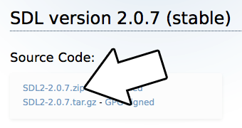

2) Extract the folder inside of the archive we downloaded to an easily accessible directory that is ideally dedicated to iOS development. For this tutorial we will be putting everything in "~/ioslib".

After extracting the SDL source you should have it at "~/ioslib/SDL2-2.0.7/" (path will vary depending on your SDL version). Copy the SDL iOS project template located at "~/ioslib/SDL2-2.0.7/Xcode-iOS/Template/SDL iOS Application" to "~/ioslib/SDL2-2.0.7/SDL iOS Application"

3) Open the template project inside of "~/ioslib/SDL2-2.0.7/Xcode-iOS/Template/SDL iOS Application". Inside you'll see a broken reference to the SDL source project. Delete it:
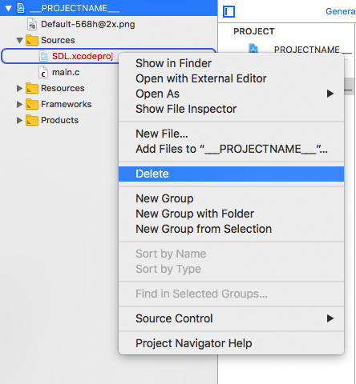

And then add the SDL source project located at "~/ioslib/SDL2-2.0.7/Xcode-iOS/SDL/SDL.xcodeproj"
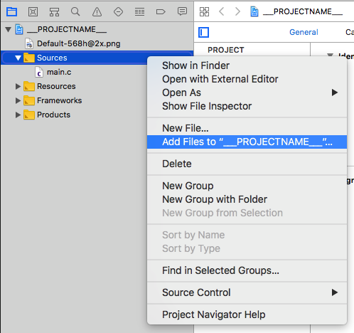

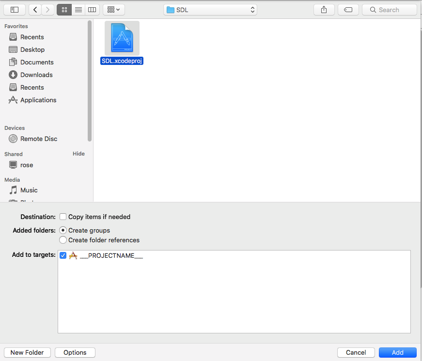

Build the application (command+B) and you should get an error:
```
entry point (_main) undefined
```

4) To fix the undefined main we need to link the project against SDL. Set the build target to libsdl and build
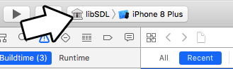

Then set the target back to the original project, select the original project, go to Build Phases, and go to Link With Libraries
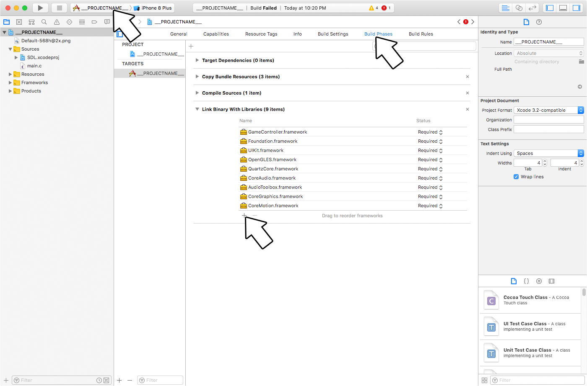

And select the libSDL library we compiled
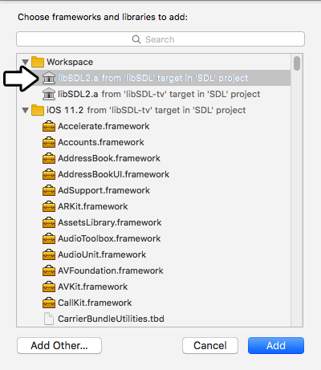

Build again and you'll get some new errors.

5) We just got a bunch of undefined symbol errors regarding AVAudioSession. To fix that, link with the AVFoundation framework
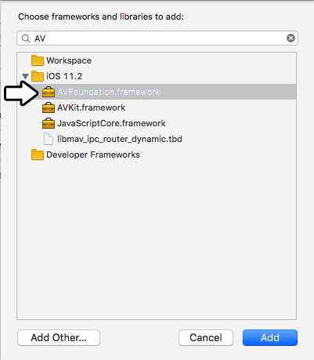

6) The project should now build and run with the default source. We want to use our own source code so download the [source for lesson 52](http://lazyfoo.net/tutorials/SDL/52_hello_mobile/52_hello_mobile.zip). Extract the folder inside to your development folder and then delete the default source from the project and add the tutorial source to the project.
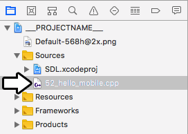

7) If you try to build the compiler will complain that it can't find SDL.h. To fix this add the include folder from the SDL source ("~/ioslib/SDL2-2.0.7/include") to the sources as a group.
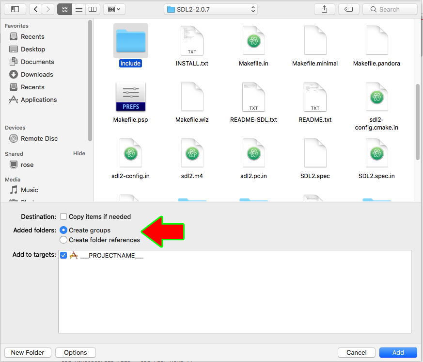

And don't forget to change
```
#include <SDL.h>
```
to
```
#include "SDL.h"
```
Now the project should compile and run, but it will crash.

8) The reason this app will crash is because it can't find the resource files. To add them, add new files to the resources group and select the folder with our demo files. Make sure to add the folder as a folder reference and not a group!
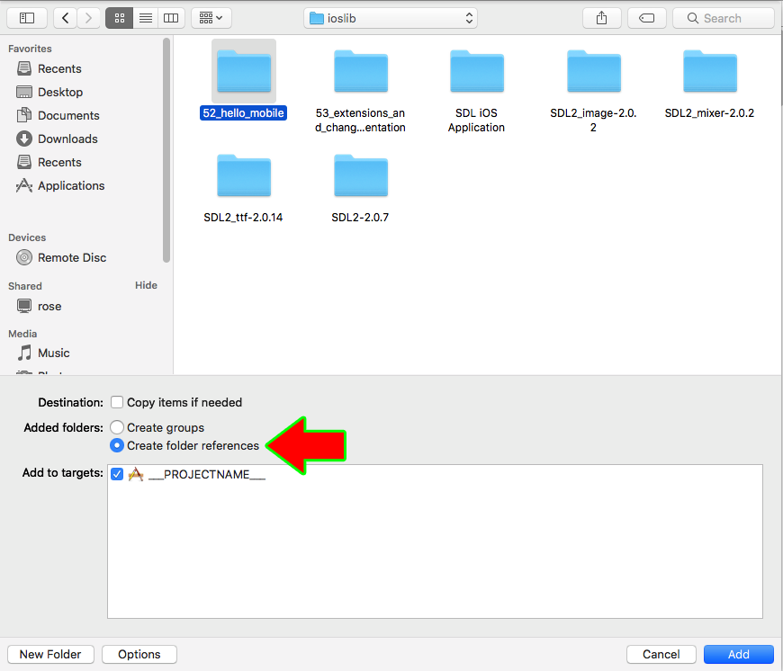

If your app is trying to load "52_hello_mobile/hello.bmp", it needs to be in the resources folder in a "52_hello_mobile" folder reference:
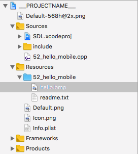

Now build and run your application. The simulator can take up to a minute to boot and run so give it time. With the application building and running, it's time to go over the source code.

## Extensions and Changing Orientation


**Last Updated 1/21/18**

So you learned how to set up the SDL2 library and you want to add SDL extension libraries. Fortunately, SDL_image/SDL_ttf/SDL_mixer are just another library you have to add on and if you already set up SDL2, you made it through the hard part.

After we set up SDL_image, we'll cover [handling orientation change on Android/iOS](#extensions-and-changing-orientation-handling-orientation-changes).

|Select Your Mobile/Development Platform||
|---|---|
||[Windows Android Studio 3.0.1](#setting-up-sdl_image-on-windows-android-studio-3-0-1)|
||[Linux Android Studio 3.0.1](#setting-up-sdl_image-on-linux-android-studio-3-0-1)|
||[Mac Android Studio 3.0.1](#setting-up-sdl_image-on-mac-android-studio-3-0-1)|
||[iOS XCode 9.2](#setting-up-sdl_image-on-ios-with-xcode-9-2)|

## Extensions and Changing Orientation: Handling Orientation Changes


**Last Updated 7/26/17**

Now that we got SDL_image loading PNGs, it's time to handle when our mobile device rotates.
```
//Screen dimensions
SDL_Rect gScreenRect = { 0, 0, 320, 240 };

//Scene textures
LTexture gPortraitTexture;
LTexture gLandscapeTexture;
```
For this application we'll be having a different textures render depending on whether the device is in portrait or landscape mode.
```
        //Create window
        gWindow = SDL_CreateWindow( "SDL Tutorial", SDL_WINDOWPOS_UNDEFINED, SDL_WINDOWPOS_UNDEFINED, gScreenRect.w, gScreenRect.h, SDL_WINDOW_SHOWN | SDL_WINDOW_RESIZABLE );
```
When you rotate your device, the height/width of the window changes which means the window size changes. In order to support rotation, the window needs to be created as resizable.
```
                //Handle events on queue
                while( SDL_PollEvent( &e ) != 0 )
                {
                    //User requests quit
                    if( e.type == SDL_QUIT )
                    {
                        quit = true;
                    }
                    //Window event
                    else if( e.type == SDL_WINDOWEVENT )
                    {
                        //Window resize/orientation change
                        if( e.window.event == SDL_WINDOWEVENT_SIZE_CHANGED )
                        {
                            //Get screen dimensions
                            gScreenRect.w = e.window.data1;
                            gScreenRect.h = e.window.data2;
                            
                            //Update screen
                            SDL_RenderPresent( gRenderer );
                        }
                    }
                }
```
SDL2 turns orientation change events into window change events. We check for window events and if the window event is a size change, we get the new dimensions, and update the screen.
```
                //Clear screen
                SDL_SetRenderDrawColor( gRenderer, 0xFF, 0xFF, 0xFF, 0xFF );
                SDL_RenderClear( gRenderer );

                //Render splash
                if( gScreenRect.h >= gScreenRect.w )
                {
                    gPortraitTexture.render( ( gScreenRect.w - gPortraitTexture.getWidth() ) / 2, ( gScreenRect.h - gPortraitTexture.getHeight() ) / 2 );    
                }
                else
                {
                    gLandscapeTexture.render( ( gScreenRect.w - gLandscapeTexture.getWidth() ) / 2, ( gScreenRect.h - gLandscapeTexture.getHeight() ) / 2 );    
                }

                //Update screen
                SDL_RenderPresent( gRenderer );
```
How do we tell if the device is in portrait or landscape? Simple: if the height is greater width, it's in portrait. Otherwise, it's in landscape.
Download the media and source code for this tutorial [here](http://lazyfoo.net/tutorials/SDL/53_extensions_and_changing_orientation/53_extensions_and_changing_orientation.zip).

## Setting up SDL_image on Windows Android Studio 3.0.1

**Last Updated 1/06/18**

1) First, download the SDL_image source on [this page](https://www.libsdl.org/projects/SDL_image/).


Extract the source code so it's at "C:\\androidlib\\SDL2_image-2.0.2"

2) Download the [demo source/assets](http://lazyfoo.net/tutorials/SDL/53_extensions_and_changing_orientation/53_extensions_and_changing_orientation.zip). Copy the directory inside to "C:\\androidprojects\\SDL\\app\\src\\main\\assets\\". Remember: if the application needs to load "53_extensions_and_changing_orientation/portrait.png" it needs to be at "C:\\androidprojects\\SDL\\app\\src\\main\\assets\\53_extensions_and_changing_orientation\\portrait.png" when building.

3) Copy demo source to "C:\\androidprojects\\SDL\\app\\src\\main\\jni\\src\\53_extensions_and_changing_orientation.cpp". Open the game make file at "C:\\androidprojects\\SDL\\app\\src\\main\\jni\\src\\Android.mk" and change local source files to include the new demo source file:
```
LOCAL_SRC_FILES := 53_extensions_and_changing_orientation.cpp
```
Open up Android Studio and try to build. You'll get an error:
```
Error:(6, 10) fatal error: 'SDL_image.h' file not found
```
This error means that our game source file can't find SDL_image.h which makes sense since we haven't set it up yet.

4) SDL_image is just another shared object library that needs to be built along SDL 2 and our C++ application. So that means we need to create a symbolic link to the SDL_image source code. Go to the start menu and run cmd as administrator:


Go to the JNI directory inside the project using this command:
```
cd "C:\androidprojects\SDL\app\src\main\jni"
```
And create a hard symbolic link directory to the SDL2_image source directory we extracted (**REMEMBER: This path will vary depending on your version of SDL_image**):
```
mklink /D SDL2_image C:\androidlib\SDL2_image-2.0.2
```
You should get the following message back
```
symbolic link created for SDL2_image <<===>> C:\androidlib\SDL2_image-2.0.2
```

Build again, you'll get the same error but at least SDL2_image has a symbolic link in the project now.

5) There may be a symbolic link to SDL_image in the JNI folder but our demo application doesn't know where it is. To fix this error open up "C:\\androidprojects\\SDL\\app\\src\\main\\jni\\src\\Android.mk" and change
```
LOCAL_C_INCLUDES := $(LOCAL_PATH)/$(SDL_PATH)/include
```
to
```
LOCAL_C_INCLUDES := $(LOCAL_PATH)/$(SDL_PATH)/include $(LOCAL_PATH)/../SDL2_image/
```
So now our demo application can find the SDL_image headers. Build again and you'll get a new error:
```
Error:(120) undefined reference to `IMG_Load' Error:(432) undefined reference to `IMG_Init' Error:(477) undefined reference to `IMG_Quit'
```

6) Those last errors were linker errors. While SDL_image managed to compile and our game managed to compile, we didn't tell the NDK to link our game against SDL_image. In "C:\\androidprojects\\SDL\\app\\src\\main\\jni\\src\\Android.mk" change
```
LOCAL_SHARED_LIBRARIES := SDL2
```
to
```
LOCAL_SHARED_LIBRARIES := SDL2 SDL2_image
```
Build again. Hopefully you should get the application to build, but you may get an error.

7) You may have gotten a No rule to make target error for IMG_WIC.c. This is the webp library being a pain in the butt. We're just going to yank it out. Open up Open "C:\\androidlib\\SDL2_image-2.0.2\\Android.mk" and change:
```
SUPPORT_WEBP ?= true
```
to
```
SUPPORT_WEBP ?= false
```
Delete the line that says
```
IMG_WIC.c \
```
and just straight up delete the "C:\\androidlib\\SDL2_image-2.0.2\\external\\libwebp-0.6.0" directory. Build again and you should get no errors.

8) The application should now build but IT WILL NOT WORK. We need to get our Java activity load the SDL extension library. Open "C:\\androidprojects\\SDL\\app\\src\\main\\java\\org\\libsdl\\app\\SDLActivity.java" and look for this section:
```
    protected String[] getLibraries() {
        return new String[] {
            "SDL2",
            // "SDL2_image",
            // "SDL2_mixer",
            // "SDL2_net",
            // "SDL2_ttf",
            "main"
        };
    }
```
Uncomment the libraries you'll be using so they'll be loaded.

9) Build and run. The application should run and rotate. Now that the application built, it's time to go over the source code.

## Setting up SDL_image on Linux Android Studio 3.0.1


**Last Updated 12/26/17**

1) First, download the SDL_image source on [this page](https://www.libsdl.org/projects/SDL_image/).


Extract the source code so it's at "~/androidlib/SDL2_image-2.0.2"

2) Download the [demo source/assets](http://lazyfoo.net/tutorials/SDL/53_extensions_and_changing_orientation/53_extensions_and_changing_orientation.zip). Copy the directory inside to "~/androidprojects/SDL_Tutorial/app/src/main/assets". Remember: if the application needs to load "53_extensions_and_changing_orientation/portrait.png" it needs to be at "~/androidprojects/SDL_Tutorial/app/src/main/assets/53_extensions_and_changing_orientation/portrait.png" when building.

3) Copy demo source to "~/androidprojects/SDL_Tutorial/app/src/main/jni/src/53_extensions_and_changing_orientation.cpp". Open the game make file at "~/androidprojects/SDL_Tutorial/app/src/main/jni/src/Android.mk" and change local source files to include the new demo source file:
```
LOCAL_SRC_FILES := $(SDL_PATH)/src/main/android/SDL_android_main.c \ 53_extensions_and_changing_orientation.cpp
```
Open up Android Studio and try to build. You'll get an error:
```
fatal error: 'SDL_image.h' file not found
```
This error means that our game source file can't find SDL_image.h which makes sense since we haven't set it up yet.

4) SDL_image is just another shared object library that needs to be built along SDL2 and our C++ application. So that means we need to create a symbolic link to the SDL_image source code. Go to the JNI directory inside the project using this command:
```
cd ~/androidprojects/SDL_Tutorial/app/src/main/jni
```
And create a symbolic link directory to the SDL2_image source directory we extracted (**REMEMBER: This path will vary depending on your version of SDL_image**):
```
ln -s ~/androidlib/SDL2_image-2.0.2 SDL2_image
```
Build again, you'll get the same error but at least SDL2_image has a symbolic link in the project now.

5) There may be a symbolic link to SDL_image in the JNI folder but our demo application doesn't know where it is. To fix this error open up "~/androidprojects/SDL_Tutorial/app/src/main/jni/src/Android.mk" and change
```
LOCAL_C_INCLUDES := $(LOCAL_PATH)/$(SDL_PATH)/include
```
to
```
LOCAL_C_INCLUDES := $(LOCAL_PATH)/$(SDL_PATH)/include $(LOCAL_PATH)/../SDL2_image/
```
So now our demo application can find the SDL_image headers. Build again and you'll get a new error:
```
Error:(120) undefined reference to `IMG_Load' Error:(432) undefined reference to `IMG_Init' Error:(477) undefined reference to `IMG_Quit'
```

6) Those last errors were linker errors. While SDL_image managed to compile and our game managed to compile, we didn't tell the NDK to link our game against SDL_image. In "~/androidprojects/SDL_Tutorial/app/src/main/jni/src/Android.mk" change
```
LOCAL_SHARED_LIBRARIES := SDL2
```
to
```
LOCAL_SHARED_LIBRARIES := SDL2 SDL2_image
```
Build again. Hopefully you should get the application to build, but you may get an error.

7) You may have gotten a No rule to make target error for IMG_WIC.c. This is the webp library being a pain in the butt. We're just going to yank it out. Open up Open "~/androidlib/SDL2_image-2.0.2/Android.mk" and change:
```
SUPPORT_WEBP ?= true
```
to
```
SUPPORT_WEBP ?= false
```
Delete the line that says
```
IMG_WIC.c \
```
and just straight up delete the "~/androidlib/SDL2_image-2.0.2/external/libwebp-0.6.0" directory. Build again and you should get no errors.

8) The application should now build but **IT WILL NOT WORK**. We need to get our Java activity load the SDL extension library. Open "~/androidprojects/SDL_Tutorial/app/src/main/java/org/libsdl/app/SDLActivity.java" and look for this section:
```
    protected String[] getLibraries() {
        return new String[] {
            "SDL2",
            // "SDL2_image",
            // "SDL2_mixer",
            // "SDL2_net",
            // "SDL2_ttf",
            "main"
        };
    }
```
Uncomment the libraries you'll be using so they'll be loaded.

9) Build and run. The application should run and rotate. Now that the application built, it's time to go over the source code.

## Setting up SDL_image on Mac Android Studio 3.0.1


**Last Updated 9/29/17**

1) First, download the SDL_image source on [this page](https://www.libsdl.org/projects/SDL_image/).


Extract the source code so it's at "~/androidlib/SDL2_image-2.0.2"

2) Download the [demo source/assets](http://lazyfoo.net/tutorials/SDL/53_extensions_and_changing_orientation/53_extensions_and_changing_orientation.zip). Copy the directory inside to "~/androidprojects/SDL_Tutorial/app/src/main/assets". Remember: if the application needs to load "53_extensions_and_changing_orientation/portrait.png" it needs to be at "~/androidprojects/SDL_Tutorial/app/src/main/assets/53_extensions_and_changing_orientation/portrait.png" when building.

3) Copy demo source to "~/androidprojects/SDL_Tutorial/app/src/main/jni/src/53_extensions_and_changing_orientation.cpp". Open the game make file at "~/androidprojects/SDL_Tutorial/app/src/main/jni/src/Android.mk" and change local source files to include the new demo source file:
```
LOCAL_SRC_FILES := $(SDL_PATH)/src/main/android/SDL_android_main.c \ 53_extensions_and_changing_orientation.cpp
```
Open up Android Studio and try to build. You'll get an error:
```
fatal error: 'SDL_image.h' file not found
```
This error means that our game source file can't find SDL_image.h which makes sense since we haven't set it up yet.

4) SDL_image is just another shared object library that needs to be built along SDL2 and our C++ application. So that means we need to create a symbolic link to the SDL_image source code. Go to the JNI directory inside the project using this command:
```
cd ~/androidprojects/SDL_Tutorial/app/src/main/jni
```
And create a symbolic link directory to the SDL2_image source directory we extracted (**REMEMBER: This path will vary depending on your version of SDL_image)**:
```
ln -s ~/androidlib/SDL2_image-2.0.2 SDL2_image
```
Build again, you'll get the same error but at least SDL2_image has a symbolic link in the project now.

5) There may be a symbolic link to SDL_image in the JNI folder but our demo application doesn't know where it is. To fix this error open up "~/androidprojects/SDL_Tutorial/app/src/main/jni/src/Android.mk" and change
```
LOCAL_C_INCLUDES := $(LOCAL_PATH)/$(SDL_PATH)/include
```
to
```
LOCAL_C_INCLUDES := $(LOCAL_PATH)/$(SDL_PATH)/include $(LOCAL_PATH)/../SDL2_image/
```
So now our demo application can find the SDL_image headers. Build again and you'll get a new error:
```
Error:(120) undefined reference to `IMG_Load' Error:(432) undefined reference to `IMG_Init' Error:(477) undefined reference to `IMG_Quit'
```

6) Those last errors were linker errors. While SDL_image managed to compile and our game managed to compile, we didn't tell the NDK to link our game against SDL_image. In "~/androidprojects/SDL_Tutorial/app/src/main/jni/src/Android.mk" change
```
LOCAL_SHARED_LIBRARIES := SDL2
```
to
```
LOCAL_SHARED_LIBRARIES := SDL2 SDL2_image
```
Build again. Hopefully you should get the application to build, but you may get an error.

7) You may have gotten a No rule to make target error for IMG_WIC.c. This is the webp library being a pain in the butt. We're just going to yank it out. Open up Open "~/androidlib/SDL2_image-2.0.2/Android.mk" and change:
```
SUPPORT_WEBP ?= true
```
to
```
SUPPORT_WEBP ?= false
```
Delete the line that says
```
IMG_WIC.c \
```
and just straight up delete the "~/androidlib/SDL2_image-2.0.2/external/libwebp-0.6.0" directory. Build again and you should get no errors.

8) The application should now build but **IT WILL NOT WORK**. We need to get our Java activity load the SDL extension library. Open "~/androidprojects/SDL_Tutorial/app/src/main/java/org/libsdl/app/SDLActivity.java" and look for this section:
```
    protected String[] getLibraries() {
        return new String[] {
            "SDL2",
            // "SDL2_image",
            // "SDL2_mixer",
            // "SDL2_net",
            // "SDL2_ttf",
            "main"
        };
    }
```
Uncomment the libraries you'll be using so they'll be loaded.

9) Build and run. The application should run and rotate. Now that the application built, it's time to go over the source code.
Extensions and Changing Orientation Part 2: Handling Orientation Changes

## Setting up SDL_image on iOS with XCode 9.2


**Last Updated 1/21/18**

1) First, download the SDL_image source on [this page](https://www.libsdl.org/projects/SDL_image/).
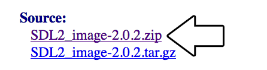

Extract the folder inside to a development directory. For this tutorial we'll be placing it at "~/ioslib/SDL2_image-2.0.2".

2) Open up your SDL project. Add the SDL_image project which should be located at ~/ioslib/SDL2_image-2.0.2/Xcode-iOS/SDL_image.xcodeproj
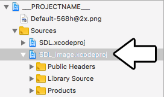

3) Set the target to SDL_image
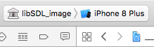

Build and you should get an error about missing SDL header files. To fix this add the SDL include folder (which should be located at "~/ioslib/SDL2-2.0.7/include") to the SDL_image project as a group to the Public Headers:
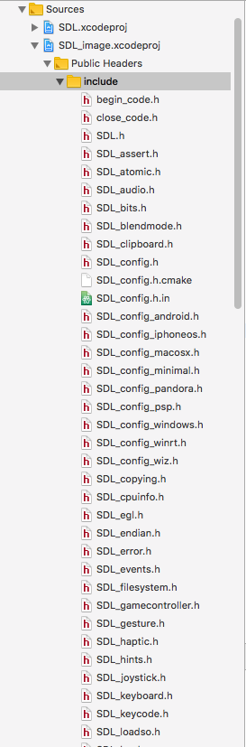

Now the SDL_image library should compile.

4) Download the [demo source/assets](http://lazyfoo.net/tutorials/SDL/53_extensions_and_changing_orientation/53_extensions_and_changing_orientation.zip). Extract source file and add it to the project. Change the target back to the main project and build. You'll get an error about missing header files. In 53_extensions_and_changing_orientation.cpp, change
```
#include <SDL.h>
```
to
```
#include "SDL.h"
#include <SDL_image.h>
```
to
```
#include "SDL_image.h"
```
You'll still get an error about missing SDL_image.h files. Simply add SDL_image.h (which should be at "~/ioslib/SDL2_image-2.0.2/SDL_image.h") to the project:
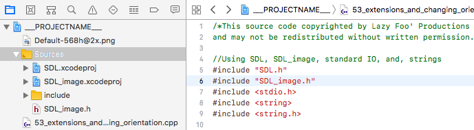

Build again and it should compile but you'll get undefined reference errors.

5) To fix the SDL_image linker errors, add the SDL_image library we compiled and ImageIO/MobileCoreServices
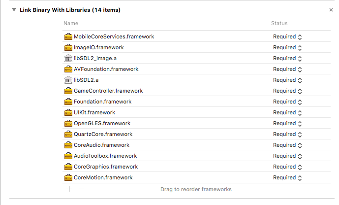

6) The project will build and run at this point but it will crash because it can't find assets files. Make sure to add the asset folder **as a reference** so the app and load the image files:
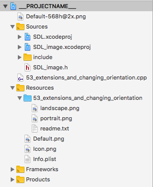

7) The project should now build and run. To enable orientation changes, select the project then go to General and under Deployment Info check the orientations you want to support.


Now that the application built, it's time to go over the source code.

## Touches


**Last Updated 6/11/19**

Now that we know how to load images on mobile, it's time to handle touch input events.
```
//Scene textures
LTexture gTouchDownTexture;
LTexture gTouchMotionTexture;
LTexture gTouchUpTexture;
```
For this demo we'll have a set of textures we'll be using to indicate what type of touch event happens.
```
            //Main loop flag
            bool quit = false;

            //Event handler
            SDL_Event e;

            //Touch variables
            SDL_Point touchLocation = { gScreenRect.w / 2, gScreenRect.h / 2 };
            LTexture* currentTexture = &gTouchUpTexture;
```
We'll need to keep track of the touch location and the current touch texture. Here we're setting the default touch location as the center of the screen and the default touch texture to the touch up texture.
```
                    //Touch down
                    else if( e.type == SDL_FINGERDOWN )
                    {
                        touchLocation.x = e.tfinger.x * gScreenRect.w;
                        touchLocation.y = e.tfinger.y * gScreenRect.h;
                        currentTexture = &gTouchDownTexture;
                    }
                    //Touch motion
                    else if( e.type == SDL_FINGERMOTION )
                    {
                        touchLocation.x = e.tfinger.x * gScreenRect.w;
                        touchLocation.y = e.tfinger.y * gScreenRect.h;
                        currentTexture = &gTouchMotionTexture;
                    }
                    //Touch release
                    else if( e.type == SDL_FINGERUP )
                    {
                        touchLocation.x = e.tfinger.x * gScreenRect.w;
                        touchLocation.y = e.tfinger.y * gScreenRect.h;
                        currentTexture = &gTouchUpTexture;
                    }
```
When you interact with a touch display, you generate a [SDL_TouchFingerEvent](https://wiki.libsdl.org/SDL_TouchFingerEvent). When the touch starts you get a SDL_FINGERDOWN event, when you move around your finger a SDL_FINGERMOTION happens, and when you release your touch you get a SDL_FINGERUP.

Touch events function pretty much like mouse events with one major difference: touch coordinates are normalized. This means instead of going from 0 to 640 (or what ever the size of your mobile display), they always go from 0 to 1. To get the touch coordinates in screen coordinates simply multiply the touch coordinates by the screen resolution. If you look at the code above that's exactly what we're doing here, along with setting the corresponding texture for the given touch event.

One thing not covered here is handling multiple fingers. All we do here is handle the most recent touch event. If you want to handle more than one finger, just keep track of them with their touch IDs. The touch IDs aren't simple 0, 1, 2, etc but a 64bit integer version of the pointer to the touch data. This quirk has tripped people over before so keep it in mind.
```
                //Clear screen
                SDL_SetRenderDrawColor( gRenderer, 0xFF, 0xFF, 0xFF, 0xFF );
                SDL_RenderClear( gRenderer );

                //Render touch texture
                currentTexture->render( touchLocation.x - currentTexture->getWidth() / 2, touchLocation.y - currentTexture->getHeight() / 2 );

                //Update screen
                SDL_RenderPresent( gRenderer );
```
As you can see in our rendering, we just render the touch texture at the touch position.
Download the media and source code for this tutorial [here](http://lazyfoo.net/tutorials/SDL/54_touches/54_touches.zip).

## Multi Touch


**Last Updated 6/19/19**

In this tutorial we'll be using SDL 2's built in functionality to handle multi touch gestures like pinch and rotate.
```
//Scene textures
LTexture gPinchCloseTexture;
LTexture gPinchOpenTexture;
LTexture gRotateTexture;
```
Like in the previous tutorial, we'll be using a set of textures to show which type of input is happening.
```
            //Main loop flag
            bool quit = false;

            //Event handler
            SDL_Event e;

            //Touch variables
            SDL_Point touchLocation = { gScreenRect.w / 2, gScreenRect.h / 2 };
            LTexture* currentTexture = &gPinchOpenTexture;
```
Also like the previous tutorial, we'll need to keep track of the touch location and the current texture to render.
```
                    //Multi touch gesture
                    else if( e.type == SDL_MULTIGESTURE )
                    {
                        //Rotation detected
                        if( fabs( e.mgesture.dTheta ) > 3.14 / 180.0 )
                        {
                            touchLocation.x = e.mgesture.x * gScreenRect.w;
                            touchLocation.y = e.mgesture.y * gScreenRect.h;
                            currentTexture = &gRotateTexture;
                        }
```
When a multi touch gesture happens a [SDL_MultiGestureEvent](https://wiki.libsdl.org/SDL_MultiGestureEvent) gets generated. Here we check for rotations first by checking the angle on the gesture. The thing to remember is that the smallest rotation will get reported so if you pinch and rotate by a 1000th of a radian, it will show up in the gesture. Here we make sure the rotation is at least one degree before reporting it as a rotation.

If the rotation is big enough, we set the location of the gesture and set the texture.
```
                        //Pinch detected
                        else if( fabs( e.mgesture.dDist ) > 0.002 )
                        {
                            touchLocation.x = e.mgesture.x * gScreenRect.w;
                            touchLocation.y = e.mgesture.y * gScreenRect.h;
                            
                            //Pinch open
                            if( e.mgesture.dDist > 0 )
                            {
                                currentTexture = &gPinchOpenTexture;
                            }
                            //Pinch close
                            else
                            {
                                currentTexture = &gPinchCloseTexture;
                            }
                        }
                    }
```
If the rotation wasn't big enough, we then check the distance of the pinch. Again remember that coordinates are normalized so a 10 pixel pinch on a 1920 resolution tablet will be reported at around 0.0052.

If the pinch is big enough, we set the gesture position and then check if the pinch was opening or closing.
```
                //Clear screen
                SDL_SetRenderDrawColor( gRenderer, 0xFF, 0xFF, 0xFF, 0xFF );
                SDL_RenderClear( gRenderer );

                //Render touch texture
                currentTexture->render( touchLocation.x - currentTexture->getWidth() / 2, touchLocation.y - currentTexture->getHeight() / 2 );

                //Update screen
                SDL_RenderPresent( gRenderer );
```
Once again like the previous tutorial, in the rendering we show the current gesture texture and the gesture position.
Download the media and source code for this tutorial [here](http://lazyfoo.net/tutorials/SDL/55_multitouch/55_multitouch.zip).
